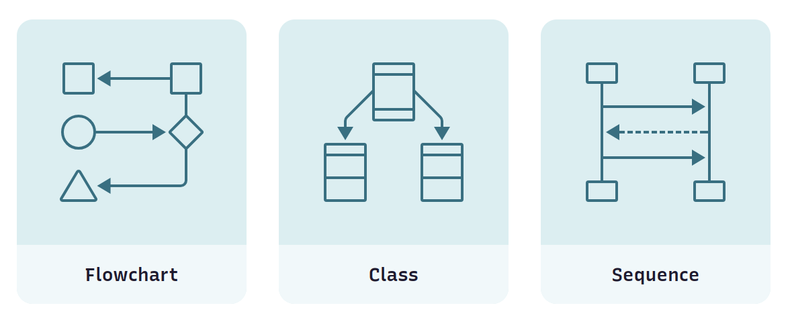
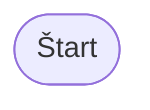
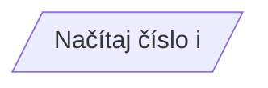
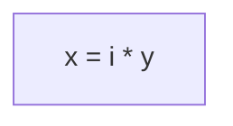
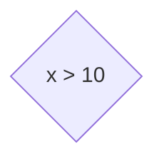
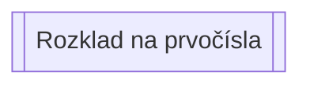
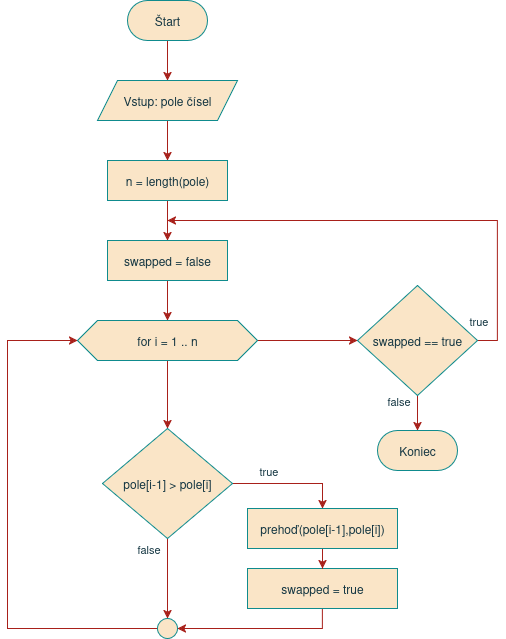

# Cvičenie 1: Úvod do predmetu, vývojový diagram

Úvodné cvičenie je venované príprave vášho počítača, inštalácii potrebných nástrojov a programov a praktickému úvodu do ekosystému Java. Okrem toho sa na tomto a na nasledujúcich cvičeniach stručne zopakujú témy programovania, ktoré ste preberali v predchádzajúcich rokoch. Vysvetlí sa tiež, ktoré znalosti by už študent mal ovládať, nakoľko tento predmet nie je úvodným predmetom pre programovanie ako také. 

<div class="md-has-sidebar" markdown>
  <main markdown>
Na cvičení si taktiež zopakujeme návrh a tvorbu jednoduchých vývojových diagramov. Klasické vývojové diagramy sú používané hlavne pri výuke. Ich pochopenie vám však neskôr pomôže pri vytváraní iných typov diagramov. Tie sa v praxi hojne používajú na vysvetlenie procesov prebiehajúcich v počítačovom systéme či aplikácii. Pri zložitejšej architektúre, práci vo väčšom tíme ľudí alebo pri komunikácii s manažérmi sú diagramy často lepšie riešenie ako text, odrážky, či ukážka kódu.
  </main>

  <aside markdown>
Farebný diagram pekne vyznie aj vo vašej projektovej alebo záverečnej práci a zvýši vám počet strán. :material-emoticon-wink-outline:
  </aside>
</div>



## Opakovanie z minulých rokov

<div class="md-has-sidebar" markdown>
  <main markdown>
Tento predmet nie je úvodom do programovania ako takého, preto sa od vás očakáva, že už ovládate základy programovania a algoritmizácie. Na úvodných cvičeniach si zopakujeme veci z programovania, ktoré ste brali v minulých rokoch. Porovnáme si kód v Jave z kódom, ktorý ste písali v jazyku Python. Ak si však z predchádzajúcich rokov už veľa nepamätáte, oprášte si doma staré zošity a učebnice.

Okrem úplných základov programovania a algoritmizácie si zopakujte aj zložené dátové štruktúry ako polia, množiny a slovníky, a taktiež základné triediace a vyhľadávacie algoritmy.

V rámci tohto predmetu budeme používať okrem IDE aj konzolu a príkazový riadok, preto ak používate na svojom počítači operačný systém Windows, odporúčam vám [nainštalovať si PowerShell](https://aka.ms/powershell-release?tag=stable). Ak to však s programovaním myslíte vážne, pouvažujte nad operačným systémom Linux. Pre seriózne programovanie je vo väčšine prípadov Linux tým najlepším riešením.

*[IDE]: Integrated Development Environment


!!! tip "Učím sa s pomocou Umelej Inteligencie"

    Som študent strednej školy. Vysvetli mi jednoduchým spôsobom, ako funguje:

    - [Triediaci algoritmus Bubble Sort](https://grok.com/share/c2hhcmQtMg%3D%3D_04b3627f-6f2d-4869-ad90-7ffbc532171b)
    - [Rekurzia](https://grok.com/share/c2hhcmQtMg%3D%3D_395beb3e-61f3-416c-a956-11f492e70de2)
    - [Zložené dátové typy](https://grok.com/share/c2hhcmQtMg%3D%3D_22a68726-c192-4788-856a-96af9b2c544f)

    Sú tieto odpovede, ktoré nám dala umelá inteligencia, správne? Dôverovali by ste umelej inteligencii pri témach, o ktorých vôbec nič neviete?

  </main>

  <aside markdown>
Medzi základné koncepty algoritmizácie patrí analýza problému, rozdelenie na menšie kroky a návrh algoritmu. Vetvenie algoritmu pomocou podmienok, použitie cyklov na opakovanie kódu, základné logické a matematické operácie sú takisto veci, ktoré by ste už mali vedieť ovládať.

Z konceptov programovania by ste už mali vedieť základy premenných a dátových typov, ako napr. čísla, reťazce a booleovské hodnoty. Očakáva sa tiež, že vám nebude robiť problém definovanie a používanie vlastných funkcií/procedúr a použitie parametrov a návratových hodnôt pri volaní funkcií.
  </aside>
</div>

## Java Development Kit

<div class="md-has-sidebar" markdown>
  <main markdown>
Java nie je iba programovací jazyk, ale aj celá platforma a sada programov a nástrojov na vývoj a spúšťanie programov napísaných pre túto platformu. Štandardne ak si stiahnete do svojho počítača 'Javu', tak ide iba o nástroje na spúšťanie programov vytvorených pre platformu Java. Táto sada programov sa volá *Java Runtime Environment (JRE)* a vlastné programy v takejto 'Jave' nebudete môcť písať. 

Na to, aby ste mohli aj programy aj tvoriť potrebujete tzv. *Java Development Kit (JDK)*. Ide o väčšiu sadu nástrojov, ktorá okrem JRE v sebe obsahuje aj nástroje pre programátorov. Táto JDK sada však nie je iba jedna, ale existuje veľké množstvo tzv. *distribúcii JDK* od rôznych inštitúcii a firiem. 

V rámci tohto predmetu budeme používať distribúciu *Temurin* vytvorenú nadáciou Eclipse. Ide o open source distribúciu, ktorá je vhodná na bežné použitie ako pri výuke, tak aj pri komerčnom nasadení Javy. Stiahnite si teda a nainštalujte do svojho počítača **JDK Temurin vo verzii 21 LTS** z oficálnej stránky [https://adoptium.net/](https://adoptium.net/)
  </main>

  <aside>
    Java má za sebou dlhú históriu a prešla viacerými zmenami, preto je niekedy dosť komplikované vyznať sa, čo sa ako volá a načo to slúži. Aj samotný programovací jazyk prešiel značnou modernizáciou a vylepšeniami, preto neodporúčame učiť sa zo starých kníh a neaktuálnych webových stránok, ktoré vás môžu často popliesť.
  </aside>
</div>


!!! info "Ktorú verziu Javy použiť?"

    Nová verzia Javy vychádza každých 6 mesiacov. Pre bežné použitie však nie je dobré používať vždy tú najnovšiu, ale radšej použite verziu LTS (long-term support), ktorá vychádza každé dva roky. Je stabilnejšia a má dlhú podporu aktualizácii opráv chýb a bezpečnostných záplat.

    Verzie Javy z podporou LTS sú verzie 17, 21 a 25. Pre viac informácii pozri stránku o [histórii verzií Javy](https://en.wikipedia.org/wiki/Java_version_history)

    *[LTS]: Long term support

Po úspešnej inštalácii si funkčnosť overte tak, že si otvorte nové okno konzoly a v príkazovom riadku spusťte príkaz `java --version`.


=== "Zistenie verzie Javy"

    ```
    ~$ java --version
    openjdk 21.0.6 2025-01-21 LTS
    OpenJDK Runtime Environment Temurin-21.0.6+7 (build 21.0.6+7-LTS)
    OpenJDK 64-Bit Server VM Temurin-21.0.6+7 (build 21.0.6+7-LTS, mixed mode, sharing)
    ```

## IDE

<div class="md-has-sidebar" markdown>
  <main markdown>

{align=right width=150}

Pre komfortné programovanie v Jave je vhodné, aby ste používali vývojové prostredie, po anglicky Integrated Development Environment (IDE). Na tomto predmete budeme pracovať vo vývojovom prostredí *IntelliJ IDEA* od firmy JetBrains. Ide o najpopulárnejšie a najviac premakané vývojové prostredie pre jazyk Java. 

Program ItelliJ IDEA si stiahnite a nainštalujte z oficiálnej stránky [https://www.jetbrains.com/idea/download](https://www.jetbrains.com/idea/download). K dispozícii je bezplatná verzia *Community Edition* a platená verzia *Ultimate*. Ako študenti SPŠE v Prešove máte jedinečnú možnosť používať platenú verziu Ultimate úplne zadarmo. 

!!! info "Ako si aktivovať IntelliJ IDEA Ultimate"

    Pre aktiváciu platenej verzie je potrebné
  
    - zaregistrovať sa na stránke [https://account.jetbrains.com/signup](https://account.jetbrains.com/signup) s použitím svojej školskej e-mailovej adresy.
    - požiadať o školskú licenciu na stránke [https://www.jetbrains.com/shop/eform/students](https://www.jetbrains.com/shop/eform/students). Vyplnenie formulára a potvrdenie e-mailovej adresy vám zaberie 3 minúty a školskú licenciu získate automaticky ihneď po zaslaní žiadosti.
    - prihlásiť sa do vyššie vytvoreného konta v programe IntelliJ IDEA. Prihlásenie urobíte v okne *Manage Subscriptions* ktoré nájdete v sekcii Help, alebo v úvodnom okne po stlačení na ikonku :material-cog: vľavo dole.
  </main>

  <aside markdown>
Za vývojovým prostredím IntelliJ IDEA stojí celkom zaujímavá firma. Spoločnosť JetBrains s.r.o. bola založená v Českej republike, troma Ruskými programátormi. Našich susedov si vybrali, aby mohli ľahšie obchodovať v rámci Európskej únie a Ameriky. Postupne vyvinuli množstvo ďalších produktov a medzi ich najznámejší prínos do sveta programovania patrí vytvorenie jazyka *Kotlin*. Tento jazyk sa stal hlavným programovacím jazykom pre vývoj aplikácii pre OS Android. 
    
Jazyk Kotlin beží nad platformou Java, dá sa použiť všade tam, kde aj jazyk Java a ponúka modernú alternatívu s množstvom vylepšení. Syntax jazyka je podobný Jave, a zruční Java programátori sa ho dokážu naučiť za pár dní. Hlavným a najpopulárnejším vývojovým prostredím pre jazyk Kotlin je opäť IntelliJ IDEA.
  </aside>
</div>

IntelliJ IDEA nie je zďaleka jediné vývojové prostredie pre jazyk Java. Medzi ďalšie populárne IDE-čka patria programy *Netbeans* a *Eclipse IDE*.
Veľa programátorov má tiež v obľube používať nástroj [Visual Studio Code](https://code.visualstudio.com/), čo je taký univerzálny editor pre veľké množstvo jazykov, a zvláda celkom dobre aj Javu. Medzi jeho najväčšie výhody patrí jednoduchosť, rýchlosť, veľké množstvo rozšírení a *výborná podpora pre nástroje umelej inteligencie*.

## Vývojový diagram

<div class="md-has-sidebar" markdown >
  <main markdown>
Použitie diagramov pri tvorbe softvéru prešlo turbulentnou históriou. V súčasnom modernom spôsobe programovania sa v posledných rokoch prestali používať príliš formálne a komplexné diagramy. Neprinášali želaný úžitok, stratilo sa pri nich veľa času a rýchlo sa stali zastaralými. Namiesto nich do popredia prišli ľahké tzv. "lightweight" diagramy, ktoré sú praktickejšie, jednoduchšie a rýchlejšie sa prispôsobia zmenám. Často sa dokonca dajú vytvoriť aj automaticky, priamo zo zdrojového kódu aplikácie.

Moderným prístupom ku tvorbe diagramov sa budeme venovať aj na tomto predmete. Pred tým však je vhodné zopakovať si vývojové diagramy. Tie majú stále svoje uplatnenie, či už ide o popis jednoduchých a priamočiarych procesov, alebo pri popise algoritmov. Okrem použitia vývojových diagramov vo výuke nájdeme ich využitie v praxi stále aj dnes. Ozrejmia nám poradie krokov v danom procese, pomáhajú zorientovať sa v algoritme a pomocou nich vieme skontrolovať, či sme pri implementácii na nič nezabudli.

!!! tip "Učím sa s pomocou Umelej Inteligencie"

    Som študent strednej školy. Chcem vedieť, [aké sú súčasné trendy používania diagramov pri softvérovom vývoji.](https://chatgpt.com/share/68b2c1fd-aefc-8011-819b-73cfec407b22)

Návrh vývojového diagramu netreba komplikovať. Často je vhodné použiť iba minimálny počet blokov, prepojením šípkami určiť ich poradie a bloky zrozumiteľne označiť. Pri popise blokov je najlepšie zamerať sa na vyjadrenie akcie, ktorú daný blok vykonáva. Zložitejšie časti procesu je vhodné rozdeliť do viacerých menších diagramov a na tie sa potom v hlavnom diagrame odkazovať.

V nasledujúcej časti si pripomenieme základné bloky vývojového diagramu, ktoré sa používajú pri popise algoritmov a na konkrétnych príkladoch si ukážeme ich využitie.
</main>
  <aside markdown>
Programovanie je často o riešení problémov a úloh, s ktorými sa na vás obrátia vaši klienti alebo nadriadení. Vtedy je samotné písanie kódu vedľajšie a zákazníkom je jedno, koľko kódu napíšete. Tiež im bude jedno, či ho napíšete vy, alebo umelá inteligencia. Vašou pridanou hodnotou má byť schopnosť daný problém alebo úlohu správne analyzovať a vytvoriť návrh riešenia. Potom môžete zvoliť vhodné nástroje a techniky na vytvorenie softvéru, ktorý problémy vášho klienta pomôže vyriešiť.

Ak je úloha zložitejšia, alebo pracujete v rámci tímu, je častokrát vhodné návrh riešenia zapísať vo forme diagramu. Pomocou diagramu sa viete zamerať na podstatné časti úlohy a nemusíte myslieť na zložitosť a pridané problémy, ktoré vám vždy do vášho riešenia prinesie programovací jazyk, framework, knižnica alebo iný nástroj, ktorý vo výsledku použijete.

!!! tip "Hot Take"
    Umelá inteligencia, povedz mi  [prečo UML diagramy pohoreli a čo z nich nakoniec ostalo?](https://grok.com/share/c2hhcmQtMg%3D%3D_9be19082-4ce7-4525-bb30-0bcbd99405d6)

  </aside>
</div>


### Základné bloky vývojového diagramu


<table>
<tr><th> Príklad </th> <th> Typ symbolu </th><th> Popis </th></tr>
<tr><td align="center" width=30%> 

</td><td>Terminál</td><td>Označuje začiatok a koniec procesu. Niekedy nazývaný aj terminátor.</td></tr><tr><td align="center"> 

</td><td>Vstup/Výstup</td><td>Vstup a výstup dát, napr. načítanie čísla, vypísanie výsledku, ...</td></tr><tr><td align="center"> 

</td><td>Operácia, proces</td><td>Bežný príkaz, operácia alebo iný konkrétny krok procesu</td></tr><tr><td align="center"> 

</td><td>Rozhodovanie</td><td>Rozhodovacia funkcia, podmienka. Má viacero výstupov, označených podľa toho, aký výsledok rozhodovania môže nastať.</td></tr><tr><td align="center"> 

</td><td>Podproces</td><td>Podprogram, metóda alebo funkcia, ktorej proces je zakreslený na inom mieste vývojového diagramu</td></tr></table>


<div class="md-has-sidebar" markdown>
  <main markdown>
Jednotlivé časti vývojového diagramu sú spojené čiarami so šípkami :octicons-arrow-right-24:, ktoré určujú smer toku, teda v akom poradí sa bude daný proces alebo algoritmus vykonávať.

Okrem vyššie uvedených symbolov vývojového diagramu existujú ďalšie symboly s rôznymi významami, napríklad existuje špeciálny typ symbolu pre manuálny vstup dát, alebo symbol pre krok prípravy. V bežnej praxi však tieto symboly nie sú veľmi rozšírené a väčšinou si kľudne vystačíme so základnymi symbolmi.
  </main>

  <aside markdown>
Ak je čiara medzi symbolmi veľmi dlhá alebo neprehľadná, môžeme ju za pomoci symbolov kruhu :octicons-circle-16: rozdeliť a zprehľadniť tým diagram. Tento symbol sa nazýva spojka, alebo konektor.
  </aside>
</div>

!!! example "Príklad 1.1: Súčet dvoch čísel"
    ```mermaid
    flowchart TD
        Start([Štart]) --> Input1[/Prečítať číslo1/]
        Input1 --> Input2[/Prečítať číslo2/]
        Input2 --> Sum[súčet = číslo1 + číslo2]
        Sum --> Output[/Vypísať súčet/]
        Output --> End([Koniec])
    ```

!!! example "Príklad 1.2: Delenie dvoch čísel"
    ```mermaid
    flowchart TD
        Start([Štart]) --> Input1[/Prečítať delenec/]
        Input1 --> Input2[/Prečítať deliteľ/]
        Input2 --> Test{deliteľ == 0}
        Test --> |Áno|Error[/Vypísať "Nulou sa nedá deliť"/]
        Test --> |Nie|Div[podiel = delenec / deliteľ]
        Div --> Output[/Vypísať podiel/]
        Output --> End([Koniec])
        Error --> End
    ```

!!! example "Príklad 1.3: Kalkulačka"
    ```mermaid
    flowchart TD
        Start([Štart]) --> Prompt[/Vypísať menu s možnosťami: S, P, A, X/]
        Prompt --> Read[/Vstup: voľba užívateľa/]
        Read --> Choice{Čo si užívateľ vybral?}
        Choice --> |S|Add[[Súčet]]
        Choice --> |P|Div[[Podiel]]
        Choice --> |A|Abs[[Absolútna hodnota]]
        Choice --> |X|End([Koniec])
        Add --> Prompt
        Div --> Prompt
        Abs --> Prompt
        AStart([Absolútna hodnota]) --> Input1[/Prečítať číslo/]
        Input1 --> Test{číslo < 0}
        Test --> |Áno|Inv[číslo = číslo * -1]
        Test --> |Nie|Output[/Vypísať číslo/]
        Inv --> Output
        Output --> AEnd([Koniec])
        classDef empty width:0px
    ```

!!! example "Príklad 1.4: Praženica na cibuľke"
    ```mermaid
    flowchart TD
        Start([Štart]) --> InitEgg[[Pripraviť vajíčka]]
        InitEgg --> S0[Dať panvicu na sporák]
        S0 --> InitOnion[[Opražiť cibuľu]]
        InitOnion --> S1[Vyliať vajíčka do panvice s opraženou cibuľou]
        S1 --> S2[Miešať]
        S2 --> Test{praženica == riedka}
        Test --> |true|S2
        Test --> |false|S3[Vypnúť sporák]
        S3 --> S4[Dať praženicu na tanier a podávať]
        S4 --> End([Koniec])
        AStart([Pripraviť vajíčka]) --> A1[/Vybrať vajíčka/]
        A1 --> AP1[Rozbiť vajíčka a vyliať do misky]
        AP1 --> AP2[Rozmiešať]
        AP2 --> AEnd([Koniec])

        BStart([Opražiť cibuľu]) --> B1[/Vybrať cibuľu, olej a korenie/]
        B1 --> BP1[Očistiť a pokrájať cibuľu]
        BP1 --> BP2[Dať do panvice olej a cibuľu, zapnúť sporák]
        BP2 --> BP3[Miešať]
        BP3 --> BTest{cibuľa == opražená}
        BTest --> |true|BKor[Pridať korenie a soľ]
        BKor --> BEnd([Koniec])
        BTest --> |false|BP3
    ```

!!! example "Príklad 1.5: Pracovný tok (Workflow) predajcu áut"
    ```mermaid
    flowchart LR
        Start([Štart]) --> Test{Nové alebo jazdené auto?}
        Test --> |Nové|New[Nakonfigurovať nové vozidlo]
        Test --> |Jazdené|Old[Vybrať auto zo skladových zásob]
        New --> P1[Ponúknuť zimné pneumatiky]
        Old --> P1
        P1 --> O1((A ))
        O2(( A)) --> P3[Ponúknuť poistenie]
        P3 --> P4[Ponúknuť predĺženie záruky]
        P4 --> P5[Ponúknuť vernostný program]
        P5 --> End([Koniec])
    ```
    
!!! abstract "Úloha do zošita: Vývojový diagram"

    Do zošita si zakreslite jeden jednoduchý vývojový diagram a jeden diagram s rozhodovacím blokom.

    Splnenie úlohy vám budeme kontrolovať.

### Zbierka príkladov vývojových diagramov

V tejto časti uvádzame zopár úloh pre tvorbu vývojových diagramov. Po kliknití na príklad sa vám ukáže daný diagram.

??? example "Príklad 1.6: Zistenie väčšieho z dvoch čísel"
    ```mermaid
    flowchart TD
        Start([Štart]) --> Vstup[/Načítaj čísla: x, z/]
        Vstup --> Test{x > y}
        Test -->|true|A[/Výstup: x/]
        Test -->|false|B[/Výstup: y/]
        A --> End([Koniec])
        B --> End
    ```
    !!! question "Doplňujúce otázky"
        - Čo sa stane, ak sú čisla rovnaké?
        - Ako by ste upravili diagram tak, aby pokrýval všetky možnosti?

??? example "Príklad 1.7: Výpis radu čísel"
    ```mermaid
    flowchart TD
        Start([Štart]) --> Vstup[/Načítaj čísla: from, to/]
        Vstup --> P[i = from]
        P --> Test{i <= to}
        Test -->|false| End([Koniec])
        Test -->|true|Print[/Výstup: i/]
        Print --> Step[i = i + 1]
        Step --> Test
    ```
    !!! question "Doplňujúce otázky"
        - Funguje tento algoritmus pre akúkoľvek dvojicu čísel?
        - Vypíše sa aj číslo `to`?

??? example "Príklad 1.8: Hľadanie čísla"
    ```mermaid
    flowchart TD
        Start([Štart]) --> Prompt[/Uhádni na aké číslo myslím/]
        Prompt --> R[y = random_integer]
        R --> Vstup[/Načítaj číslo x/]
        Vstup --> EQ{x == y}
        EQ -->|true| WIN[/Uhádol si, bolo to číslo Y/]
        WIN --> End([Koniec])
        EQ -->|false|CMP{x > y}
        CMP -->|true| BIG[/Hľadané čislo je menšie, hádaj znova/]
        BIG --> Vstup
        CMP -->|false| SMOL[/Hľadané čislo je väčšie, hádaj znova/]
        SMOL --> Vstup
    ```
    !!! question "Doplňujúce otázky"
        - Ako by vyzeral vývojový diagram, ak by mal súťažiaci iba 10 pokusov?
        - Čo by trebalo pridať, aby vo výslednom výpise sa uviedlo, na koľko pokusov bolo číslo uhádnuté

??? example "Príklad 1.9: Výpočet aritmetického priemeru"
    ```mermaid
    flowchart TD
        Start([Štart]) --> Init[počet = 0, súčet = 0]
        Init --> Prompt[/Zadaj ďalšie číslo, alebo 'X' ak hotovo/]
        Prompt --> Hotovo{vstup == 'X'}
        Hotovo -->|true| Print[[Výpis priemeru]]
        Print --> END([Koniec])
        Hotovo -->|false| P1[počet = počet + 1]
        P1 --> P2[súčet = súčet + vstup]
        P2 --> Prompt
        AStart([Výpis priemeru])
        AStart --> P3[priemer = súčet / počet]
        P3 --> Out[/Vypíš priemer/]
        Out --> AEnd([Koniec])
    ```
    !!! question "Doplňujúce otázky"
        - Čo sa stane, ak nezadáme žiadne číslo?
        - Čo sa stane, ak zadáme písmeno iné ako 'X'?

??? example "Príklad 1.10: Zoradenie poľa algoritmom Bubble Sort"

    ```mermaid
    flowchart TD
        Start([Štart]) --> InitV[/"Vstup: pole čísel"/]
        InitV --> N["n = length(pole)"]
        N --> InitSwap["swapped = false"]
        InitSwap --> Loop["i = 1"]
        Loop --- C1[ ]:::empty
        C1 --> Test{"pole[i - 1] > pole[i]"}
        Test --> |true|Swap["prehoď_prvky(i-1, i)"]
        Test --> |false|Step
        Swap --> SetSwapped["swapped = true"]
        SetSwapped --> Step["i = i + 1"]
        Step --> TestLoop{"i < n"}
        TestLoop -->|true| C1
        TestLoop -->|false| TestSwapped{"swapped == true"}
        TestSwapped -->|true| InitSwap
        TestSwapped -->|false| End([Koniec])
        classDef empty width:0px
    ```
    !!! question "Doplňujúce otázky"
        - Prečo vnútorný cyklus začína od čísla 1 a nie od čísla 0?
        - Algoritmus by sa dal optimalizovať, ako?

    Vývojový diagram s použitím neštandardného symbolu cyklu for, vytvorený v programe draw.io

    

??? example "Príklad 1.11: Výpočet faktoriálu pomocou iterácie"
    ```mermaid
    flowchart TD
        Start([Štart]) --> Vstup[/Načítaj číslo/]
        Vstup --> Init[i = 1, výsledok = 1]
        Init --> Test{i <= číslo}
        Test -->|false| Out[/Vypíš výsledok/]
        Test -->|true| P[výsledok = výsledok * i]
        P --> P2[i = i + 1]
        P2 --> Test
        Out --> End([Koniec])
    ```
    !!! question "Doplňujúce otázky"
        - Aké najväčšie číslo by váš program vedel spracovať?

??? example "Príklad 1.12: Výpočet faktoriálu pomocou rekurzie"
    ```mermaid
    flowchart TD
        Start([Štart]) --> Vstup[/Načítaj číslo n/]
        Vstup --> FN[["výsledok = faktorial(n)"]]
        FN --> Out[/Vypíš výsledok/]
        Out --> End([Koniec])

        AStart(["faktorial(x)"]) --> Test{x == 0}
        Test --> |true| P1[výsledok = 1]
        Test --> |false| P2[["výsledok = x * faktorial(x-1)"]]
        P1 --> AEnd([return výsledok])
        P2 --> AEnd
    ```
    !!! question "Doplňujúce otázky"
        - Ktorá verzia algoritmu je ľahšia na pochopenie?
        - Ktorá verzia algoritmu je ľahšia na programovanie?

??? example "Príklad 1.13: Súčet prvých N prirodzených čísel"
    ```mermaid
    flowchart TD
        Start([Štart]) --> Init[výsledok = 0]
        Init --> Vstup[/Načítaj číslo n/]
        Vstup --> Test{n == 0}
        Test -->|true|Print[/Výstup: výsledok/]
        Print --> End([Koniec])
        Test -->|false|P[výsledok = výsledok + n]
        P --> P1[n = n - 1]
        P1 --> Test
    ```
    !!! question "Doplňujúce otázky"
        - Aký bude priebeh algoritmu, ak zadáme číslo, ktoré nie je prorodzené?
        - Ako by ste upravili algoritmus tak, aby pokrýval všetky možnosti vstupu?

??? example "Príklad 1.14: Povrch a objem valca"
    ```mermaid
    flowchart TD
        Start([Štart]) --> VstupR[/Načítaj polomer/]
        VstupR --> VstupV[/Načítaj výšku/]
        VstupV --> S1[[Povrch valca]]
        S1 --> S2[[Objem valca]]
        S2 --> End([Koniec])

        PStart([Objem valca]) --> PP1["SP = 3.14 \* polomer \* polomer"]
        PP1 --> PP2[objem = SP * výška]
        PP2 --> PV[/Výstup: objem/]
        PV --> PEnd([Koniec])

        VStart([Povrch valca]) --> VP1["SP = 3.14 \* polomer \* polomer"]
        VP1 --> VP2["SPL = 2 \* 3.14 \* polomer \* výška"]
        VP2 --> VP3[povrch = 2 * SP + SPL]
        VP3 --> VV[/Výstup: povrch/]
        VV --> VEnd([Koniec])
    ```
    !!! question "Doplňujúce otázky"
        - Algoritmus zbytočne počíta jednu časť dvakrát. Ako by ste upravili diagram tak, aby sa počítala iba raz?

??? example "Príklad 1.15: Nájdenie čísla v poli"
    ```mermaid
    flowchart TD
        Start([Štart]) --> InitV[/"Vstup: pole čísel"/]
        InitV --> InitX[/Vstup: hľadané číslo x/]
        InitX --> P["i = 0"]
        P --> P2["n = length(pole)"]
        P2 --> Test{i < n}
        Test --> |false|Fail[/Výstup: číslo sa nenašlo/]
        Test --> |true|Test2{"pole[i] == x"}
        Test2 --> |true|Win[/Výstup: číslo sa nachádza na pozícii i/]
        Test2 --> |false|Step["i = i + 1"]
        Step --> Test
        Fail --> End([Koniec])
        Win --> Koniec
    ```
    !!! question "Doplňujúce otázky"
        - Čo ak sa v poli nachádza hľadané číslo viac krát? Ako upraviť algoritmus, aby vypísal všetky nájdenia?
        - Ak by boli čísla v poli zoradené, dal by sa algoritmus optimalizovať?


### Diagramy ako kód

Súčasným trendom v moderných prístupoch ku tvorbe diagramov je technika Diagrams as Code (DaC). Ide o postup, pri ktorom sa diagram nekreslí v grafickom editore, ale pomocou na to určenej syntaxe sa zapíše do textového súboru, často priamo do dokumentácie alebo komentárov zdrojového kódu. Výsledný obrázok sa potom automaticky vygeneruje pomocou dokumentačného nástroja. 

Takéto diagramy sa dajú ľahko upraviť a verzionovať spolu s kódom a jednoducho sa vložia do dokumentácie a webových stránok. Veľkou výhodou je taktiež možnosť použitia umelej inteligencie, ktorá vie takéto diagramy písať a synchronizovať so zmenami v zdrojovóm kóde programu.

Medzi nevýhody prístupu Diagrams as Code patrí nevyzrelosť nástrojov na písanie takýchto diagramov, nemožnosť precízne určiť polohu a tvar blokov a šípiek, a pri automatickom písaní diagramov aj nižšia pridaná hodnota *(low signal)* oproti ručne písaným diagramom. Netechnický ľudia môžu mať taktiež problém s písaním takéhoto diagramu, nakoľko ide vlastne o špeciálny programovací jazyk *(Domain-specific Language, DSL)*

<div class="md-has-sidebar" markdown>
  <main markdown>
Jedným z najpopulárnejších DaC nástrojov na tvorbu diagramov je [Mermaid](https://mermaid.js.org/), ktorý rýchlo a bezplatne umožňuje vytvoriť vývojový diagram zo stručného textového zápisu jednotlivých blokov a prepojení.

*[DaC]: Diagrams as Code

=== "Príklad zápisu vývojového diagramu *1.1: Súčet dvoch čísel* v syntaxe Mermaid"
    ```
    flowchart TD
        Start([Štart])
        Input1[/Prečítať číslo1/]
        Input2[/Prečítať číslo2/]
        Sum[súčet = číslo1 + číslo2]
        Output[/Vypísať súčet/]
        End([Koniec])

        Start --> Input1
        Input1 --> Input2
        Input2 --> Sum
        Sum --> Output
        Output --> End
    ```
  
V textovom zápise vývojového diagramu stačí uviesť bloky, ktoré chcete zobraziť a napísať prepojenia jednotlivých blokov. Typy blokov sa definuje pomocou rôznych druhov zátvoriek, do ktorých sa napíše text, ktorý chcete v bloku zobraziť, napr. `Start([Štart])`. Prepojenie blokov sa napíše pomocou textu `-->`. 

  </main>
  <aside markdown>
Nástroj Mermaid je založený ja Javascriptovej knižnici [mermaid.js](https://github.com/mermaid-js/mermaid), ktorá umožňuje generovať diagramy na vašej stránke alebo vo vašom frontent programe. Diagramy na tejto stránke, ktorú práve čítate, boli automaticky vygenerované práve pomocou tento knižnice a autor nemusel použiť žiadny špeciálny editor na tvorbu diagramov. :material-emoticon-cool-outline:

!!! tip "Pracujem s pomocou Umelej Inteligencie"

    Pracujem na dokumentácii k môjmu projektu. Vytvor mi [kód v jazyku Mermaid na zápis vývojového diagramu pre nájdene väčšieho z dvoch čísel](https://grok.com/share/c2hhcmQtMg%3D%3D_b29dbc6f-2b61-4b68-91c5-24bd75d1f10b)

    ??? "Vygenerovaný vývojový diagram"
        ```
        flowchart TD
            A[Začiatok] -->|Vstup| B["Zadaj prvé číslo (a)"]
            B --> C["Zadaj druhé číslo (b)"]
            C --> D{a > b ?}
            D -->|Áno| E["Výstup: Väčšie číslo je a"]
            D -->|Nie| F{a == b ?}
            F -->|Áno| G["Výstup: Čísla sú rovnaké"]
            F -->|Nie| H["Výstup: Väčšie číslo je b"]
            E --> I[Koniec]
            G --> I
            H --> I
        ```
</aside>
</div>

!!! abstract "Praktická úloha na cvičení"

    Otvorte si na vašom prehliadači stránku [https://mermaid.live](https://mermaid.live). Vytvorte v ňom jednoduchý vývojový diagram.

    V časti **Actions** si vyexportujte váš vývojový diagram do formátu .png a **pošlite ho vášmu učiteľovi na EduPage** do konca vyučovacej hodiny.

Okrem vývojových diagramov nástroj Mermaid umožňuje vytvoriť aj iné typy diagramov používaných pri návrhu a vývoji softvéru. *Tento nástroj vám môže pomôcť, ak budete potrebovať vytvoriť diagramy do svojej práce či zadania a nebude sa vám chcieť kresliť ich ručne.*

!!! warning "Upozornenie"

    Nástroj Mermaid má niektoré nedostatky, ktoré v niektorých prípadoch komplikujú tvorbu vývojových diagramov. Najväčší problém majú so šípkami smerom späť a pri symbole cyklusu for (ktorého použitie je neštandardné a využíva sa hlavne pri výuke). Ak je potrebná formálna presnosť je lepšie použiť grafický editor diagramov ako napr. [draw.io](https://draw.io).


## Pseudokód

Pseudokód je spôsob zápisu algoritmu v prirodzenom jazyku, podobnom programovaciemu, ale bez striktnej syntaxe. Pomáha plánovať kód. Taktiež pomáha vysvetliť, ako daný algoritmus funguje. Pseudokód je určený hlavne na zápis algoritmov a podobá sa na zdrojový kód. Pre písanie pseudokódu neexistujú žiadne pravidlá a väčšinou sa pseudokód podobá na programovací jazyk, ktorý daný autor chce použiť na implementáciu svojho algoritmu.

=== "Príklad pseudokódu pre súčet dvoch čísel"

    ```
    Začať
    Prečítať číslo1
    Prečítať číslo2
    súčet = číslo1 + číslo2
    Vypísať súčet
    Koniec
    ```

!!! abstract "Úloha do zošita: Pseudokód"

    Do zošita si napíšte pseudokód pre aspoň jeden z vašich vývojových diagramov, ktoré máte v zošite zakreslené.

    Splnenie úlohy vám budeme kontrolovať.

## Zhrnutie cvičenia

- [x] Zopakovať si základy programovania z minulých rokov
- [x] Ak používam Windows, nainštalovať si [PowerShell](https://aka.ms/powershell-release?tag=stable)
- [x] Nainštalovať si Javu JDK 21 LTS v distribúcii [Temurin](https://adoptium.net/)
    * [ ] Overiť si, či Java beží správne pomocou `java --version`
- [x] Nainštalovať si vývojové prostredie [IntelliJ IDEA](https://www.jetbrains.com/idea/download)
    * [ ] Aktivovať si školskú licenciu pre bezplatné použitie verzie Ultimate
- [x] Zopakovať si 5 základných symbolov vývojového diagramu
    * [ ] Ovál - Terminál
    * [ ] Rovnobežník - Vstup/Výstup
    * [ ] Obdĺžnik - Operácia, proces
    * [ ] Kosoštvorec - Rozhodovanie
    * [ ] Obdĺžnik so zvislými čiarami - Podproces
- [x] Vytvoriť jednoduchý vývojový diagram 
- [x] Vytvoriť vývojový diagram s rozhodovaním
- [x] Vytvoriť vývojový diagram v editore [Mermaid Live](https://mermaid.live)
    * [ ] Exportovať diagram do formátu .png
    * [ ] Zaslať vyexportovaný diagram učiteľovi na EduPage
- [x] Vytvoriť pseudokód daného algoritmu

!!! note "Poznámky do zošita"
    V zošite je potrebné mať napísané aspoň tieto poznámky:

    ```
    Učebnica na stránke oop.wagjo.com


    PRÍPRAVA

    Pre programovanie je potrebné mať Javu JDK (Java Development Kit).
    Odporúčaná je distribúcia Temurin.

    Akú Javu máme:
    - príkaz: java --version
    - nová verzia vychádza každých 6m
    - posledné stabilné verzie Javy sú 17, 21 a 25

    IDE (Integrated Development Environment):
    - vývojové prostredie
    - uľahčuje programovanie
    - IntelliJ IDEA


    ÚVOD DO DIAGRAMOV

    Vývojový diagram znázorňuje kroky procesu alebo algoritmu. 
    V praxi sa používa v zjednodušenej forme.
    Dopĺňa iné typy diagramov.

    >> zapísať tabuľku so základnými typmi symbolov vývojového diagramu.

    >> nakresliť jeden jednoduchý vývojový diagram a jeden diagram s rozhodovacím blokom


    DIAGRAMY AKO KÓD

    "Diagram as Code" alebo DaC sú diagramy vo forme textu.
    Vieme ich dať do dokumentácie alebo zdrojového kódu.
    Používame nástroj http://mermaid.live

    Vlastnosti:
    - generované automaticky z textu
    - ľahšie sa udržiava aktuálny
    - vie ho vytvárať a meniť AI

    Nevýhody:
    - nezrelosť nástrojov
    - musíte vedieť špecifickú syntax
    - strata precíznej kontroly vizuálu


    PSEUDOKÓD

    Pseudokód je zápis algoritmu v prirodzenom jazyku, bez pravidiel. 
    Pomáha nám vysvetliť algoritmus a plánovať kód.

    >> zapísať pseudokód jedného z vývojových diagramov

    ```


!!! warning "Skúšanie a kontrola vedomostí"

    Na ďalšej hodine budeme kontrolovať nasledovné veci:

    - Správne nainštalovaná Java JDK 21
    - Správne nainštalovaný program IntelliJ IDEA
    - Zapísané poznámky z hodiny vo vašom zošite

    Ústne skúšanie alebo krátka 5-minútovka:

    - Základné symboly vývojového diagramu a ich význam
    - Vedieť čo je Diagram as Code, uviesť jeho výhody a nevýhody
    - Vytvorenie vývojového diagramu pre danú úlohu
    - Vytvorenie pseudokódu danej úlohy alebo algoritmu
