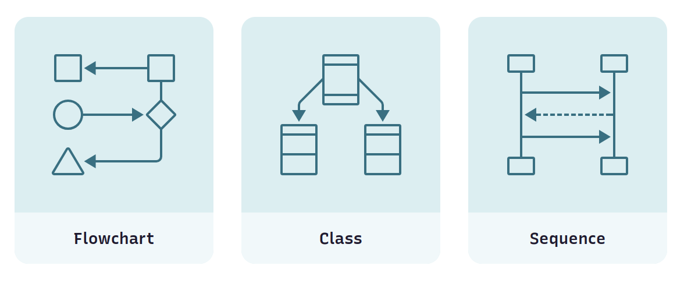

# Cvičenie 1: Úvod do predmetu, vývojový diagram

Úvodné cvičenie je venované príprave vášho počítača, inštalácii potrebných nástrojov a programov a praktickému úvodu do ekosystému Java. Okrem toho sa na tomto a na nasledujúcich cvičeniach stručne zopakujú témy programovania, ktoré ste preberali v predchádzajúcich rokoch. Vysvetlí sa tiež, ktoré znalosti by už študent mal ovládať, nakoľko tento predmet nie je úvodným predmetom pre programovanie ako také. 

<div class="md-has-sidebar" markdown>
  <main markdown>
Na cvičení si taktiež zopakujeme návrh a tvorbu jednoduchých vývojových diagramov. Klasické vývojové diagramy sú používané hlavne pri výuke. Ich pochopenie vám však neskôr pomôže pri vytváraní iných typov diagramov. Tie sa v praxi hojne používajú na vysvetlenie procesov prebiehajúcich v počítačovom systéme či aplikácii. Pri zložitejšej architektúre, práci vo väčšom tíme ľudí alebo pri komunikácii s manažérmi sú diagramy často lepšie riešenie ako text, odrážky, či ukážka kódu.
  </main>

  <aside markdown>
Farebný diagram pekne vyznie aj vo vašej projektovej alebo záverečnej práci a zvýši vám počet strán. :material-emoticon-wink-outline:
  </aside>
</div>



## Opakovanie z minulých rokov

<div class="md-has-sidebar" markdown>
  <main markdown>
Tento predmet nie je úvodom do programovania ako takého, preto sa od vás očakáva, že už ovládate základy programovania a algoritmizácie. Na úvodných cvičeniach si zopakujeme veci z programovania, ktoré ste brali v minulých rokoch. Porovnáme si kód v Jave s kódom, ktorý ste písali v jazyku Python. Ak si však z predchádzajúcich rokov už veľa nepamätáte, oprášte si doma staré zošity a učebnice.

Okrem úplných základov programovania a algoritmizácie si zopakujte aj zložené dátové štruktúry ako polia, množiny a slovníky, a taktiež základné triediace a vyhľadávacie algoritmy.

V rámci tohto predmetu budeme používať okrem IDE aj konzolu a príkazový riadok, preto ak používate na svojom počítači operačný systém Windows, odporúčam vám [nainštalovať si PowerShell](https://aka.ms/powershell-release?tag=stable). Ak to však s programovaním myslíte vážne, pouvažujte nad operačným systémom Linux. Pre seriózne programovanie je vo väčšine prípadov Linux tým najlepším riešením.

*[IDE]: Integrated Development Environment


!!! tip "Učím sa s pomocou Umelej Inteligencie"

    Som študent strednej školy. Vysvetli mi jednoduchým spôsobom, ako funguje:

    - [Triediaci algoritmus Bubble Sort](https://grok.com/share/c2hhcmQtMg%3D%3D_04b3627f-6f2d-4869-ad90-7ffbc532171b)
    - [Rekurzia](https://grok.com/share/c2hhcmQtMg%3D%3D_f9683f65-b3d4-433a-a350-d308f461b67d)
    - [Zložené dátové typy](https://grok.com/share/c2hhcmQtMg%3D%3D_94026252-0da8-4476-838b-f72158d34ddd)

    Sú tieto odpovede, ktoré nám dala umelá inteligencia, správne? Dôverovali by ste umelej inteligencii pri témach, o ktorých vôbec nič neviete?

  </main>

  <aside markdown>
Medzi základné koncepty algoritmizácie patrí analýza problému, rozdelenie na menšie kroky a návrh algoritmu. Vetvenie algoritmu pomocou podmienok, použitie cyklov na opakovanie kódu, základné logické a matematické operácie sú takisto veci, ktoré by ste už mali vedieť ovládať.

Z konceptov programovania by ste už mali vedieť základy premenných a dátových typov, ako napr. čísla, reťazce a booleovské hodnoty. Očakáva sa tiež, že vám nebude robiť problém definovanie a používanie vlastných funkcií/procedúr a použitie parametrov a návratových hodnôt pri volaní funkcií.
  </aside>
</div>

## Java Development Kit

<div class="md-has-sidebar" markdown>
  <main markdown>
Java nie je iba programovací jazyk, ale aj celá platforma a sada programov a nástrojov na vývoj a spúšťanie programov napísaných pre túto platformu. Štandardne ak si stiahnete do svojho počítača 'Javu', tak ide iba o nástroje na spúšťanie programov vytvorených pre platformu Java. Táto sada programov sa volá *Java Runtime Environment (JRE)* a vlastné programy v takejto 'Jave' nebudete môcť písať. 

Na to, aby ste mohli aj programy aj tvoriť potrebujete tzv. *Java Development Kit (JDK)*. Ide o väčšiu sadu nástrojov, ktorá okrem JRE v sebe obsahuje aj nástroje pre programátorov. Táto JDK sada však nie je iba jedna, ale existuje veľké množstvo tzv. *distribúcií JDK* od rôznych inštitúcii a firiem. 

V rámci tohto predmetu budeme používať distribúciu *Temurin* vytvorenú nadáciou Eclipse. Ide o open source distribúciu, ktorá je vhodná na bežné použitie ako pri výuke, tak aj pri komerčnom nasadení Javy. Stiahnite si teda a nainštalujte do svojho počítača **JDK Temurin vo verzii 25 LTS** z oficiálnej stránky [https://adoptium.net/](https://adoptium.net/)
  </main>

  <aside>
    Java má za sebou dlhú históriu a prešla viacerými zmenami, preto je niekedy dosť komplikované vyznať sa, čo sa ako volá a načo to slúži. Aj samotný programovací jazyk prešiel značnou modernizáciou a vylepšeniami, preto neodporúčame učiť sa zo starých kníh a neaktuálnych webových stránok, ktoré vás môžu často popliesť.
  </aside>
</div>


!!! info "Ktorú verziu Javy použiť?"

    Nová verzia Javy vychádza každých 6 mesiacov. Pre bežné použitie však nie je dobré používať vždy tú najnovšiu, ale radšej použite verziu LTS (long-term support), ktorá vychádza každé dva roky. Je stabilnejšia a má dlhú podporu aktualizácii opráv chýb a bezpečnostných záplat.

    Verzie Javy z podporou LTS sú verzie 17, 21 a 25. Pre viac informácii pozri stránku o [histórii verzií Javy](https://en.wikipedia.org/wiki/Java_version_history)

    *[LTS]: Long term support

Po úspešnej inštalácii si funkčnosť overte tak, že si otvorte nové okno konzoly a v príkazovom riadku spusťte príkaz `java --version`.


=== "Zistenie verzie Javy"

    ```
    ~$ java --version
    openjdk 25.0.4 2026-07-21 LTS
    OpenJDK Runtime Environment Temurin-25.0.4+7 (build 25.0.4+7-LTS)
    OpenJDK 64-Bit Server VM Temurin-25.0.4+7 (build 25.0.4+7-LTS, mixed mode, sharing)
    ```

## IDE

<div class="md-has-sidebar" markdown>
  <main markdown>

{align=right width=150}

Pre komfortné programovanie v Jave je vhodné, aby ste používali vývojové prostredie, po anglicky Integrated Development Environment (IDE). Na tomto predmete budeme pracovať vo vývojovom prostredí *IntelliJ IDEA* od firmy JetBrains. Ide o najpopulárnejšie a najviac premakané vývojové prostredie pre jazyk Java. 

Program IntelliJ IDEA si stiahnite a nainštalujte z oficiálnej stránky [https://www.jetbrains.com/idea/download](https://www.jetbrains.com/idea/download). K dispozícii je bezplatná verzia *Community Edition* a platená verzia *Ultimate*. Ako študenti SPŠE v Prešove máte jedinečnú možnosť používať platenú verziu Ultimate úplne zadarmo. 

!!! info "Ako si aktivovať IntelliJ IDEA Ultimate"

    Pre aktiváciu platenej verzie je potrebné
  
    - zaregistrovať sa na stránke [https://account.jetbrains.com/signup](https://account.jetbrains.com/signup) s použitím svojej školskej e-mailovej adresy.
    - požiadať o školskú licenciu na stránke [https://www.jetbrains.com/shop/eform/students](https://www.jetbrains.com/shop/eform/students). Vyplnenie formulára a potvrdenie e-mailovej adresy vám zaberie 3 minúty a školskú licenciu získate automaticky ihneď po zaslaní žiadosti.
    - prihlásiť sa do vyššie vytvoreného konta v programe IntelliJ IDEA. Prihlásenie urobíte v okne *Manage Subscriptions* ktoré nájdete v sekcii Help, alebo v úvodnom okne po stlačení na ikonku :material-cog: vľavo dole.
  </main>

  <aside markdown>
Za vývojovým prostredím IntelliJ IDEA stojí celkom zaujímavá firma. Spoločnosť JetBrains s.r.o. bola založená v Českej republike, troma ruskými programátormi. Našich susedov si vybrali, aby mohli ľahšie obchodovať v rámci Európskej únie a Ameriky. Postupne vyvinuli množstvo ďalších produktov a medzi ich najznámejší prínos do sveta programovania patrí vytvorenie jazyka *Kotlin*. Tento jazyk sa stal hlavným programovacím jazykom pre vývoj aplikácií pre OS Android. 
    
Jazyk Kotlin beží nad platformou Java, dá sa použiť všade tam, kde aj jazyk Java a ponúka modernú alternatívu s množstvom vylepšení. Syntax jazyka je podobný Jave, a zruční Java programátori sa ho dokážu naučiť za pár dní. Hlavným a najpopulárnejším vývojovým prostredím pre jazyk Kotlin je opäť IntelliJ IDEA.
  </aside>
</div>

IntelliJ IDEA nie je zďaleka jediné vývojové prostredie pre jazyk Java. Medzi ďalšie populárne IDE-čka patria programy *Netbeans* a *Eclipse IDE*.
Veľa programátorov má tiež v obľube používať nástroj [Visual Studio Code](https://code.visualstudio.com/), čo je taký univerzálny editor pre veľké množstvo jazykov, a zvláda celkom dobre aj Javu. Medzi jeho najväčšie výhody patrí jednoduchosť, rýchlosť, veľké množstvo rozšírení a *výborná podpora pre nástroje umelej inteligencie*.

## Vývojový diagram
