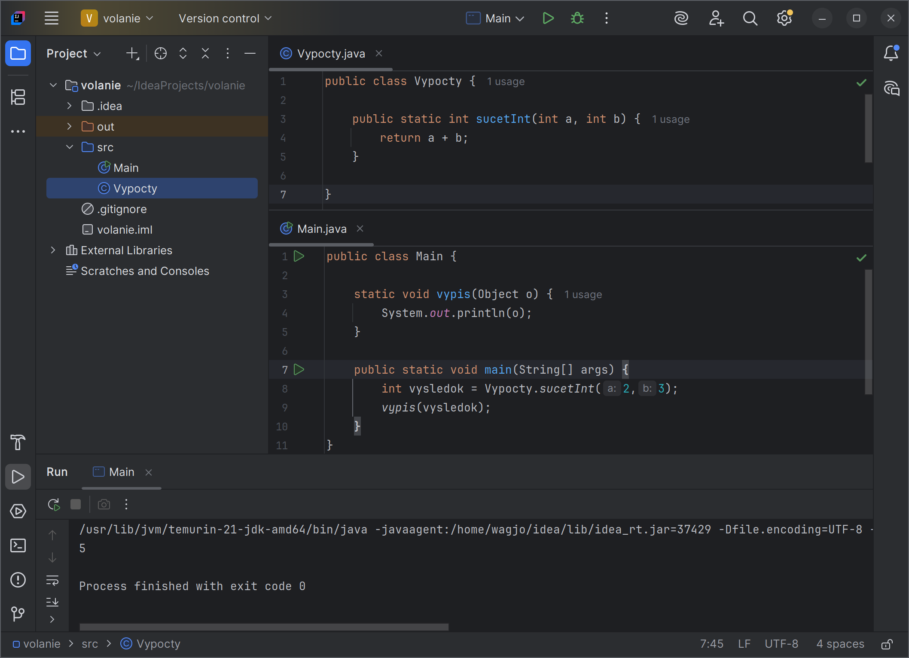

# Cvičenie 2: Prvý Java program

Na tomto cvičení začneme pracovať vo vývojovom prostredí IntelliJ IDEA a vytvoríme si náš prvý projekt. Ukážeme si, ako sa spúšťa a naučíme sa pracovať so štandardným vstupom a výstupom. Taktiež na tomto cvičení budeme mať úvod do znakových reťazcov, podmienok a cyklov.

## Metódy

Klasické funkcie v Jave musia byť vždy súčasťou nejakej triedy (anglicky class). O triedach si povieme viac neskôr, zatiaľ stačí vedieť, že trieda je taká šablóna, alebo plán, podľa ktorého sa vytvárajú objekty. Funkcie v triedach nazývame metódy.

Metódy môžu pracovať s konkrétnym objektom, alebo môžu byť tzv. statické, teda nezávislé na objekte, a môžeme ich volať kedykoľvek. Statické metódy sa pri definícii označujú slovom `static`.

## Statické metóda main

Každý Java program musí mať miesto, ktoré sa začne vykonávať ako prvé po spustení programu. Toto miesto predstavuje statická metóda s názvom `main`. Táto metóda je vstupným bodom programu a keď táto metóda skončí, skončí sa aj celý program.

```java
public class Main {
    public static void main(String[] args) {
        System.out.println("Hello world!");
    }
}
```

Metóda `main` prijíma vstupné argumenty, ktoré užívateľ zadal pri volaní programu.

## Otypovanie metód

Podobne ako pri premenných, v Jave musíme explicitne uviesť dátové typy všetkých argumentov danej metódy. 
Ba čo viac, musíme tak isto uviesť dátový typ výstupu metódy, teda výsledku, ktorý metóda vracia.

Ak metóda nevracia žiaden výsledok, použijeme špeciálne kľúčové slovo `void`.

## Volanie metód

Statickú metódu v rámci rovnakej triedy volám tak, že napíšem jej názov. Ak je však metóda v inej triede, musím pred meno metódy uviesť aj meno tejto triedy a dať bodku.

Každá verejná trieda musí byť vo svojom vlastnom súbore s príponou `.java`. Názov súboru musí byť rovnaký ako názov triedy.

!!! example "Príklad 2.1: Ukážka volania statických metód"

    ```java title="Súbor Vypocet.java"
    public class Vypocty {
        public static int sucetInt(int a, int b) {
            return a + b;
        }
    }
    ```

    ```java title="Súbor Main.java"
    public class Main {

        static void vypis(Object o) {
            System.out.println(o);
        }

        public static void main(String[] args) {
            int vysledok = Vypocty.sucetInt(2,3);
            vypis(vysledok);
        }
    }
    ```

    Súbory musia byť v rovnakom priečinku, aby sme mohli priamo volať metódu z triedy Vypocty.


## Projekt v IntelliJ IDEA

Vyskúšame si vyššie uvedený program v prostredí IntelliJ IDEA. Po spustení vytvorme nový projekt a v ňom súbory podľa daného príkladu.

Pre spustenie programu použijeme zelené tlačítko 'Run', alebo stlačíme stlačíme ++"Shift"+"F10"++

{ .on-glb }
/// caption
Príklad 2.1 v prostredí IntelliJ IDEA
///

## Štandardný výstup

Na vypísanie textu do konzoly používame metódu `System.out.println`. Táto metóda prijíma jeden argument, ktorý vypíše na obrazovku. Ak chceme výstup formátovať, použijeme podobnú metódu `System.out.printf`. Táto metóda už prijíma viac argumentov.

Prečo také komplikované meno? Trieda `System` je trieda štandardnej knižnice, ktorá okrem iného obsahuje objekty so vstupom a výstupom. `out` je jeden z takýchto objektov. Reprezentuje štandardný výstup z programu. No a metódy `println` a `printf` sú definované nad týmto objektom, preto triedu aj objekt pri volaní musíme uviesť.

!!! info "Dokumentácia"

    - Zoznam metód, ktoré vieme volať nad `System.out` nájdeme v [dokumentácii triedy `PrintStream`](https://docs.oracle.com/en/java/javase/21/docs/api/java.base/java/io/PrintStream.html#method-summary)


### Formátovanie výstupu

Ak chceme výstup formátovať, použijeme metódu `System.out.printf`. Vo formátovácom reťazci na miesto, kde chcem vypísať hodnotu uvediem kľúčové slovo začínajúce percentom. Dané hodnoty potom uvediem podľa poradia ako argumenty za formátovací reťazec.

!!! example "Príklad 2.2: Vypísanie aktuálneho dátumu"

    ```java title="Súbor Main.java"
    import java.time.LocalDate;

    public class Main {

        public static void main(String[] args) {
            LocalDate dnes = LocalDate.now();
            System.out.printf("Ahoj, dnes je rok %d a mesiac %s", dnes.getYear(), dnes.getMonth());
        }
    }
    ```

Základné druhy formátovania

| Značka | Popis | 
|--------|-------|
| `%s`   | Reťazec |
| `%d`   | Celé číslo, napr. `%07d` číslo s nulami zľava |
| `%f`   | Desatinné číslo, napr. `%.2f` pre 2 desatinné miesta |
| `%c`   | Znak |

!!! info "Dokumentácia"

    - Podrobný návod ako sa v metóde `printf` formátujú reťazce nájdeme v [doumentácii triedy `Formatter`](https://docs.oracle.com/en/java/javase/21/docs/api/java.base/java/util/Formatter.html#syntax)


## Importovanie tried

V predchádzajúcom príklade sa vyskytol príkaz `import`. V Jave sú triedy rozdelené do balíkov (packages). Aby sme mohli použiť triedu z iného balíka, musí sa importovať.

Importovať môžem buď iba jednu triedu alebo môžem importovať všetky triedy v balíku.

```java
import java.util.Scanner; // Import jednej triedy
import java.util.*; // Import celého balíka
```

!!! info "Automaticky importované triedy"

    Trieda `System` je automaticky importovaná, preto sme ju nemuseli pridávať manuálne. Java automaticky importuje všetky triedy z balíka [`java.lang`](https://docs.oracle.com/en/java/javase/21/docs/api/java.base/java/lang/package-summary.html#class-summary)

Podobne ako triedy musia byť zapísané vo svojom samostatnom súbore, tak aj balíky musia mať svoj samostatný priečinok. Všetky triedy v tom istom priečinku teda patria do toho istého balíka. Balík zadefinujeme na začiatku súboru príkazom `package`.

```java
// súbor: balicek/Osoba.java
package balicek;

public class Osoba {
    public String meno;
    public Osoba(String meno) {
        this.meno = meno;
    }
}
```

## Štandardný vstup

Na načítanie údajov so štandardného vstupu sa najčastejšie používa trieda `Scanner` z balíka `java.util`.
Pomocou tento triedy sa napojíme na vstup (`System.in`) a čítame z neho údaje. Čítať môžme aj iné údaje ako reťazce znakov.


<div class="md-has-sidebar" markdown>
<main markdown>

```java
import java.util.Scanner;

public class Main {
    public static void main(String[] args) {
        // vytvorenie Scanneru pre štandardný vstup
        Scanner sc = new Scanner(System.in);

        System.out.print("Zadaj svoje meno: ");
        String meno = sc.nextLine();   // číta celý riadok

        System.out.print("Zadaj svoj vek: ");
        int vek = sc.nextInt();        // číta celé číslo

        System.out.printf("Ahoj %s, máš %d rokov.", meno, vek);
    }
}
```

  </main>

  <aside markdown>
Väčšinou ak skončíte prácu s objektom `Scanner`, mali by ste tento objekt zatvoriť pomocou metódy `close()`. Ak však Scanner pracuje nad štandardným vstupom `System.in`, tak ho nezatvárajte, inak už viac nebudete môcť štandardný vstup vo svojom programe použiť
  </aside>
</div>

`Scanner` nepracuje iba nad štandardným vstupom. Je mu jedno z čoho číta údaje, a tak ho viete vytvoriť nad súborom, reťazcom znakov alebo údajmi, ktoré boli zaslané cez sieť.

!!! info "Dokumentácia"

    - Detaily ohľadom metód a použitia triedy Scanner nájdete v [dokumentácii triedy `Scanner`](https://docs.oracle.com/en/java/javase/21/docs/api/java.base/java/util/Scanner.html)

## Reťazce znakov

Na prácu s reťazcami znakov sa v Jave používa trieda `String`. Reťazec v Jave je **nemeniteľný objekt**, čo znamená, že pri úprave reťazca sa vytvorí nový objekt v pamäti. Výhodou je vysoká bezpečnosť, nakoľko reťazec vám nemôže nikto potajomky zmeniť.

```java
String meno = "Fero";
String pozdrav = "Ahoj " + meno + "!";
System.out.println(pozdrav);  // Ahoj Fero!
```

!!! info "Dokumentácia"

    - Detaily ohľadom reťazcov nájdete v [dokumentácii triedy `String`](https://docs.oracle.com/en/java/javase/21/docs/api/java.base/java/lang/String.html)

Od Jave verzia 13 je k díspozícii aj viacriadkový reťazec, podobne ako v Pythone:

```java
// Textový blok (Java 13+)
String text = """
    Ahoj,
    ako sa máš?
    """;
```

!!! tip "Učím sa s pomocou umelej inteligencie"

    Som študent strednej školy, a učím sa objektové programovanie v Jave. Vysvetli mi jednoduchým spôsobom, [prečo je String nemeniteľný, aké to má výhody a nevýhody, a dôvody, prečo si Java zvolila nemeniteľnú verziu.](https://grok.com/share/c2hhcmQtMg%3D%3D_a93fde0f-035b-470d-b6c1-8a3026ef4c0b).


## Podmienky

Pre rozhodovanie sa v jave používa príkaz `if`. Podobne ako v Pythone, môže mať viacero možností. Vtedy použijeme príkazy `else` alebo `else if`.

```java title="Použitie podmienky v Jave"
int znamka = 3;

if (znamka == 1) {
    System.out.println("Výborný");
} else if (znamka == 2) {
    System.out.println("Chválitebný");
} else if (znamka == 3) {
    System.out.println("Dobrý");
} else {
    System.out.println("Neúspešný");
}
```

V Jave existuje taktiež tzv. ternárny operátor, pomocou ktorého vieme zapísať podmienku ako výraz, a použiť ju tak v rámci iných výrazov alebo príkazov. Syntax ternárneho operátora je `(podmienka) ? hodnota_ak_true : hodnota_ak_false`

```java title="Použitie ternárneho operátora Jave"
int vek = 20;
String typ = (vek >= 18) ? "dospelý" : "mladý";
System.out.println(typ);
```

## Cykly

Cykly slúžia na opakovanie časti kódu. V Jave existujú štyry príkazy na vytvorenie cyklu, dnes si ukážeme dve z nich.

Cyklus pomocou `for` sa používa, keď dopredu vieme, koľkokrát sa má cyklus opakovať.

```java
for (int i = 0; i < 5; i++) {
    System.out.println("i = " + i);
}
```

Cyklus pomocou `while` sa opakuje, kým je podmienka pravdivá
```java
int i = 0;
while (i < 5) {
    System.out.println("i = " + i);
    i++;
}
```


## Úlohy na precvičenie

!!! example "Úloha 2.1: Vykreslenie štvorca do konzoly"

    Vytvorte funkciu, ktorá vykreslí štvorec do konzoly. Vstupom do funkcie je veľkosť štvorca.

!!! example "Úloha 2.2: Výpočet obsahu a objemu valca"

    Vytvorte funkciu, ktorá na vstupe prijíma výšku a polomer a vypočíta obsah a objem valca. Výsledok vráťťe ako dict, a na vypísanie na obrazovku vytvorte samostatnú funkciu.

!!! example "Úloha 2.3: Výpočet faktoriálu"

    Vytvorte funkciu na výpočet faktoriálu

!!! example "Úloha 2.4: Orámovaný text"

    Vytvorte funkciu na vypísanie orámovaného textu do konzoly. Majte aj maximálnu šírku a text zalomte po slovách, ak je dlhý.

!!! example "Úloha 2.5: Prvočísla"

    Vytvorte funkciu na vrátenie najbližieho prvočísla väčšieho ako zadaný vstup


## Zhrnutie cvičenia

- [x] Statické metódy
    * [ ] Klasické funkcie v Jave musia byť vždy súčasťou nejakej triedy (anglicky class)
    * [ ] Metódy môžu pracovať s konkrétnym objektom, alebo môžu byť tzv. statické, teda nezávislé na objekte
    * [ ] Statické metódy sa pri definícii označujú slovom static.
- [x] Statické metóda main je vstupným bodom programu a keď táto metóda skončí, skončí sa aj celý program.
- [x] Otypovanie metód
    * [ ] musíme explicitne uviesť dátové typy všetkých argumentov a aj výstupu danej metódy
    * [ ] Ak metóda nevracia žiaden výsledok, použijeme špeciálne kľúčové slovo void
- [x] Volanie metód
    * [ ] Statickú metódu v rámci rovnakej triedy volám tak, že napíšem jej názov
    * [ ] Ak je však metóda v inej triede, musím pred meno metódy uviesť aj meno tejto triedy a dať bodku.
- [x] Štruktúra kódu
    * [ ] Každá verejná trieda musí byť vo svojom vlastnom súbore s príponou .java. 
    * [ ] Názov súboru musí byť rovnaký ako názov triedy.
    * [ ] V Jave sú triedy rozdelené do balíkov (packages)
    * [ ] Aby sme mohli použiť triedu z iného balíka, musí sa importovať
    * [ ] Java automaticky importuje všetky triedy z balíka java.lang
    * [ ] balíky musia mať svoj samostatný priečinok 
    * [ ] Všetky triedy v tom istom priečinku teda patria do toho istého balíka.
- [x] Reťazce sú reprezentované triedou `String`, objekty tejto triedy sú nemeniteľné
- [x] Vstup a výstup
    * [ ] Na vypísanie textu do konzoly používame metódu System.out.println
    * [ ] Ak chceme výstup formátovať, použijeme podobnú metódu System.out.printf
    * [ ] Štandardný vstup prečítame použítím triedy Scanner z balíka java.util. 
- [x] Podmienky a cykly
    * [ ] Pre rozhodovanie sa v jave používa príkaz if a else
    * [ ] Cyklus pomocou for sa používa, keď dopredu vieme, koľkokrát sa má cyklus opakovať.
    * [ ] Cyklus pomocou while sa opakuje, kým je podmienka pravdivá 

!!! note "Poznámky do zošita"
    V zošite je potrebné mať napísané aspoň tieto poznámky:

    ```
    Statické metódy - static
    - Patria do nejakej triedy
    - Viem ich volať nezávisle na objekte

    Entry point programu
    - statická metóda main(String[] args)
    - keď skončí main, skončí sa aj program

    Metódy sú v triedach, každá trieda má svoj .java súbor s rovnakým názvom ako trieda
    Triedy sú v balíkoch, každý balík má svoj priečinok s rovnakým názvom ako balík

    Reťazce znakov - String - reťazec je nemeniteľný objekt

    Výstup pomocou System.out.println
    Vstup pomocou java.util.Scanner

    Podmienky - if, else
    Cykly - for, while
    ```

!!! warning "Skúšanie a kontrola vedomostí"

    Ústne skúšanie alebo krátka 5-minútovka:

    - Vedieť napísať statickú metódu
    - Vedieť napísať cyklus a podmienku
    - Ternárny operátor, čo to je?
    - Ako načítame vstup z klávesnice?
    - Ako vypíšeme niečo na obrazovku?
