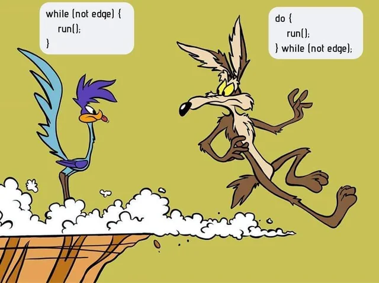

# Cvičenie 3: Riadenie toku programu

Na tomto cvičení sa hlbšie ponoríme do spôsobov, akými sa v Jave dá riadiť tok programu. Priblížime si detailne podmienky a cykly.

Veľká úloha na cvičení: Vytvoriť program pre konzolu riadený pomocou menu a vykresľujúci parametrizované (rôzne veľké) obrazce (štvorce, obdĺžniky, trojuholníky, bonus – kruhy) vyplnené i prázdne

## Podmienka switch

Na minulom cvičaní sme si ukázali podmienku `if-else`. Ide o najčastejšie používaný typ podmienky a vo svojich programoch ho budete často používať. Okrem tejto podmienky má však Java aj príkaz `switch`.

`switch` je podmienka, ktorá sa zvykne používať, ak mám na výber z viacerých možností. Ak nenastane ani jeden z `case` prípadov, nastane možnosť `default`.


```java title="Tradičný switch príkaz"
int den = 3;

switch (den) {
    case 1:
        System.out.println("Pondelok");
        break;
    case 2:
        System.out.println("Utorok");
        break;
    case 3:
        System.out.println("Streda");
        break;
    default:
        System.out.println("Neznámy deň");
}
```

Podmienka v príkaze `switch` musí mať vo výsledku primitívnu hodnotu, `String`, alebo musí byť tzv. `enum` (o tom niekedy inokedy)

Všimnite si použitie príkazu `break`. Ak by v nejakej možnosti `break` nebol, vykonávanie programu by pokračovalo ďalšou možnosťou! Niekedy je to žiadúce, a takýto spôsob sa volá **fall-through**. Uvedieme si ho v nasledovných príkladoch:

??? example "Switch kedy viacero možností má rovnaký kód"

    ```java
    int mesiac = 3; // marec

    switch (mesiac) {
        case 12:
        case 1:
        case 2:
            System.out.println("Zima");
            break;

        case 3:
        case 4:
        case 5:
            System.out.println("Jar");
            break;

        case 6:
        case 7:
        case 8:
            System.out.println("Leto");
            break;

        case 9:
        case 10:
        case 11:
            System.out.println("Jeseň");
            break;

        default:
            System.out.println("Neplatný mesiac");
    }
    ```

??? example "Switch s fall through kedy niektoré možnosti obshujú aj tie nasledovné"

    ```java
    int accessCode = 2;
    String clearance;

    switch (accessCode) {
        case 1:
            clearance = "Top Secret";
            System.out.println("Full system access!");
        case 2:
            clearance = "Secret";
            System.out.println("Restricted area access!");
        case 3:
            clearance = "Confidential";
            System.out.println("Limited access!");
            break;
        case 4:
            clearance = "Public";
            System.out.println("Basic access only!");
            break;
        default:
            clearance = "Denied";
            System.out.println("Access not granted!");
    }

    System.out.println("Access Code: " + accessCode + ", Clearance: " + clearance);
    ```


V nových verzíách Javy existuje moderná verzia `switch`, ktorá je už ako výraz, a jednotlivé možnosti môžu byť zložitejšie. `break` sa už nepoužíva a fall through nenastáva.

<div class="md-has-sidebar" markdown>
<main markdown>

```java title="Moderný switch od Javy 14"
int den = 3;

String nazov = switch (den) {
    case 1 -> "Pondelok";
    case 2 -> "Utorok";
    case 3 -> "Streda";
    case 6, 7 -> "Víkend";
    default -> "Neznámy deň";
};

System.out.println(nazov);
```

  </main>

  <aside markdown>
Ak je vo `switch` zápise šípka `->` tak ide o moderný switch výraz.</aside>
</div>


!!! info "Pre pokročilých, od Javy 17"

    V modernom zápise podmienky `switch` tiež závisí na poradí jednotlivých prípadov. Vieme v nich totiž použiť tzv. pattern matching, kde viacero prípadov môže vyhovovať podmienke.

    ```java
    int score = 85;
    String grade = switch (score) {
        case int s when s >= 90 -> "A";
        case int s when s >= 80 -> "B";
        case int s when s >= 70 -> "C";
        default -> "F";
    };
    System.out.println(grade); // Output: B
    ```

## Cyklus a jeho riadenie

Na minulom cvičení sme si ukázali cykly `for` a `while`. Prvý bol pre prípady, kedy vieme dopredu počet opakovaní, alebo chceme iterovať cez nejakú kolekciu alebo rozsah hodnôt. Cyklus `while` opakuje kód dovtedy kým je splnená podmienka.

Na riadenie toku cyklov existujú dva špeciálne príkazy. Príkaz `break` ukončí predčasne cyklus, a príkaz `continue` preskočí aktuálnu iteráciu pokračuje ďalšou.

```java title="Príklad použitie break a continue"
for (int i = 0; i < 10; i++) {
    if (i == 5) break; // ukončí celý cyklus
    if (i % 2 == 0) continue; // přeskočí párne čísla
    System.out.println(i);
} // vypíše čísla 1 a 3
```

Použitie `break` a `continue` si ukážeme aj v nasledovných príkladoch

??? example "Vyhľadávanie prvku v poli"

    ```java
    int[] pole = {4, 8, 15, 16, 23, 42};
    int hladane = 23;
    int i = 0;

    while (i < pole.length) {
        if (pole[i] == hladane) {
            System.out.println("Našiel som číslo " + hladane + " na indexe " + i);
            break; // už netreba pokračovať
        }
        i++;
    }
    ```

??? example "Hádanie tajného čísla"

    ```java
    import java.util.Scanner;

    Scanner sc = new Scanner(System.in);
    int tajne = 7;
    int pokusy = 0;

    while (true) {
        System.out.print("Hádaš číslo: ");
        int tip = sc.nextInt();
        pokusy++;
        
        if (tip <= 0) {
            System.out.println("Zadaj kladné číslo!");
            continue; // nepočítaj ako pokus
        }
        
        if (tip == tajne) {
            System.out.println("Správne! Našiel si číslo na " + pokusy + ". pokus.");
            break; // koniec hry
        }
        
        if (tip < tajne) {
            System.out.println("Nesprávne, hľadané číslo je väčšie, skús znova.");
        } else {
            System.out.println("Nesprávne, hľadané číslo je menšie, skús znova.");
        }
    }
    ```

## Cyklus do-while

Tretím typom cyklu v Jave je cyklus `do-while`, ktorý je podobný cyklu `while`, ale vždy sa vykoná aspoň jedenkrát. Ukončovacia podmienka sa totiž testuje až na konci.

```java title="Simulácia hádzania kocky"
import java.util.Random;

...

Random random = new Random();
int hod;

do {
    hod = random.nextInt(6) + 1; // Generuje číslo od 1 do 6
    System.out.println("Padlo číslo: " + hod);
} while (hod != 6);

System.out.println("Hurá! Padla šestka!");
```

{.on-glb}
/// caption
Rozdiel medzi while a do-while
///

## Cyklus for-each

Štvrtým typom cyklu v Jave je tzv. for-each cyklus. Ide o cyklus ktorý iteruje naprieč nejakou kolekciou alebo iným objektom, ktorý sa dá iterovať. Používa sa, ak chcete jednoducho spracovať každý prvok bez manuálnej správy indexu alebo iterácie.

```java title="Príklad použitie for-each"
int[] cisla = {1, 2, 3, 4, 5};

for (int cislo : cisla) {
    System.out.println("Číslo: " + cislo);
}
```

Cyklus for-each je jednoduchý, nepotrebujete v ňom spravovať index ako pri klasickom `for` cykle. Používa sa iba na čítanie prvkov, nie na ich modifikáciu v kolekcii. Taktiež vnútri cyklu neviete zistiť pozíciu prvku v cykle, nakoľko nemáte prístup k indexu.


## Úlohy na precvičenie

!!! example "Úloha 3.1: Zisti, či je číslo negatívne"

    Vytvorte funkciu, ktorá vypíše, či je vstupné číslo negatívne, pozitívne, alebo či je 0. Použite if-else

!!! example "Úloha 3.2: Switch kalukačka"

    Napíš program, ktorý podľa znaku (+, -, *, /) vykoná príslušnú matematickú operáciu nad dvoma číslami. Použi switch

!!! example "Úloha 3.3: Slovné hodnotenie"

    Napíš program, ktorý podľa zadanej známky (1–5) vypíše slovné hodnotenie ("Výborný", "Chválitebný", ...). Použi switch.

!!! example "Úloha 3.4: Najväčšie číslo"

    Používateľ bude zadávať celé čísla. Program bude hľadať najväčšie z nich. Zadanie čísla 0 ukončí zadávanie a vypíše sa najväčšie zadané číslo. Použite do-while.

!!! example "Úloha 3.5: Párne čísla"

    Napíš program, ktorý vypíše všetky párne čísla od 1 po n (hodnotu n zadá používateľ). Použite while.

!!! example "Úloha 3.6: Nákupné položky"

    Používateľ zadáva ceny položiek. Program počíta celkovú sumu a skončí, keď používateľ zadá 0. Použite do-while.

!!! example "Úloha 3.7: Počítanie deliteľov"

    Napíš program, ktorý pre zadané číslo zistí, koľko má deliteľov (vrátane 1 a samotného čísla) pomocou for cyklu.

!!! example "Úloha 3.8: Výpis párnych čísel"

    Máme pole čísel {10, 15, 20, 25, 30, 20, 88, 43, 77, 32}. Použi for-each cyklus na výpis iba párnych čísel.

## Zhrnutie cvičenia

- [x] Podmienka `switch` sa zvykne používať, ak mám na výber z viacerých možností
    * [ ] Podmienka v príkaze `switch` musí mať vo výsledku primitívnu hodnotu, `String`, alebo musí byť tzv. `enum`
    * [ ] Ak nevyhovuje žiadna možnosť, vyberie sa prípad `default`, ake je definovaný
    * [ ] Ak v možnosti neuvediem `break`, nastáva *fall-through* a vykoná sa aj nasledujúca možnosť
    * [ ] Moderná verzia `switch`, ktorá je už ako výraz, nepoužíva fall-through a jeden prípad môže mať viacero možností
- [x] Na riadenie toku cyklov
    * [ ] Príkaz `break` ukončí predčasne cyklus
    * [ ] Príkaz `continue` preskočí aktuálnu iteráciu pokračuje ďalšou
- [x] V Jave máme 4 typy cyklov: `for`, `while`, `do-while` a `for-each`
- [x] Cyklus `do-while`
    * [ ] Je podobný cyklu `while`, ale vždy sa vykoná aspoň jedenkrát
- [x] Cyklus `for-each`
    * [ ] Iteruje naprieč nejakou kolekciou alebo iným objektom, ktorý sa dá iterovať
    * [ ] Používa sa iba čítanie prvkov, nie na ich modifikáciu v kolekcii
    * [ ] Vnútri cyklu neviete zistiť pozíciu prvku v cykle, nakoľko nemáte prístup k indexu

!!! note "Poznámky do zošita"
    V zošite je potrebné mať napísané aspoň tieto poznámky:

    ```
    switch je podmienka pre výber z viacerých možností
    - musí mať primitívnu hodnotu, String, enum
    - ak nič nevyhovuje, vyberie default
    - ak neuvediem break, nastáva fall-through a vykoná sa aj nasledujúca možnosť
    - moderná verzia switch, je už výraz, nepoužíva fall-through a jeden prípad môže mať viacero možností

    Riadenie toku cyklov
    - break ukončí predčasne cyklus
    - continue  preskočí aktuálnu iteráciu pokračuje ďalšou

    V Jave máme 4 typy cyklov: for, while, do-while a for-each

    Cyklus do-while je podobný cyklu while, ale vždy sa vykoná aspoň jedenkrát

    Cyklus for-each
    - iteruje naprieč kolekciou
    - používa sa na čítanie, nie na modifikáciu
    - neposkytuje pozíciu prvku v cykle, nemá index
    ```

!!! warning "Skúšanie a kontrola vedomostí"

    Ústne skúšanie alebo krátka 5-minútovka:

    - Popíšte fungovanie príkazu switch
    - Čo je fall-through a aké má využitie
    - Aký je rozdiel medzi while a do-while
    - Ako funguje príkaz break
    - Ako funguje príkaz continue
    