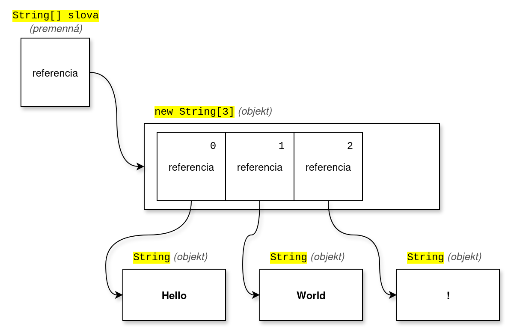
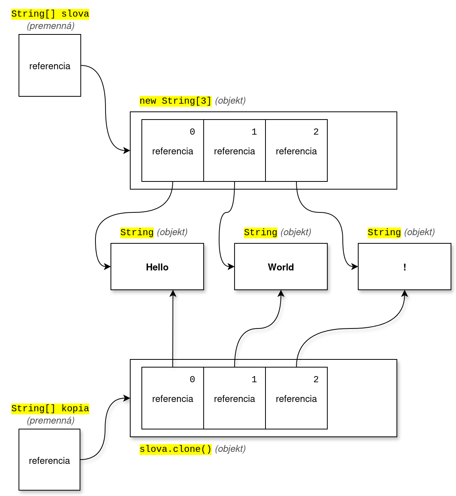

# Cvičenie 4: Balíky a triedy, polia, varargs

Na dnešnom cvičení sa bližšie povenujeme poliam, ktoré predstavujú základný spôsob ako v Jave uchovávať dokopy viac hodnôt.
Pred tým si však vyskúšame vytvoriť projekt s viacerými triedami.

## Projekt s viacerými triedami v balíkoch

V IntelliJ IDEA si v našom projekte vytvoríme balíky a 4 triedy podľa nasledovného príkladu

=== "Projekt so štyrmi triedami v balíkoch"

    ```java title="sk/spse/tvary/Kruh.java"
    package sk.spse.tvary;

    public class Kruh {
        public static double obvod(double r) {
            return 2 * Math.PI * r;
        }
        public static double obsah(double r) {
            return Math.PI * r * r;
        }
    }
    ```

    ```java title="sk/spse/tvary/Obdlznik.java"
    package sk.spse.tvary;

    public class Obdlznik {
        public static int obvod(int a, int b) {
            return (2 * a) + (2 * b);
        }
        public static int obsah(int a, int b) {
            return a * b;
        }
    }
    ```

    ```java title="sk/spse/tvary/Stvorec.java"
    package sk.spse.tvary;

    public class Stvorec {
        public static int obvod(int a) {
            // Ak je trieda v tom istom balíku, nemusím písať jeho názov
            return Obdlznik.obvod(a, a);
        }
        public static int obsah(int a) {
            return Obdlznik.obsah(a, a);
        }
    }
    ```

    ```java title="sk/spse/Main.java"
    package sk.spse;

    import sk.spse.tvary.Kruh;

    public class Main {
        public static void main(String[] args) {
            int a = 10;
            // Používam triedu Kruh, ktorú som si importoval
            System.out.printf("Obvod kružnice o veľkosti %d je %.2f\n",
                              a, Kruh.obvod(a));
            // Ak použijem celé meno triedy, nemusím robiť import
            System.out.printf("Obvod štvorca  o veľkosti %d je %d\n",
                              a, sk.spse.tvary.Stvorec.obvod(a));
        }
    }
    ```

<div class="md-has-sidebar" markdown>
<main markdown>
Funkčnosť projektu si vyskúšame spustením triedy `sk.spse.Main`. Všimnite si použitie balíkov a importu. Import v Jave je iný ako import v Pythone. V Jave je import iba na uľahčenie práce programátorom, aby nemuseli stále písať celý názov triedy. Inú funkciu import nemá a samotný import nám nič nevykoná ani nespustí. **Používať iné triedy môžeme bez akéhokoľvek importu**.

Na rozdiel od Pythonu nám Java neumožňuje premenovať importované triedy alebo metódy resp. vytvoriť ich alias. Ak je v Jave problém s duplicitnými menami, jednoducho triedu neimportujeme ale použijeme jej celé meno aj s balíkom.
 </main>
  <aside markdown>
  Existuje ešte jeden špeciálny typ importu, ktorý importuje všetky statické metódy z danej triedy, takže ich nemusíme volať cez názov triedy. V našom prípade by takýto import vyzeral napr. `import static sk.spse.tvary.Kruh`
</div>

## Pole - Array

Ak chceme v Jave uchovávať viac hodnôt v jednej premennej, môžeme použiť pole.

Pole (anglicky array) je zoznam hodnôt jedného typu s fixnou (nemennou dĺžkou). Jednotlivé hodnoty sú očíslované a vieme k nim pristupovať pomocou indexu. Ide o neprimitívny dátovy typ, teda konkrétne pole je objekt. Na prácu s poliami máme v Jave špeciálnu syntax.

Vlastnosti poľa:

- **fixná veľkosť**, nemenná dĺžka
- samotné **prvky poľa ale meniť viem**
- **homogénne prvky** - prvky poľa musia byť rovnakého typu
- **pole je objekt**, nie je primitívny typ. Prvky poľa môžu byť primitívne.
- **prvky majú poradie**, **majú index**, ktorý začína číslom 0

Pri vytváraní poľa musím definovať jeho veľkosť.

=== "Deklarácia a inicializácia poľa"

    ```java
    int[] pole = new int[5]; // Pole čísel o veľkosti 5, prvky sa inicializujú na 0
    pole[0] = 10; // mením prvý prvok poľa
    pole[4] = 30; // mením posledný prvok poľa
    ```

Pole viem vytvoriť aj priamo z konkrétnych hodnôt

=== "Vytvorenie poľa s konkrétnymi hodnotami"

    ```java
    int[] pole = {1, 2, 3, 4, 5};
    ```

Ak mám pole primitívnych hodnôt, tak sú uložené priamo v objekte poľa. Ak mám však pole neprimitívnych hodnôt - objektov, tak do objektu poľa sa uložia referencie na objekty. V nasledujúcom príklade si pomocou diagramu znázorníme, ako to vyzerá v pamäti počítača:

=== "Pole neprimitívneho typu"

    ```java
    String[] slova = new String[3];
    slova[0] = "Hello";
    slova[1] = "World";
    slova[2] = "!";
    ```

{.on-glb width=550}
/// caption
premenná, pole a jednotlivé prvky poľa sú v pamäti počítača uložené samostatne
///

### Používanie poľa

Dĺžku poľa viem zistiť pomocou atribútu `length`

=== "Zistenie dĺžky poľa"

    ```java
    int[] pole = new int[10];
    System.out.println(pole.length); // 10
    ```

K jednotlivým prvkom poľa pristupujem pomocou hranatých zátvoriek. Takto viem hodnoty prvkov nie len čítať ale ich aj meniť.

=== "Prístup k prvkom poľa"

    ```java
    int[] cisla = {10, 20, 30};
    System.out.println(cisla[1]);  // 20
    System.out.println(cisla[3]);  // CHYBA!
    ```

Ak sa pokúsim pristúpiť ku neexistujúcim prvkom, Java vyhodí výnimku `ArrayIndexOutOfBoundsException`

Prvky poľa viem prechádzať v cykle. Môžem použiť klasický `for` alebo novší `for-each`

=== "Použitie cyklusu `for`"

    ```java
    for (int i = 0; i < cisla.length; i++) {
        System.out.println(cisla[i]);
    }
    ```

=== "Použitie cyklusu `for-each`"

    ```java
    for (int n : cisla) {
        System.out.println(n);
    }
    ```

Prvky poľa môžu byť akéhokoľvek typu, primitívneho aj neprimitívneho.

=== "Prvky v poli môžu byť aj objekty"

    ```java
    String[] slova = {"Hello", "world", "!"};
    for (String slovo: slova) {
        System.out.print(slovo + " ");
    }
    ```

### Užitočné utility

Niektoré veci sa pri poliach robia špeciálne. Polia sa nedajú porovnávať cez klasický `equals()` a nedajú sa vypisovať do reťazca cez klasický `toString()`. Tak isto pri kopírovaní poľa pozor. Keďže pole je objekt, obyčajné `=` skopíruje referenciu (odkaz), ale objekt bude ten istý. 

Pre takéto situácie máme v Jave pomocnú triedu `java.util.Arrays`, v ktorej máme užitočné utility. Všetky metódy sú statické.

- `Arrays.fill(pole, hodnota)` - vyplní pole hodnotou
- `Arrays.equals(pole1, pole2)` - porovná polia podľa ich hodnôt
- `Arrays.toString(pole)` - vypíše obsah poľa do reťazca
- `Arrays.sort(pole)` - zoradí pole od najmenšieho po najväčší prvok. Mení existujúce pole!

=== "Príklad použitia triedy `j.u.Arrays`"

    ```java
    import java.util.Arrays;

    int[] arr = {3, 1, 2};
    Arrays.sort(arr); // sort
    System.out.println(Arrays.toString(arr)); // [1, 2, 3]
    ```


!!! abstract "Dokumentácia"

    Všetky utilitky nájdete v oficiálnej dokumentácii triedy [`java.util.Arrays`](https://docs.oracle.com/en/java/javase/21/docs/api/java.base/java/util/Arrays.html)


### Kopírovanie poľa

Na vytvorenie kópie poľa máme v Jave viacero metód. 

- `pole.clone()` - vytvorí nové pole a skopíruje hodnoty prvkov
- `Arrays.copyOf(pole, novaDlzka)` - nové pole môže mať inú veľkosť
- `Arrays.copyOfRange(pole, od, do)` - môžeme skopírovať iba časť poľa
- `System.arraycopy(src, srcPos, dest, destPos, length)` - skopíruje hodnoty prvkov medzi dvoma existujúcimi poľami

!!! warning "Shallow copy"

    Tieto metódy kopírovania poľa sú tzv. povrchné, anglicky shallow. To znamená, že pole sa síce vytvorí nové a prvky
    sa do neho skopírujú, ale samotné prvky sú iba obyčajná kópia ako pri `=`. To znamená, že keď máme pole objektov, tak sa nám skopírujú referencie. Vo výsledku budem mať 2 rozdielne polia, ale prvky v nich budú ukazovať na rovnaké objekty. To môže byť problém, ak sú objekty meniteľné.

Na príklade s poľom `slovo` si ukážeme, ako sa pri kopírovaní poľa jeho jednotlivé prvky zdieľajú.

=== "Pole neprimitívneho typu"

    ```java
    String[] slova = new String[3];
    slova[0] = "Hello";
    slova[1] = "World";
    slova[2] = "!";
    String[] kopia = slova.clone();
    ```

{.on-glb width=550}
/// caption
Pole neprimitívnych hodnôt vytvára pri kopírovaní tzv. Shallow copy
///


### Viacrozmerné pole

V Jave viem vytvoriť aj viacrozmerné polia. Sú komplikovanejšie na pochopenie, spomenieme ich preto iba veľmi stručne.

=== "Viacrozmerné pole"

    ```java
    int[][] matica = new int[2][3]; 
    matica[0][0] = 1;

    int[][] matica2 = {{1, 2, 3}, {4, 5, 6}};
    ```

!!! tip "Učím sa s pomocou umelej inteligencie"

    Som študent strednej školy, učím sa Javu. Vysvetli mi [základy viacrozmerných polí v Jave, uveď príklady a na čo si dávať pri práci s viacrozmernými poľami pozor](https://grok.com/share/c2hhcmQtMg%3D%3D_f0f19e0a-16b9-4f50-a96e-54e27153a09b).


## Premenlivý počet argumentov

V Jave vieme definovať metódy, ktoré majú premenlivý počet argumentov. Takéto argumenty sa anglicky volajú varargs (variable-length arguments) a pri volaní takejto metódy môžeme uviesť akýkoľvek počet premenlivých argumentov (aj 0). Samozrejme, ak má metóda aj klasické argumenty, tie musíme uviesť vždy.

=== "Premenlivý počet argumentov"

    ```java
    void metoda(int a, int b, String... slova) {
        System.out.println(a + b);
        for (String slovo : slova) {
            System.out.println(slovo);
        }
    }

    metoda(1, 2);
    metoda(1, 2, "Hello", "world");
    ```

V metóde môžeme mať iba jeden vararg argument. Premenlivý argument musíme uviesť v zozname parametrov metódy vždy ako posledný. V tele samotnej metódy máme vararg argument uložený vo forme poľa.

Keďže vararg argument je v skutočnosti pole hodnôt, vieme pri volaní takejto metódy poslať na vstup pole, a Java ho automaticky použije ako pole argumentov.

!!! tip "Učím sa s pomocou umelej inteligencie"

    Som študent strednej školy, učím sa Javu. Vysvetli mi [ako sa v Jave pracuje s varargs](https://grok.com/share/c2hhcmQtMg%3D%3D_ec79000a-8e32-43c1-a449-f16b4d8dceb1).


## Úlohy na precvičenie

!!! example "Úloha 4.1: Priemer"

    V balíku `sk.spse.util` vytvorte triedu `Math`. V tejto triede vytvorte statickú metódu `priemer`, ktorá má na vstupe pole čísel a vráti ich aritmetický priemer. Zavolaj ju z metódy `sk.spse.Main.main()`

!!! example "Úloha 4.2: Číselné sústavy"

    V balíku `sk.spse.util` vytvorte triedu `Pole`. V nej vytvorte statickú metódu `najdlhsiRetazec`, ktorá má na vstupe pole reťazcov a vráti najdlhší z nich.

!!! example "Úloha 4.3: Medián"

    V triede `sk.spse.util.Math` vytvorte statickú metódu `median`, ktorá má premenlivý počet číselných argumentov, a vráti ich mediánovú hodnotu.

    Medián je číslo, ktoré leží presne v strede zoradeného zoznamu čísel. Ak je dĺžka zoznamu párna, mediánom je priemer dvoch stredných čísel.

!!! example "Úloha 4.4: Medián z klávesnice"

    Do predchádzajúcej úlohy pridajte do metódy `sk.spse.Main.main()` načítavanie čísel z klávesnice. Ako budete riešiť počet čísel?

!!! example "Úloha 4.5: Párne a nepárne"

    V triede `sk.spse.util.Pole` vytvorte statickú metódu `parneNeparne`, ktorá má na vstupe pole čísel, a vráti pole o veľkosti 2, kde prvý prvok poľa bude počet párnych čísel a druhý prvok bude počet nepárnych čísel.

!!! example "Úloha 4.6: Spájanie polí"

    V triede `sk.spse.util.Pole` vytvorte statickú metódu `spoj`, ktorá má na vstupe dve polia a vráti pole, ktoré vznikne spojením týchto dvoch polí.

!!! example "Úloha 4.7: Najdlhšia sekvencia"

    V triede `sk.spse.util.Pole` vytvorte statickú metódu `najdlhsiaSekvencia`, ktorá má na vstupe pole a vráti číslo, ktorého hodnota je dĺžka najdlhšej sekvencie rovnakých prvkov vo vstupnom poli.


## Zhrnutie cvičenia

- [x] Import tried v Jave nie je povinný, stačí ak použijeme celý názov triedy
    * [ ] `import static balik.Trieda.*` importuje všetky statické metódy danej triedy
    * [ ] V Jave sa nedá vytvoriť alias, ak je problém s duplicitou, používame celý názov triedy
- [x] Pole - Array, je zoznam hodnôt jedného typu
    * [ ] fixná veľkosť
    * [ ] hodnoty prvkov meniť viem
    * [ ] všetky prvky musia mať rovnaký typ
    * [ ] pole je objekt
    * [ ] prvky majú poradie, index
- [x] Ak prvky poľa sú primitívne, ukladajú sa priamo do poľa. Ak sú objekty, v poli sú iba referencie na nich.
- [x] Pri vytváraní poľa musím uviesť jeho veľkosť, napr. `int[] pole = new int[5];`
    * [ ] Pole viem inicializovať aj konkrétnymi hodnotami, napr. `int[] pole = {1, 2, 3, 4, 5};`
    * [ ] K prvkom poľa pristupujem cez index, napr. `pole[0] = 3;`
    * [ ] Dĺžku poľa zistím cez atribúť `length`, napr. `pole.length`
    * [ ] Pole viem iterovať v cykle `for-each`
- [x] Pri poliach si treba dávať pozor hlavne na tieto veci
    * [ ] Klasický `equals()` nefunguje správne
    * [ ] Klasický `toString()` nevypíše hodnoty prvkov
    * [ ] Keďže pole je objekt, operátor `=` skopíruje referenciu (odkaz), nie objekt
- [x] Užitočné utility nájdem v triede `java.util.Arrays`
    * [ ] `Arrays.fill(pole, hodnota)` - vyplní pole hodnotou
    * [ ] `Arrays.equals(pole1, pole2)` - porovná polia podľa ich hodnôt
    * [ ] `Arrays.toString(pole)` - vypíše obsah poľa do reťazca
    * [ ] `Arrays.sort(pole)` - zoradí pole od najmenšieho po najväčší prvok. Mení existujúce pole!
- [x] V Jave mám metódy na povrchné (shallow) kopírovanie poľa
    * [ ] `pole.clone()` - vytvorí nové pole a skopíruje hodnoty prvkov
    * [ ] `Arrays.copyOf(pole, novaDlzka)` - nové pole môže mať inú veľkosť
    * [ ] `Arrays.copyOfRange(pole, od, do)` - môžeme skopírovať iba časť poľa
    * [ ] `System.arraycopy(src, srcPos, dest, destPos, length)` - skopíruje hodnoty prvkov medzi dvoma existujúcimi poľami
- [x] Viem vytvárať aj viacrozmerné polia
    * [ ] `int[][] matica = new int[2][3];`
    * [ ] `matica[0][0] = 1;`
    * [ ] `int[][] matica2 = {{1, 2, 3}, {4, 5, 6}};`
- [x] Metódy v Jave môžu mať premenlivý počet argumentov - varargs
    * [ ] Príklad definície `void metoda(int a, int b, String... slova)`
    * [ ] V tele metódy sú argumenty uložené do poľa
    * [ ] Do vararg metódy viem vložiť aj pole, Java ho použije ako pole argumentov


!!! note "Poznámky do zošita"
    V zošite je potrebné mať napísané aspoň tieto poznámky:

    ```
    POLIA

    Pole - Array, je zoznam hodnôt jedného typu
    Vlastnosti:
    - fixná nemenná veľkosť
    - hodnoty prvkov meniť viem
    - všetky prvky musia mať rovnaký typ
    - pole je objekt
    - prvky majú poradie, index

    Pri vytváraní poľa musím uviesť jeho veľkosť, napr. int[] pole = new int[5];
    Inicializácia konkrétnymi hodnotami, int[] pole = {1, 2, 3, 4, 5};
    
    K prvkom poľa pristupujem cez index, pole[0] = 3;
    Dĺžku poľa zistím cez pole.length
    Pole viem iterovať vo for-each
    Pole kopírujem cez pole.clone()

    Utility v triede java.util.Arrays
    - Arrays.equals
    - Arrays.toString
    - Arrays.sort
    - Arrays.copyOf

    Viacrozmerné polia int[][] matica new int[2][3];

    VARARGS

    Varargs - premenlivý počet argumentov pri volaní metódy
    Príklad definície void metoda(int a, int b, String... slova)
    V tele metódy sú tieto argumenty uložené do poľa
    Ak ako vararg argument uvediem pole, použije sa ako pole argumentov
    ```

!!! warning "Skúšanie a kontrola vedomostí"

    Okruhy otázok na test:

    - Čo je pole
    - Vlastnosti poľa
    - Ako zistím dĺžku poľa
    - Ako kopírujem pole
    - Ako porovnám 2 polia
    - Varargs - čo to je
    - Ako sa pristupuje k varargs vnútri metódy?
    