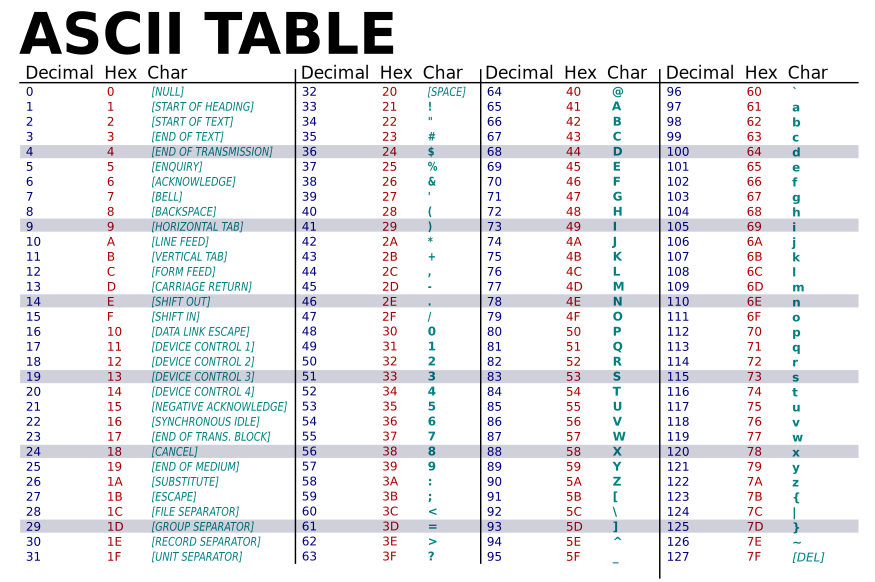

# Cvičenie 5: Literály, null, typová konverzia, obalené typy

Staticko typové jazyky nám nájdu veľa chýb pri kompilácii, teda ešte pred spustením programu. Automatické kontroly typov nám dávajú pocit istoty a bezpečnosti, že náš kód je navrhnutý správne a program bude robiť to, čo očakávame.

Nič však nie je zadarmo. Statická typová kontrola so sebou prináša aj množstvo nevýhod. Aby sme v staticko typovom jazyku vedeli dobre programovať, musíme spoznať a pochopiť veci, ktoré sme pri dynamických jazykoch ako Python nemuseli riešiť.

Na dnešnom cvičení sa povenujeme práci s typmi, ale najprv si ukážeme literály jazyka a vysvetlíme si, ako Java rieši absenciu hodnoty pomocou výrazu `null`.

## Literál

Dátové typy majú svoje konkrétne hodnoty. Zápis takejto hodnoty priamo v kóde sa nazýva **literál**. Syntax literálov je súčasťou programovacieho jazyka.

=== "Príklady literálov v Jave"

    ``` java
    123                // int literál
    123L               // long literál
    0xFF               // int literál v hexadecimálnej sústave
    0b1010             // int literál v binárnej sústave
    07                 // int literál v osmičkovej sústave
    1_000_000          // int literál s podtržníkom (pre čitateľnosť)
    3.14               // double literál
    3.14f              // float literál
    6.022e23           // double literál s exponentom
    'a'                // char literál
    '\n'               // char literál (escape – nový riadok)
    '\u03A9'           // char literál (Unicode znak Ω)
    "Hello"            // String literál
    "Line1\nLine2"     // String literál s escape sekvenciou
    "Unicode:\u263A"   // String literál s Unicode znakom ☺
    """
    Line1
    Line2
    """                // String literál – viacriadkový
    true               // boolean literál (true)
    false              // boolean literál (false)
    null               // null literál (špeciálny)
    {1, 2, 3}          // pole (zložený typ, prvky sú literály)
    ```

## Null

<div class="md-has-sidebar" markdown>
<main markdown>

V Jave existuje špeciálna hodnota `null`, ktorá označuje, že premenná referenčného (neprimitivného) typu neukazuje na žiadny objekt. Inými slovami: premenná existuje, ale "neukazuje nikam". Akákoľvek neprimitívna premenná môže mať `null` hodnotu.

Používa sa pri nasledovných situáciách:

- Inicializácia premenných, v prípadoch keď ešte nemáme vypočítanú hodnotu

    ```java
    String meno = null;
    ```

- Indikácia neprítomnosti objektu, napríklad ak metóda, ktorá má vyhľadať a vrátiť objekt ho nenašla, alebo nedokáže vypočítať výsledok
- Resetovanie premennej, kedy už nechceme aby premenná viac ukazovala na danú hodnotu

    ```java
    obj = null; 
    ```

Null referencia je jedna z najkontroverznejších vecí v Jave a celkovo v programovaní. Prináša totiž obrovské množstvo problémov, komplikácií a je najčastejším zdrojom chýb. Nutnosť kontrolovať `null` hodnoty komplikuje a zneprehľadňuje kód. Modernejšie programovanie jazyky sa rôznymi spôsobmi všemožne snažia `null` referenciám vyhnúť. 

Ak kód v Jave očakáva konkrétny objekt a dostane `null` hodnotu, nemôže ďalej pokračovať a vyhodí výnimku [NullPointerException](https://docs.oracle.com/en/java/javase/21/docs/api/java.base/java/lang/NullPointerException.html) (NPE).

=== "Kód, ktorý pozabudol na možnosť mať `null` na vstupe"

    ```java
    public void spracuj(String input) {
        int dlzka = input.length(); // Ak je input null, vyhodí sa NPE
        // Ďalší kód
    }
    ```

Väčšine problémov s `null` referenciami dokážeme predísť. Pri písaní kódu je potrebné ošetrovať prípady, kedy vstupné argumenty našich metód obsahujú `null` hodnotu. Ak naša metóda nepripúšťa `null` hodnoty na vstupe, je potrebné čím skôr vyhodiť výnimku, aby sa uľahčilo debugovanie. Na to nám môže poslúžiť metóda [`Objects.requireNonNull()`](https://docs.oracle.com/en/java/javase/21/docs/api/java.base/java/util/Objects.html#requireNonNull(java.lang.Object,java.lang.String)), ktorá vyhodí NPE výnimku, ak je argument `null`.

=== "Ošetrenie vstupného parametra"

    ```java
    import java.util.Objects;

    public void spracuj(String input) {
        Objects.requireNonNull(input, "Input nesmie byť null");
        // Ďalší kód
    }
    ```


 </main>

  <aside markdown>
Známy počítačový vedec Tony Hoare, ktorý prvý prišiel s nápadom `null` referencie, tento svoj objav nazval chybou za miliardu dolárov. 

!!! quote "Null: The Billion Dollar Mistake"

    But I couldn't resist the temptation to put in a null reference, simply because it was so easy to implement. This has led to innumerable errors, vulnerabilities, and system crashes, which have probably caused a billion dollars of pain and damage in the last forty years.
</aside>
</div>

!!! tip "Učím sa s pomocou umelej inteligencie"

    Som študent strednej školy. Učím sa Javu. [Objasni mi všetky úskalia práce s null referenciou a poraď, ako sa vyhnúť problémom s null.](https://grok.com/share/c2hhcmQtMg%3D%3D_54ad4e90-09ea-42e7-922f-676579026bd5)

## Typová konverzia

V praxi sa často stáva, že mám hodnotu, ktorú viem rovnako reprezentovať v rôznych dátových typoch alebo triedach. Najčastejšie je to pri číselných typoch. Programovacie jazyky nám rôznymi spôsobmi umožňujú konvertovať hodnoty medzi dátovými typmi. Java nám ponúka niekoľko možností.

### Implicitná konverzia (widening conversion)

<div class="md-has-sidebar" markdown>
<main markdown>

Pri číselných typoch, kedy nenastáva strata informácie nám Java umožňuje automaticky konvertovať menšie typy na väčšie.

=== "Automatická konverzia - widening"

    ```java
    int a = 10;
    long b = a; // implicitná konverzia (int → long)
    double c = b; // implicitná konverzia (long → double)
    ```

Poradie primitívnych typov je nasledujúce:

`byte` → `short` → `int` → `long` → `float` → `double`
</main>
  <aside markdown>
Pri konverzii celočíselného typu na `float` alebo `double` môže nastať strata presnosti. [Problematika čísel s pohyblivou desatinnou čiarkou](https://floating-point-gui.de/) je však veľmi komplikovaná a detailné pochopenie ich fungovania by zabralo viacero samostaných cvičení. 

Buďte preto pri ich používaní opatrní a keď sa dá použite celočíselné typy.</aside>
</div>

### Explicitná konverzia (narrowing conversion, casting)

Opačne to však už automaticky nefunguje, nakoľko by sa mohla stratiť informácia. V takýchto prípadoch to vieme urobiť manuálne pomocou castingu. Pri castingu napíšeme do zátvoriek typ, do ktorého chceme skonvertovať našu hodnotu.

=== "Explicitná konverzia - narrowing, casting"

    ```java
    double x = 900.78;
    int y = (int) x;  // explicitný casting (double → int)
    System.out.println(y); // 900

    byte b = (byte) x;  // explicitný casting (double → byte)
    System.out.println(b); // -124, nastalo pretečenie
    ```

Pri konvertovaní na menší číselný typ môžu nastať nasledovné problémy:

- odrezanie desatinných miest
- pretečenie (overflow)

<div class="md-has-sidebar" markdown>
<main markdown>

Konverziu vieme vykonať aj medzi nečíselnými typmi. Primitívny typ `char` je vnútorne reprezentovaný ako 16-bitové čislo a dá sa bez straty informácií konvertovať na `int` alebo väčšie typy.

=== "Konverzia typu `char`"

    ```java
    char c = 'A';
    int code = c; // implicitne 'A' → 65
    System.out.println(code);

    code = 100;
    char d = (char)code; // explicitne 100 → 'd'
    System.out.println(d);
    
    char e = 101; // implicitná konverzia pri inicializacii 101 → 'e'
    ``` 
 
 </main>

  <aside markdown>
Každý znak je v pamäti počítača uložený ako číslo. Základná anglická abeceda sa zmestí do jedného bajtu. Prvých 128 znakových kódov je definovaných v [štandarde ASCII](https://www.ascii-code.com/)

Kódovaniu znakov do čísel sa venuje svetový [štandard Unicode](https://home.unicode.org/). Ten rozširuje štandard ASCII a umožňuje kódovať akúkoľvek abecedu a emoji znaky.
</aside>
</div>

{.on-glb}
/// caption
ASCII tabuľka znakov
///

## Obalené typy

<div class="md-has-sidebar" markdown>
<main markdown>

Java poskytuje primitívne dátové typy. Sú rýchle a zaberajú málo pamäti. Keďže však v Jave skoro stále pracujeme s objektami a triedami, používanie primitívnych typov často prináša rôzne obmedzenia a komplikácie.

Sú rôzne situácie, kedy je vyžadovaný objekt a nie primitívna hodnota. Často sa napríklad stáva, že metóda, ktorú by sme chceli použiť vyžaduje na vstupe objekt, ale mi máme primitívnu hodnotu.

Pre takéto prípady má java k dispozícii tzv. obalené typy, anglicky *wrapper classes*. **Pre každý primitívny dátový typ existuje príslušný obalený typ**. Obalené triedy poskytujú plnohodnotné objekty, reprezentujúce dané číslo alebo inú primitívnu hodnotu. Zaberajú však viacej miesta v pamäti. Objekty obalených typov sú nemenné.

=== "Obalené typy v Jave"

    ```java
    int x = 10; // primitívny dátový typ
    Integer y = 10; // obalený typ
    System.out.printf("x je %d, y je %d", x, y); // používajú sa rovnako
    ```

Java poskytuje množstvo funkcionalít, ktoré umožňujú voľne si zamienať primitívne a obalené objekty vo väčšine prípadov. Preto vy ako programátor by ste mali vždy ak je to možné **uprednostniť primitívne typy a obalené typy používať len vtedy, keď je to nutné**. Obalené typy totiž môžu byť zdrojom problémov.

=== "`NullPointerException` pri obalených typoch"

    ```java
    int x = 10;
    Integer y = null;
    if(x == y) // Vyhodí NPE výnimku
        System.out.println("rovnajú sa");
    ```
 
 </main>

  <aside markdown>

| Primitívny<br>typ | Obalený<br>typ |
|----------------|-------------|
| byte | [Byte](https://docs.oracle.com/en/java/javase/21/docs/api/java.base/java/lang/Byte.html) |
| short | [Short](https://docs.oracle.com/en/java/javase/21/docs/api/java.base/java/lang/Short.html) |
| int | [Integer](https://docs.oracle.com/en/java/javase/21/docs/api/java.base/java/lang/Integer.html) |
| long | [Long](https://docs.oracle.com/en/java/javase/21/docs/api/java.base/java/lang/Long.html) |
| float | [Float](https://docs.oracle.com/en/java/javase/21/docs/api/java.base/java/lang/Float.html) |
| double | [Double](https://docs.oracle.com/en/java/javase/21/docs/api/java.base/java/lang/Double.html) |
| char | [Character](https://docs.oracle.com/en/java/javase/21/docs/api/java.base/java/lang/Character.html) |
| boolean | [Boolean](https://docs.oracle.com/en/java/javase/21/docs/api/java.base/java/lang/Boolean.html) |
</aside>
</div>

### Autoboxing

Prevod z primitívneho typu na obalený sa v programovaní volá boxing (z anglického slova box ako krabica). Podobne prevod na primitívny typ sa volá unboxing.

Java vykonáva automatickú konverziu z a do balených typov, vždy keď je to potrebné. To sa v Jave nazýva autoboxing a auto-unboxing.

=== "Príklady autoboxingu a auto-unboxingu"

    ```java
    int x = 5;
    Integer y = 10; // autoboxing, literály sú vždy primitívneho typu
    y = x; // autoboxing, x je primitívny, y nie
    
    List li = new ArrayList();
    li.add(x); // autoboxing, x je primitívny typ, 
               // ale do listu sa dajú vkladať iba objekty


    x = y; // auto-unboxing, y je objekt, x je primitívny

    if(x == y) // auto-unboxing, y sa skonvertuje na primitívny typ, 
               // aby sme mohli porovnať hodnoty
        System.out.println("x je rovnaké ako y");

    ```

### Na čo si dať pozor

Primitívne hodnoty porovnávame pomocou operátora `==`. Ak je aspoň jeden z operandov primitívna hodnota, Java urobí auto-unboxing a všetko je v poriadku. Ak však porovnávame 2 obalené objekty, musíme použiť namiesto toho metódu `equals()`.

=== "Porovnávanie s obalenými objektami"

    ```java
    int a = 10000;
    Integer b = 10000;
    Integer c = 10000;

    a == b; // v poriadku
    b == c; // CHYBA, porovná identitu, nie hodnoty!
    b.equals(c); // správne porovnanie hodnôt dvoch objektov
    ```

### Konštanty a metódy obalených typov

Obalené triedy poskytujú množstvo užitočných metód a konštánt. Niektoré z nich si teraz predstavíme.

Triedy obalených typov poskytujú statické konštanty obsahujúce maximálne a minimálne hodnoty a tiež špeciálne hodnoty ako napríklad nekonečno.

=== "Statické konštanty v obalených triedach"

    ```java
    Integer.MAX_VALUE // 2147483647
    Long.MIN_VALUE // -9223372036854775808
    Double.POSITIVE_INFINITY // Infinity
    ```

Metódy tried obalených typov sa často používajú na typovú konverziu s triedou `String`, teda na prevody z a do reťazcov. 

=== "Parsovanie z a do triedy `String`"

    ```java
    String s = "11001";
    int x = Integer.parseInt(s); // prevod z reťazca do int
    int c = Integer.parseInt(s, 2); // vieme robiť prevod aj z inej číselnej sústavy
    long y = Long.parseLong(s); // prevod z reťazca do long
    byte b = Byte.parseByte(s); // Vyhodí NumberFormatException výnimku, 
                                // pretože číslo je príliš veľké na byte

    long a = 1234;
    String s10 = Long.toString(a); // prevod do reťazca
    String s16 = Long.toString(a, 16); // vieme si vybrať číselnú sústavu

    System.out.printf("Číslo %s v šestnástkovej sústave je %s", s10, s16);
    ```

## Úlohy na precvičenie

!!! example "Úloha 5.1: Bezpečné porovnanie reťazcov"

    Napíš metódu, ktorá porovnáva dva reťazce aj v prípade, že jeden alebo oba sú null.

    Výstup: true, ak sú rovnaké (vrátane oboch null), inak false.

!!! example "Úloha 5.2: Číselné sústavy"

    Napíšte program, ktorý načíta celé číslo z klávesnice a vypíše ho v desiatkove, šestnástkovej, osmičkovej a dvojkovej sústave.

    Bonus: Ak je číslo v správnom rozsahu, napíšte aj, aký znak by toto číslo mohlo reprezentovať.

!!! example "Úloha 5.3: Detekcia číselného typu"

    Napíš program, ktorý načíta reťazec z klávesnice. Potom program skúsi tento reťazec skonvertovať do rôznych číselných typov a uvedie, ktoré typy by mohli načítaný reťazec reprezentovať.

    Pri práci použite ošetrenie výnimiek.

    Najprv vyskúšajte typy `long` a `double`. Môžete pridať menšie celočíselné typy.
    
    Bonus: Skúste otestovať aj šestnástkovú, binárnu a osmičkovú sústavu.

!!! example "Úloha 5.4: Delenie"

    Napíš program, ktorý načíta dve čísla a napíše výsledok po delení. Ošetrite čo najviac výnimiek pri chybách, ktoré môžu nastať.

!!! example "Úloha 5.5: Ošetrená kalkulačka"

    Napíšte program, v ktorom užívateľ bude môcť vykonať základné matematické operácie. Program rozdeľte do viacerých metód.

    Vypisujte menu a po splnení úlohy sa do neho naspať vráťte. Majte možnosť ukončiť program.


## Zhrnutie cvičenia

- [x] Literál je zápis konkrétneho údaja priamo v kóde
- [x] Špeciálny literál `null` vyjadruje neprítomnosť hodnoty
    * [ ] Akákoľvek premenná referenčného (neprimitívneho) typu môže nadobúdať hodnotu `null`
    * [ ] Používa sa, ak pri inicializácii premennej ešte nemáme vypočítanú hodnotu, ak chceme vyjadriť neprítomnosť hodnoty, alebo ak chceme z premennej vymazať objekt
    * [ ] Ak kód očakáva objekt a dostane null hodnotu, nemôže pokračovať a vyhodí výnimku `NullPointerException` (NPE).
    * [ ] Metóda `Objects.requireNonNull()` slúži na ošetrenie vstupov pri kontrole `null` hodnôt
- [x] Typová konverzia nám v Jave umožňuje konvertovať hodnoty medzi dátovými typmi
    * [ ] Implicitná konverzia - widening, automaticky konvertuje menšie typy na väčšie
    * [ ] Explicitná konverzia - narrowing alebo casting, manuálna konverzia, pri ktorej môže nastať strata informácie orezaním alebo pretečením
    * [ ] Znakový typ `char` viem previesť na `int` alebo väčší, pretože znaky sú vnútorne reprezentované ako číselné kódy
    * [ ] Základné štandardy znakových kódov sú ASCII a Unicode
- [x] Obalené typy - wrapper classes
    * [ ] Pre každý primitívny dátový typ existuje príslušný obalený typ
    * [ ] Obalený typ je trieda a jeho hodnoty sú objekty
    * [ ] Autoboxing a auto-unboxing je automatická konverzia z a do balených typov, vždy keď je to potrebné
    * [ ] Uprednostňujeme primitívne typy a obalené typy používame len keď je to nutné
    * [ ] Ak porovnávame 2 obalené objekty, musíme použiť metódu `equals()`, nie `==`
    * [ ] Obalené triedy poskytujú pomocné metódy ako `parseLong()`, `toString()` a rôzne konštanty

!!! note "Poznámky do zošita"
    V zošite je potrebné mať napísané aspoň tieto poznámky:

    ```
    LITERÁL

    Literál je zápis údaja priamo v kóde
    Literál null vyjadruje neprítomnosť hodnoty
    Výnimka NullPointerException sa vyhodí, ak program očakával objekt a nie null

    TYPOVÁ KONVERZIA

    Typová konverzia umožňuje konvertovať medzi dátovými typmi
    Implicitná konverzia - widening, automaticky konvertuje menšie typy na väčšie
    byte → short → int → long → float → double
    Explicitná konverzia - narrowing alebo casting, manuálna konverzia

    char viem previesť na int alebo väčší, pretože znaky sú vnútorne ako číselné kódy

    OBALENÉ TYPY

    Obalené typy - wrapper classes
    Pre každý primitívny dátový typ existuje príslušný obalený typ - trieda
    Autoboxing a auto-unboxing je automatická konverzia z a do balených typov, keď je to potrebné
    Uprednostňujeme primitívne typy pred obalenými, Java robí konverzie za nás
    2 obalené objekty porovnávam cez equals()
    ```

!!! warning "Skúšanie a kontrola vedomostí"

    Okruhy otázok na test:

    - Na čo slúži literál null, aká výnimka sa s ním spája
    - Ako funguje implicitná typová konverzia
    - Čo je a ako sa robí explicitná typová konverzia
    - Čo sú obalené typy, aké majú použitie
    - Čo je autoboxing a auto-unboxing
    - Ako sa parsujú čisla z reťazca znakov a ako sa prevádzajú čísla na reťazec
    