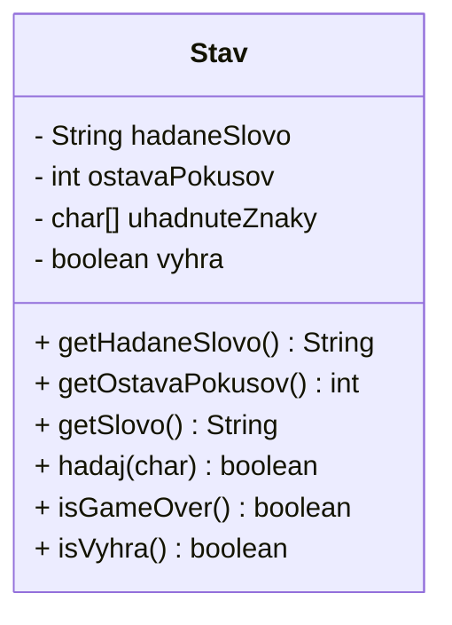
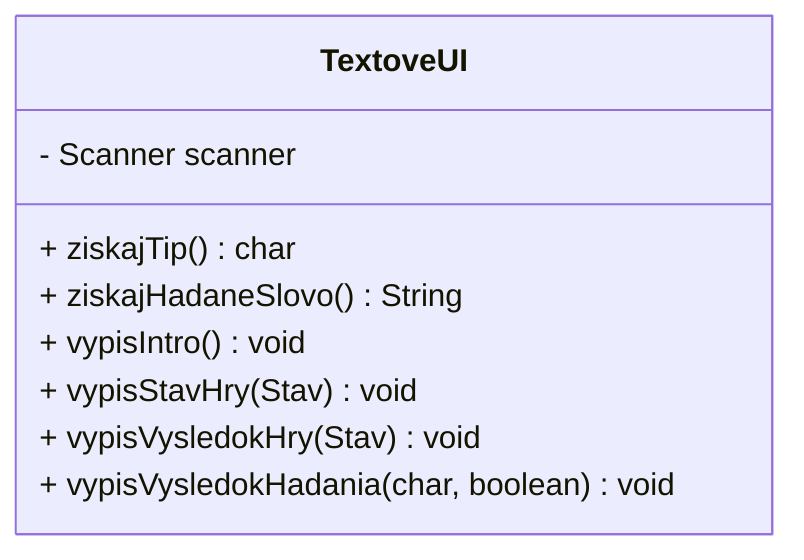
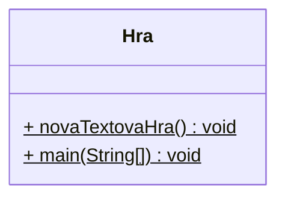
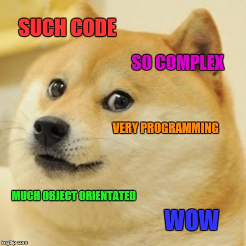

# Cvičenie 7: Metódy

Na dnešnom cvičení si vyskúšame písanie metód. Aby sme robili aj niečo praktickejšie, naprogramujeme si jednoduchú textovú hru.

## Hangman

Dnešným projektom bude naprogramovať hru Hangman - Obesenec. Ide o známu hru, kedy hráč musí na určitý počet pokusov uhádnuť všetky znaky v hádanom slove.

{width=400}

Zadanie úlohy:

- Hra obesenec v príkazovom riadku
- Na začiatku hra požiada o slovo, ktoré sa bude hádať
- Hráč zadá písmeno, hra ukáže uhádnuté znaky v slove
- Hráč má 5 pokusov, potom hra končí

Návrh riešenia:

- Vytvoríme 3 triedy
- Trieda `Stav` bude spravovať stav hry: hádané slovo, uhádnuté znaky a počet ostávajúcich pokusov
- Trieda `TextoveUI` bude mať na starosť užívateľské rozhranie: výpis na obrazovku a načítavanie z klávesnice
- Trieda `Hra` bude mať hlavnú logiku hry a vstupný bod programu

!!! example "Úloha 7.1: Nový projekt"

    V IntelliJ IDEA si vytvoríme nový Java projekt s názvom `Hangman`. Pri vytváraní vypneme možnosť vytvorenia *Sample code*, ukážkového kódu.

## Trieda `Stav`

Začneme vytvorením triedy `Stav`. V triede budeme mať 4 atribúty, všetky privátne. Trieda bude mať jeden konštruktor, ktorý inicializuje jej atribúty. Hodnoty 2 atribútov, `ostavaPokusov` a `hadaneSlovo` zadáva volajúci pri vytváraní objektu.

=== "Trieda `Stav` s atribútmi a konštruktorom"

    ```java
    package sk.spse.hangman;

    import java.util.Arrays;

    public class Stav {
        private boolean vyhra;
        private int ostavaPokusov;
        private String hadaneSlovo;
        private char[] uhadnuteZnaky;

        public Stav(String hadaneSlovo, int pokusy) {
            this.ostavaPokusov = pokusy;
            this.hadaneSlovo = hadaneSlovo;
            this.uhadnuteZnaky = new char[hadaneSlovo.length()];
            Arrays.fill(uhadnuteZnaky, '_');
            this.vyhra = false;
        }
    }
    ```

Popis atribútov:

- `vyhra` nám bude hovoriť, či sme vyhrali, alebo nie
- `ostavaPokusov` bude obsahovať počet zostávajúcich pokusov. Ak bude 0, hra končí
- `hadaneSlovo` je slovo, ktoré má hráč uhádnuť
- `uhadnuteZnaky` je pole znakov, do ktorého budeme vpisovať uhádnuté časti slova na daných pozíciach. Má takú istú dĺžku, ako hádané slovo. Na začiatku budú všetky prvky tohto poľa znaky `_` (podčiarník)

Konštruktor prijíma 2 argumenty, hádané slovo a počet pokusov, na ktorý sa musí slovo uhádnuť. Ostatné atribúty konštruktor inicializuje na ich počiatočné hodnoty.

!!! example "Úloha 7.2: Trieda `Stav`"

    Vytvorte novú triedu `sk.spse.hangman.Stav` a pridajte do nej atribúty a konštruktor podľa príkladu uvedeného vyššie.

Keďže sú všetky atribúty privátne, mimo triedy Stav nevieme priamo zistiť ich hodnotu. Musíme teda vytvoriť **getter metódy**. Vytvoríme ich iba pre prípady, kedy naozaj potrebujeme zistiť nejakú hodnotu.

!!! example "Úloha 7.3: Getter metódy"

    Vytvorte nasledovné getter metódy v triede Stav:

    - `public boolean isVyhra()` - vráti hodnotu atribútu `vyhra`
    - `public boolean isGameOver()` - vráti true, ak je počet pokusov menší ako 1 alebo ak sme vyhrali, ináč vráti false
    - `public int getOstavaPokusov()` - vráti zostávajúci počet pokusov
    - `public String getHadaneSlovo()` - vráti hádané slovo. *Bonus: slovo vráti, iba ak hra skončila, ináč vyhodí výnimku*
    - `public String getSlovo()` - vráti slovo, ktoré sme zatiaľ uhádli. Kód tejto metódy musí vytvoriť reťazec String z poľa znakov `uhadnuteZnaky`. Môžete na to použiť statickú metódu `String.valueOf()`

Vytvorili sme teda 5 getter metód. Getter metódy, ktoré vracajú boolean hodnotu sa zvyknú začínať slovom `is`, ostatné sa začínajú slovom `get`. Getter metóda nemusí vždy vracať iba priamu hodnotu atribútu. Ako vidíme v príklade metódy `getSlovo()`, getter metóda môže hodnoty atribútov vhodne upraviť tak, aby vyhovovali volajúcemu. Vnútornú implementáciu si potom môžeme zvoliť takú, aká vyhovuje vnútornej logike triedy.

Ostáva nám ešte napísať metódu, ktorá zmení stav hry podľa toho, aký znak hráč zadal.

!!! example "Úloha 7.4: Inštančná metóda"

    V triede `Stav` vytvorte inštančnú metódu `public boolean hadaj(char tip)`, ktorá bude meniť stav hry podľa zadaného znaku `tip`. V tele metódy napíšte kód, ktorý urobí nasledovné:

    - Vytvorí pomocnú `boolean` premennú `spravnyTip`, inicializuje ju na `false`
    - V cykle prejdite všetky znaky hádaného slova, a ak sa znak zhoduje so znakom `tip`, pridajte tento znak do poľa `uhadnuteZnaky` na tú istú pozíciu, akú má v hľadanom slove. Ak sa znak zhoduje, nastavte premennú `spravnyTip` na `true` Pri porovnaní znakov použite metódu `Character.toLowerCase(char)`, aby sme pri nebrali ohľad na veľkosť písmen.
    - Ak nenastal správny tip, dekrementuje atribút `ostavaPokusov`
    - Ak je sme uhádli celé slovo, atribút `vyhra` nastaví na `true`. Uhádnutie zistite porovnaním hádaného slova zo slovom, ktoré vracia metóda `getSlovo()`
    - Metóda vráti hodnotu premennej `spravnyTip`


Hotová trieda `Stav` teda bude mať 4 atribúty, jeden konštuktor a 6 metód. Triedu môžeme znázorniť nasledovným UML class diagramom.



## Trieda `TextoveUI`

Druhá trieda, ktorú si vytvoríme, bude mať na starosti užívateľské rozhranie. Nakoľko sme si ešte nevysvetlili prácu s grafikou a grafickýmí rozhraniami, ostaneme pri textovom rozhraní. V budúcnosti budeme môcť vytvoriť inú triedu pre grafické rozhranie a nebudeme musieť meniť kód stavu hry.

!!! example "Úloha 7.5: Trieda `TextoveUI`"

    Vytvorte novú triedu `sk.spse.hangman.TextoveUI` s nasledovným atribútom a konštruktorom:

    ```java
    package sk.spse.hangman;

    import java.util.Scanner;

    public class TextoveUI {
        private Scanner scanner;

        public TextoveUI() {
            this.scanner = new Scanner(System.in);
        }
    }
    ```

Do triedy `TextoveUI` sme si pridali atribút `scanner`, ktorý budeme používať pri čítaní z klávesnice. O správnu inicializáciu atribútu sa postará konštruktor triedy.

Do tejte našej triedy potrebujeme pridať 2 inštančné metódy, ktoré budú načítavať údaje z klávesnice. Potrebujeme totiž na začiatku hry zadať hľadané slovo a počas hry potrebujeme, aby nám hráč zadával písmená, ktoré chce hádať.

!!! example "Úloha 7.6: Získanie vstupu"

    Vytvorte nasledovné inštančné metódy v triede `TextoveUI`. V kóde týchto metód použite atribút `scanner` na načítanie hodnôt z klávesnice.

    - `public char ziskajTip()` - vypíše na obrazovku text "Hádaj písmeno: " a načíta jeden znak z klávesnice. Použite metódu `scanner.nextLine()` a potom pomocou metódy `String#charAt()` vráťte prvý znak, ktorý užívateľ zadal.
    - `public String ziskajHadaneSlovo()` - vypíše na obrazovku text "Zadaj slovo, ktoré sa má hádať: " a načíta slovo z klávesnice. Vráti načítané slovo. Po načítaní 'vyčistite' obrazovku napísaním veľkého množstva nových riadkov (znak '\n')

Ostáva nám napísať zopár metód na vypísanie rôznych informácií na obrazovku

!!! example "Úloha 7.7: Vypísanie informácii"

    Vytvorte nasledovné inštančné metódy v triede `TextoveUI`.

    - `public void vypisIntro()` - vypíše text "Vitaj v hre Obesenec!". Text môžete pekne orámovať, ak chcete.
    - `public void vypisStavHry(Stav stav)` - do samostatného riadku vypíše "Slovo: " a za ním vypíše zatiaľ uhádnuté slovo `stav.getSlovo()`
    - `public void vypisVysledokHry(Stav stav)` - Ak je `stav.isVyhra()` `true`, vypíše "Vyhral si!". V opačnom prípade vypíše "Prehral si, hľadané slovo bolo: " a vypíše hľadané slovo.
    - `public void vypisVysledokHadania(char tip, boolean spravnyTip)` - ak je vstupny argument `spravnyTip` true, vypíše "Uhadol si dalsi znak!". V opačnom prípade vypíše "Znak %c sa v hľadanom slove nenachádza", pričom vypíše znak `tip`.

Trieda `TextoveUI` bude teda mať 6 inštančných metód, 2 na čítanie a 4 na výpis. UML diagram tejto triedy by mohol vyzerať nasledovne:



## Trieda `Hra`

Ostáva nám napísať hlavnú logiku hry. To nebude zložité, nakoľko väčšinu logiky už máme implementovanú v triedach `Stav` a `TextoveUI`. Hlavná trieda `Hra` bude mať za úlohu tieto veci:

- Vytvorí objekt triedy `TextoveUI`
- Vypíše intro a načíta hádané slovo do pomocnej premennej
- Vytvorí objekt triedy `Stav` a do konštruktora vloží hádané slovo. Počet pokusov nastaví na 5
- Spustí cyklus, ktorý sa opakuje, kým nie je koniec hry (`stav.isGameOver()`)
- V cykle vypíše stav hru, načíta tip, zavolá metódu `hadaj()` a vypíše výsledok hadania
- Po skončení cyklu vypíše výsledok hry

!!! example "Úloha 7.8: Hlavná trieda `Hra`"

    Vytvorte triedu `sk.spse.hangman.Hra` s nasledovným kódom

    ```java
    package sk.spse.hangman;

    public class Hra {
        public static void novaTextovaHra() {
            TextoveUI ui = new TextoveUI();
            ui.vypisIntro();

            String hadaneSlovo = ui.ziskajHadaneSlovo();

            Stav stav = new Stav(hadaneSlovo, 5);

            while(!stav.isGameOver()) {
                ui.vypisStavHry(stav);
                char tip = ui.ziskajTip();
                boolean spravnyTip = stav.hadaj(tip);
                ui.vypisVysledokHadania(tip, spravnyTip);
            }

            ui.vypisVysledokHry(stav);
        }

        public static void main(String[] args) {
            novaTextovaHra();
        }
    }

    ```

Trieda hra je z hľadiska štruktúry jednoduchá, má iba 2 statické metódy a nemá žiaden atribút. **V UML Class diagrame sú statické metódy podčiarknuté**.



Hra je hotová, spustite ju spustením triedy `Hra` a môžete začať hrať. Poproste vášho suseda, aby vám zadal hľadané slovo.

Na budúcom cvičení pokračujeme v tomto projekte, pokiaľ ste niektoré úlohy nestihli na hodine, dokončte si ich do budúcej hodiny doma.

{width=400}
/// caption
Blahoželáme k úspešnému naprogramovaniu hry. Nižšie nájdete bonusové úlohy.
///


## Úlohy na precvičenie

!!! example "Úloha 7.9: Hrajte znova"

    Po skončení hry nevypnite program, ale spusťte hru znova. Pamätajte si počet výhier a prehier.

!!! example "Úloha 7.10: Defaultný počet pokusov"

    Vytvorte konštantu `DEFAULT_POKUSY` v triede `Stav`. Vytvorte preťažený konštruktor, ktorý bude prijímať iba hľadané slovo a použite tento defaultný počet pokusov. Odstráňte magické číslo z triedy `Hra`

!!! example "Úloha 7.11: Defaultný zoznam slov"

    Vytvorte konštantu pole slov `DEFAULT_SLOVA` v triede `Stav`. Dajte do neho 20 slov. Vytvorte preťažený konštruktor, ktorý nemá žiaden argument a použije náhodné slovo z tohto zoznamu.

!!! example "Úloha 7.12: Ošetrenie vstupov"

    Ošetrite vstupy do konštruktora, vyhoďte výnimky, ak sú nesprávne. Podobne ošetrite vstupy do metód a vstupy z klávesnice.

!!! example "Úloha 7.13: Počet pokusov"

    Pri výhre vypíšte, na ktorý pokus hráč vyhral

!!! example "Úloha 7.14: Pamäť nesprávnych znakov"

    Pamätajte si nesprávne znaky, ktoré hráč hádal. Pri vypísani stavu hry ich v každom kole vypíšte.

!!! example "Úloha 7.15: Nepozornosť sa nevypláca"

    Odoberte pokus, aj keď hráč zadá znak, ktorý je síce správny, ale už ho pred tým zadal.


## Zhrnutie cvičenia

- [x] Vyriešte úlohy a naprogramujte textovú hru Obesenec
- [x] Getter metódy, ktoré vracajú boolean hodnotu sa zvyknú začínať slovom `is`, ostatné sa začínajú slovom `get`.
- [x] V UML Class diagrame sú statické metódy podčiarknuté

!!! note "Poznámky do zošita"
    Toto cvičenie si do zošita nemusíte písať žiadne poznámky

!!! warning "Skúšanie a kontrola vedomostí"

    Na budúcom cvičení pokračujeme v tomto projekte, pokiaľ ste niektoré úlohy nestihli na hodine, dokončte si ich do budúcej hodiny doma.

    Okruhy otázok na test:

    - Vedieť vytvoriť a použiť inštančné metódy
    