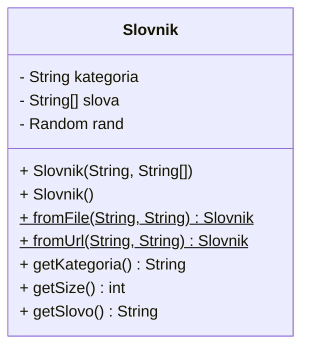
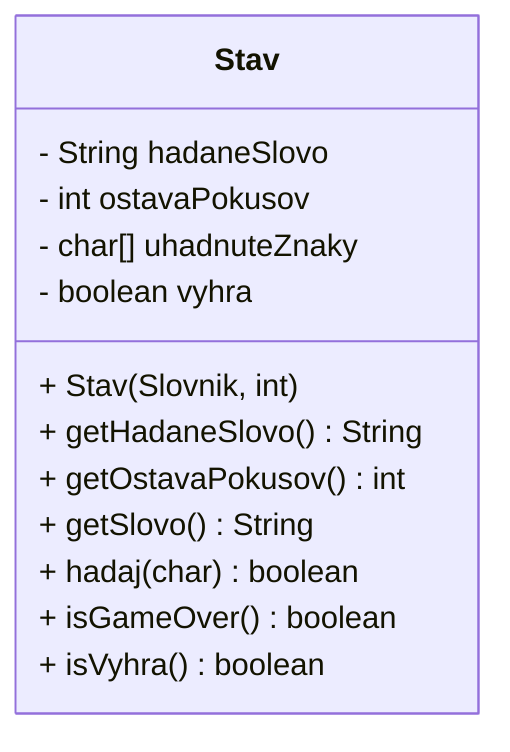
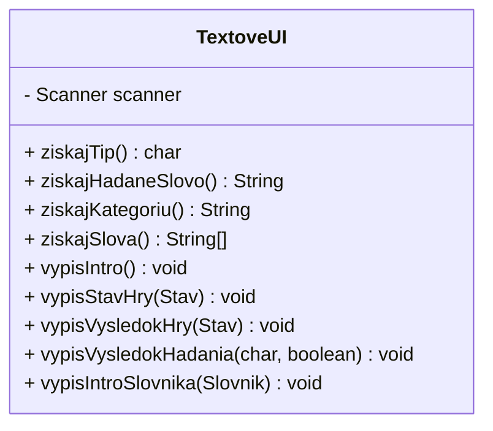
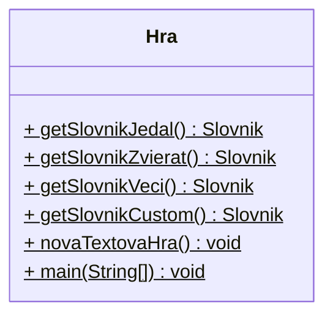

# Cvičenie 9: Inicializácia a konštruktory

Toto cvičenie budeme pokračovať vo vylepšovaní hry Hangman, ktorú ste si naprogramovali minulé cvičenie. Dnes si do hry pridáme slovník so slovami, aby sme hádané slovo nemuseli dávať manuálne.

Ak nemáte projekt s hrou Hangman, môžete si ju stiahnuť príkazom `git clone https://github.com/wagjo/oop-hangman.git`


## Slovník do hry Hangman

Zadanie úlohy:

- Namiesto načítania hádaného slova z klávesnice hra bude mať zoznam slov
- Z tohto zoznamu slov hra na začiatku náhodne vyberie hádané slovo
- Vyskúšame si rôzne spôsoby vytvárania slovníka

Návrh riešenia:

- Nová trieda `Slovnik`, ktorá bude spravovať zoznam slov
- Úprava triedy `TextoveUI` o pomocné metódy slovníka
- Úprava triedy `Stav` tak, aby v konštruktore prijímala namiesto hádaného slova slovník slov
- Úprava triedy `Hra` tak, aby namiesto získania hádaného slova vytvorila a použila slovník

!!! example "Úloha 9.1: Kontrola hry Hangman"

    V IntelliJ IDEA si otvorte projekt Hangman a spustite ho, aby ste vyskúšali funkčnosť programu. Ak projekt nemáte, stiahnite ho príkazom `git clone https://github.com/wagjo/oop-hangman.git`


## Trieda `Slovnik`

Začneme vytvorením triedy `Slovnik`. V triede budeme mať 3 atribúty, všetky privátne. Trieda bude mať jeden konštruktor, ktorý inicializuje jej atribúty. Hodnoty 2 atribútov, `kategoria` a `slova` zadáva volajúci pri vytváraní objektu.

=== "Trieda `Slovnik` s atribútmi a konštruktorom"

    ```java
    package sk.spse.hangman;

    import java.util.Random;

    public class Slovnik {
        private final String kategoria;
        private final String[] slova;
        private final Random rand = new Random();

        public Slovnik(String kategoria, String[] slova) {
            this.kategoria = kategoria;
            this.slova = slova;
        }
    }    
    ```

Popis atribútov:

- `kategoria` nám hovori o kategórii slov, ktoré máme v slovníku, napr. zvieratá, jedlá, veci, atď.
- `slova` je pole so slovami
- `rand` je pomocný objekt na získanie náhodného čísla

Konštruktor prijíma 2 argumenty, kategória a slová. Atribút `rand` sa inicializuje priamo pri deklarácii atribútu.

!!! example "Úloha 9.2: Trieda `Slovnik`"

    Vytvorte novú triedu `sk.spse.hangman.Slovnik` a pridajte do nej atribúty a konštruktor podľa príkladu uvedeného vyššie.

V ďalšom kroku potrebujeme vytvoriť getter metódy, hlavne pre výber náhodného slova.

!!! example "Úloha 9.3: Getter metódy"

    Vytvorte nasledovné getter metódy v triede Slovnik:

    - `public String getKategoria()` - vráti hodnotu atribútu `kategoria`
    - `public int getSize()` - vráti počet slov v slovníku
    - `public String getSlovo()` - vráti náhodné slovo so slovníka. Náhodné číslo získate z objektu `rand` pomocou `rand.nextInt(slova.length)`

Základný slovník máme vytvorený, poďme ho použiť v hre. Ako prvé potrebujeme upraviť triedu `Stav` tak, aby v konštruktore prijímala namiesto slova slovník.

!!! example "Úloha 9.4: Úprava triedy `Stav`"

    Upravte konštruktor triedy `Stav` tak, aby namiesto argumentu `hadaneSlovo` prijímala slovník. 
    
    Samotné hádané slovo v konštruktori získajte pomocou metódy `getSlovo()`

Teraz môžme v trieda `Hra` vytvoriť slovník a použiť ho v hre.


## Slovník zapísaný v kóde programu

Najjednoduchší slovník vytvoríme tak, že mu priamo napíšeme zoznam slov. Trieda slovník má konštruktor, ktorý prijíma pole slov, takže stačí nám tento konštruktor vhodne zavolať.

!!! example "Úloha 9.5: Slovník jedál priamo v kóde"

    Do triedy `Hra` pridajte statickú metódu `getSlovnikJedal()`, ktorá vráti nový slovník jedál

    ```java
    public static Slovnik getSlovnikJedal() {
        String[] slova = {"polievka", "ratatouille", "kebab", "surstromming", "hamburger"};
        Slovnik slovnik = new Slovnik("jedla", slova);
        return slovnik;
    }
    ```

    Upravte metódu `novaTextovaHra()` tak, aby namiesto premennej `hadaneSlovo` použila slovník jedál.

    Vyskúšajte spustiť program, mal by fungovať

Teraz by sme mali mať funkčný program, ktorý bude používať náhodné slovo zo slovníka.

Pred samotným hádaním by bolo dobré, aby program vypísal kategóriu slov, ktoré máme hádať. Pridajme teda novú vypisovaciu metódu.

!!! example "Úloha 9.6: Intro text pre slovník"

    Do triedy `TextoveUI` pridajte metódu `vypisIntroSlovnika` s nasledovným kódom

    ```java
    public void vypisIntroSlovnika(Slovnik slovnik) {
        System.out.println("---------------------");
        System.out.printf("Zameranie slovnika: %s\n", slovnik.getKategoria());
        System.out.printf("Velkost slovnika: %d slov\n", slovnik.getSize());
        System.out.println("---------------------");
    }
    ```

    Upravte metódu `novaTextovaHra()` tak, aby na začiatku programu vypísal intro text slovníka


## Slovník načítaný so súboru

Mať dáta priamo v kóde nie je vždy najlepší nápad. Ak by sme dáta chceli zmeniť, museli by sme vytvoriť novú verziu programu. Vo väčšine prípadov je lepšie oddeliť dáta od kódu programu. Vyskúšame si teda vytvoriť slovník, ktorý načíta slová so súboru.

Vytvoríme si továrenskú metódu v triede `Slovnik`, ktorá nám vytvorí slovník zo slov v súbore.

!!! example "Úloha 9.7: Slovník so súboru"

    1. Vytvorte si v projekte adresár `assets`

    1. Do tohto adresára stiahnite súbor `zvierata.txt` so stránky [https://oop.wagjo.com/assets/zvierata.txt](https://oop.wagjo.com/assets/zvierata.txt)

    1. Do triedy `Slovnik` pridajte továrenskú metódu `fromFile(String kategoria, String nazov)` s nasledovným kódom

        ```java
        public static Slovnik fromFile(String kategoria, String nazov) {
            try {
                Path subor = Path.of(nazov);
                String text = Files.readString(subor);
                String[] slova = text.split("\n");
                return new Slovnik(kategoria, slova);
            } catch (IOException e) {
                throw new RuntimeException("Nepodarilo sa nacitat so suboru", e);
            }
        }
        ```

    1. Importujte všetky novo používané triedy, IDE vám v tom vie pomôcť

    1. Do triedy `Hra` pridajte statickú metódu `getSlovnikZvierat()`, ktorá vráti nový slovník zvierat

        ```java
        public static Slovnik getSlovnikZvierat() {
            Slovnik slovnik = Slovnik.fromFile("zvierata", "assets/zvierata.txt");
            return slovnik;
        }
        ```

    1. Upravte metódu `novaTextovaHra()` tak, aby sa použil slovník zvierat.

Vyskúšajte si zmenený program, mal by vám dávať hádať slová zvierat.


## Slovník z internetu

Ako ďalší typ slovníka si vyskúšame slovník, ktorý si zoznam slov stiahne z internetu. Bude to vyzerať dosť podobne ako pri predchádzajúcom slovníku.

!!! example "Úloha 9.8: Slovník z internetu"

    1. Do triedy `Slovnik` pridajte továrenskú metódu `fromUrl(String kategoria, String url)` s nasledovným kódom

        ```java
        public static Slovnik fromUrl(String kategoria, String url) {
            try (Scanner sc = new Scanner(new URL(url).openStream())) {
                String text = sc.useDelimiter("\\A").next();
                String[] slova = text.split("\n");
                return new Slovnik(kategoria, slova);
            } catch (Exception e) {
                throw new RuntimeException("Nepodarilo sa nacitat slovnik", e);
            }
        }
        ```

    1. Importujte všetky novo používané triedy, IDE vám v tom vie pomôcť

    1. Do triedy `Hra` pridajte statickú metódu `getSlovnikVeci()`, ktorá vráti nový slovník vecí

        ```java
        public static Slovnik getSlovnikVeci() {
            Slovnik slovnik = Slovnik.fromUrl("veci", "https://oop.wagjo.com/assets/veci.txt");
            return slovnik;
        }
        ```

    1. Upravte metódu `novaTextovaHra()` tak, aby sa použil slovník vecí.


## Slovník zadaný z klávesnice

Posledný typ slovníka, ktorý si dnes ukážeme, bude slovník, ktorý ručne napíšeme na začiatku programu. Tu nám bude treba vytvoriť pomocné metódy v triede `TextoveUI`. Vytvorenie tohto slovníka dáme do preťaženého konštruktora.

!!! example "Úloha 9.9: Slovník zadaný z klávesnice"

    1. Do triedy `TextoveUI` pridajte 2 nové metódy, jednu na získanie názvu kategórie a druhú na získanie samotných slov do slovníka

        ```java
         public String ziskajKategoriu() {
            System.out.print("Zadaj kategoriu slovnika: ");
            return scanner.nextLine();
        }

        public String[] ziskajSlova() {
            System.out.println("Prazdnym riadkom ukoncis zadavanie!");
            String[] slova = new String[1000];
            int idx = 0;
            while(true) {
                System.out.print("Zadaj dalsie slovo: ");
                String slovo = scanner.nextLine();
                if (slovo.isBlank()) {
                    break;
                }
                slova[idx] = slovo;
                idx++;
            }
            return Arrays.copyOf(slova, idx);
        }
        ```

    1. V triede `Slovnik` vytvorte nový defaultný konštruktor, ktorý bude načítavať dáta z klávesnice

        ```java
        public Slovnik() {
            TextoveUI ui = new TextoveUI();
            String kategoria = ui.ziskajKategoriu();
            String[] slova = ui.ziskajSlova();
            this.kategoria = kategoria;
            this.slova = slova;
        }
        ```

    1. Do triedy `Hra` pridajte statickú metódu `getSlovnikCustom()`, ktorá vráti nový ručne zadaný slovník

        ```java
        public static Slovnik getSlovnikCustom() {
            Slovnik slovnik = new Slovnik();
            return slovnik;
        }
        ```

    1. Upravte metódu `novaTextovaHra()` tak, aby sa použil tento slovník

Vyskúšajte si spustiť program a zadať zopár slov. Program by mal potom na hádanie vybrať jedno z nich.


## Diagramy tried

Hotová trieda `Slovnik` teda bude mať 3 atribúty, 2 konštuktory, 2 továrenské metódy a 3 getter metódy. Triedu môžeme znázorniť nasledovným UML class diagramom.



Keďže už máme viacero konštruktorov a spôsovov vytvárania objektov danej triedy, je dobré do class diagramu uviesť aj konštruktory. Konštruktory by sa mali v class diagrame uvádzať ako prvé z metód.

Trieda `Stav` sa nám veľmi nezmenila, vymenili sme iba typ argumentu v konštruktore. 



Trieda `TextoveUI` má 3 nové metódy.



Do triedy `Hra` nám pribudli statické metódy na vytváranie slovníkov




## Úlohy na precvičenie

!!! example "Úloha 9.10: Podpora slov s medzerou"

    Upravte program tak, aby podporoval hádané výrazy z viacerých slov. 
    
    Hint: Stačí, ak pri vytváraní uhádnutých znakov v konštruktore triedy `Stav` nedáme všade znak podčiarníka, ale iba na tie miesta, ktoré chceme, aby hráť hádal. Teda na miesta kde je medzera dáme hneď na začiatku správny znak.

!!! example "Úloha 9.11: Písmená s diakritikou"

    Upravte program tak, aby pri hádaní nerozlišoval diakritiku, teda ak hráč zadá písmeno `a`, vyplní to aj písmeno `á`.

!!! example "Úloha 9.12: ASCII Obesenec"

    V metóde `vypisStavHry()` vykreslite pomocou znakov obesenca, ktorý bude vyzerať ináč pri inom počte ostávajúcich pokusov.


## Zhrnutie cvičenia

- [x] Vyriešte úlohy a naprogramujte slovník do textovej hry Obesenec
- [x] Na náhodné čisla používame triedu `java.util.Random`
- [x] V UML Class diagrame sú konštruktory na prvom mieste v zozname metód

!!! note "Poznámky do zošita"
    Toto cvičenie si do zošita nemusíte písať žiadne poznámky

!!! warning "Skúšanie a kontrola vedomostí"

    Okruhy otázok na test:

    - Vedieť vytvoriť a použiť preťažené konštruktory a továrenské metódy
    - Vedieť priamo inicializovať atribúty v triede
    