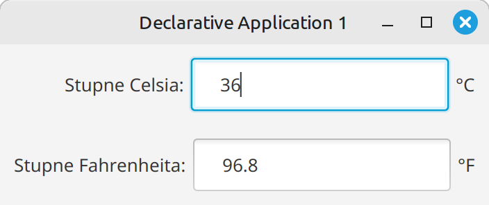

# Cvičenie 14: JavaFX komponenty

Na tomto cvičení si budeme vytvárať rôzne typy scén a GUI programov

## OPG GUI repozitár

Na adrese [https://github.com/wagjo/opg-gui-ulohy](https://github.com/wagjo/opg-gui-ulohy) máte repozitár, do ktorého budete robiť dnešné úlohy.

1. Vytvorte si svoju vlastnú kópiu tohto repozitára pomocou tlačítka `Fork` na GitHub stránke.
1. Potom si repozitár stiahnite do svojho počítača
1. V repozitári je 5 úloh, každá úloha má deklaratívny a procedurálny variant
1. Ako ukážku máte v každej úlohe naprogramované počítadlo
1. Úlohy spúšťate pomocou triedy Main, v deklarativnom alebo proceduralnom variante

Vašou úlohou bude zmeniť kód v jednotlivých úlohách tak, aby spĺňal zadanie.

- V deklaratívnej verzii použite FXML a Controller
- V procedurálnej verzii vytvorte scénu pomocou kódu, všetko dajte do triedy Application

## Úlohy

!!! example "Úloha 14.1: Premena jednotiek teploty"

    Upravte úlohu 1 tak, aby scéna vyzerala nasledovne:

    {width=350}

    Zadanie:

    - Ak zadáte číslo do jedného z textových polí, v druhom poli sa automaticky vypočíta prevedená hodnota
    - Ako koreňový prvok použite VBox
    - Každý riadok bude HBox, ktorý v sebe bude mať 3 prvky
    - Na odchytenie vstupu z klávesnice použite `OnKeyTyped`


!!! example "Úloha 14.2: Registrácia užívateľa"

    Upravte úlohu 2 tak, aby scéna vyzerala nasledovne:

    {width=300}

    Zadanie:

    - Všimnite si, ako sú všetky 3 riadky zarovnané 
    - Ako koreňový prvok použite `GridPane`, bude mať 2 stĺpce a 5 riadkov
    - Posledné 2 riadky majú spojené stĺpce
    - `RadioButton` prvky musia mať spoločný toggleGroup
    - Hodnotu pohlavia zistíme nasledovne: `((RadioButton)pohlavieGroup.getSelectedToggle()).getText()`
    - Tlačítko `Zavrieť` ukončí program pomocou `Platform.exit()`
    - Tlačítko `Registrovať vypíše `Alert` box v ktorom uvedie hodnoty, ktoré zadal užívateľ

    {width=350}

!!! example "Úloha 14.3: Oznam"

    Upravte úlohu 3 tak, aby scéna vyzerala nasledovne:

    {width=550}

    Zadanie:

    - Ako koreňový prvok použite BorderPane
    - Ako obrázok použite súbor [spse.png](../assets/spse.png) a komponent `ImageView`
    - Text oznamu dajte do prvku `TextArea`
    - Na odkaz použite `Hyperlink`
    - Tlačítko `Beriem na vedomie` ukončí program pomocou `Platform.exit()`

!!! example "Úloha 14.4: Andy Warhol"

    Upravte úlohu 4 tak, aby scéna vyzerala nasledovne:

    {width=550}

    Zadanie:

    - Ako koreňový prvok použite `BorderPane` alebo `VBox`
    - Tlačítko `Close` ukončí program pomocou `Platform.exit()`
    - Tlačítko `Randomize` nech zmení farby pozadí na náhodné
    - Obrázky sa budú umiestňovať do `TilePane` a to takto:
    - Každý prvok v `TilePane` nech je VBox, do ktorého potom dáte `ImageView`
    - Každý VBox nech má svoj atribút v Controlleri a farby potom môžete zmeniť pomocou nasledovného kódu

    ```java
    private void randomize() {
        vbox1.setStyle("-fx-background-color: " + getRandomColor());
        vbox2.setStyle("-fx-background-color: " + getRandomColor());
        vbox3.setStyle("-fx-background-color: " + getRandomColor());
        vbox4.setStyle("-fx-background-color: " + getRandomColor());
    }
    ```
    

!!! example "Úloha 14.5: Jedálniček"

    Upravte úlohu 5 tak, aby scéna vyzerala nasledovne:

    {width=550}

    Zadanie:

    - V kóde si vytvoríte zoznam jedál, kde jedlo je `record Jedlo(Integer id, String nazov, Integer kalorie, Double cena) {}`
    - Ako koreňový prvok použite BorderPane
    - Tabuľka `TableView` nech má 3 stĺpce `TableColumn`. 
    - Automatickú šírku posledného stĺpca viete nastaviť pomocou atribútu Column Resize: constrained resize
        - V procedurálnej verzii je to `tabulka.setColumnResizePolicy(TableView.CONSTRAINED_RESIZE_POLICY_FLEX_LAST_COLUMN);`
    - Tlačítko `Vymaž` vymaže aktuálne vybraný prvok
    - Tlačítko `Zatvor` ukončí program pomocou `Platform.exit()`

    Kód na vpísanie dát do tabuľky (v deklaratívnej verzii implementujte v Controlleri rozhranie Initializable):

    ```java
    @Override
    public void initialize(URL location, ResourceBundle resources) {
      id.setCellValueFactory(p -> new SimpleIntegerProperty(p.getValue().id()).asObject());
      nazovJedal.setCellValueFactory(p -> new SimpleStringProperty(p.getValue().nazov()));
      kalorie.setCellValueFactory(p -> new SimpleIntegerProperty(p.getValue().kalorie()).asObject());
      cena.setCellValueFactory(p -> new SimpleDoubleProperty(p.getValue().cena()).asObject());
      tabulka.getItems().setAll(jedloList);
    }
    ```

    Kód na vymazanie prvku:

    ```java
    Jedlo selected = tabulka.getSelectionModel().getSelectedItem();
    jedloList.remove(selected);
    tabulka.getItems().remove(selected);
    ```
