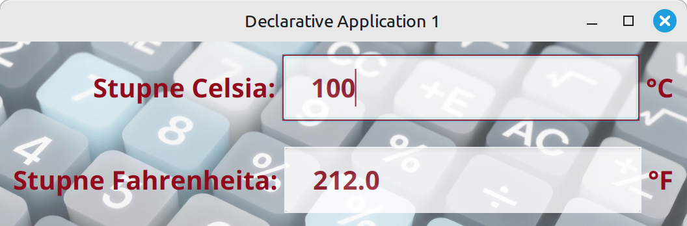
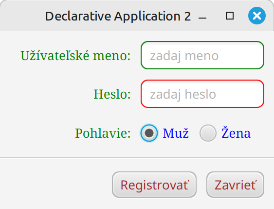
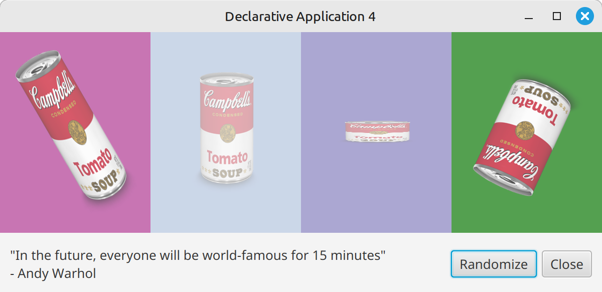
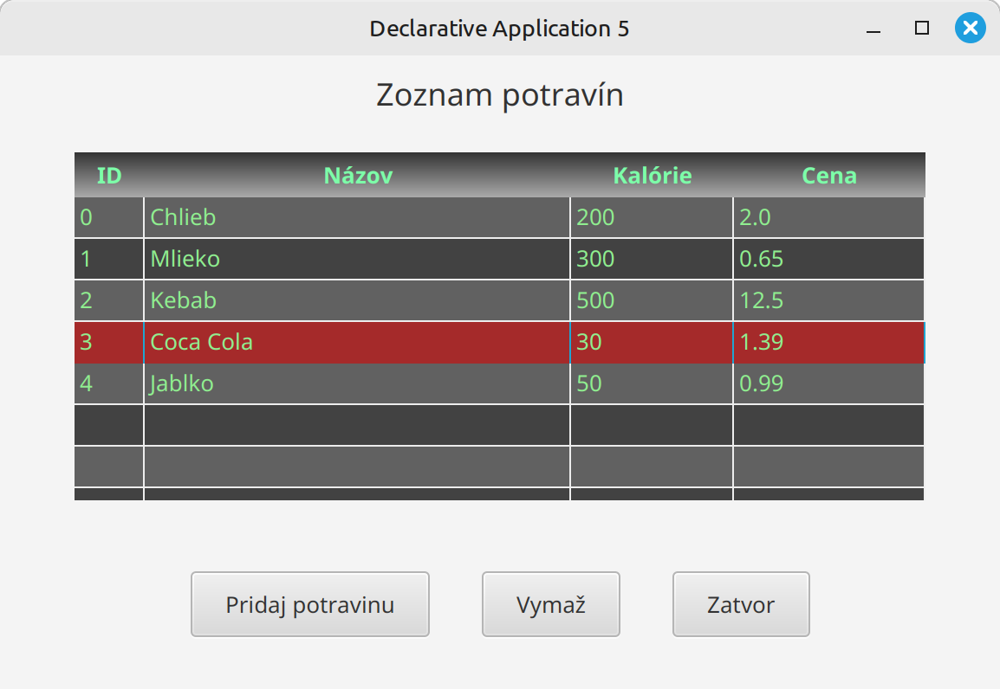

# Cvičenie 15: JavaFX štýly

Toto cvičenie je zamerané na štýlovanie JavaFX aplikácií pomocou CSS

## Základné CSS atribúty

Na teórii sme si vysvetlili základy štýlovania a CSS selektory. Ostáva nám ukázať si najbežnejšie CSS atribúty:

| Atribút                 | Popis                   | Príklad                      |
| ----------------------- | ----------------------- | ---------------------------- |
| `-fx-background-color`  | Farba pozadia           | `-fx-background-color: red;` |
| `-fx-text-fill`         | Farba textu             | `-fx-text-fill: white;`      |
| `-fx-font-size`         | Veľkosť písma           | `-fx-font-size: 16px;`       |
| `-fx-font-family`       | Typ písma               | `-fx-font-family: "Arial";`  |
| `-fx-font-weight`       | Hrúbka písma            | `-fx-font-weight: bold;`     |
| `-fx-padding`           | Vnútorné odsadenie      | `-fx-padding: 10;`           |
| `-fx-background-radius` | Zaoblenie rohov pozadia | `-fx-background-radius: 5;`  |
| `-fx-border-color`      | Farba okraja            | `-fx-border-color: black;`   |
| `-fx-border-width`      | Hrúbka okraja           | `-fx-border-width: 2;`       |
| `-fx-border-radius`     | Zaoblenie okraja        | `-fx-border-radius: 5;`      |
| `-fx-alignment`         | Zarovnanie obsahu                 | `-fx-alignment: center;`       |
| `-fx-spacing`           | Medzera medzi prvkami (VBox/HBox) | `-fx-spacing: 10;`             |
| `-fx-opacity`           | Priehľadnosť                      | `-fx-opacity: 0.5;`            |
| `-fx-cursor`            | Typ kurzora                       | `-fx-cursor: hand;`            |
| `-fx-effect`            | Efekty (tieň, blur)               | `-fx-effect: dropshadow(...);` |
| `-fx-background-insets` | Odsadenie pozadia                 | `-fx-background-insets: 5;`    |
| `-fx-border-insets`     | Odsadenie okraja                  | `-fx-border-insets: 5;`        |
| `-fx-underline`        | Podčiarknutie textu           | `-fx-underline: true;`      |
| `-fx-line-spacing`     | Medzera medzi riadkami        | `-fx-line-spacing: 5;`      |
| `-fx-wrap-text`        | Zalomenie textu               | `-fx-wrap-text: true;`      |
| `-fx-content-display`  | Pozícia grafiky voči textu    | `-fx-content-display: top;` |
| `-fx-graphic-text-gap` | Medzera medzi ikonou a textom | `-fx-graphic-text-gap: 10;` |
| `-fx-background-image`    | Obrázok pozadia    | `-fx-background-image: url("img.png");` |
| `-fx-background-repeat`   | Opakovanie obrázka | `-fx-background-repeat: no-repeat;`     |
| `-fx-background-position` | Pozícia obrázka    | `-fx-background-position: center;`      |
| `-fx-background-size`     | Veľkosť obrázka    | `-fx-background-size: cover;`           |
| `-fx-border-style`        | Štýl okraja        | `-fx-border-style: solid;`              |
| `-fx-rotate`            | Rotácia prvku           | `-fx-rotate: -20;` |
| `-fx-scale-x`           | Zmena mierky X          | `-fx-scale-x: 250%` |
| `-fx-scale-y`           | Zmena mierky Y          | `-fx-scale-y: 250%` |

## Úlohy

!!! example "Úloha 15.1: Premena jednotiek teploty"

    Vytvorte .css súbor so štýlmi tak, aby úloha 14.1 vyzerala nasledovne:

    {.on-glb width=500}

    Použite nasledovné CSS atribúty:

    - `-fx-text-fill`
    - `-fx-font-size`
    - `-fx-font-weight`
    - `-fx-opacity`
    - `-fx-border-color`
    - `-fx-background-image`
    - `-fx-background-size`
     
    Detaily:

    - Farba textu #930b1e
    - Veľkosť textu 20, hrúbka **bold**
    - Priesvitnosť `text-field` komponentov **0.8**
    - Obrázok pozadia [calculator.jpeg](../assets/calculator.jpeg)

!!! example "Úloha 15.2: Registrácia užívateľa"

    Pridajte **inline štýly** do úlohy 14.2 tak, aby aplikácia vyzerala nasledovne:

    {.on-glb width=300}

    Použite nasledovné CSS atribúty:

    - `-fx-text-fill`
    - `-fx-font-family`
    - `-fx-border-color`
    - `-fx-font-family`
    - `-fx-background-radius`
    - `-fx-border-radius`
     
    Detaily:

    - Farby: green, red, brown a blue
    - Font family: Serif
    - Radius: 7px
    - Obrázok pozadia [calculator.jpeg](../assets/calculator.jpeg)

!!! example "Úloha 15.3: Oznam"

    Vytvorte .css súbor so štýlmi tak, aby úloha 14.3 vyzerala nasledovne:

    {.on-glb width=500}

    Použite nasledovné CSS atribúty:

    - `-fx-background-image`
    - `-fx-background-size`
    - `-fx-effect`
    - `-fx-text-fill`
    - `-fx-font-weight`
    - `-fx-font-family`
    - `-fx-background-color`
    - `-fx-font-size`
    - `-fx-border-color`
    - `-fx-rotate`
     
    Detaily:

    - Farba nadpisu: `#b80101`
    - Efekt tieňa: `dropshadow(gaussian, #dee1ea, 20, 0.9, 0, 0)`
    - Farba priesvitného pozadia tlačidla a text-area: `#FFFA`
    - Obrázok pozadia [ele-wallpaper2.jpeg](../assets/ele-wallpaper2.jpeg)

    Priesvitné pozadie do text-area sa robí trochu komplikovanejšie, skúste pohľadať na internete, ako

    Skúste animovať logo školy tak sa pri prechode myšou vyrovnalo a pri kliknutí zväčšilo. Na plynulý prechod je potrebné použiť OpenFX verziu 23.

!!! example "Úloha 15.4: Andy Warhol"

    Upravte úlohu 14.4 tak, aby sa náhodne generovala nie len farba pozadia, ale aj:

    - šírka a výška plechoviek
    - priehľadnosť
    - natočenie

    {width=550}

!!! example "Úloha 15.5: Jedálniček"

    Vytvorte .css súbor so štýlmi tak, aby úloha 14.5 vyzerala nasledovne:

    {width=550}

    Použite nasledovné CSS atribúty:

    - `-fx-background-color`
    - `-fx-text-fill`
    - `-fx-padding` (na HBox a tlačidlá)
    - `-fx-spacing` (na HBox, medzery medzi tlačidlami)
    - `-fx-alignment` (na HBox, vycentruje tlačidlá)

    Na štýlovanie TableView viete využiť nasledovné CSS selektory:

    - `.table-view`
    - `.table-view:focused`
    - `.table-view .column-header-background`
    - `.table-view .column-header-background .label`
    - `.table-view .column-header `
    - `.table-view .table-cell`
    - `.table-row-cell`
    - `.table-row-cell:odd`
    - `.table-row-cell:selected`

    Detaily:

    - farba vyznačeného riadky tabuľky: `brown`
    - farby pozadí riadkov: `#616161; #424242;`
    - farebný prechod v hlavičke: `linear-gradient(#333 0%, #aaa 100%);`
    - padding tlačidiel: `10px 20px 10px 20px;`