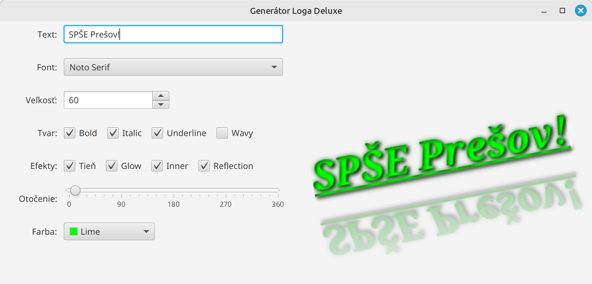
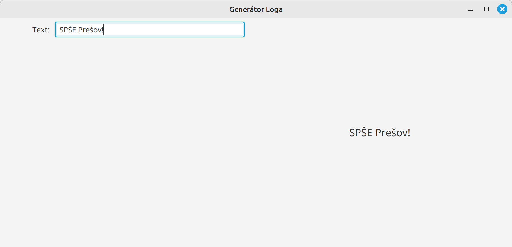
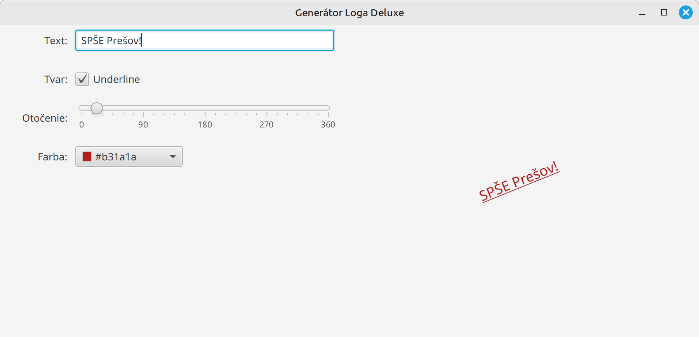

# Cvičenie 17: Použitie property objektov

Na dnešnom cvičení si vytvoríme generátor loga, v ktorom využijeme property objekty na efektívnu komunikáciu medzi komponentami.

Cieľom je vytvoriť aplikáciu, ktorá umožňuje vytvoriť logo a upraviť jeho rôzne vlastnosti. Parametre sa budú nastavovať v ľavej časti aplikácie, a logo sa zobrazí v pravej časti.

{.on-glb width=600}

Začneme s jednoduchou verziou programu a postupne do neho budeme pridávať nové funkcionality.

!!! example "Úloha 17.1: Projekt generátor loga"

    Stiahnite si repozitár [https://github.com/wagjo/opg-gui-ulohy-logo.git](https://github.com/wagjo/opg-gui-ulohy-logo.git) a otvorte ho vo vašom IntelliJ IDEA.

    {width=600}

    Oboznámte sa so zdrojovým kódom aplikácie

!!! example "Úloha 17.2: Pridanie základných vlastností loga"

    Začneme z pridávaním základných nastavení. Upravte aplikáciu tak, aby sa v nej dali nastavovať nasledovné parametre loga:

    - text loga
    - farba textu
    - natočenie
    - podčiarknutie loga

    Zmeny v logu vykonajte buď pomocou prepojenia property objektov medzi ovládacími komponentami a logom alebo pomocou listenerov nad ovládacími komponetami.

    {.on-glb width=600}

    Prepojenie medzi property objektami vykonáme pomocou `bind`, napr.

    ```java
    logo.textProperty().bind(text.textProperty());
    ```

    Zmena nastavenia pomocou listeneru sa robí pomocou `addListener` nasledovne:

    ```java
    text.textProperty().addListener((obs, oldSize, newSize) -> logo.setText(newSize));
    ```


!!! example "Úloha 17.3: Pridanie pokročilých nastavení"

    Postupne do aplikácie pridávajte ďalšie nastavenia, napr. podľa príkladu na začiatku tohto cvičenia. Väčšinu zložitejších nastavení už nebude možné jednoducho prepojiť pomocou property objektov, avšak stále budeme môcť využiť listenery na to, aby sme zistili, či sa v niektorom ovládacom prvku zmenila hodnota.

    Pokročilejšie nastavenia:

    - vlastnosti písma: veľkosť, hrúbka, sklon, typ písma - použite metódu `logo.setFont()`
    - efekty písma: tieň (`DropShadow`), žiara (`Glow`), odraz (`Reflection`), vnútorný tieň (`InnerShadow`). Všetky efekty viete aplikovať pomocou `logo.setEffect()`
    - vlnenie loga pomocou `DisplacementMap` - zložitejšie, je potrebné vytvoriť vlastnú mapu zvlnenia
    - iné nastavenia: natiahnutie X/Y osi, presvitnosť, farba pozadia, ...

    príklad vlastnej mapy zvlnenia:

    ```java
    // aplitúda napr. 5 a frekvencia 20
    private DisplacementMap createWavyEffect(double amplitude, double frequency) {
        int width = (int) logo.getWidth() + 50;
        int height = (int) logo.getHeight() + 50;

        FloatMap floatMap = new FloatMap();
        floatMap.setWidth(width);
        floatMap.setHeight(height);

        for (int i = 0; i < width; i++) {
            double v = (Math.sin(i / 25.0 * Math.PI) - 0.5) / 60.0;
            for (int j = 0; j < height; j++) {
                floatMap.setSamples(i, j, 0.0f, (float) v);
            }
        }

        DisplacementMap displacementMap = new DisplacementMap();
        displacementMap.setMapData(floatMap);

        return displacementMap;
    }
    ```