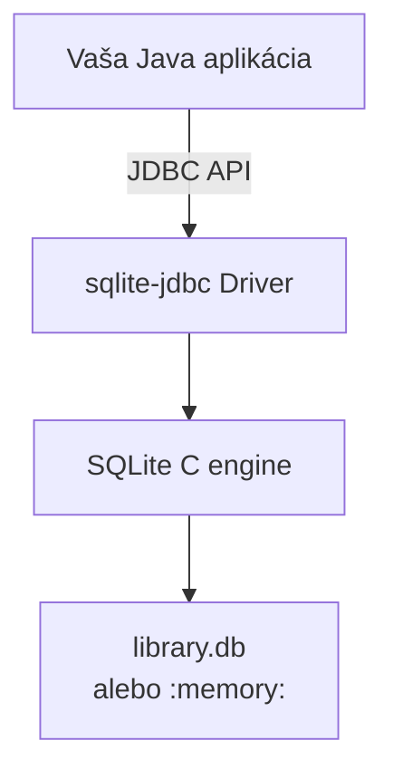

# Podklady pre výučbu: Práca s databázami a SQLite v Jave + Základy ORM (JPA/Hibernate)

**Modul:** Databázy v Jave (JDBC + SQLite) a úvod do ORM  
**Celkový čas:** 6 hodín  
**Rozdelenie:** 2 hodiny teórie + 2 × 2 hodiny cvičenia  
**Úroveň:** Stredne pokročilí študenti Javy (po základoch OOP, kolekcií, výnimiek a základov SQL)

---

## Obsah

1. [Ciele modulu](#ciele-modulu)
2. [Predpoklady](#predpoklady)
3. [Použité technológie a verzie](#použité-technológie-a-verzie)
4. [Teória – 2 hodiny](#teória--2-hodiny)
5. [Cvičenie 1 – JDBC a SQLite (2 hodiny)](#cvičenie-1--jdbc-a-sqlite-2-hodiny)
6. [Cvičenie 2 – Základy ORM s JPA/Hibernate (2 hodiny)](#cvičenie-2--základy-orm-s-jpahibernate-2-hodiny)
7. [Zhrnutie a odporúčania](#zhrnutie-a-odporúčania)
8. [Príloha: Kompletné `pom.xml` súbory](#príloha-kompletné-pomxml-súbory)

---

## Ciele modulu

Po absolvovaní študenti dokážu:

- Vytvoriť a pripojiť sa k SQLite databáze z Javy pomocou JDBC
- Bezpečne vykonávať CRUD operácie s `PreparedStatement` a transakciami
- Porozumieť konceptu ORM a rozdielom oproti čistému JDBC
- Vytvoriť jednoduché JPA entity a nakonfigurovať Hibernate
- Vykonávať základné CRUD operácie pomocou Hibernate Session API
- Rozhodnúť sa, kedy použiť JDBC a kedy ORM v praxi

---

## Predpoklady

- Základy Javy (OOP, `try-with-resources`, kolekcie, výnimky)
- Základy SQL (`SELECT`, `INSERT`, `UPDATE`, `DELETE`, `CREATE TABLE`, `WHERE`, `LIKE`)
- Základné skúsenosti s Mavenom
- Odporúčané: IntelliJ IDEA (Community alebo Ultimate)

---

## Použité technológie a verzie (jún 2026)

| Technológia                    | Verzia          | Účel                              |
|--------------------------------|-----------------|-----------------------------------|
| JDK                            | 17+ / 21        | Vývojová platforma                |
| sqlite-jdbc                    | 3.53.2.0        | JDBC driver pre SQLite            |
| jakarta.persistence-api        | 3.1.0           | JPA štandard                      |
| hibernate-core                 | 6.6.52.Final    | ORM implementácia                 |
| hibernate-community-dialects   | 6.6.52.Final    | Podpora SQLite dialectu           |

> **Poznámka:** Verzie overte vždy na [Maven Central](https://central.sonatype.com). Hibernate 6.6.x je stabilná a dobre zdokumentovaná séria vhodná na výučbu.

---

## Teória – 2 hodiny

### 1.1 Prečo databázy v Jave? (10 min)

Väčšina reálnych Java aplikácií potrebuje perzistenciu dát. Hlavné dôvody:

- Dlhodobé uloženie dát (aj po reštarte aplikácie)
- Súbežný prístup viacerých používateľov/procesov
- ACID vlastnosti (Atomicity, Consistency, Isolation, Durability)
- Výkonné dotazovanie a reporting

V Jave existujú tri hlavné prístupy:

1. **JDBC** – nízkoúrovňový, plná kontrola nad SQL
2. **ORM** (Object-Relational Mapping) – automatické mapovanie objektov na tabuľky
3. **Vyššie abstrakcie** – Spring Data JPA, jOOQ, Querydsl (nad ORM)

V tomto module sa venujeme **JDBC + SQLite** a **základom ORM (JPA + Hibernate)**.

### 1.2 SQLite – embedovaná databáza (15 min)

**Čo je SQLite?**

- Najrozšírenejšia embedovaná relačná databáza na svete
- Celá databáza = **jeden súbor** na disku (alebo `:memory:`)
- Žiadny samostatný server (na rozdiel od PostgreSQL/MySQL)
- Implementácia v C, veľmi rýchla a malá
- Podporuje väčšinu SQL-92 + niektoré rozšírenia

**Architektúra JDBC + SQLite**



**Kedy SQLite používať?**

- Desktopové aplikácie
- Mobilné aplikácie (Android používa SQLite natívne)
- IoT / embedded systémy
- Lokálne úložisko v desktopových nástrojoch
- **Testovanie a prototypovanie** (rýchle vytvorenie DB v pamäti)
- Aplikácie s nízkou až strednou záťažou

**Kedy SQLite nepoužívať?**

- Vysoká konkurencia zápisov (SQLite zamyká celú databázu pri zápise)
- Veľké dáta a komplexná analytika
- Distribuované systémy s viacerými nodmi

### 1.3 JDBC – Java Database Connectivity (25 min)

**Hlavné triedy a rozhrania:**

| Trieda / Rozhranie       | Účel                                      |
|--------------------------|-------------------------------------------|
| `DriverManager`          | Získanie `Connection`                     |
| `Connection`             | Spojenie s databázou + transakcie         |
| `Statement`              | Jednoduché SQL (riziko SQL injection)     |
| `PreparedStatement`      | Bezpečné parametrizované dotazy (`?`)     |
| `ResultSet`              | Výsledok `SELECT` (iterácia ako cursor)   |
| `SQLException`           | Výnimka pri chybe databázy                |

**Základný flow (vždy s try-with-resources!):**

```java
String url = "jdbc:sqlite:library.db";

try (Connection conn = DriverManager.getConnection(url);
     PreparedStatement ps = conn.prepareStatement(
         "INSERT INTO books (title, author, published_year) VALUES (?, ?, ?)")) {

    ps.setString(1, "Effective Java");
    ps.setString(2, "Joshua Bloch");
    ps.setInt(3, 2018);
    ps.executeUpdate();

} catch (SQLException e) {
    e.printStackTrace();
}
```

**Dôležité pravidlá:**

1. **Vždy** používajte `try-with-resources` (od Java 7)
2. **Vždy** používajte `PreparedStatement` pri vstupe od používateľa
3. `Statement` používajte len na statické DDL (`CREATE TABLE`)
4. Transakcie: `setAutoCommit(false)` → `commit()` / `rollback()`
5. Mapovanie `ResultSet` → objekty robte ručne (alebo použite ORM)

**URL pre SQLite:**

- Súbor: `jdbc:sqlite:library.db`
- In-memory (ideálne pre testy): `jdbc:sqlite::memory:`
- Read-only: `jdbc:sqlite:file:library.db?mode=ro`

### 1.4 Transakcie a best practices v JDBC (10 min)

```java
conn.setAutoCommit(false);
try {
    // INSERT knihy
    // INSERT autora
    conn.commit();
} catch (SQLException e) {
    conn.rollback();
    throw e;
}
```

**Best practices (zhrnutie):**

- `try-with-resources` všade
- `PreparedStatement` vždy
- Správne zatváranie `ResultSet`, `Statement`, `Connection`
- Connection pooling v reálnych aplikáciách (HikariCP)
- Logging SQL dotazov počas vývoja

### 1.5 Úvod do ORM – Object-Relational Mapping (20 min)

**Problém "impedance mismatch":**

Objekty v Jave majú:
- Identitu (`==` vs `equals`)
- Stav + správanie
- Dedičnosť
- Asociácie (1:N, N:M, kompozícia)

Relačné tabuľky majú:
- Riadky a stĺpce
- Primárne a cudzie kľúče
- Normalizáciu

Manuálne mapovanie (`ResultSet` → `new Book(...)`) je **nudné, opakujúce sa a náchylné na chyby**.

**ORM rieši** toto mapovanie automaticky.

**Výhody ORM:**

- Veľmi málo boilerplate kódu
- Vyššia produktivita
- Automatický dirty checking + transakcie
- Lazy loading, caching, cascade
- Väčšia nezávislosť od konkrétnej databázy

**Nevýhody / riziká:**

- Výkonnostný overhead (niekedy)
- N+1 selects problém (ak nie je správne nakonfigurované)
- Zložitejšia konfigurácia na začiatku
- "Leaky abstraction" – stále treba rozumieť SQL
- Debugovanie generovaného SQL môže byť ťažšie

**ORM riešenia v Jave:**

- **JPA (Jakarta Persistence)** – štandardná špecifikácia
- **Hibernate** – najpoužívanejšia implementácia JPA
- EclipseLink
- MyBatis (SQL-centric prístup)
- jOOQ (type-safe SQL builder)

V tomto kurze používame **JPA + Hibernate**.

### 1.6 Základy JPA/Hibernate (25 min)

**Hlavné anotácie:**

| Anotácia                  | Význam                                      |
|---------------------------|---------------------------------------------|
| `@Entity`                 | Trieda je mapovaná na tabuľku               |
| `@Table(name = "books")`  | Názov tabuľky                               |
| `@Id`                     | Primárny kľúč                               |
| `@GeneratedValue`         | Automatické generovanie ID (`IDENTITY`)     |
| `@Column(name=..., nullable=...)` | Mapovanie stĺpca                     |
| `@ManyToOne` / `@OneToMany` | Vzťahy medzi entitami                    |
| `@Transient`              | Pole nie je mapované do DB                  |

**Príklad entity `Book`:**

```java
@Entity
@Table(name = "books")
public class Book {

    @Id
    @GeneratedValue(strategy = GenerationType.IDENTITY)
    private Long id;

    @Column(nullable = false, length = 255)
    private String title;

    private String author;

    @Column(name = "published_year")
    private Integer publishedYear;

    private String isbn;

    // Bezparametrický konštruktor (povinný pre JPA!)
    public Book() {}

    // Gettery, settery, equals/hashCode (podľa ID)
}
```

**Životný cyklus entity:**

1. **Transient** – nový objekt, nie je v DB
2. **Managed** – objekt je v Persistence Context (Hibernate ho sleduje)
3. **Detached** – po uzavretí `Session` / `EntityManager`
4. **Removed** – označený na vymazanie

**Základné operácie (Hibernate Session API):**

```java
Session session = HibernateUtil.getSessionFactory().openSession();
Transaction tx = session.beginTransaction();

Book book = new Book();
book.setTitle("Clean Code");
session.persist(book);           // INSERT

Book found = session.get(Book.class, 1L);  // SELECT

tx.commit();
session.close();
```

**JPQL príklad:**

```java
List<Book> books = session
    .createQuery("FROM Book b WHERE b.title LIKE :title", Book.class)
    .setParameter("title", "%Java%")
    .list();
```

### 1.7 Porovnanie JDBC vs ORM (10 min)

| Kritérium                  | JDBC                                      | JPA/Hibernate                              |
|---------------------------|-------------------------------------------|--------------------------------------------|
| Množstvo kódu             | Veľké (ručné mapovanie)                   | Malé (automatické)                         |
| Výkon                     | Najlepší možný                            | Dobrý (s overheadom)                       |
| Flexibilita SQL           | Plná                                      | Dobrá (JPQL + native queries)              |
| Transakcie                | Manuálne                                 | Automatické + dirty checking               |
| Vzťahy 1:N, N:M           | Ručné JOIN + mapovanie                    | Deklaratívne (`@OneToMany`)                |
| Krivka učenia             | Nižšia na začiatku                        | Vyššia na začiatku                         |
| Použitie v praxi          | Jednoduché nástroje, performance-critical | Väčšina enterprise aplikácií               |

**Záver teórie:**

Naučiť sa **JDBC** je dôležité, aby ste chápali, čo sa deje pod pokrývkou ORM.  
V reálnych projektoch sa **väčšinou** používa ORM + občas native queries pre veľmi komplexné prípady.

---

## Cvičenie 1 – JDBC a SQLite (2 hodiny)

**Cieľ:** Vytvoriť interaktívnu konzolovú aplikáciu **Knižnica** s plným CRUD pomocou JDBC.

**Výstup cvičenia:**
- Maven projekt s `sqlite-jdbc`
- Trieda `model.Book`
- Trieda `db.DatabaseManager` s CRUD metódami
- Interaktívne menu v `Main`

### Postup cvičenia

#### Krok 1: Vytvorenie projektu (10 min)
Vytvorte nový Maven projekt v IntelliJ:
- GroupId: `sk.fiit`
- ArtifactId: `java-db-jdbc-sqlite`
- JDK 17+

#### Krok 2: Pridanie dependency (5 min)
Do `pom.xml` pridajte:

```xml
<dependency>
    <groupId>org.xerial</groupId>
    <artifactId>sqlite-jdbc</artifactId>
    <version>3.53.2.0</version>
</dependency>
```

#### Krok 3: Vytvorenie modelu `Book` (10 min)
Package: `model`

```java
public class Book {
    private Long id;
    private String title;
    private String author;
    private Integer publishedYear;
    private String isbn;

    // gettery, settery, konštruktory, toString()
}
```

#### Krok 4: Implementácia `DatabaseManager` (45 min)
Package: `db`

Odporúčaná štruktúra triedy:

```java
public class DatabaseManager {

    private static final String DB_URL = "jdbc:sqlite:library.db";

    public void initializeDatabase() {
        String sql = """
            CREATE TABLE IF NOT EXISTS books (
                id INTEGER PRIMARY KEY AUTOINCREMENT,
                title TEXT NOT NULL,
                author TEXT,
                published_year INTEGER,
                isbn TEXT UNIQUE
            )
            """;
        // executeUpdate pomocou Statement
    }

    public void addBook(Book book) { /* PreparedStatement INSERT */ }

    public List<Book> getAllBooks() { /* SELECT + mapovanie ResultSet → Book */ }

    public Optional<Book> getBookById(long id) { /* ... */ }

    public void updateBook(Book book) { /* UPDATE */ }

    public void deleteBook(long id) { /* DELETE */ }
}
```

**Požiadavky:**
- Všetky metódy používajú `try-with-resources`
- Všetky parametrizované dotazy cez `PreparedStatement`
- Správne mapovanie `ResultSet` na `Book` objekty

#### Krok 5: Interaktívne menu v `Main` (30 min)
Použite `Scanner` a `switch`.

Možnosti menu:
1. Pridať novú knihu
2. Zobraziť všetky knihy
3. Nájsť knihu podľa ID
4. Upraviť knihu (podľa ID)
5. Vymazať knihu (podľa ID)
6. Ukončiť aplikáciu

#### Krok 6: Testovanie a bonusy (20 min)

**Bonusy (ak zostane čas):**
- Pridajte jednoduché vyhľadávanie podľa názvu (`LIKE`)
- Pridajte hromadné vymazanie s transakciou
- Pridajte validáciu vstupu

**Odporúčaný časový plán cvičenia:**
- 0–30 min: Projekt + dependencies + model
- 30–75 min: `DatabaseManager` (hlavná časť)
- 75–105 min: Menu + integrácia
- 105–120 min: Testovanie + bonusy + ukážka riešenia

---

## Cvičenie 2 – Základy ORM s JPA/Hibernate (2 hodiny)

**Cieľ:** Porovnať prístup s JDBC a ukázať výhody ORM na rovnakej doméne (knižnica).

**Výstup:**
- Nový Maven projekt `java-db-orm-hibernate`
- Entity `Book` s JPA anotáciami
- Konfigurácia Hibernate (`hibernate.cfg.xml`)
- `HibernateUtil`
- `repository.BookRepository` s CRUD pomocou `Session`
- Fungujúce menu (podobné ako v cvičení 1)

### Postup cvičenia

#### Krok 1: Vytvorenie projektu + dependencies (10 min)
Nový Maven projekt `java-db-orm-hibernate`.

Pridajte do `pom.xml`:

```xml
<!-- JPA API -->
<dependency>
    <groupId>jakarta.persistence</groupId>
    <artifactId>jakarta.persistence-api</artifactId>
    <version>3.1.0</version>
</dependency>

<!-- Hibernate -->
<dependency>
    <groupId>org.hibernate.orm</groupId>
    <artifactId>hibernate-core</artifactId>
    <version>6.6.52.Final</version>
</dependency>

<!-- SQLite dialect support -->
<dependency>
    <groupId>org.hibernate.orm</groupId>
    <artifactId>hibernate-community-dialects</artifactId>
    <version>6.6.52.Final</version>
</dependency>

<!-- SQLite JDBC driver -->
<dependency>
    <groupId>org.xerial</groupId>
    <artifactId>sqlite-jdbc</artifactId>
    <version>3.53.2.0</version>
</dependency>
```

#### Krok 2: Vytvorenie entity `Book` (15 min)
Package: `model`

Použite anotácie z `jakarta.persistence.*`

```java
@Entity
@Table(name = "books")
public class Book {
    @Id
    @GeneratedValue(strategy = GenerationType.IDENTITY)
    private Long id;

    @Column(nullable = false)
    private String title;

    private String author;

    @Column(name = "published_year")
    private Integer publishedYear;

    private String isbn;

    public Book() {}   // povinný!

    // gettery + settery
}
```

#### Krok 3: Konfigurácia Hibernate (15 min)
Vytvorte `src/main/resources/hibernate.cfg.xml`:

```xml
<?xml version="1.0" encoding="utf-8"?>
<!DOCTYPE hibernate-configuration PUBLIC
    "-//Hibernate/Hibernate Configuration DTD 3.0//EN"
    "http://www.hibernate.org/dtd/hibernate-configuration-3.0.dtd">

<hibernate-configuration>
    <session-factory>
        <property name="hibernate.connection.driver_class">org.sqlite.JDBC</property>
        <property name="hibernate.connection.url">jdbc:sqlite:library_orm.db</property>
        <property name="hibernate.dialect">org.hibernate.community.dialect.SQLiteDialect</property>
        <property name="hibernate.hbm2ddl.auto">update</property>
        <property name="hibernate.show_sql">true</property>
        <property name="hibernate.format_sql">true</property>

        <mapping class="model.Book"/>
    </session-factory>
</hibernate-configuration>
```

#### Krok 4: `HibernateUtil` (10 min)
Vytvorte triedu `util.HibernateUtil`:

```java
import org.hibernate.SessionFactory;
import org.hibernate.cfg.Configuration;

public class HibernateUtil {
    private static final SessionFactory SESSION_FACTORY = buildSessionFactory();

    private static SessionFactory buildSessionFactory() {
        try {
            return new Configuration().configure().buildSessionFactory();
        } catch (Throwable ex) {
            throw new ExceptionInInitializerError(ex);
        }
    }

    public static SessionFactory getSessionFactory() {
        return SESSION_FACTORY;
    }
}
```

#### Krok 5: `BookRepository` s Hibernate (35 min)
Package: `repository`

Implementujte metódy pomocou `Session` a `Transaction`:

```java
public class BookRepository {

    public void save(Book book) {
        try (var session = HibernateUtil.getSessionFactory().openSession()) {
            var tx = session.beginTransaction();
            session.persist(book);
            tx.commit();
        }
    }

    public List<Book> findAll() {
        try (var session = HibernateUtil.getSessionFactory().openSession()) {
            return session.createQuery("FROM Book", Book.class).list();
        }
    }

    public Optional<Book> findById(Long id) { ... }

    public void update(Book book) {
        try (var session = HibernateUtil.getSessionFactory().openSession()) {
            var tx = session.beginTransaction();
            session.merge(book);
            tx.commit();
        }
    }

    public void delete(Long id) { ... }
}
```

#### Krok 6: Menu v `Main` + testovanie (25 min)
Skopírujte menu z cvičenia 1 a nahraďte volania `DatabaseManager` volaniami `BookRepository`.

Spustite aplikáciu a porovnajte:
- Množstvo kódu v repository
- Automatické mapovanie
- Generovaný SQL (`show_sql=true`)

#### Krok 7: Bonusy (posledných 20 min)

**Bonusy:**
1. Pridajte entitu `Author` s `@OneToMany` / `@ManyToOne` vzťahom
2. Ukážte `cascade = CascadeType.ALL`
3. Použite JPQL s `JOIN FETCH`
4. Porovnajte počet riadkov kódu JDBC vs Hibernate repository

**Časový plán cvičenia 2:**
- 0–40 min: Dependencies + entity + konfigurácia
- 40–75 min: `HibernateUtil` + `BookRepository`
- 75–100 min: Menu + testovanie
- 100–120 min: Bonusy + diskusia + porovnanie s JDBC

---

## Zhrnutie a odporúčania

### Kedy použiť čo?

| Situácia                              | Odporúčanie          | Dôvod |
|---------------------------------------|----------------------|-------|
| Jednoduchý desktop nástroj            | SQLite + JDBC        | Rýchlosť, jednoduchosť |
| Väčšina enterprise aplikácií          | Spring Boot + Spring Data JPA | Produktivita |
| Veľmi komplexné dotazy / reporting    | Native queries + ORM | Najlepší kompromis |
| Performance-critical časť aplikácie   | JDBC alebo jOOQ      | Plná kontrola |
| Rýchle prototypovanie / testy         | SQLite + Hibernate   | Rýchle vytvorenie schémy |

### Odporúčané ďalšie kroky pre študentov

1. Vyskúšajte **Spring Boot + Spring Data JPA** (veľmi zjednodušuje prácu)
2. Naučte sa **Testcontainers** na testovanie s reálnou databázou
3. Preskúmajte **Querydsl** alebo **jOOQ** pre type-safe dotazy
4. Prečítajte si knihu *Java Persistence with Hibernate* (Gavin King)

### Zdroje

- [Hibernate 6.6 User Guide](https://docs.jboss.org/hibernate/orm/6.6/userguide/html_single/)
- [sqlite-jdbc GitHub](https://github.com/xerial/sqlite-jdbc)
- [Jakarta Persistence 3.1 Specification](https://jakarta.ee/specifications/persistence/3.1/)

---

## Príloha: Kompletné `pom.xml` súbory

### A. Pre Cvičenie 1 (JDBC)

```xml
<?xml version="1.0" encoding="UTF-8"?>
<project xmlns="http://maven.apache.org/POM/4.0.0"
         xmlns:xsi="http://www.w3.org/2001/XMLSchema-instance"
         xsi:schemaLocation="http://maven.apache.org/POM/4.0.0 http://maven.apache.org/xsd/maven-4.0.0.xsd">
    <modelVersion>4.0.0</modelVersion>

    <groupId>sk.fiit</groupId>
    <artifactId>java-db-jdbc-sqlite</artifactId>
    <version>1.0-SNAPSHOT</version>

    <properties>
        <maven.compiler.source>17</maven.compiler.source>
        <maven.compiler.target>17</maven.compiler.target>
        <project.build.sourceEncoding>UTF-8</project.build.sourceEncoding>
    </properties>

    <dependencies>
        <dependency>
            <groupId>org.xerial</groupId>
            <artifactId>sqlite-jdbc</artifactId>
            <version>3.53.2.0</version>
        </dependency>
    </dependencies>
</project>
```

### B. Pre Cvičenie 2 (ORM)

```xml
<?xml version="1.0" encoding="UTF-8"?>
<project xmlns="http://maven.apache.org/POM/4.0.0"
         xmlns:xsi="http://www.w3.org/2001/XMLSchema-instance"
         xsi:schemaLocation="http://maven.apache.org/POM/4.0.0 http://maven.apache.org/xsd/maven-4.0.0.xsd">
    <modelVersion>4.0.0</modelVersion>

    <groupId>sk.fiit</groupId>
    <artifactId>java-db-orm-hibernate</artifactId>
    <version>1.0-SNAPSHOT</version>

    <properties>
        <maven.compiler.source>17</maven.compiler.source>
        <maven.compiler.target>17</maven.compiler.target>
        <project.build.sourceEncoding>UTF-8</project.build.sourceEncoding>
    </properties>

    <dependencies>
        <!-- JPA -->
        <dependency>
            <groupId>jakarta.persistence</groupId>
            <artifactId>jakarta.persistence-api</artifactId>
            <version>3.1.0</version>
        </dependency>

        <!-- Hibernate -->
        <dependency>
            <groupId>org.hibernate.orm</groupId>
            <artifactId>hibernate-core</artifactId>
            <version>6.6.52.Final</version>
        </dependency>

        <!-- SQLite dialect -->
        <dependency>
            <groupId>org.hibernate.orm</groupId>
            <artifactId>hibernate-community-dialects</artifactId>
            <version>6.6.52.Final</version>
        </dependency>

        <!-- SQLite driver -->
        <dependency>
            <groupId>org.xerial</groupId>
            <artifactId>sqlite-jdbc</artifactId>
            <version>3.53.2.0</version>
        </dependency>
    </dependencies>
</project>
```

---

**Autor podkladov:** Grok (xAI) – pripravené pre kurz Javy  
**Verzia:** 1.0 | Jún 2026

Tieto podklady môžete voľne používať a upravovať pre vaše kurzy. Veľa úspechov pri výučbe!