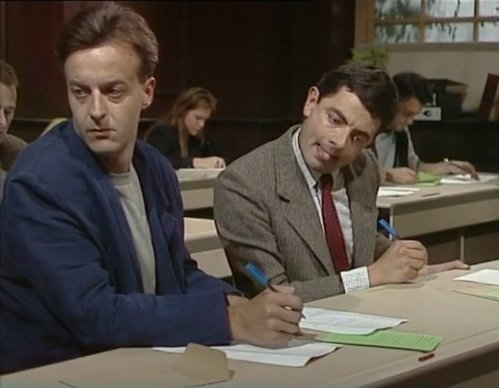
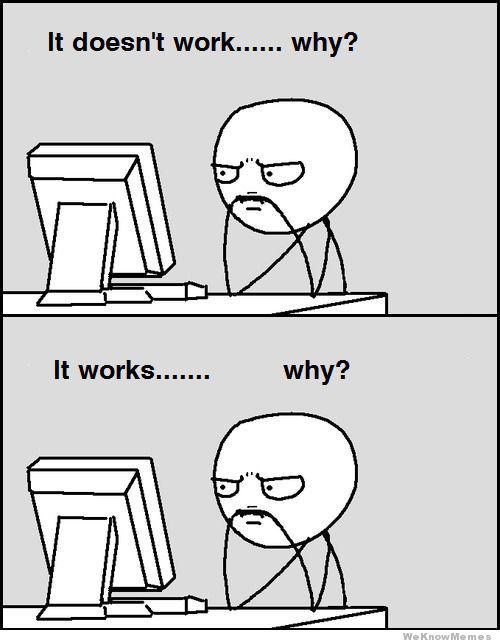

---
hide:
  - navigation
---

# Učebnica objektovo orientovaného programovania

<!--

/// caption
It's písomka time!
///
-->

Predmet *Objektovo orientované programovanie* je určený pre tretí ročník na [SPŠE v Prešove](https://www.spse-po.sk/). Medzi jeho hlavné ciele patrí osvojenie si základov objektovo orientovaného programovania a tvorbe programov v jazyku Java. Okrem toho predmet rozvíja a upevňuje základné znalosti programovania a softvérového vývoja. 

{ align=right width=300 }

Výučba sa zameriava na moderné aspekty jazyka Java za pomoci použitia najnovších nástrojov a umelej inteligencie. V neposlednej rade sa predmet venuje rozvíjaniu schopností tvorivého riešenia problémov, kritického myslenia a výchove k zodpovednosti a samostatnosti. 

*Počet hodín:* 3 hodiny týždenne, z toho 1 hodina teórie a 2 hodiny cvičenia. Doplňujúci povinne voliteľný predmet OPGP sa vyučuje 2 hodiny týždenne. Všetky veci uvedené na týchto stránkach sú aktuálne ku školskému roku 2025/2026.

!!! info "Upozornenie"

    Text neprešiel jazykovou ani štylistickou úpravou `¯\_(ツ)_/¯`. Tieto stránky sú v procese tvorby a pravidelne prechádzajú mnohými zmenami. Návrhy a pripomienky adresujte autorovi na adresu <jozef@wagjo.com>

Copyright © 2025, Jozef Wagner. Licencované v rámci <a href="https://creativecommons.org/licenses/by-nc-sa/4.0/">CC BY-NC-SA 4.0</a> :simple-creativecommons: :fontawesome-brands-creative-commons-by: :fontawesome-brands-creative-commons-nc: :fontawesome-brands-creative-commons-sa: