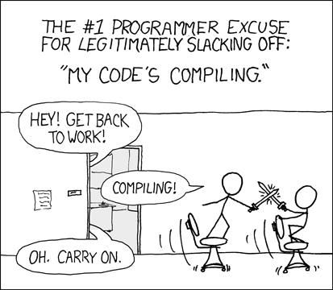
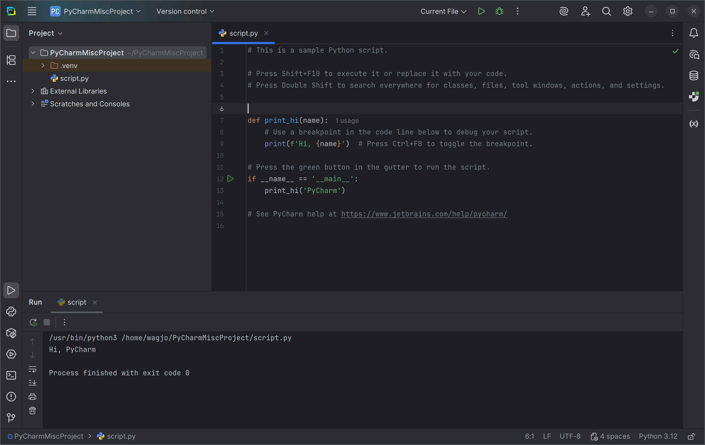

# Pokročílí 1: Úvod do predmetu

Na tomto voliteľnom predmete budeme preberať pokročilejšie témy z oblasti objektovo orientovaného programovania. Pôjdeme viac do hĺbky a ukážeme si pokročilejšie nástroje používané pri vývoji softvéru. Tak isto si ukážeme viacero praktických aplikačných využití.

Hlavným programovacím jazykom, ktorý budeme na tomto predmete používať je Python. Nakoľko ste s týmto jazykom už pracovali, očakávame od vás, že v ňom viete už ako tak programovať. V každom prípade prvé cvičenia budú venované opakovaniu.

Požiadavky na softvér a počítač sú podobné ako na klasických cvičeniach z predmetu objektovo orientované programovanie. V tomto predmete budete naviac potrebovať mať nainštalovaný programovací jazyk Python a IDE.

*[OS]: Operačný systém

## Jazyk Python

<div class="md-has-sidebar" markdown>
  <main markdown>
{align=left width=100}
Python je interpretovaný programovací jazyk na všeobecné použitie. Patrí medzi najpopulárnejšie programovacie jazyky a je hojne používaný v oblasti umelej inteligencie, strojového učenia a dátovej analýzy. Názov jazyka bol inšpirovaný populárnymi britskými komikmi [Monty Python](https://www.youtube.com/watch?v=YI8yGeaPm1U). Má dynamickú kontrolu typov a podporuje viacero programovacích paradigiem. 

{align=right width=300}
Snaží sa o jednoduchú syntax, aby s jazykom vedel pracovať aj nováčik resp. aby jazyk pre svoje potreby vedeli používať aj ne-programátori. Python v sebe obsahuje všetko, čo k základnému programovaniu potrebujete. Nemusíte tak hľadať a inštalovať nejakú knižnicu. Tento prístup je reprezentovaný jeho mottom *"Batteries included"*.
  </main>
  <aside markdown>
Základná filozofia jazyka Python je zhrnutá v 19 dizajnových princípoch nazývaných [Zen of Python](https://pep20.org).
  </aside>
</div>

Python si nainštalujte z jeho oficiálnej stránky [https://www.python.org/downloads/](https://www.python.org/downloads/). Najnovšia verzia jazyka Python je verzia 3.13. **Pri inštalácii v OS Windows zaškrtnite možnosť `Add python.exe to PATH`.** Po úspešnej inštalácii si funkčnosť overte tak, že si otvorte nové okno konzoly a v príkazovom riadku spusťte príkaz `python --version`.

=== "Zistenie verzie Pythonu"

    ```
    ~$ python --version
    Python 3.13.7
    ```

### Semantic versioning

Populárny spôsobom v programovaní, ako označovať nové verzie softvéru a knižníc je použitie tzv. [sémantického verzionovania](https://semver.org/lang/sk/). Príklad sémantickéj verzie je 2.1.4. Ide o číslovanie verzií programu vo formáte MAJOR.MINOR.PATCH, kde zväčšujeme číslo:

* MAJOR verzie, keď sme spravili zmeny, ktoré nie sú spätne kompatibilné,
* MINOR verzie, keď sme pridali funkcionalitu so zachovaním spätnej kompatibility,
* PATCH verzie, keď sme opravili chyby a ostala zachovaná spätná kompatibilita.

<div class="md-has-sidebar" markdown>
  <main markdown>
Ak sa teda objaví program s novou MAJOR verziou, takmer isto nebude kompatibilný so staršími verziami. Nová verzia MINOR alebo PATCH by mala fungovať aj so staršími súbormi. Väčšina knižníc a nástrojov v jazyku Python, Java alebo Javascript používa tento spôsob verzionovania.

!!! warning "Jazyk Python sémantické verzionovanie iba predstiera"

    Jazyk Python samotný má čisla verzií veľmi podobné sémantickému, avšak sémantické verzionovanie často porušuje. Za jeho históriu sa stalo niekoľkokrát, že aj nová MINOR verzia priniesla zmeny, ktoré neboli kompatibilné so staršími verziami. Preto si treba dávať pozor, ak aktualizujete verziu jazyka a prečítať si dokumentáciu, či náhodou nebude treba váš program upraviť, aby mohol na novšej verzii jazyka bežať.

  </main>
  <aside markdown>
Inou populárnou formov tvorenia verzií ja [Kalendárové verzionovanie, tzv. CalVer](https://calver.org/), pri ktorom sa verzia softvéru odvodzuje od roka a mesiaca, v ktorom bola verzia vydaná. Známym príkladom použitia takého spôsobu je IDE Pycharm alebo IntelliJ IDEA, ktoré má verziu napr. 2025.2.1
  </aside>
</div>

## PyCharm - Python IDE

{align=right width=150}

Pre komfortné programovanie v Pythone je vhodné, aby ste používali vývojové prostredie, po anglicky Integrated Development Environment (IDE). Na tomto predmete budeme pracovať vo vývojovom prostredí *PyCharm* od firmy JetBrains. Ide o najpopulárnejšie a najviac premakané vývojové prostredie pre jazyk Python. 

Program PyCharm si stiahnite a nainštalujte z oficiálnej stránky [https://www.jetbrains.com/pycharm/download](https://www.jetbrains.com/pycharm/download). K dispozícii je bezplatná verzia a platená verzia *Pro*. Ako študenti SPŠE v Prešove máte jedinečnú možnosť používať platenú verziu úplne zadarmo. Pre aktiváciu si pozrite návod v prvom cvičení objektovo orientovaného programovania.

!!! tip "Učím sa s pomocou umelej inteligencie"

    Som študent strednej školy a učím sa používať jazyk Python

    - [Uveď stručnú históriu, kto ho používa a na aké účely](https://grok.com/share/c2hhcmQtMg%3D%3D_f2f3cc74-b06a-4d3b-a25a-31444d65233f)
    - [Aké sú populárne vývojové prostredia pre Python](https://grok.com/share/c2hhcmQtMg%3D%3D_dc6ff17b-96c6-40f7-a1bf-e37a2844577c)

## Kompilovaný vs. Interpretovaný jazyk

<div class="md-has-sidebar" markdown>
  <main markdown>
Na začiatku sme spomínali, že Python je interpretovaný jazyk. Čo to znamená?

Pri interpretovaných jazykoch sa zdrojový kód programu, ktorý napíšete, *analyzuje a vykonáva priamo za behu programu*. Na to musí byť na danom počítačí nainštalovaný tzv. interpreter, inak program nespustíte. Výhodou takýchto jazykov ja dynamickosť a interaktivita. Ich nevýhodou je pomalší výkon. Typickým príkladom interpretovaných jazykov sú Python, Javascript a PHP.

Naproti tomu sú kompilované jazyky, ktoré sa musia pred spustením tzv. skompilovať, teda previesť do strojového kódu daného počítača. Výsledný súbor (vo Windowse je to väčšinou .exe súbor) potom vieme spúšťať bez toho, aby sme na počítač museli hocičo inštalovať. Takéto programy sú potom často výkonnejšie a zaberajú menej pamäte. Nevýhodou tohto prístupu je, že musíte skompilovať program zvlášť pre každý typ operačného systému a procesora. Príkladom kompilovaných jazykov je C, C++, Rust a Swift.

[](https://xkcd.com/303/)
/// caption
Kompilovanie, [xkcd 303](https://xkcd.com/303/)
///

Pre tvorbu bežného softvéru je viacmenej jedno, či je jazyk kompilovaný alebo interpretovaný. V nasledujúcej tabuľke je zhrnuté porovnanie týchto dvoch prístupov.

  </main>
  <aside markdown>
Striktné čierno-biele delenie na interpretovaný a kompilovaný jazyk dnes už často neplatí. Interpretované jazyky zvyknú používať rôzne finty, ako zvýšiť ich efektivitu, napr. automatickým kompilovaním na pozadí (Just In Time compiler).

Podobne aj kompilované jazyky niekedy majú svoj vlastný virtuálny stroj, na ktorom beží ich skompilovaný program. Tým sa vyhnú problémom s rôznymi procesormi a OS. Typický príklad jazyka s takým virtuálnym strojom je jazyk Java, ktorého virtuálny stroj JVM vykonáva programy skompilované do tzv. bytekódu tohto stroja.
  </aside>
</div>

| Vlastnosť | Interpretovaný jazyk | Kompilovaný jazyk |
| --------- | -------------------- | ----------------- |
| Interaktivita | Dajú sa písať interaktívne, často sa používajú pre rôzne skripty | Bez interaktivity, pred spustením treba čakať, kým sa celý program skompiluje |
| Dynamickosť | Veľmi dynamický, program sa dá ľahko meniť aj počas jeho behu | Nedá sa upraviť, každá zmena sa musí nanovo skompilovať |
| Výkon programu | Pomalší, horšia správa pamäti | Vysoký výkon, efektívne využitie procesora |
| Spustenie programu | Všade tam, kde je nainštalovaný interpreter | Musíte získať skompilovanú verziu pre daný OS a procesor |
| Kontrola chýb  | Počas behu programu | Počas kompilácie |
| Špeciálne využitie  | Skripty, Web | Hry, Výkonný software |
| Príklad   | Javascript, Python, PHP | C, C++, Rust, Swift |

## Interaktívne programovanie

<div class="md-has-sidebar" markdown>
  <main markdown>
  Na začiatok si v Pythone vyskúšame interaktívne programovanie. To znamená, že Pythonu budeme písať príkazy a on nám bude hneď odpovedať. Pre začatie interaktívneho programovanie je potrebné spustiť si konzolu s príkazovým riadkom. 

Vo Windowse odporúčame použiť Windows PowerShell. Po spustení konzoly PowerShell spustíme Python v interaktívnom móde napísaním príkazu `python` a stlačením klávesy ++"Enter"++.

=== "Spustenie Pythonu v interaktívnom móde"

    ```
    ~$ python
    Python 3.13.7 (main, Sep  3 2025, 18:25:04) [GCC 13.3.0] on linux
    Type "help", "copyright", "credits" or "license" for more information.
    >>> 
    ```

S Pythonom následne komunikujeme tak, že do príkazového riadku napíšeme príkaz, ktorý chceme vykonať a stlačíme kláves ++"Enter"++. Python príkaz vykoná a ak výsledkom príkazu je nejaká hodnota, tak ju Python do konzoly vypíše. 

=== "Výrazové príkazy v interaktívnom móde"

    ``` python
    >>> 37
    37
    >>> 1 + 2
    3
    >>> 5 * 5 * 5
    125
    >>> 10 - 3
    7
    >>> 'Ahoj ' + 'Jožo' # (1)!
    'Ahoj Jožo'
    ```

    1. Operátor sčítania `+` sa dá v Pythone použiť nie len pre čísla

</main>
  <aside markdown>
Interaktívne programovanie pomocou konzoly sa nazýva REPL, a znamená *read–eval–print loop*. Je výsadou interaktívnych jazykov a umožňuje meniť program za jeho behu a dokonca opraviť aj komplikované chyby bez toho, aby sa program musel reštartovať. Svetovo známym príkladom je ako NASA pomocou REPL opravila kritickú chyby vo vesmírnej lodi [Deep Space 1](https://susam.net/very-remote-debugging.html), ktorá bola od zeme vzdialená 100 miliónov kilometrov.
  </aside>
</div>

Nie všetky príkazy vo výsledku vyprodukujú nejakú hodnotu. V nasledujúcom príklade vytvoríme premennú a priradíme jej rôzne hodnoty. 

!!! info "Premenná"

    Premenná v Pythone je taká šípka s menom, ktorá ukazuje na nejakú hodnotu. Túto šípku potom môžeme kedykoľvek zmeniť a ukázať na inú hodnotu.

    **Presnejšie povedané, premenná má názov a ukazuje na nejaký objekt uložený v pamäti počítača. To, na akú vec bude ukazovať, vieme počas programu kedykoľvek meniť.** Celkom odborne povedané, premenná je pomenovaná referencia na objekt.
    
    Keďže je Python dynamicko typovaný jazyk, premenné nemajú žiadny dátový typ a vieme do nich priradzovať hodnoty rôznych typov. To je zásadný rozdiel v porovnaní s jazykom Java, kde každá premenná má svoj dátový typ a kompilátor kontroluje, či to program dodržiava.

    Názov premennej musí začínať písmenom alebo `_`, a môže obsahovať len písmená, číslice a `_`.

=== "Príkazy v interaktívnom móde"

    ``` python
    >>> a = 10 # (1)!
    >>> a # (2)!
    10
    >>> a + 5
    15
    >>> a = 20 # (3)!
    >>> a + 5
    25
    ```

    1. Príkaz priradenia premennej nevracia žiadnu hodnotu, preto sa v interaktívnom móde po zadaní takého príkazu nič nezobrazí. Premenná sa však vytvorí a môžeme ju v ďalších príkazoch použiť.
    2. Ak napíšeme iba premennú, nič sa do nej nepriradí a takýto príkaz vráti jej aktuálnu hodnotu
    3. Hodnotu premennej zmeníme a nasledujúce príkazy už budú pracovať s novou hodnotou

Ak chceme interaktívny mód opustiť, do príkazového riadku napíšeme `exit` a stlačíme ++"Enter"++

## Python skripty

Interaktívne programovanie má svoj význam pri oprave chýb za behu programu alebo na jednoduché vyskúšanie nejakej vecičky. Pre bežné použitie je lepšie vytvoriť tzv. skript. 

Skript je textový súbor, do ktorého napíšeme kód nášho programu. Takýto skript potom vieme dať Pythonu a ten potom skript spustí a program sa vykoná.

Pre vytváranie skriptu budeme používať IDE PyCharm. Ak už máme otvorený projekt, do hlavného okna PyCharm sa môžeme dostať pomocou voľby `File - Close Project`.

Z hlavného okna PyCharmu vyberieme možnosť **`New Script`**. Otvorí sa nám súbor `script.py`, v ktorom budeme mať vzorový kód. Ten môžeme kľudne nahradiť svojim.

Ak chceme v PyCharme spusiť aktuálne otvorený skript, stlačíme ++"Shift"+"F10"++ alebo klikneme na zelenú šípku play v hornej časti aplikácie.

{ .on-glb }
/// caption
Nový skript v prostredí PyCharm
///

Po spustení skriptu sa nám v dolnej časti aplikácie objaví konzolové okno programu, v ktorom vidíme všetko, čo náš program vypísal a pomocou ktorého môžeme do nášho programu vložiť aj vstup z klávesnice.

!!! info "Spúšťanie skriptov bez IDE"

    Pre reálne použitie sa skripty nepúšťajú cez IDE, ale vieme ich spustiť priamo cez príkazový riadok. Stačí uviesť názov súboru. Príklad spustenia skriptu `python script.py`

Nasledujúce príklady vložte do skriptu a spusťte v prostredí PyCharm IDE

## Štandardný výstup

Spustenie skriptu v Pythone prebieha ináč ako pri interaktívnom programovaní. Príkazy v skripte sa vykonávajú riadok po riadku. **Pri skripte sa na rozdiel od interaktívneho módu nevypisuje výsledok príkazu, ktorý sa vykonal**. Ak chceme do konzoly vypísať nejakú hodnotu, musíme na to použiť funkciu `print()`

!!! example "Príklad 1.1: Použitie výstupu"

    ``` python
    PI = 3.14
    r = 30
    obvod = 2 * PI * r
    print("Obvod je", obvod)
    ```

    ``` console
    Obvod je 188.4 
    ```

<div class="md-has-sidebar" markdown>
  <main markdown>

!!! info "Konštanty"

    Pri výpočtoch často potrebujeme použiť nejaké nemenné hodnoty, napríklad matematické konštanty. Je veľmi zlou praxou písať tieto hodnoty priamo do kódu, bez toho aby sme ozrejmili, čo dané číslo znamená. 

    Oveľa lepšou možnosťou je zadefinovať takého hodnoty ako konštanty. Takéto **nemenné hodnoty v Pythone vyjadríme pomocou obyčajnej premennej, ktorá však má svoje celé meno napísane veľkými písmenami**.

    Vo vyššie uvedenom príklade sme takto zadefinovali konštantu `PI`. Zápis konštanty je však iba konvenciou, teda dohodou programátorov, že to tak budú robiť a že takúto konštantu nebudú vo svojich programoch meniť. Samotný jazyk Python bohužiaľ neponúka žiadne špeciálne možnosti pre vytvorenie konštánt. V takej Jave sa to dá.

 </main>
  <aside markdown>
  Zapisovanie číselných konštánt priamo do kódu bez ozrejmenia, o čo ide, je škaredý zlozvyk mnohých programátorov. Takáto nejasná hodnota v programovaní sa volá [Magic Number](https://en.wikipedia.org/wiki/Magic_number_(programming))
  </aside>
</div>


## Štandardný vstup

Tak ako vieme do konzoly niečo vypísať, vieme aj požiadať o nejaký vstup od užívateľa. Nasledujúci príklad ukáže použitie vstupu pomocou funkcie `input()`.

!!! example "Príklad 1.2: Použitie vstupu"

    ``` python
    print("Dobrý deň, ako sa voláš?")
    meno = input() # (1)!
    print("Ahoj", meno, "Rád ťa tu vidím")
    ```

    1. Funkcia `input()` počká, kým užívateľ zadá vstup z klávesnice, stlačí ++"Enter"++ a potom táto funkcia vráti reťazec znakov (string)

    ``` console
    Dobrý deň, ako sa voláš?
    Jožo
    Ahoj Jožo Rád ťa tu vidím
    ```

!!! warning "Upozornenie"

    Po spustení tohto programu v PyCharm je niekedy nutné myškou kliknúť do okna konzoly, a až potom zadávať vstup z klávesnice.

## Formátované reťazce, f-stringy

Ak pred reťazec vložíme znak `f`, môžeme do tohto reťazca pomocou zložených zátvoriek vložiť premenné a nemusíme krkolome spájať reťazce a premennými.

!!! example "Príklad 1.3: Použitie vstupu"

    ``` python
    print("Dobrý deň, ako sa voláš?")
    meno = input()
    print("V akej obci bývaš?")
    obec = input()
    print(f"Ahoj {meno} z obce {obec}, rád ťa tu vidím!")
    ```

    ``` console
    Dobrý deň, ako sa voláš?
    Jožo
    V akej obci bývaš?
    Prešov
    Ahoj Jožo z obce Prešov, rád ťa tu vidím!
    ```

!!! tip "Učím sa s pomocou umelej inteligencie"

    Som študent strednej školy, učím sa Python. Napíš 3 nie zložité príklady na:

    - [použitie premenných a konštánt](https://grok.com/s/c2hhcmQtMg%3D%3D_b34d50b3-4fc3-4793-8677-67feae0ff42f)
    - [použitie funkcií input() a print()](https://grok.com/s/c2hhcmQtMg%3D%3D_f6804dbb-58b4-49e2-acb9-57ef35db5f6b)
    - [prácu s formátovanými reťazcomi f-string](https://grok.com/s/c2hhcmQtMg%3D%3D_e52c28f4-60e6-4909-92d8-d83ab4844f2b)

## Zhrnutie cvičenia

- [x] Nainštalovať si Python 3.13 zo stránky [https://www.python.org/downloads/](https://www.python.org/downloads/)
    * [ ] Overiť si, či Python beží správne pomocou `python --version`
- [x] Nainštalovať si vývojové prostredie [PyCharm](https://www.jetbrains.com/pycharm/download)
    * [ ] Aktivovať si školskú licenciu pre bezplatné použitie verzie Pro
- [x] Vedieť, čo je sémantické verzionovanie
    * [ ] Číselná verzia programu vo formáte MAJOR.MINOR.PATCH
    * [ ] MAJOR sa inkrementuje, keď sme spravili zmeny, ktoré nie sú spätne kompatibilné,
    * [ ] MINOR sa inkrementuje, keď sme pridali funkcionalitu so zachovaním spätnej kompatibility,
    * [ ] PATCH sa inkrementuje, keď sme opravili chyby a ostala zachovaná spätná kompatibilita.
- [x] Vedieť rozdiel medzi interpretovaným a kompilovaným jazykom
    * [ ] Interpretovaný je dynamický a interaktívny
    * [ ] Kompilovaný je výkonnejší 
    * [ ] Interpretovaný program potrebuje mať nainštalovaný interpreter
    * [ ] Kompilovaný program beží iba pre jednu konkrétnu verziu OS a procesora
    * [ ] Python je interpretovaný
- [x] Vedieť spustiť Python v interaktívnom móde
    * [ ] Otvoriť konzolu a spustiť príkaz `python`
- [x] Vedieť vytvoriť a spustiť skript
    * [ ] Pomocou `New Script` v programe PyCharm
    * [ ] Spustím pomocou `SHIFT-F10`
- [x] Čo je premenná
    * [ ] Premenná v Pythone je šípka (referencia) s menom, ktorá ukazuje na nejakú hodnotu (objekt)
    * [ ] To, na akú vec bude ukazovať, vieme počas programu kedykoľvek meniť.
    * [ ] Premennú vytvárame a meníme pomocou operácie priradenia, napr. `a = 10`
    * [ ] Premenná v Pythone nemá dátový typ, môže ukazovať na hocičo
- [x] Čo je konštanta
    * [ ] Konštanta je ako premenná, ale jej hodnota sa nemá meniť
    * [ ] Pre názov konštanty sa používajú veľké písmená
    * [ ] Je to iba dohoda, Python nekontroluje, či konštantu meníme
- [x] Štandardný vstup a výstup
    * [ ] Do konzoly vypíšeme pomocou funkcie `print()`
    * [ ] Z klávesnice načítame pomocou funkcie `input()`
- [x] Formátovaný reťazec, f-string
    * [ ] Umožňuje nám vkladať do reťazca premenné
    * [ ] Príklad: `f"Ahoj {meno} z obce {obec}, rád ťa tu vidím!"`
    

!!! note "Poznámky do zošita"
    V zošite je potrebné mať napísané aspoň tieto poznámky:

    ```
    Učebnica na stránke https://oop.wagjo.com/

    JAZYK PYTHON

    Vlastnosti:
    - interpretovaný jazyk 
    - všeobecné použitie
    - dynamické typovanie

    Použitie:
    - umelá inteligencia
    - strojové učenie
    - dátová analytika a dátová veda

    Novšie verzie sú často nekompatibilné so starými a je nutná migrácia


    SEMANTIC VERSIONING

    Vytváranie verzií vo formáte MAJOR.MINOR.PATCH
    Používané napr. v knižniciach v Javascripte, Pythone a Jave.

    Príklad: 3.13.7, 1.0.0

    - MAJOR sa zvýši: veľké a nekompatibilné zmeny
    - MINOR sa zvýši: nová funkcionalita, spätne kompatibilná
    - PATCH sa zvýši: oprava chýb, spätne kompatibiliná


    KOMPILOVANÝ VS INTERPRETOVANÝ JAZYK

    Interpretovaný jazyk: 
    - interaktívny, skriptovací, pomalší
    - potrebuje interpreter
    - Python, PHP, Javascript

    Kompilovaný jazyk: 
    - rýchly, program spustím až keď ho skompilujem
    - chyby nájde ešte pred spustením programu
    - špeciálna verzia pre každý typ OS a CPU
    - C, C++, Rust, Swift

    Java je hybrid, kód sa skompiluje do bytekódu a ten sa interpretuje cez JVM


    INTERAKTÍVNE PROGRAMOVANIE

    V konzole spustím program python.
    Zadávam príkaz a python mi vypíše jeho výsledok.
    Vhodné na skúšanie vecí a opravu chýb.


    SKRIPTY

    Skript je súbor s príponou .py, v ktorom je kód programu.
    Skript vytvorím pomocou PyCharm. Spúšťam pomocou SHIFT-F10.


    PREMENNÁ

    Python premenná je pomenovaná referencia na objekt uložený v pamäti počítača.
    Vytvárame a meníme pomocou operácie priradenia, napr. a = 10.
    Premenná v Pythone nemá dátový typ, môže ukazovať na hocičo.


    KONŠTANTA

    Konštanta je ako premenná, ale jej hodnota sa nemá meniť.
    Pre názov konštanty sa používajú veľké písmená.
    Je to iba dohoda, Python nekontroluje, či konštantu meníme.


    VSTUP A VÝSTUP
    
    - do konzoly vypíšeme pomocou funkcie print()
    - z klávesnice načítame pomocou funkcie input()


    F-STRING
    
    Umožňuje nám vkladať do reťazca premenné.    
    Príklad: f"Ahoj {meno} z obce {obec}, rád ťa tu vidím!"
    ```


!!! warning "Skúšanie a kontrola vedomostí"

    Na ďalšej hodine budeme kontrolovať nasledovné veci:

    - Správne nainštalovaný Python 3.13
    - Správne nainštalovaný program PyCharm
    - Zapísané poznámky z hodiny vo vašom zošite

    Ústne skúšanie alebo krátka 5-minútovka:

    - Čo je sémantické verzionovanie, popíš na príklade
    - Aké sú rozdiely medzi interpretovaným a kompilovaným jazykom?
    - Čo je premenná, uveď príklad kódu
    - Čo je konštanta, ako sa v Pythone zapisuje
    - Ako vypíšeme niečo do konzoly
    - Ako načítame vstup z klávesnice
    - Čo je f-string, na čo sa používa, uveď príklad
