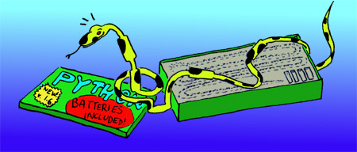

# Pokročilí 1: Úvod do predmetu, premenné, vstup a výstup

Na tomto voliteľnom predmete budeme preberať pokročilejšie témy z oblasti objektovo orientovaného programovania. Pôjdeme viac do hĺbky a ukážeme si pokročilejšie nástroje používané pri vývoji softvéru. Takisto si ukážeme viacero praktických aplikačných využití.

Hlavným programovacím jazykom, ktorý budeme na tomto predmete používať je Python. Nakoľko ste s týmto jazykom už pracovali, očakávame od vás, že v ňom viete už ako tak programovať. V každom prípade prvé cvičenia budú venované opakovaniu.

Požiadavky na softvér a počítač sú podobné ako na klasických cvičeniach z predmetu objektovo orientované programovanie. V tomto predmete budete navyše potrebovať mať nainštalovaný programovací jazyk Python a IDE.

*[OS]: Operačný systém

## Jazyk Python

<div class="md-has-sidebar" markdown>
  <main markdown>
{align=left width=100}
Python je interpretovaný programovací jazyk na všeobecné použitie. Patrí medzi najpopulárnejšie programovacie jazyky a je hojne používaný v oblasti umelej inteligencie, strojového učenia a dátovej analýzy. Názov jazyka bol inšpirovaný populárnymi britskými komikmi [Monty Python](https://www.youtube.com/watch?v=YI8yGeaPm1U). Má dynamickú kontrolu typov a podporuje viacero programovacích paradigiem. 

{align=right width=300}
Snaží sa o jednoduchú syntax, aby s jazykom vedel pracovať aj nováčik resp. aby jazyk pre svoje potreby vedeli používať aj ne-programátori. Python v sebe obsahuje všetko, čo k základnému programovaniu potrebujete. Nemusíte tak hľadať a inštalovať nejakú knižnicu. Tento prístup je reprezentovaný jeho mottom *"Batteries included"*.
  </main>
  <aside markdown>
Základná filozofia jazyka Python je zhrnutá v 19 dizajnových princípoch nazývaných [Zen of Python](https://pep20.org).
  </aside>
</div>

Python si nainštalujte z jeho oficiálnej stránky [https://www.python.org/downloads/](https://www.python.org/downloads/). Najnovšia verzia jazyka Python je verzia 3.14. **Pri inštalácii v OS Windows zaškrtnite možnosť `Add python.exe to PATH`.** Po úspešnej inštalácii si funkčnosť overte tak, že si otvorte nové okno konzoly a v príkazovom riadku spusťte príkaz `python --version`.

=== "Zistenie verzie Pythonu"

    ```
    ~$ python --version
    Python 3.14.7
    ```

### Semantic versioning

Populárnym spôsobom v programovaní, ako označovať nové verzie softvéru a knižníc je použitie tzv. [sémantického verzionovania](https://semver.org/lang/sk/). Príklad sémantickej verzie je 2.1.4. Ide o číslovanie verzií programu vo formáte MAJOR.MINOR.PATCH, kde zväčšujeme číslo:

* MAJOR verzie, keď sme spravili zmeny, ktoré nie sú spätne kompatibilné,
* MINOR verzie, keď sme pridali funkcionalitu so zachovaním spätnej kompatibility,
* PATCH verzie, keď sme opravili chyby a ostala zachovaná spätná kompatibilita.

<div class="md-has-sidebar" markdown>
  <main markdown>
Ak sa teda objaví program s novou MAJOR verziou, takmer isto nebude kompatibilný so staršími verziami. Nová verzia MINOR alebo PATCH by mala fungovať aj so staršími súbormi. Väčšina knižníc a nástrojov v jazyku Python, Java alebo Javascript používa tento spôsob verzionovania.

!!! warning "Jazyk Python sémantické verzionovanie iba predstiera"

    Jazyk Python samotný má čísla verzií veľmi podobné sémantickému, avšak sémantické verzionovanie často porušuje. Za jeho históriu sa stalo niekoľkokrát, že aj nová MINOR verzia priniesla zmeny, ktoré neboli kompatibilné so staršími verziami. Preto si treba dávať pozor, ak aktualizujete verziu jazyka a prečítať si dokumentáciu, či náhodou nebude treba váš program upraviť, aby mohol na novšej verzii jazyka bežať.

  </main>
  <aside markdown>
Inou populárnou formou tvorenia verzií je [Kalendárové verzionovanie, tzv. CalVer](https://calver.org/), pri ktorom sa verzia softvéru odvodzuje od roka a mesiaca, v ktorom bola verzia vydaná. Známym príkladom použitia takého spôsobu je IDE Pycharm alebo IntelliJ IDEA, ktoré má verziu napr. 2026.2.1
  </aside>
</div>
