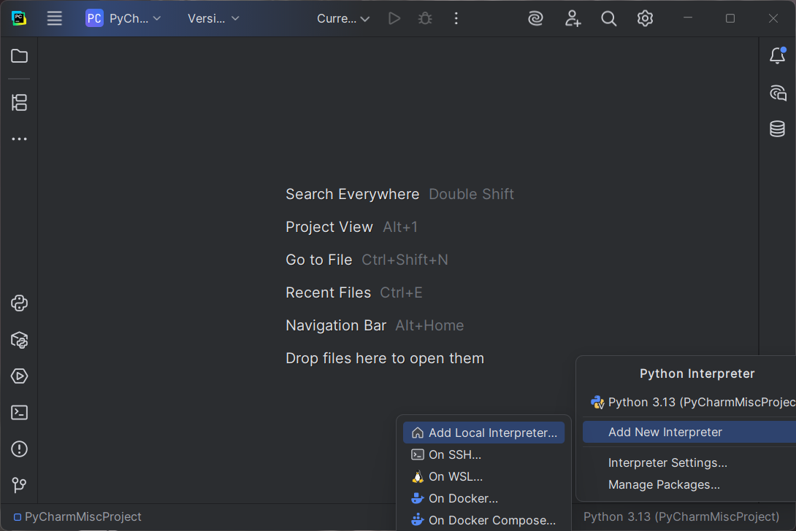
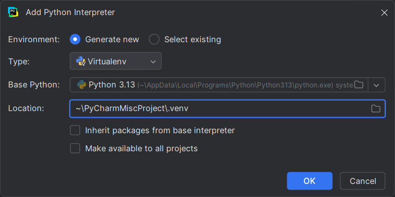
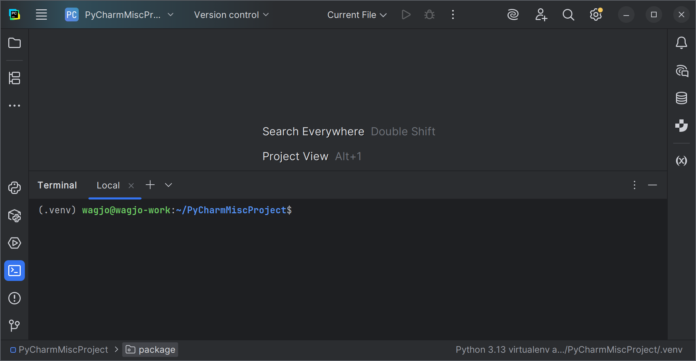

# Pokročílí 5: Správa knižníc

V programovaní pod pojmom knižnica rozumieme sadu funkcií a tried, ktoré riešia nejakú špecifickú úlohu a vieme ich použiť vo svojich programoch. Python poskytuje bohatú štadardnú knižnicu, v ktorej máme k dispozícii množstvo modulov s užitočnými funkciami.

Pri programovaní však nie sme odkázaní iba na štandardnú knižnicu, ale vieme si stiahnuť a použiť tisíce knižníc, ktoré vytvorili iní programátori. Python nám poskytuje rôzne nástroje na správu, používanie a aj vytváranie takýchto knižníc. Dnes sa im povenujeme bližšie.

## Správa distribučných balíkov pomocou `pip`

`pip` je najpopulárnejší nástroj na spravovanie knižníc v Pythone. Tento nástroj sa nainštaluje automaticky spolu s Pythonom, preto ho má každý používateľ Pythonu k dispozícii.

Knižnica spravovaná pomocou `pip` sa anglicky volá *distribution package*, teda distribučný balík, ale ide o iný druh "balíka", ako sme si vysvetľovali minule keď sme preberali `import` balíkov. Preto `pip` "distribučné balíky" budeme ďalej niekedy nazývať jednoducho *knižnice*.

Distribučné balíky v `pip` majú svoje jedinečné meno a obsahujú ľubovoľný počet balíkov a modulov, ktoré po nainštalovaní budeme mať k dispozícii. Okrem mena má každá knižnica aj svoju verziu. Väčšina `pip` knižníc používa sémantické verzionovanie.

Nástroj `pip` sa používa z príkazového riadku. Ak chceme zistiť, aké `pip` distribučné balíky máme vo svojom počítači nainštalované, použijeme na to príkaz `pip list`. Program nám do konzoly vypíše všetky nainštalované knižnice a aj ktorú verziu máme nainštalovanú.

<div class="md-has-sidebar" markdown>
<main markdown>

Inštaláciu knižnice vykonáme pomocou príkazu `pip install <nazov>`. Existuje napríklad populárna knižnica na vytvorenie webového servera s názvom Flask. Do svojho počítača ju vieme nainštalovať pomocou príkazu `pip install flask`, ktorý spustíme z príkazového riadku.

 </main>
  <aside markdown>
Knižnicu odinštalujeme príkazom `pip uninstall <nazov>`.
  </aside>
</div>

!!! info "Inštalácia konkrétnej verzie knižnice"

    Niekedy je potrebné mať nainštalovanú nie najnovšiu, ale nejakú konkrétnu verziu knižnice. Verziu vieme špecifikovať pri inštalácii a to pomocou `pip install <nazov>==<verzia>`, teda napr.`pip install flask==3.0.1`

<div class="md-has-sidebar" markdown>
<main markdown>

Ak na svojom počítači už máme knižnicu nainštalovanú, ale medzitým vyšla nová verzia, je potrebné knižnicu aktualizovať. To vieme urobiť pomocou príkazu `pip install --upgrade <nazov>`.

**`pip` knižnice sa v Pythone inštalujú globálne**, teda nainštalujem ju raz a môžem ju používať vo všetkých svojich Python programoch. Toto je niekedy zdroj nepríjemných problémov, keď máme 2 python programy, ktoré potrebujú tú istú knižnicu, ale rozdielne verzie. Ešte raz, knižnice sa v Pythone inštalujú do celého systému, ich inštalácia nie je obmedzená iba pre daný Python projekt. Nemôžeme mať naraz nainštalované 2 verzie tej istej knižnice.

Na vyriešenie tohto problému sa v Pythone používa virtuálne prostredie, anglicky virtual environment.

 </main>
  <aside markdown>

!!! info "Moderné nástroje na správu knižníc"

    Modernou alternatívou k `pip` je nástroj [`uv`](https://docs.astral.sh/uv/), ktorý nahrádza `pip` a aj ďalšie iné Python nástroje. Oproti `pip` je 10-100x rýchlejší a ponpka viac funkcionalít
</aside>
</div>

## Virtuálne prostredie `.venv`

Virtuálne prostredie v Pythone poskytuje izolovaný priestor pre programátorov, v ktorom majú vlastnú sadu knižníc a vlastnú verziu jazyka Python. Knižnice nainštalované pomocou `pip` v rámci jedného virtuálneho prostredia neovplyvňujú iné virtuálne prostredia a nie sú viditeľné ani zo systému.

Virtuálne prostredie má na disku svoj vlastný adresár, do ktorého ukladá svoje nastavenia a nainštalované distribučné balíky. Väčšinou je tento adresár umiestnený v adresári daného Python projektu a jeho názov je `.venv`.

!!! info "Správa virtuálneho prostredie cez príkazový riadok"

    Ak používame príkazový riadok, tak s virtuálnym prostredím vieme pracovať nasledovne.

    - Virtuálne prostredie pred prvým použitím vytvoríme pomocou príkazu `python -m venv .venv`, ktorý vytvorí virtuálne prostredie do adresára `.venv`
    - Aktivujeme virtuálne prostredie pomocou príkazu `.venv\scripts\activate` 
    - Vo vnútri virtuálneho prostredia mám zmenený príkazový riadok, na ktorého začiatku mi bude ukazovať `(.venv)`
    - Po skončení práce s virtuálnym prostredím ho ukončím pomocou príkazu `deactivate`

Vývojové prostredie PyCharm vie spravovať a používať virtuálne prostredia a štandardne vám ho aj vytvorí pre každý váš projekt. Ak ho chcete znovu vytvoriť, stačí zmazať adresár `.venv` vo vašom projekte a potom kliknutím na menu vpravo dole si viete vytvoriť nové virtuálne prostredie.

{.on-glb}
/// caption
Vytvorenie virtuálneho prostredia pomocou možnosti `Add new interpreter`
///

{.on-glb}
/// caption
Vytvorenie nového virtuálneho prostredia z existujúceho Pythonu
///

To, či náš projekt máme spustený vo virtuálnom prostredí si vieme overiť tak, že si v Pythone otvoríme terminál, pomocou ikonky vľavo dole, alebo pomocou kláves ++"Alt"+"F12"++. Príkazový riadok v tomto termináli musí začínať značkou virtuálneho prostredia `(.venv)`

{.on-glb}
/// caption
Virtuálne prostredie je aktívne, príkazový riadok začína textom `(.venv)`
///

Ak v tomto termináli teraz nainštalujeme nejakú knižnicu pomocou príkazu `pip install`, tak bude viditeľná iba v rámci tohto virtuálneho prostredia. Tak isto príkaz `pip list` bude ukazovať iba knižnice nainštalované do tohto virtuálneho prostredia.

## Verejný repozitár balíkov `PyPI.org`

Všetky knižnice, ktoré si vieme stiahnuť a používať pomocou nástroja `pip` sú zverejnené vo verejnom repozitári Python Package Index (PyPI) na adrese [https://pypi.org](https://pypi.org). Pomocou tejto stránky vieme knižnice vyhľadávať a prečítať si ich dokumentáciu. Napríklad vyššie spomínaná knižnica Flask má svoju stránku na [https://pypi.org/project/Flask/](https://pypi.org/project/Flask/)

Do repozitára PyPI si vieme zadarmo uložiť aj svoje vlastné knižnice alebo celé Python programy. Musia byť licencované Open Source licenciou a nesmú byť príliš veľké. Jediné čo treba urobiť je zaregistrovať sa na ich stránke a vygenerovať si API token, pomocou ktorého budete vedieť nahrať váš distribučný balíček do repozitára.

## Správa závislostí pomocou `requirements.txt`

Táto sekcia popisuje starší (ale stále často používaný) spôsob správy projektových závislostí. Moderný spôsob si uvedieme v ďalšej sekcii.

<div class="md-has-sidebar" markdown>
<main markdown>

Keď používame nejakú knižnicu v našom Python programe, musíme ju mať nainštalovanú pomocou `pip` nástroja. Ak vytvárame projekt, ktorý má používať niekto iný, tak ten človek si po stiahnutí nášho projektu musí všetky tieto knižnice nainštalovať. Aby sme mu nemuseli hovoriť, ktorú knižnicu a v akej verzii si musí nainštalovať, tak v Pythone existuje dohoda, že názvy všetkých knižníc, ktoré náš projekt potrebuje, sa dajú do súbora `requirements.txt`. Tento súbor sa umiestni do nášho projektu a ktokoľvek bude chcieť náš projekt používať, bude mať prehľad o požiadavkách nášho projektu na cudzie knižnice.

Súbor `requirements.txt` je obyčajný textový subor, do ktorého na samostatné riadky uvedieme názvy knižníc, ktoré náš projekt vyžaduje.

 </main>
  <aside markdown>
Vygenerovať súbor so závislosťami si vieme aj automaticky pomocou príkazu **`pip freeze > requirements.txt`**. Tento príkaz nám vloží do súboru závislosti na všetky aktuálne nainštalované knižnice a uvedie aj ich konkrétnu verziu. Súbor následne môžeme ďalej manuálne upraviť a spresniť naše závislosti.
  </aside>
  </div>

=== "Ukážka súboru `requirements.txt`"

    ```
    blinker==1.9.0
    click>=8.3.0
    Flask~=3.1.2
    itsdangerous<=2.2.0
    MarkupSafe
    Jinja2>3.1.6
    ```

Ak má projekt takýto súbor, potom všetky jeho **závislosti vieme nainštalovať jedným príkazom `pip install -r requirements.txt`**

V súbore `requirements.txt` vidíme, že verzie vieme písať rôznymi spôsobmi. Ak verziu distribučného balíka neuvedieme, nainštaluje sa najnovšia verzia. Pomocou operátora `==` nainštalujeme konkrétnu verziu, a pomocou operátorov `>=`, `<=`, `>` a `<` vieme uviesť, aké verzie vyžadujeme. Operátor `~=` bude akceptovať iba kompatibilné verzie podľa sémentického verzionovania, napr. `~=2.2` bude akceptovať verzie `2.2.1`, `2.2.9`, `2.3`, ale nie `2.1` alebo `3.0`.

!!! abstract "Dokumentácia"

    Kompletný popis rôznych možností deklarovania závislostí a ich verzií môžeme nájsť v [dokumentácii špecifikácie verzií distribučných balíkov Pythonu](https://packaging.python.org/en/latest/specifications/version-specifiers/#id5)


## Konfigurácia projektu pomocou `pyproject.toml`

Súbor `requirements.txt` nám umožňuje uviesť závislosti, nič viac. Na detailnejšiu konfiguráciu Python projektov slúži súbor `pyproject.toml`. Poskytuje modernejšiu alternatívu k suboru `requirements.txt` a viem do neho dať všetky nastavenia môjho projektu.

V súbore `pyproject.toml` musím uviesť minimálne názov môjho projektu a verziu. Všetky ostatné nastavenia sú voliteľné. Závislosti na knižniciach uvádzam do atribútu `dependencies`.

=== "Príklad súboru `pyproject.toml`"

    ```toml
    [project]
    name = "moj-projekt"
    version = "0.0.1"
    dependencies = [
        "flask",
        "ascii-announcers==0.0.2"
    ]
    ```

**Ak uvediem závislosti (dependencies) v súbore `pyproject.toml`, súbor `requirements.txt` nepotrebujem**

Súbor `pyproject.toml` umiestňujeme do adresára s projektom. Všetky zdrojové moduly a balíky odporúčame dať to adresára `src`, podľa konvencie [src layout](https://packaging.python.org/en/latest/discussions/src-layout-vs-flat-layout/)

V PyCharm vieme potom adresár `src` označiť ako zdrojový tak, že na neho klikneme pravým tlačítkom a vyberieme `Mark Directory as -> Sources root`.

Takto vytvorený projekt potom vieme lokálne nainštalovať príkazom `pip install -e .`, ktorý spustím vo virtuálnom prostredí, napríklad pomocou terminálu v PyCharme. Tým sa nainštalujú všetky závislosti zo súboru `pyproject.toml` a naviac budeme mať lokálne k dispozícii všetky balíky a moduly z adresára `src`, takže ich budeme vedieť spúšťať pomocou príkazu `python -m balik.modul`


## Úlohy na precvičenie

!!! example "Úloha 5.1: Základný projekt"

    1. Vytvorte v PyCharm nový projekt s názvom "cowsay", tak aby mal virtuálne prostredie
    1. Vytvorte v ňom súbor `pyproject.toml` s nasledovným obsahom
    ```toml
    [project]
    name = "cowsay"
    version = "0.0.1"
    dependencies = [
        "colored",
        "ascii-announcers==0.0.2"
    ]
    ```
    1. Vytvorte nasledovné adresáre a súbory
    ```
    src
     └── cowsay
           └── __init__.py
           └── __main__.py
    ```
    1. Adresár `src` v PyCharme označte ako "Sources root"
    1. V súbore `__main__.py` napíšte jednoduchý Hello World
    ```
    print("Hello World!")
    ```
    1. V terminály lokálne nainštalujte tento projekt pomocou `pip install -e .`
    1. Projekt spustite pomocou `python -m cowsay`

!!! example "Úloha 5.2: Farebný výpis argumentov"

    Upravte projekt z úlohy 5.1 nasledovne.

    - prečítajte vstupné argumenty programu pomocou premennej `sys.argv` a vypíšte prvý argument na obrazovku. Príklad spustenia
    ```python
    python -m cowsay "Hello there!"
    ```
    - použite knižnicu `colored` na zmenu farby textu. Príklad
    ```python
    from colored import Style, fore

    color="red"
    print(fore(color) + "Hello World!" + Style.reset)
    ```

!!! example "Úloha 5.3: Zvieratko"

    Upravte projekt z úlohy 5.2 nasledovne

    - použite knižnicu `ascii-announcers` na zobrazenie ASCII zvieratka. Príklad
    ```python
    from ascii_announcers import announcers

    print(announcers.get("cow"))
    ```
    - Vypíšte farebný text z predchádzajúceho zadania a pod ním vykreslite zvieratko
    - Vyskúšajte iné zvieratká, ktoré sú uložené v premennej `announcers`

!!! example "Úloha 5.4: Orámovaný text"

    Upravte projekt z úlohy 5.3 nasledovne
    
    - Použite knižnicu `textwrap` na zalomenie textu do viacerých riadkov
    - Orámujte text, ktorý vypisujete
    - Vyskúšajte použiť farby

    Príklad výstupu:
    ```
     ________________________________ 
    / Hello there! I hope you have a \
    \      nice day today sir!       /
     -------------------------------- 
    ```

!!! example "Úloha 5.5: Cowsay"

    Upravte projekt z úlohy 5.4 nasledovne

    - Zo zvieratka nakreslite čiaru ku rámčeku, aby bolo jasné, že to hovorí zvieratko. Príklad:
    ```
     ________________________________ 
    / Hello there! I hope you have a \
    \      nice day today sir!       /
     -------------------------------- 
       \  ^__^
        \ (oo)\_______
          (__)\       )\/\
              ||----w |
              ||     ||
    ```
    - Urobte to tak, aby to fungovalo s akýmkoľvek zvieratkom


## Zhrnutie cvičenia

- [x] `pip` je nástroj na spravovanie distribučných balíkov
    * [ ] `pip` knižnice sa v Pythone inštalujú globálne
    * [ ] Nemôžeme mať naraz nainštalované 2 verzie tej istej knižnice
    * [ ] `pip list` - zoznam nainštalovaných knižníc
    * [ ] `pip install <nazov>` - nainštalovanie najnovšej verzie knižnice
    * [ ] `pip install <nazov>==<verzia>` - nainštalovanie konkrétnej verzie knižnice
    * [ ] `pip install --upgrage <nazov>` - aktualizácia knižnice
    * [ ] `pip uninstall <nazov>` - odinštalovanie knižnice
- [x] Virtuálne prostredie `.venv`
    * [ ] Izolovaný priestor pre programátorov, ktorý má vlastnú sadu knižníc a vlastnú verziu jazyka Python
    * [ ] Knižnice z jedného virtuálneho prostredia neovplyvňujú iné virtuálne prostredia a nie sú viditeľné ani zo systému.
    * [ ] Virtuálne prostredie potrebuje svoj vlastný adresár, väčšinou je to `.venv`
- [x] Verejný repozitár balíkov PyPI.org
    * [ ] Python Package Index (PyPI) na adrese https://pypi.org
    * [ ] `pip` balíky sa sťahujú práve z tohto repozitára
    * [ ] Do repozitára PyPI si vieme zadarmo uložiť aj svoje vlastné knižnice alebo celé Python programy
- [x] Správa závislostí pomocou requirements.txt
    * [ ] Starý spôsob
    * [ ] Textový súbor `requirements.txt` na samostatných riadkoch obsahuje názvy knižníc, ktoré náš projekt vyžaduje.
    * [ ] Ak má projekt takýto súbor, potom všetky jeho závislosti vieme nainštalovať jedným príkazom `pip install -r requirements.txt`
    * [ ] Okrem názvu vieme uviesť, akú verziu potrebujeme. Vieme na to použiť operátory `==`, `~=`, `>`, `>=`, `<`, `<=` a iné
- [x] Konfigurácia projektu pomocou pyproject.toml
    * [ ] Moderný spôsob
    * [ ] V súbore `pyproject.toml` musím uviesť minimálne názov môjho projektu a verziu.
    * [ ] Závislosti na knižniciach uvádzam do atribútu `dependencies`
    * [ ] Ak uvediem závislosti (dependencies) v súbore `pyproject.toml`, súbor `requirements.txt` nepotrebujem
    * [ ] Súbor pyproject.toml umiestňujeme do adresára s projektom. Všetky zdrojové moduly a balíky odporúčame dať to adresára `src`
    * [ ] Projekt viem lokálne nainštalovať príkazom `pip install -e .`
    * [ ] Projekt budem vedieť spúšťať pomocou príkazu `python -m balik.modul`


!!! note "Poznámky do zošita"
    V zošite je potrebné mať napísané aspoň tieto poznámky:

    ```
    PIP

    pip je nástroj na spravovanie distribučných balíkov
    pip knižnice sa v Pythone inštalujú globálne
    Nemôžeme mať naraz nainštalované 2 verzie tej istej knižnice

    pip list
    pip install
    pip install --upgrade

    VIRTUÁLNE PROSTREDIE

    Izolovaný priestor, ktorý má vlastnú sadu knižníc
    Knižnice z jedného virtuálneho prostredia neovplyvňujú iné virtuálne prostredia
    a nie sú viditeľné ani zo systému.
    Virtuálne prostredie potrebuje svoj vlastný adresár, väčšinou je to .venv

    PYPI.ORG

    Python Package Index (PyPI) na adrese https://pypi.org
    pip balíky sa sťahujú práve z tohto repozitára
    Viem v ňom zverejniť zadarmo aj svoje balíky

    requirements.txt

    Starý spôsob písania závislostí, do textového súboru
    Okrem názvu knižnice vieme uviesť verziu.
    Vieme na to použiť operátory ==, ~=, >, >=, <, <= a iné
    Ak mám súbor requirements.txt, závislosti nainštalujem pomocou pip install -r requirements.txt

    pyproject.toml

    Moderný spôsob konfigurácie projektu
    V súbore musím uviesť minimálne názov môjho projektu a verziu.
    Závislosti na knižniciach uvádzam do atribútu dependencies
    Lokálne nainštalujem príkazom pip install -e .
    ```

!!! warning "Skúšanie a kontrola vedomostí"

    Okruhy otázok na test:

    - Čo je nástroj pip, ako sa používa
    - Čo je virtuálne prostredie v Pythone, na čo sa používa
    - Stránka pypi.org, na čo slúži
    - Súbor requirements.txt, na čo slúži
    - Ako sa píšu závislosti na knižniciach
    - Ako nainštalujem závislosti zo súboru requirements.txt
    - pyproject.toml, na čo slúži, aké má minimálne atribúty
    - Ako zapíšem závislosti do súboru pyproject.toml
    - Ako nainštalujem lokálne projekt, ktorý má pyproject.toml
