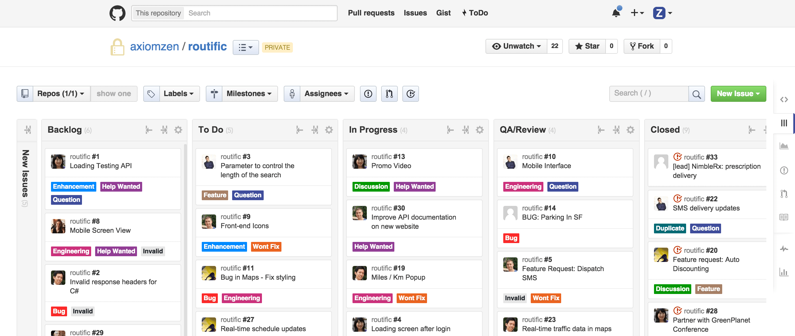

# Pokročílí 6: Agilný vývoj, verziovacie systémy, správa vývoja

Ak softvér vyvíja tím ľudí, dohodnú sa na spôsobe spolupráce aby si navzájom rozumeli a nevznikal chaos. Metódy a princípy pri tvorbe softvéru sa s rokmi menili. V súčasnosti je zaužívaný tzv. agilný prístup k vývoju softvéru. Dnes si ho bližšie priblížime.

## Agilný vývoj

<div class="md-has-sidebar" markdown>
<main markdown>

Agilný vývoj softvéru vznikol ako reakcia programátorov na skostnatelé metodiky v korporáciách. S touto filozofiou prišli samotní programátori a zo začiatku boli agilné princípy oslobodzujúce, prinášali viac kreativity a flexibility. Ako na agilné princípy postupne prechádzali veľké firmy a korporácie, stali sa hlavným prístupom vývoja softvéru. Urobil sa z toho však veľký biznis a agilné metodiky sa začali príliš formalizovať, stali sa povrchnými rituálmi a prestali plniť svoju pôvodnú funkciu. Takýmto iba naoko agilným metodikám sa hovorí Agilné divadlo, anglicky *Agile theater*. 

!!! tip "Učím sa s pomocou umelej inteligencie"

    [Kritický pohľad na históriu agilných metodík vývoja softvéru a aký je súčasný stav](https://grok.com/share/c2hhcmQtMg%3D%3D_b57203e2-b196-4e8c-b868-abef7380a961)

 </main>

  <aside markdown>
  Pred agilným prístupom bol v oblasti softvérového vývoja zaužívaný tzv. *waterfall model*, ktorý mal lineárny proces zberu požiadaviek, návrhu, implementácii, testovania a nasadenia. Kým sa však dostal do bodu nasadenia, jeho oneskorenie bolo často také veľké, že bol softvér nepoužiteľný. Požiadavky sa totiž v čase menia a konkurencieschopná firma musí vedieť reagovať na zmeny.  
</aside>
</div>


<div class="md-has-sidebar" markdown>
<main markdown>


Aj napriek súčasenému častému zneužívaniu agilných metodík v korporáciách a veľkých firmách majú tieto prístupy stále veľký prínos, samozrejme iba ak sa používajú správne. Základné princípy agilného vývoja sú vyjadrené v [Manifeste agilného vývoja softvéru](https://agilemanifesto.org/iso/sk/manifesto.html):

- **Ľudia a komunikácia** sú viac než procesy a nástroje
- **Funkčný softvér** je viac než vyčerpávajúca dokumentácia
- **Spolupráca so zákazníkom** je viac než dojednávanie zmluvy
- **Radšej reagovať na zmenu** než sa držať plánu.

*Aj keď časť napravo je dôležitá, viac si ceníme ľavú časť.*

 </main>

  <aside markdown>
Príkladom úspešného používania agilných prístupov vo veľkých korporáciách sú Tesla a SpaceX, firmy Elona Muska a firma Valve, ktorú vlastní Gabe Newell. Prečítajte si ich [príručku pre nových zamestnancov](https://www.valvesoftware.com/en/publications) 
  
{width=200}
  </aside>
</div>


<div class="md-has-sidebar" markdown>
<main markdown>

V centre agilného vývoja je teda flexibilita kvôli lepšiemu reagovaniu na zmeny na trhu a krátke iterácie kvôli lepšiemu pochopeniu potrebám zákazníkov. Tento prístup má však aj niekoľko podstatných nedostatkov, ktoré sa musíme snažiť pri svojej práci čo najviac eliminovať.

- **Nedostatok dokumentácie a plánovania**, dôsledkom častých zmien a rýchlej iterácii. Vedie k nedostatku štruktúry projektu a veľmi ťažkému prijímaniu nových ľudí (onboarding)
- Scope creep - **neustále pridávanie nových funkcionalít**. Zákazníci často sami nevedia, čo potrebujú. Bez jasnej vízie sa projekt rýchlo nafúkne
- **Prílišná byrokracia**, ceremónia a rituály - manažment zneužíva agilné postupy na tvorbu výkonnostných metrík a deadline-ov 

Väčšina z nedostatkov agilného prístupu sa dá eliminovať, ak má projekt **jasnú víziu**, **lídra** a ľudia v tíme majú **možnosť vlastniť** (anglicky own) nejakú časť projektu, teda mať **autonómiu**, **možnosť rozhodovať** ale aj **byť zodpovedný** sa nejakú konkrétnu časť.

 </main>

  <aside markdown>
Pri vyzretejších a stabilnejších projektoch sa v súčasnosti používajú hybridné prístupy, kombinujúce agilnú metodiku s waterfall modelom. Pre nové startupové a výskumné projekty sú však správne agilné prístupy stále tou najlepšou alternatívou.
</aside>
</div>

Programovací jazyk Python je svojou dynamickou povahou a veľkou open source komunitou veľmi vhodný na použitie agilných prístupov. Rýchlo sa v ňom tvoria a overujú nové nápady, má výbornú podporu pre automatizované testovanie a nástroje pre priebežné nasadzovanie softvéru.

V oblasti softvérového vývoja sa osvedčilo niekoľko nástrojov a techník, ktoré pomáhajú a uľahčujú používanie agilných prístupov.

### Kanban

Prvou technikou je **Kanban**, v ktorom si úlohy rozdelíme do rôznych stĺpcov, ktoré reprezentujú stav, v akom sa úloha nachádza. Tradičné kategórie sú *"Backlog"*, *"To Do"*, *"In development"*, *"QA"* a *"Done"*. Ako sa na úlohe postupne pracuje, tak sa úloha presúva medzi stĺpcami. Populárnymi nástrojmi pre Kanban sú nástroje GitHub Projects, Trello alebo Jira.

{.on-glb}
/// caption
Ukážka nástroja používajúceho Kanban
///


### Scrum

<div class="md-has-sidebar" markdown>
<main markdown>

Asi najpopulárnejšou sadou techník pri agilnom programovaní je **Scrum**, ktorý zavádza určité konkrétne roly a postupy v rámci tímu:

- **Sprint** - mesačné alebo dvojtýždňové iterácie návrhu, vývoja a vyhodnotenia
- **Daily Standup** - pravidelná krátka tímová porada
- **Product Owner** - človek zodpovedný za dodržanie vízie projektu
- **Scrum Master** - asistent, ktorý pomáha, aby v tíme fungovali agilné prístupy 

Nesprávne použitie techník Scrum však vedie k mikromanažmentu, plytvaniu času, frustrácii a vyhoreniu programátorov. Mnohí vývojári tvrdia, že Scrum premieňa skvelých developerov na priemerných a ignoruje individuálne silné stránky.

 </main>
  <aside markdown>

</aside>
</div>

Najpopulárnejším nástrojom pre podporu techník SCRUM je Jira, ktorá je však často príliš komplikovaná a práca v Jire zaberá veľa času a energie. Pre menšie tímy sú často vhodnejšie agilné nástroje platformy GitHub.

!!! tip "Učím sa s pomocou umelej inteligencie"

    Prečo sú [Scrum a techniky Extrémneho programovania často kontroverzné](https://grok.com/share/c2hhcmQtMg%3D%3D_4895e7b3-2a6b-428e-a467-7e32ed8df77e) pri ich použití v rámci agilného softvérového vývoja? Ako vieme eliminovať ich nevýhody? Vedela by metodológia Lean software development pomôcť?

### Ostatné techniky

<div class="md-has-sidebar" markdown>
<main markdown>

V rámci nasadenia agilných prístupov v softvérovom vývoji často používajú techniky tzv. extrémneho programovania. Ide hlavne o párové programovanie, a Test Driven Development, ktorý dáva dôraz na podrobné testovanie. Prínos týchto techník je však diskutabilný, nakoľko sú pomerne náročné na čas a energiu a tak ich použitie treba dobre zvážiť.

Oproti súčastným metodikám agilného vývoja pomocou techník Scrum sa hlavne v malých tímoch používa tzv. *Lean software development*. Lean software development je filozofia vývoja softvéru založená na princípoch štíhlej výroby, ktorá sa zameriava na maximalizáciu hodnoty pre zákazníka a minimalizáciu plytvania. Opiera sa o princípy ako rýchle doručovanie, spätnú väzbu, oddialenie rozhodnutí, rešpekt k ľuďom a optimalizáciu celého procesu.
 </main>

  <aside markdown>
  So zvačšujúcim sa využívaním umelej inteligencie pri návrhu a tvorbe softvéru sa menia aj techniky agilného programovania. Ak nám umelá inteligencia umožní mať menšie tímy ľudí, možno nebudeme potrebovať techniky ako Scrum ale agilné praktiky sa posunú viacej smerom k technikám *Lean software development*
</aside>
</div>

## Verziovacie systémy

Či už programujete sám alebo v rámci nejakého tímu, nástroje na správu verzií sú jedny z najdôležitejších nástrojov pri softvérovom vývoji. 

Verziovacie systémy (VCS – Version Control Systems) sú nástroje, ktoré umožňujú **sledovať zmeny v zdrojových súboroch** počas softvérového vývoja. Pomocou nich sa vieme **vrátiť k starším verziám**, sledovať kto čo zmenil, riešiť konflikty, a efektívne spolupracovať v tíme.

V súčasnosti sú populárne distribuovaný verziovacie systémy, kedy každý jeden programátor má na svojom počítači svoju **vlastnú kópiu projektu z celou jeho históriou**. Pomocou distribuovaných verziovacích systémov si programátori vedia tieto svoje jednotlivé kópie ľahko **synchronizovať a zdieľať**.

Vlastnosti distribuovaných VCS:

- **História zmien**, kedykoľvek sa viem vrátiť späť
- Nie je nutný server, celý repozitár mám na svojom počítači
- Vetvenie - **branching** - pre skúšanie nových vecí, experimentovanie a opravu bugov
- Zlučovanie - **merging** - zlúčenie zmien z iných vetiev alebo od iných ľudí
- Tagovanie - **tagging** - označenie konkrétnych bodov v histórii napr. verziou softvéru
- Distribuovaná spolupráca - zdieľanie súborov s inými

### git

{align=left width=200}

Najpopulárnejším nástrojom na správu verzií je **git**. Stal sa z neho de facto štandard verzionovania a budeme ho používať aj my. Práci s nástrojom git sa bližšie budeme venovať inokedy, nateraz si však tento nástroj nainštalujte do svojho počítača.

Do svojho počítača si zo stránky [https://git-scm.com/downloads](https://git-scm.com/downloads) stiahnite a nainštalujte git do svojho počítača. Pri inštalácii máte možnosť detailne nastaviť chovanie programu. Odporúčame **ponechať všetky nastavenia** na odporúčaných hodnotách.

Či máme git správne nainštalovaný zistíme cez príkazový riadok nasledovným spôsobom

=== "Zistenie verzii nástroja `git`"

    ```sh
    ~$ git --version
    git version 2.51.0
    ```

### GitHub

{align=left width=100}

Platforma GitHub poskytuje zdarma nástroje agilného programovania a umožňuje zdieľať git repozitár medzi viacerými vývojármi. Poskytuje tiež Kanban tabuľku, a issues na evidenciu bugov a featurov.

Vytvorte si konto na stránke [github.com](https://github.com) a cez edupage mi zašlite svoje užívateľské meno, aby som vás vedel pridať do projektov, na ktorých budeme pracovať.

GitHub nie je jediný nástroj na správu vývoja softvéru nad git repozitárom. Jeho hlavnou konkurenciou je [GitLab](https://gitlab.com), ktorý si vieme zadarmo nainštalovať ak máme svoj vlastný server.

## Správa vývoja

Okrem správy verzií máme k dispozícii aj iné nástroje na správu rôznych aspektov softvérového vývoja. 

Na *správu úloh a sprintov* v agilnom programovní vieme využiť Kanban tabuľku a správu ticketov a pull requestov na platforme GitHub. Pull requesty sú žiadosti o pridanie zmien do hlavného kódu, ktoré vieme vyhodnotiť a schváliť alebo odmietnuť. Tickety nám slúžia na evidenciu chýb a požiadaviek na nové funkcionality.

*Komunikácie v tíme* často prebieha online formou, a medzi nástroje na takúto komunikáciu patria Slack a Microsoft Teams.

<div class="md-has-sidebar" markdown>
<main markdown>

*Dokumentácia* sa zvykne často písať v textovom formáte a pridáva sa priamo ku zdrojovým súborom. Vie ju potom ľahko manažovať nástroj na správu verzií a tým sa ľahšie udržiava aktuálna. Populárny formát na písanie dokumentácie je syntax [Markdown](https://www.markdownguide.org/).

Pre písanie dokumentácie v Pythone sa však väčšinou používa syntax [reStructuredText](https://docutils.sourceforge.io/rst.html), ktorý je viac podporovaný dokumentačnými nástrojmi v Python ekosystéme.

 </main>

  <aside markdown>
Tieto učebné texty sú tak isto napísané pomocou Markdownu
</aside>
</div>

Aby sme vedeli čítať kód napísaný inými programátormi, je vhodné dodržiavať určité štandardy kvality. V Pythone sú tieto štandardy spísané v [príručke PEP 8 - Sprievodca štýlom](https://peps.python.org/pep-0008/). IDE PyCharm nás často automaticky upozorní, keď tieto štandardy nedodržiavame.

Medzi pokročilé nástroje správy vývoja softvéru patrí automatizované testovanie a nasadzovanie aplikácie, anglicky CI/CD, Continuous Integration/Continuous Deployment. V tomto nám tiež vie pomôcť GitHub so svojím GitHub Actions, alebo iné nástroje ako napríklad Jenkins a CircleCI. Testovanie v Pythone sa často realizuje pomocou nástroja [pytest](https://docs.pytest.org/en/stable/#).

## Zhrnutie cvičenia

- [x] Manifesto agilného vývoja softvéru
    - [ ] **Ľudia a komunikácia** sú viac než procesy a nástroje
    - [ ] **Funkčný softvér** je viac než vyčerpávajúca dokumentácia
    - [ ] **Spolupráca so zákazníkom** je viac než dojednávanie zmluvy
    - [ ] **Radšej reagovať na zmenu** než sa držať plánu.
- [x] Nevýhody agilného prístupu
    - [ ] Nedostatok dokumentácie a plánovania
    - [ ] Scope creep - neustále pridávanie nových funkcionalít
    - [ ] Prílišná byrokracia, ceremónia a rituály
- [x] Scrum pojmy
    - [ ] **Sprint** - mesačné alebo dvojtýždňové iterácie návrhu, vývoja a vyhodnotenia
    - [ ] **Daily Standup** - pravidelná krátka tímová porada
    - [ ] **Product Owner** - človek zodpovedný za dodržanie vízie projektu
    - [ ] **Scrum Master** - asistent, ktorý pomáha, aby v tíme fungovali agilné prístupy 
- [x] Verziovacie systémy (VCS – Version Control Systems) sú nástroje, ktoré umožňujú **sledovať zmeny v zdrojových súboroch** počas softvérového vývoja
    - [ ] **História zmien**, kedykoľvek sa viem vrátiť späť
    - [ ] Nie je nutný server, celý repozitár mám na svojom počítači
    - [ ] Vetvenie - **branching** - pre skúšanie nových vecí, experimentovanie a opravu bugov
    - [ ] Zlučovanie - **merging** - zlúčenie zmien z iných vetiev alebo od iných ľudí
    - [ ] Tagovanie - **tagging** - označenie konkrétnych bodov v histórii napr. verziou softvéru
    - [ ] Distribuovaná spolupráca - zdieľanie súborov s inými
- [x] **git** - najpopulárnejší nástroj na správu verzií
    - [ ] Stiahnuť a nainštalovať zo stránky [https://git-scm.com/downloads](https://git-scm.com/downloads)
- [x] **GitHub** - Platforma na správu softvérového vývoja a git repozitára
    - [ ] Vytvoriť si konto na [github.com](https://github.com) a zaslať mi vaše užívateľské meno
- [x] Ostatné nástroje na správu softvérového vývoja
    - [ ] Kanban - Rozdelenie úloh do stĺpcov podľa stavu - GitHub projects
    - [ ] Tickety a Pull requesty - GitHub
    - [ ] Virtuálna komunikácia pomocou Slack alebo Microsoft Teams
    - [ ] Dokumentácia pomocou textových súborov vo formáte MarkDown alebo reStructuredText - GitHub vie pekne zobraziť
    - [ ] Dodržiavanie štýlov programovania - PEP 8
    - [ ] CI/CD, Continuous Integration/Continuous Deployment pomocou GitHub Actions
    - [ ] Testovanie pomocou pytest - často súčasť CI/CD

!!! note "Poznámky do zošita"
    V zošite je potrebné mať napísané aspoň tieto poznámky:

    ```
    AGILNÝ VÝVOJ

    Manifesto agilného vývoja softvéru
    - Ľudia a komunikácia sú viac než procesy a nástroje
    - Funkčný softvér je viac než vyčerpávajúca dokumentácia
    - Spolupráca so zákazníkom je viac než dojednávanie zmluvy
    - Radšej reagovať na zmenu než sa držať plánu.

    Riziká
    Nedostatok dokumentácie a plánovania
    Scope creep - neustále pridávanie nových funkcionalít
    Prílišná byrokracia, ceremónia a rituály
    
    Scrum pojmy
    - Sprint - 1-4 týždňové opakovanie návrhu, vývoja a vyhodnotenia
    - Daily Standup - pravidelná krátka tímová porada
    - Product Owner - človek zodpovedný za dodržanie vízie projektu
    - Scrum Master - asistent, ktorý pomáha, aby v tíme fungovali agilné prístupy 

    Verziovacie systémy
    - História zmien
    - Celý repozitár na svojom počítači
    - Vetvenie - branching - experimentovanie a oprava bugov
    - Zlučovanie - merging - zakomponovanie zmien
    - Tagovanie - tagging - označenie bodov v histórii napr. verziou
    - Distribuovaná spolupráca - zdieľanie súborov s inými
    
    Kanban - Rozdelenie úloh do stĺpcov podľa stavu - GitHub projects
    Dokumentácia - formát MarkDown alebo reStructuredText
    Štýly programovania - PEP 8
    ```

!!! warning "Skúšanie a kontrola vedomostí"

    Do budúcej hodiny:

    - Nainštalovať si git na svojom počítačí
    - Vytvoriť si konto na GitHube a zaslať mi užívateľské meno

    Okruhy otázok na test:

    - Aké sú princípy agilného vývoja
    - Riziká agilného vývoja
    - Scrum pojmy
    - Vlastnosti verziovacích systémov
    - Čo je Kanban
