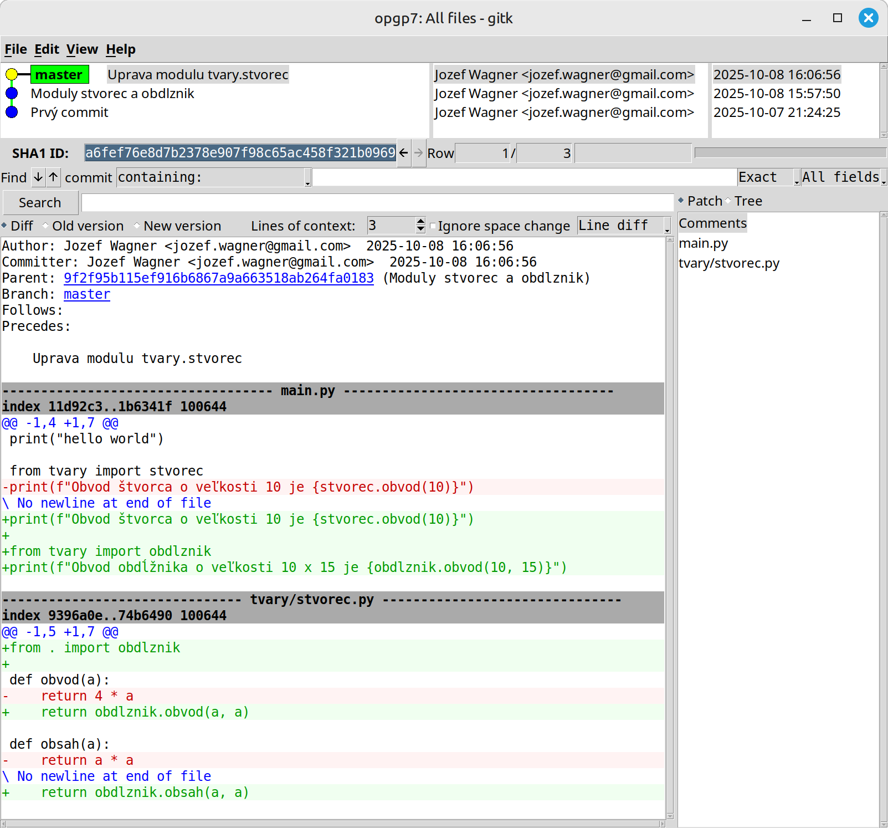
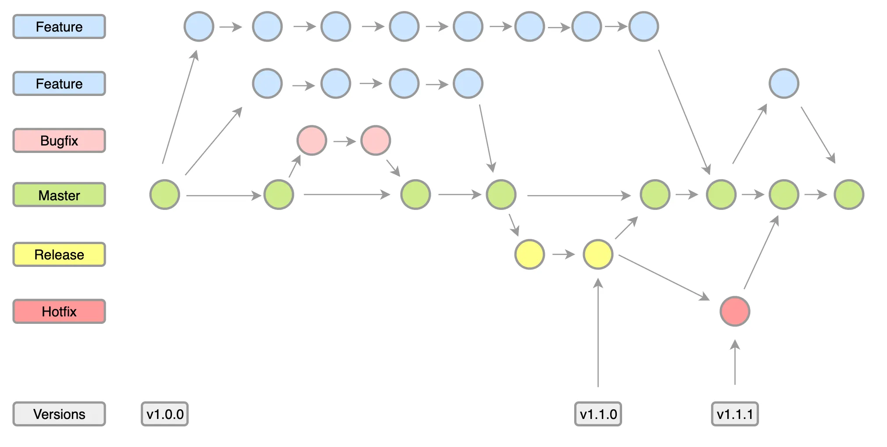
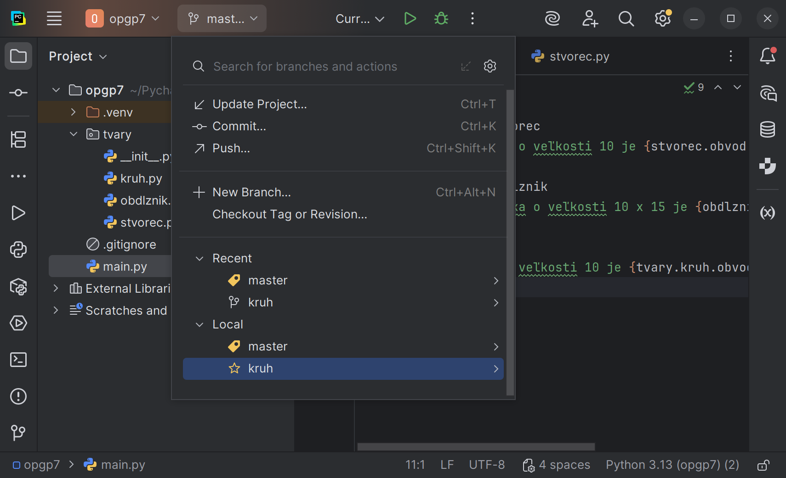
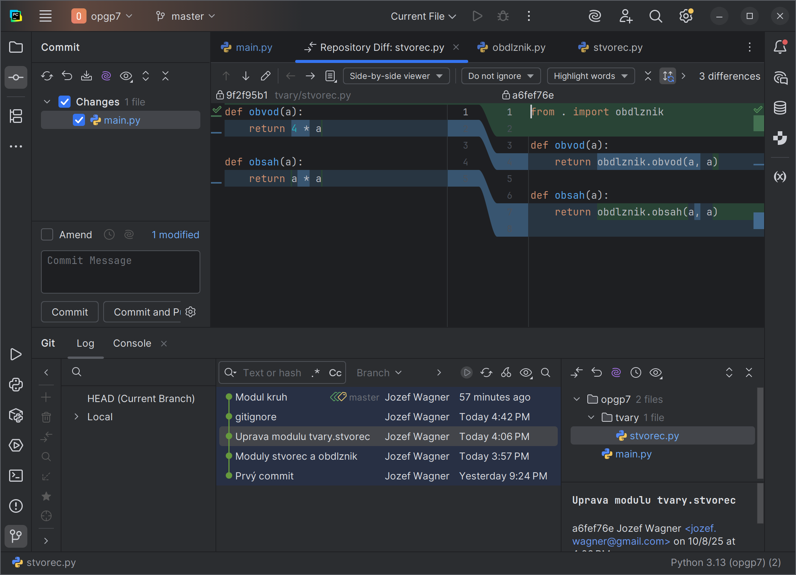

# Pokročílí 7: Verziovací nástroj git

Dnes sa naučíme pracovať s najpopulárnejším distribuovaným verziovacím nástrojom `git`. Najprv si ukážeme základné príkazy tohto nástroja a na konci cvičenia si vyskúšame, ako nástroj PyCharm integruje prácu s verziami v rámci svojho IDE.

## git

<div class="md-has-sidebar" markdown>
<main markdown>


Nástroj git je open source distribuovaný verziovací nástroj. Spravuje históriu vášho projektu a ukladá ju celú na vašom disku, takže na prácu s ním nie je potrebný žiaden server alebo internetové pripojenie.

git bol vytvorený Linusom Torvaldsom, známym fínskym programátorom, ktorý je aj tvorca operačného systému Linux. Názvom tohto nástroja (git je britská mierne vulgárna nadávka) chcel poukázať na svoju komplikovanú povahu.

Nástroj git si môžete stiahnuť a nainštalovať zo stránky [https://git-scm.com/](https://git-scm.com/).

Po úspešnej inštalácii je potrebné nakonfigurovať vaše meno a emailovú adresu pomocou príkazu `git config`.

!!! example "Úloha 7.1"

    V príkazovom riadku si nastavte vaše meno a e-mailovú adresu pomocou nasledovných príkazov

    ```sh
    git config --global user.name Janko Mrkvicka
    git config --global user.email janko.mrkvicka@gmail.com 
    ```


 </main>

  <aside markdown>
  Linus Torvalds [nie je spokojný](https://www.youtube.com/watch?v=iYWzMvlj2RQ), ako slabo Nvidia podporuje grafické karty v Linuxe


  Konfiguráciu nástroja git robíme pomocou príkazu <br>`git config`
</aside>
</div>

## Vytvorenie git repozitára

<div class="md-has-sidebar" markdown>
<main markdown>

Celá história vášho projektu sa ukladá do tzv. git repozitára. Štandardne je tento repozitár umiestnený v adresári vášho projektu v samostatnom podadresári s názvom `.git`.

Existujú 2 možnosti, ako vytvoriť git repozitár.

Ak mám projekt a chcem v ňom vytvoriť git repozitár, v adresári môjho projektu spustím príkaz `git init`. Tento príkaz nám vytvorí prázdny repozitár v našom projekte.

Druhá možnosť je, ak chceme stiahnuť projekt spolu s git repozitárom, ktorý je na nejakom serveri. Na to vieme použiť prízaz `git clone` a URL adresu repozitára, napr. `git clone https://github.com/wagjo/cowsay.git`. Tento príkaz nám vytvorí adresár s projektom a do neho umiestni aj git repozitár s kompletnou históriou.

!!! example "Úloha 7.2"

    1. V IDE PyCharm vytvorte nový projekt s názvom `opgp7`. 
    1. V tomto projekte vytvorte súbor `main.py` a v ňom príkaz `print("hello world")`
    1. Otvorte v PyCharme terminál a spustite v ňom príkaz `git init`
    1. Úspešné vytvorenie repozitára skontrolujte pomocou príkazu `git status`


 </main>

  <aside markdown>
  Repozitár vytvoríme pomocou príkazu <br>`git init`

  Existujúci repozitár stiahneme pomocou príkazu <br>`git clone <repo_url>`
</aside>
</div>

## Working tree a index/staging

<div class="md-has-sidebar" markdown>
<main markdown>

Všetky súbory, ktoré práve máme reálne na disku v našom projekte sa v gite volajú **working tree**. Ide o skutočné súbory na disku, s ktorými pracujeme, do ktorých píšeme kód programu alebo dokumentáciu.

git sleduje zmeny, ktoré v našich súboroch vytvárame, a umožňuje nám zapísať stav našich súborov do repozitára. Nakoľko nie všetky zmeny chceme zapísať do histórie, musíme vždy určiť, ktoré zmeny chceme zapísať. To sa robí pomocou príkazu `git add`. V tomto príkaze uvedieme, zmeny v ktorých súboroch sa majú zapísať. Ak chceme zapísať zmeny vo všetkých súboroch, použijeme príkaz `git add .`

!!! example "Úloha 7.3"

    V termináli spustite príkaz `git add .`, pridanie nových súborov overíme pomocou príkazu `git status`.

**Súbory pridané pomocou `git add` sa nám ešte nazapíšu do histórie**. Zmeny v týchto súboroch sa pridali do tzv. indexu, alebo "staging area", teda "javiskového priestoru". V tomto indexe si vieme postupne popridávať súbory a vytvoriť si tak sadu zmien, ktoré chceme zapísať do histórie.


 </main>

  <aside markdown>
  Do indexu pridáme zmeny pomocou príkazu <br>`git add`

  Stav repozitára zistíme príkazom <br>`git status`
</aside>
</div>


## Zápis zmien do repozitára

<div class="md-has-sidebar" markdown>
<main markdown>

Ak máme prichystané zmeny v indexe (staging area), vieme vytvoriť zápis zmien do repozitára. Robí sa tak pomocou príkazu `git commit`.

Zápis do repozitára nazývame jednoducho **commit**. Každý commit má tieto údaje:

- Samotné zmeny v súboroch nášho projektu
- Krátka správa s popisom, čoho sa zmena týka
- Dátum, kedy zápis zmien nastal
- Autora, ktorý zápis urobil
- unikátny identifikátor zmeny, nazývaný hash (napríklad `e3a1f5b7c2d4`)
- odkaz na predchádzajúci commit, aby sme vedeli vyskladať postupnosť zmien

Nakoľko je správa s popisom povinná, píše sa často rovno do príkazu ako `git commit -m "Krátky popis zmien"`

!!! example "Úloha 7.4"

    V termináli vykonajte zápis zmien pomocou `git commit -m "Prvý commit"`. Vykonanie zápisu si overíme pomocou príkazu `git log`. Overenie, že sa všetko pridalo vykonáme príkazom `git status`.


 </main>

  <aside markdown>
  Zápis sady zmien do repozitára urobíme príkazom <br>`git commit -m "popis zmien"`

  Zoznam posledných commitov vypíšeme pomocou príkazu <br>`git log`
</aside>
</div>

## Pridanie ďalších commitov

Teraz si vyskúšame urobiť zopár ďalších commitov

!!! example "Úloha 7.5"

    1. V projekte si vytvorte balík `tvary` a v ňom 2 súbory s nasledovným obsahom

        ```python title="tvary/obdlznik.py"
        def obvod(a, b):
            return (2 * a) + (2 * b)

        def obsah(a, b):
            return a * b
        ```

        ```python title="tvary/stvorec.py"
        def obvod(a):
            return 4 * a

        def obsah(a):
            return a * a
        ```

    1. Do súboru main.py pridajte nasledujúci kód:

        ```python title="main.py"
        from tvary import stvorec
        print(f"Obvod štvorca o veľkosti 10 je {stvorec.obvod(10)}")
        ```

    1. Vykonané zmeny pridajte do indexu pomocou `git add .`, ktorý spustíte v terminály nástroja PyCharm

    1. Pridanie si overte pomocou príkazu `git status`. Mal by vypísať niečo také:

        ```git
        On branch master
        Changes to be committed:
        (use "git restore --staged <file>..." to unstage)
            modified:   main.py
            new file:   tvary/__init__.py
            new file:   tvary/obdlznik.py
            new file:   tvary/stvorec.py
        ```

    1. Vytvorenie commitu a zápis zmien vykonajte pomocou príkazu `git commit -m "Moduly stvorec a obdlznik"`

<div class="md-has-sidebar" markdown>
<main markdown>

!!! example "Úloha 7.6"

    1. Urobte zmeny v nasledovnom súbore:

        ```python title="tvary/stvorec.py"
        from . import obdlznik
        
        def obvod(a):
            return obdlznik.obvod(a, a)

        def obsah(a):
            return obdlznik.obsah(a, a)
        ```

    1. Pridajte do súboru `main.py` nasledovný kód

        ```python title="main.py"
        from tvary import obdlznik
        print(f"Obvod obdĺžnika o veľkosti 10 x 15 je {obdlznik.obvod(10, 15)}")
        ```

    1. Príkazom `git status` zisite, ktoré súbory sú zmenené

        ```git
        On branch master
        Changes not staged for commit:
        (use "git add <file>..." to update what will be committed)
        (use "git restore <file>..." to discard changes in working directory)
                modified:   main.py
                modified:   tvary/stvorec.py

        no changes added to commit (use "git add" and/or "git commit -a")
        ```

    1. Príkazom `git diff` zistíme presne, ktoré zmeny v súboroch nastali

        ```diff
        diff --git a/main.py b/main.py
        index 11d92c3..1b6341f 100644
        --- a/main.py
        +++ b/main.py
        @@ -1,4 +1,7 @@
        print("hello world")
        
        from tvary import stvorec
        -print(f"Obvod štvorca o veľkosti 10 je {stvorec.obvod(10)}")
        \ No newline at end of file
        +print(f"Obvod štvorca o veľkosti 10 je {stvorec.obvod(10)}")
        +
        +from tvary import obdlznik
        +print(f"Obvod obdĺžnika o veľkosti 10 x 15 je {obdlznik.obvod(10, 15)}")
        diff --git a/tvary/stvorec.py b/tvary/stvorec.py
        index 9396a0e..74b6490 100644
        --- a/tvary/stvorec.py
        +++ b/tvary/stvorec.py
        @@ -1,5 +1,7 @@
        +from . import obdlznik
        +
        def obvod(a):
        -    return 4 * a
        +    return obdlznik.obvod(a, a)
        
        def obsah(a):
        -    return a * a
        \ No newline at end of file
        +    return obdlznik.obsah(a, a)
        ```

     1. Vykonané zmeny pridajte do indexu pomocou `git add .`

     1. Vytvorenie commitu a zápis zmien vykonajte pomocou príkazu `git commit -m "Uprava modulu tvary.stvorec"`

</main>

  <aside markdown>
  Prehľad zmien, ktoré neboli pridané do indexu si vieme zobraziť pomocou <br>`git diff`

  GUI nástroj na prehľad zmien a histórie spustíme príkazom `gitk`
</aside>
</div>


V našom repozitári teraz máme 3 commity. Ich zoznam si môžeme zobraziť pomocou príkazu `git log`

```git
commit a6fef76e8d7b2378e907f98c65ac458f321b0969 (HEAD -> master)
Author: Jozef Wagner <jozef.wagner@gmail.com>
Date:   Wed Oct 8 16:06:56 2025 +0200

    Uprava modulu tvary.stvorec

commit 9f2f95b115ef916b6867a9a663518ab264fa0183
Author: Jozef Wagner <jozef.wagner@gmail.com>
Date:   Wed Oct 8 15:57:50 2025 +0200

    Moduly stvorec a obdlznik

commit 64ea0e111f59922819e46632062d069999ef48f3
Author: Jozef Wagner <jozef.wagner@gmail.com>
Date:   Tue Oct 7 21:24:25 2025 +0200

    Prvý commit
```

Git obsahuje aj GUI nástroj na vizualizáciu histórie a zmien v git repozitári. Spustíme ho príkazom `gitk`.

{.on-glb}
/// caption
Grafické rozhranie pre zobrazenie histórie a zmien
///

## Zmeny, ktoré nechceme sledovať

<div class="md-has-sidebar" markdown>
<main markdown>

Pri programovaní sa často stáva, že pri kompilácii alebo spúšťaní programu sa objavia nejaké súbory, ktoré sú dočasné alebo pomocné a nechceme ukladať ich históriu do git repozitára. V našom príklade si nástroj PyCharm vytvára adresár `__pycache__` s pomocnými súbormi. Tento adresár je dobré pridať do zoznamu ignorovaných súborov.

Súbory, ktoré má git ignorovať sa píšu do súboru `.gitignore` (názov súboru začína bodkou).

!!! example "Úloha 7.7"

    1. V adresári projektu vytvorte nový súbor s názvom `.gitignore`

    1. Do súboru vložte text `__pycache__` a súbor uložte

    1. Súbor pridajte do git indexu pomocou `git add .`

    1. Zapíšte zmenu do repozitára pomocou `git commit -m "gitignore"`

!!! abstract "Dokumentácia"

    V súbore `.gitignore` môžeme používať wildcards znak `*` ak chceme ignorovať skupinu súborov. Viac si môžete prečítať v [príkladoch použitia](https://www.atlassian.com/git/tutorials/saving-changes/gitignore)

Na internete vieme nájsť predpripravené `.gitignore` súbory pre daný programovací jazyk. Pre Python vieme použiť prepripravený súbor z adresy [https://github.com/github/gitignore/blob/main/Python.gitignore](https://github.com/github/gitignore/blob/main/Python.gitignore). Buď si skopírujte jeho obsah do svojho `.gitignore` súboru alebo si ho stiahnite a premenujte.

</main>

  <aside markdown>
  Súbor `.gitignore` obsahuje názvy súborov a adresárov, ktoré má git nástroj ignorovať
</aside>
</div>

## Vetvy zmien

<div class="md-has-sidebar" markdown>
<main markdown>

Nástroj git nám umožňuje spravovať viacero vetiev kódu, každú so svojou vlastnou históriou a zmenami. Hlavná vetva, to ktorej sme zapisovali všetky naše doterajšie commity sa volá `master`.

Nové vetvy si vieme vytvárať ak chceme opraviť zložitejšiu chybu, experimentovať, alebo vykonať náročnejšie zmeny. Pre ľahšie pochopenie sa niekedy používajú diagramy, kde kruhy sú commity a šípky predstavujú postupnosť zápisu zmien. Rôzne verzie sú na rôznych riadkoch resp. majú inú farbu commitov.



Vyskúšame si teraz vytvoriť novú vetvu, do ktorej pridáme novú funkcionalitu, ktorú ešte nechcem mať na hlavnej vetve. 

</main>

  <aside markdown>
  Novú vetvu vytvoríme pomocou príkazu <br>`git checkout -b <branch_name>`

  Do inej vetvy sa prepneme príkazom <br>`git checkout <branch_name>`

  Inú vetvu zlúčime do aktuálne otvorenej pomocou <br>`git merge <branch_name>`

  Zoznam všetkých vetiev zobrazíme príkazom <br>`git branch -av`
</aside>
</div>


!!! example "Úloha 7.8"

    1. Vytvorme novú vetvu s názvom kruh pomocou príkazu `git checkout -b kruh`

    1. Do balíka tvary pridajte modul `kruh`

        ```python title="tvary/kruh.py"
        import math

        PI = math.pi

        def obvod(r):
            return 2 * PI * r

        def obsah(r):
            return PI * r * r
        ```

    1. Pridajte nasledovný kód do súboru `main.py`

        ```python
        import tvary.kruh
        print(f"Obvod kruhu o veľkosti 10 je {tvary.kruh.obvod(10)}")
        ```

    1. Zmeny pridajte do indexu pomocou `git add .`

    1. Vytvorte nový commit pomocou `git commit -m "Modul kruh"`

Modul kruh sme si pridali vo vetve `kruh`, v hlavnej vetve sa tento modul nebude nachádzať. Zoznam všetkých vetiev, ktoré máme v repozitári si vypíšeme príkazom `git branch -av`. Ak chceme vetvu kruh zlúčiť s hlavnou vetvou, použijeme na to príkaz `git merge`.

!!! example "Úloha 7.9"

    1. Prepite sa do hlavnej vetvy príkazom `git checkout master`

    1. To, na ktorej vetve sme, zistíme príkazom `git status` alebo `git branch`

    1. Všimnite si, že súbor tvary/kruh.py zmizol, a commit v ktorom sme ho pridali nie je viditeľný ani cez `git log` ani cez `gitk`

    1. Zlúčte vetvu kruh do hlavnej vetvy príkazom `git merge kruh`

    1. Modul kruh už budeme mať opäť k dispozícii


## Štruktúra git repozitára

Na dnešnom cvičení sme si ukázali prácu s git indexom a vetvami. Nabudúce si ukážeme prácu s vetvami uloženými mimo náš repozitár, ktoré môžu byť na počítačoch našich kolegov alebo napríklad na GitHube.

Nasledujúci diagram ukazuje rôzne typy git úložísk a príkazy, pomocou ktorých do nich vieme pridávať nové zmeny a commity.

{.on-glb}
/// caption
Štruktúra `git` repozitára a základné príkazy
///

## Podpora git v nástroji PyCharm

Nástroj PyCharm automaticky detekuje git repozitár a umožňuje nám robiť väčšinu operácií bez použitia príkazového riadku. Hlavné menu pre správu verzií je vľavo hore. Pomocou neho sa vieme prepínať medzi vetvami.

{.on-glb}
/// caption
Menu správy verzií v nástroji PyCharm
///

Akúkoľvek zmenu, ktorú sme nezapísali do commitu PyCharm detekuje a súbor so zmenou v projektovom okne v ľavom stĺpci označí modrou farbou. Červenou farbou označí súbory, ktoré nie sú pridané do repozitára. 

Nástroj PyCharm umožňuje vykonať pridanie do indexu a vytvorenie commitu pomocou panela Commit v ľavom stĺpci programu. V ňom si jednoducho vyklikáme aké zmeny majú byť súčasťou nového commitu a dole napíšeme popis nového commitu.

Históriu repozitára vieme zobraziť v nástroji PyCharm v paneli Git, ktorý je v ľavom dolnom stĺpci.

{.on-glb}
/// caption
Panel Commit, panel Git a diff zmeny v hlavnom okne
///

!!! example "Úloha 7.10"

    1. Do projektu pridajte modul `util.py`

        ```python
        def faktorial(n):
            if n == 0: return 1
            return n * faktorial(n - 1)

        def fib(n):
            if n == 0: return 0
            if n == 1: return 1
            return fib(n - 1) + fib(n - 2)

        def obrat(s):
            if len(s) < 2: return s
            return s[-1] + obrat(s[:-1])

        def main():
            print("V tomto module su nasledovné funkcie:")
            print(f"- Faktoriál (faktoriál čísla 30 je {faktorial(30)})")
            print(f"- Fibonacciho číslo (fibonacci na pozícii 30 je {fib(30)})")
            print(f"- Obrátenie reťazca ({obrat("Obrátenie reťazca")})")

        if __name__ == '__main__':
            main()
        ```

    1. Pomocou PyCharmu ho pridajte do indexu a vytvorte nový commit s popisom "Modul util.py"


## Zhrnutie cvičenia

{.on-glb}
/// caption
Ťahák s najpoužívanejšími `git` príkazmi
///

- [x] Nástroj git - distribuovaný systém kontroly verzií
    * [ ] Konfiguráciu nástroja git robíme pomocou príkazu `git config`
    * [ ] `git config --global user.name Janko Mrkvicka`
    * [ ] `git config --global user.email janko.mrkvicka@gmail.com`
- [x] Vytvorenie git repozitára
    * [ ] Repozitár vytvoríme pomocou príkazu `git init`
    * [ ] Existujúci repozitár stiahneme pomocou príkazu `git clone <repo_url>`
    * [ ] Súbor `.gitignore` obsahuje názvy súborov a adresárov, ktoré má git nástroj ignorovať
- [x] Working tree a index/staging
    * [ ] Working tree - Aktuálne súbory na disku s ktorými pracujeme
    * [ ] Index/staging - Sada zmien, ktoré chceme zapísať do repozitára
    * [ ] Do indexu pridáme zmeny pomocou príkazu `git add`
    * [ ] Stav repozitára zistíme príkazom `git status`
- [x] Commit je zápis súboru zmien v repozitári. Obsahuje:
    * [ ] Samotné zmeny v súboroch nášho projektu
    * [ ] Krátka správa s popisom, čoho sa zmena týka
    * [ ] Dátum, kedy zápis zmien nastal
    * [ ] Autora, ktorý zápis urobil
    * [ ] Unikátny identifikátor zmeny, nazývaný hash (napríklad e3a1f5b7c2d4)
    * [ ] Odkaz na predchádzajúci commit, aby sme vedeli vyskladať postupnosť zmien
- [x] Zápis zmien do repozitára
    * [ ] Zápis sady zmien do repozitára urobíme príkazom `git commit -m "popis zmien"`
    * [ ] Zoznam posledných commitov vypíšeme pomocou príkazu `git log`
    * [ ] Prehľad zmien, ktoré neboli pridané do indexu si vieme zobraziť pomocou `git diff`
    * [ ] GUI nástroj na prehľad zmien a histórie spustíme príkazom `gitk`
- [x] Vetvy zmien
    * [ ] Novú vetvu vytvoríme pomocou príkazu `git checkout -b <branch_name>`
    * [ ] Do inej vetvy sa prepneme príkazom `git checkout <branch_name>`
    * [ ] Inú vetvu zlúčime do aktuálne otvorenej pomocou `git merge <branch_name>`
    * [ ] Zoznam všetkých vetiev zobrazíme príkazom `git branch -av`


!!! note "Poznámky do zošita"
    V zošite je potrebné mať napísané aspoň tieto poznámky:

    ```
    GIT

    Konfiguráciu robíme pomocou git config
    Repozitár vytvoríme pomocou git init
    Existujúci repo stiahneme pomocou git clone <repo_url>
    Do súboru .gitignore napíšeme, ktoré súbory má git ignorovať

    Working tree - Aktuálne súbory na disku s ktorými pracujeme
    Index/staging - Sada zmien, ktoré chceme zapísať do repozitára
    git add - Do indexu pridáme zmeny pomocou 
    git status - Stav repozitára zistíme príkazom 

    Commit je zápis súboru zmien v repozitári. Obsahuje:
    - Samotné zmeny v súboroch
    - Krátka správa, čoho sa zmena týka
    - Dátum zápisu
    - Autora zápisu
    - Unikátny identifikátor zmeny (hash)
    - Odkaz na predchádzajúci commit

    git commit -m "popis zmien" - Zápis sady zmien 
    git log - Zoznam posledných commitov
    git diff - Prehľad zmien, ktoré nie sú ešte v indexe
    gitk - GUI nástroj

    Vetvy zmien
    git checkout -b <branch_name> - vytvorenie novej vetvy
    git checkout <branch_name> - prepnutie to inej vetvy
    git merge <branch_name> - zlúčenie inej vetvy do aktuálnej
    git branch -av - Zoznam všetkých vetiev
    ```

!!! warning "Skúšanie a kontrola vedomostí"

    Okruhy otázok na test:

    - Čo je working tree
    - Čo je index / staging area
    - Čo obsahuje commit
    - Základné príkazy na prácu s gitom
