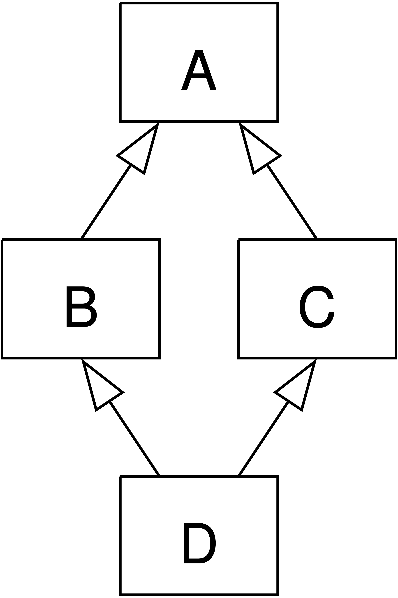

# Pokročílí 12: Dedičnosť

Po zapuzdrení si dnes vysvetlíme dedičnosť.

## Dedičnosť

Dedičnosť umožňuje vytvoriť novú triedu (podtriedu), ktorá **preberá vlastnosti a metódy** inej triedy (nadtriedy).

=== "Ukážka dedičnosti v Pythone"

    ```python
    class Osoba:
        def __init__(self, meno):
            self.meno = meno
        
        def pozdrav(self):
            print(f"Ahoj, som {self.meno}")

    class Student(Osoba):
        def __init__(self, meno, skola):
            super().__init__(meno)   # voláme konštruktor rodiča
            self.skola = skola
        
        # prepísanie (override) metódy
        def pozdrav(self):                
            print(f"Som {self.meno} a chodim na {self.skola}")

    d = Student("Fero", "SPSE Presov")
    d.pozdrav()
    ```

Užitočné metódy:

- `issubclass(Student, Osoba)`      # True
- `isinstance(d, Student)`          # True
- `isinstance(d, Osoba)`            # True – aj rodičovské triedy

## super()

Pomocou funkcie `super()` vieme pristupovať k objektu rodiča a volať jeho metódy a konštruktory a používať jeho atribúty.

`super()` sa používa hlavne v týchto dvoch prípadoch:

- volanie rodičovského konštruktora - aby sa dosiahla správna inicializácia atribútov
- volanie prepísanej (prekrytej) metódy - ak z nejakého dôvodu metóda v podtriede potrebuje zavolať prekrytú metódu

Volanie `super()` v konštruktore je takmer vždy ten správny prístup. Pri konštruktoroch sa často v argumentoch používa `**kwargs`, aby podtrieda mohla odovzdať rodičovskej triede všetky argumenty bez toho, aby musela vedieť presne aké argumenty rodičovská trieda vyžaduje.

=== "Posielanie argumentov rodičovským metódam"

    ```python
    class A:
        def __init__(self, a=None, **kwargs):
            super().__init__(**kwargs)        # vždy najprv!
            self.a = a
            print(f"A: a = {a}")

    class B:
        def __init__(self, b=None, **kwargs):
            super().__init__(**kwargs)
            self.b = b
            print(f"B: b = {b}")

    class C:
        def __init__(self, c=None, **kwargs):
            super().__init__(**kwargs)
            self.c = c
            print(f"C: c = {c}")

    # Akýkoľvek poradie dedičnosti funguje!
    class MojaTrieda(A, B, C):
        def __init__(self, x=None, **kwargs):
            super().__init__(**kwargs)        # pošle všetko hore
            self.x = x
            print(f"MojaTrieda: x = {x}")
    ```

## Viacnásobná dedičnosť

Na rozdiel od Javy sa v Pythone dá použiť viacnásobná dedičnosť

=== "Príklad viacnásobnej dedičnosti"

    ```python
    class A:
        def akcia(self):
            print("A")

    class B(A):
        def akcia(self):
            print("B")
            super().akcia()

    class C(A):
        def akcia(self):
            print("C")
            super().akcia()

    class D(B, C):      # D dedí od B aj C
        def akcia(self):
            print("D")
            super().akcia()
    ```

Pri viacnásobnej dedičnosti môže nastať problém, že niektoré triedy môžu byť dedené viackrát. Odborne sa tento problém volá **diamantový problém**, podľa tvaru aký má hierarchia tried pri viacnásobnom dedení.

{.on-glb width=300}
/// caption
Diamantový problém predchádzajúceho príkladu
///

Ak máme pri prekrytých metódach volanie rodičovských metód, u viacnásobného dedenia Python na určenie, ktorá metóda sa zavolá použije tzv. algoritmus MRO (Method Resolution Order). To, v akom poradí sa budú prehľadávať triedy vieme zistiť pomocou vstavanej metódy `mro()`

=== "Zistenie poradia prehľadávania rodičovských tried"

    ```python
    print(D.mro())
    # [<class '__main__.D'>, <class '__main__.B'>, <class '__main__.C'>, <class '__main__.A'>, <class 'object'>]

    d = D()
    d.akcia()
    # Výstup:
    # D
    # B
    # C
    # A
    ```

## Duck typing

Heslo duck typingu: **„Ak to chodí ako kačka a kváka ako kačka, tak to je kačka.“**

Inými slovami: Pythonu nezáleží na type objektu, ale na tom, či má požadované metódy a atribúty.

Dedenie teda častokrát nie je potrebné. Stačí, ak trieda implementuje danú metódu a jej objekty hneď vieme všade tam, kde sa táto metóda vyžaduje. Nie je potrebné mať rozhranie, abstraktnú metódu alebo rodičovskú triedu.

=== "Príklad duck typingu"

    ```python
    def zvuk_zvierata(zviera):
        print(zviera.zvuk()) # Nezáleží, či je to Pes, Macka alebo KacerDonald

    class Pes:
        def zvuk(self):
            return "Haf haf!"

    class Macka:
        def zvuk(self):
            return "Mňau!"

    class KacerDonald:
        def zvuk(self):
            return "Kvák kvák kvák!"

    for z in [Pes(), Macka(), KacerDonald()]:
        zvuk_zvierata(z)
    # Haf haf!
    # Mňau!
    # Kvák kvák kvák!
    ```

Duck typing sme používali, keď sme našim triedam implementovali dunder metódy `__str__`, `__eq__` a podobne.

Duck typing je jedna z najkrajších a najsilnejších vlastností Pythonu. Keď ho pochopíme, budeme vedieť písať oveľa flexibilnejší a krajší kód.

## Úlohy na hodine

Dnes budeme vylepšovať hru adventura, ktorú sme si programovali na minulom cvičení. Zameriame sa na nasledovné funkcionality:

- inventár hráča
- príkaz na vloženie veci do inventára
- použitie veci z inventára

!!! example "Úloha 12.1: Nová mapa"

    1. Do adresára `assets` si stiahnite novú verziu mapy [hra12.json](http://oop.wagjo.com/assets/hra12.json)

    1. V súbore `__main__.py` zmeňte mapu z `hra11.json` na `hra12.json`

    1. Pozrite si obsah súboru s mapou a všimnite si nové atribúty `items` a `uses` v niektorých miestnostiach


!!! example "Úloha 12.2: Inventár hráča"

    Ideme naimplementovať inventár, ktorý bude predstavovaný slovníkom v tvare {"nazov", vec}. Do triedy `Player` potrebujeme urobiť tieto zmeny:

    1. Otvorte modul `adventura/player.py`

    1. Pridajte do triedy nový interný atribút `_inventory`, inicializujte ho na prázdny slovník `{}`, argumenty konštruktora nemeňte

    1. Vytvorte getter metódu `inventory` pomovou @property dekorátora, ktorá vráti zoznam názvov vecí z inventára, teda zoznam kľúčov zo slovníka inventory

    1. Vytvorte nasledujúce metódy, ktoré budú pracovať s inventárom:

        - `put_item(self, item_id, item)` - vloží vec `item` do slovníka `inventory` pod kľúčom `item_id`
        - `del_item(self, item_id)` - vymaže vec z inventára podľa kľúča `item_id`
        - `has_item(self, item_id)` - vráti true, ak `item_id` sa nachádza v inventári, inak vráti false

    1. Overte funkčnosť pomocou nasledovného kódu:

        ```python
        def test():
            test_player = Player.from_dict({"start_room_id": 1})
            test_player.room_id = 2
            assert test_player.room_id == 2
            test_player.put_item("kluc", {
                "label": "kluc",
                "desc": "Zdobený kľúč"
                })
            assert test_player.has_item("kluc")
            assert test_player.inventory == ["kluc"]
            test_player.del_item("kluc")
            assert test_player.has_item("kluc") == False
            print("player module test OK")

        if __name__ == '__main__':
            test()
        ```

!!! example "Úloha 12.3: Úprava miestnosti"

    Miestnoť bude mať novú funkcionalitu:

    - V miestnosti sa môžu nachádzať veci, ukladať ich budeme do atribútu `items`
    - V miestnosti sa budú môcť použiť veci z inventára. To, aké veci sa môžu použiť a aká zmena nastane budeme mať uložené v atribúte `uses`

    Postup:

    1. Do triedy `Room` pridajte 2 atribúty, `_items` a `_uses`. Pridajte ich aj do argumentov konštruktora, ale dajte im defaultnú hodnotu None (`items=None, uses=None`)

    1. V argumentoch do konštruktora budú tieto vstupy zadané ako zoznam slovníkov, ale atribút potrebujeme mať ako index, podobne ako to máme urobené pre atribút `exits`. Vytvorte teda v konštruktore indexy pre `items` a `uses`

        - uses budeme indexovať pomocou `item_id`
        - items budeme indexovať pomocou `label`

    1. Vytvorte getter metódu pre atribút `items` pomocou @getter dekorátora, s tým, že sa bude vraciať zoznam názvov vecí (kľúče slovníka)

    1. Vytvorte metódy `get_item(self, item_id)` a `del_item(self, item_id)` pre prístup k a odstránenie veci

    1. Vytvorte metódy `replace_exits(self, new_exits)` a `replace_desc(self, new_desc)`, ktoré prepíšu východy a popis miestnosti novými hodnotami. Pri exits urobte indexáciu podobne ako sa to robí v konštruktore.

    1. Vytvorte metódu `item_use(self, item_id)`, ktorá vráti hodnotu zo slovníka `_uses` pre danú vec `item_id`

    1. Overte funkčnosť pomocou nasledovného kódu:

        ```python
        def test():
            test_room = Room.from_dict({"room_id": "1",
                                        "label": "Čistinka",
                                        "desc": "Stojíš na kraji čistinky",
                                        "items": [
                                            {
                                                "label": "kluc",
                                                "desc": "Zdobený kľúč"
                                            }
                                        ],
                                        "uses": [
                                            {
                                                "item_id": "kluc",
                                                "desc": "Kľúčom si odomkol dvere",
                                            }
                                        ],
                                        "exits": [{
                                            "label": "zapad",
                                            "room_id": "2"
                                        }, {
                                            "label": "vychod",
                                            "room_id": "3"}]})
            assert test_room.label == "Čistinka"
            assert test_room.desc == "Stojíš na kraji čistinky"
            assert test_room.game_over == None
            assert test_room.exits == ["zapad", "vychod"]
            assert test_room.exit("zapad") == {
                                            "label": "zapad",
                                            "room_id": "2"}

            assert test_room.items == ["kluc"]
            assert test_room.get_item("kluc") == {
                                                "label": "kluc",
                                                "desc": "Zdobený kľúč"
                                            }
            test_room.del_item("kluc")
            assert test_room.items == []
            assert test_room.item_use("kluc") == {
                                                "item_id": "kluc",
                                                "desc": "Kľúčom si odomkol dvere",
                                            }
            test_room.replace_exits([{"label": "zapad",
                                            "room_id": "2"
                                        }])
            test_room.replace_desc("Stojíš na kraji čistinky, prší")
            assert test_room.desc == "Stojíš na kraji čistinky, prší"
            assert test_room.exits == ["zapad"]
            print("room module test OK")

        if __name__ == '__main__':
            test()
        ```

!!! example "Úloha 12.4: Úprava stavu hry"

    Stav hry bude mať viac funkcionalít pomocou nasledovných metód:

    - `go(self, direction)` - zmení aktuálnu polohu hráča podľa smeru, ktorým sa vydal
    - `take_item(self, item_id)` - zoberie vec z miestnosti a vloží do inventára hráča
    - `use_item(self, item_id)` - použije vec z inventára a vykoná akciu. Potom vec vymaže z inventára. Akcia môže zmeniť východy alebo popis miestnosti.

    Postup:

    1. V triede Hra vytvorte metódu `go(self, direction)`, ktorá zmení aktuálnu polohu hráča podľa smeru, ktorým sa vydal. Ide viacmenej o kód, ktorý nájdete v metóde `action` v triede `Engine` v časti `verb == "go"`. Stačí ho mierne upraviť. Používajú sa tam metódy `active_room()`, `room.exit` a `player.room_id`

    1. Vytvorte metódu `take_item(self, item_id)`, ktorá zoberie vec z miestnosti a vloží do inventára. Použite na to metódy `room.get_item`, `player.put_item` a `room.del_item`

    1. Do triedy Hra vložte nasledovné 2 metódy:

        ``` python
        def _replace(self, to_replace):
            room = self.active_room()
            new_exits = to_replace.get('exits', [])
            if new_exits:
                room.replace_exits(new_exits)
            new_desc = to_replace.get('desc', None)
            if new_desc:
                room.replace_desc(new_desc)

        def use_item(self, item_id):
            room = self.active_room()
            player = self.player
            if player.has_item(item_id):
                use = room.item_use(item_id)
                to_replace = use.get('replace', {})
                self._replace(to_replace)
                player.del_item(item_id)
                return use.get("desc")
            else:
                raise ValueError("Neviem použiť " + item_id)
        ```

    1. Overte funkčnosť pomocou nasledovného kódu:

        ```python
        def test():
            test_hra = Hra.from_dict({"player": {"start_room_id": "1"},
                                    "rooms": [{"room_id": "1",
                                                "label": "Čistinka",
                                                "desc": "Stojíš na kraji čistinky",
                                                "uses": [{
                                                    "item_id": "maceta",
                                                    "desc": "Použil si mačetu",
                                                    "replace": {
                                                        "desc": "Rozsekaná čistinka",
                                                        "exits": [{
                                                            "label": "zapad",
                                                            "room_id": "10"
                                                        }]}}],
                                                "items": [{
                                                    "label": "maceta",
                                                    "desc": "Stará mačeta"
                                                }],
                                                "exits": []}]})
            assert test_hra.player.room_id == "1"
            assert test_hra.active_room().label == "Čistinka"
            test_hra.take_item("maceta")
            assert test_hra.active_room().items == []
            assert test_hra.player.inventory == ["maceta"]
            test_hra.use_item("maceta")
            assert test_hra.player.inventory == []
            assert test_hra.active_room().desc == "Rozsekaná čistinka"
            assert test_hra.active_room().exits == ["zapad"]
            test_hra.go("zapad")
            assert test_hra.player.room_id == "10"
            print("hra module test OK")

        if __name__ == '__main__':
            test()
        ```

!!! example "Úloha 12.5: Modul logiky hry"

    Modul engine musíme tiež mierne upraviť:

    1. Do metódy `describe` pridajte výpis vecí v miestnosti a vecí v inventári hráča. Na samostatný riadok vypíšte `"Na zemi sa nachádza:"` a veci v miestnosti, a na ďalší riadok `"V inventári máš:"` a veci z inventára hráča.

    1. Metódu `action` nahraďte nasledovným kódom:

        ```python
        def action(self):
            try:
                commands = input("Čo chceš urobiť?: ").split()
                verb = commands[0]
                noun = commands[1] if len(commands) > 1 else None
                if verb == "help":
                    print()
                    print("!!!!!!!!!!!! HELP !!!!!!!!!!!!!!!!!!!!")
                    print("Pre ukončenie hry napíš exit")
                    print("Z miestnosti sa vieš presunúť príkazom go a smer, ktorým sa chceš ubrať, napríklad go vychod.")
                    print("Zobrať vec zo zeme vieš pomocou príkazu take a vec, ktorú chceš zobrať, napríklad take doska.")
                    print("Použiť vec vieš príkazom use a vec, ktorú chceš použiť.")
                    print("!!!!!!!!!!!!!!!!!!!!!!!!!!!!!!!!!!!!!")
                elif verb == "exit":
                    return True
                elif verb == "go":
                    self._hra.go(noun)
                elif verb == "take":
                    self._hra.take_item(noun)
                elif verb == "use":
                    desc = self._hra.use_item(noun)
                    print()
                    print("!!!!!!!!!!!! AKCIA !!!!!!!!!!!!!!!!!!!!")
                    print(desc)
                    print("!!!!!!!!!!!!!!!!!!!!!!!!!!!!!!!!!!!!!")
                else:
                    self._hra.go(verb)
            except KeyboardInterrupt as ex:
                return True
            except Exception as ex:
                print()
                print("!!!!!!!!!!!! CHYBA !!!!!!!!!!!!!!!!!!!!")
                print("Nerozumiem príkazu. Ak si nevieš dať rady napíš help")
                print("!!!!!!!!!!!!!!!!!!!!!!!!!!!!!!!!!!!!!")
        ```

    Hotovo, skúste si zahrať hru a nájsť poklad!


## Úlohy na precvičenie

!!! example "Úloha 12.6: Popis veci"

    Každá vec má svoj popis. 
    
    1. Vytvorte novú akciu `look vec`, ktorá vypíše popis veci v miestnosti.

    1. Vytvorte novú akciu `inventory`, ktorá vypíše veci v inventári a ich popis


## Zhrnutie cvičenia

- [x] Dedičnosť umožňuje vytvoriť novú triedu (podtriedu), ktorá preberá vlastnosti a metódy inej triedy (nadtriedy)
    * [ ] Užitočné metódy `issubclass(Student, Osoba)` a `isinstance(d, Student)`
- [x] super()
    * [ ] Pomocou funkcie super() vieme pristupovať k objektu rodiča a volať jeho metódy a konštruktory a používať jeho atribúty
    * [ ] volanie rodičovského konštruktora - aby sa dosiahla správna inicializácia atribútov
    * [ ] volanie prepísanej (prekrytej) metódy - ak z nejakého dôvodu metóda v podtriede potrebuje zavolať prekrytú metódu
- [x] Na rozdiel od Javy sa v Pythone dá použiť viacnásobná dedičnosť
    * [ ] Pri viacnásobnej dedičnosti môže nastať problém, že niektoré triedy môžu byť dedené viackrát. Odborne sa tento problém volá diamantový problém, podľa tvaru aký má hierarchia tried pri viacnásobnom dedení
    * [ ] Ak máme pri prekrytých metódach volanie rodičovských metód, u viacnásobného dedenia Python na určenie, ktorá metóda sa zavolá použije tzv. algoritmus MRO (Method Resolution Order)
    * [ ] To, v akom poradí sa budú prehľadávať triedy vieme zistiť pomocou vstavanej metódy mro()
- [x] Duck typing
    * [ ] „Ak to chodí ako kačka a kváka ako kačka, tak to je kačka.“
    * [ ] Pythonu nezáleží na type objektu, ale na tom, či má požadované metódy a atribúty.
    * [ ] Dedenie teda častokrát nie je potrebné. Stačí, ak trieda implementuje danú metódu a jej objekty hneď vieme všade tam, kde sa táto metóda vyžaduje.


!!! note "Poznámky do zošita"
    V zošite je potrebné mať napísané aspoň tieto poznámky:

    ```
    DEDIČNOSŤ

    Umožňuje vytvoriť triedu (podtriedu), ktorá preberá vlastnosti a metódy inej triedy (nadtriedy)

    - issubclass(Student, Osoba) - zistenie, či je trieda potomkom
    - isinstance(x, Student) - zistenie, či objekt x je inštanciou danej triedy alebo jej rodičov

    Pomocou funkcie super() vieme pristupovať k objektu rodiča a volať jeho metódy. 2 prípady:

    - volanie rodičovského konštruktora
    - volanie prepísanej (prekrytej) metódy

    Viacnásobná dedičnosť

    Diamantový problém: niektoré triedy môžu byť dedené viackrát. Problém pri prekrytých metódach.

    Python na určenie, ktorá metóda sa zavolá použije tzv. algoritmus MRO (Method Resolution Order)

    To, v akom poradí sa budú prehľadávať triedy vieme zistiť pomocou vstavanej metódy mro()

    Duck typing

    „Ak to chodí ako kačka a kváka ako kačka, tak to je kačka.“

    Pythonu nezáleží na type objektu, ale na tom, či má požadované metódy a atribúty.
    ```

!!! warning "Skúšanie a kontrola vedomostí"

    Okruhy otázok na test:

    - Čo je dedičnosť
    - super() a jej využitie
    - Viacnásobná dedičnosť
    - MRO
    - Duck Typing
