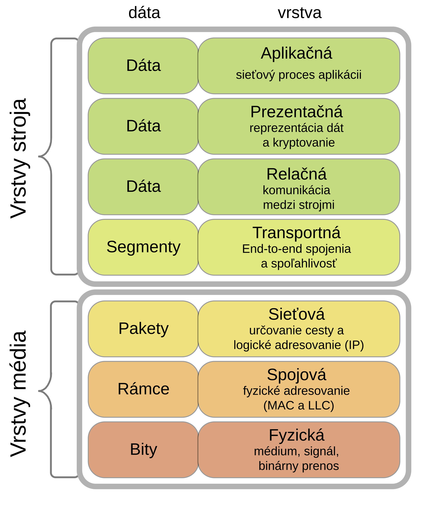

# Pokročílí 18: UDP

Začíname novú tému - sieťová komunikácia. Medzi najzákladnejšie protokoly na internete patria UDP a TCP. Dnes si vyskúšame použiť **UDP**, protokol na úrovni *transportnej vrstvy* (OSI model layer 4)

{width=350}
/// caption
UDP pracuje na 4. vrstve OSI modelu
///

## User Datagram Protocol

UDP (User Datagram Protocol) je connectionless protokol, čo znamená že **nevytvára spojenie**, je unreliable (**bez záruky doručenia** alebo poradia paketov) a pracuje s datagramami (malými paketmi dát). UDP je rýchly a vhodný pre aplikácie ako streamovanie videa, hry alebo DNS, kde je dôležitá rýchlosť viac ako spoľahlivosť.

Vlastnosti:

- Používa IP adresu a port (napr. 127.0.0.1:12345 pre localhost) pre adresovanie.
- Veľkosť jednej správy (datagramu) je maximálne okolo 65kB
- Nízka réžia (overhead), rýchle odosielanie
- podporuje broadcast a multicast.

Nevýhody: 

- žiadna kontrola chýb (chyby sa ignorujú)
- žiadne potvrdenie doručenia ani garancia poradia
- pakety sa môžu stratiť alebo prísť v inom poradí.

{width=450}
/// caption
TCP vs UDP
///

UDP v praxi býva častejšie filtrovaný alebo obmedzovaný, pretože sťažuje firewallom a NAT zariadeniam sledovanie legitímnej komunikácie. Zároveň sa často zneužíva na DDoS a amplifikačné útoky, preto majú siete prísnejšie pravidlá a niekedy blokujú vybrané UDP porty. TCP je pre svoju stavovosť a kontrolu toku z pohľadu infraštruktúry „čitateľnejší“ a stabilnejší.

Typické použitie UDP:

- hry, streamovanie (video, audio)
- DNS, IoT
- broadcast / multicast
- QUIC nadstavba pre HTTP/3 v moderných browseroch


## UDP v Pythone

Na prácu s UDP protokolom vieme v Pythone použiť štandardný modul `socket`. Ako prvé musíme nastaviť socket na protokol UDP (SOCK_DGRAM) a na sieť IPv4 (AF_INET).

```python
import socket

sock = socket.socket(socket.AF_INET,socket.SOCK_DGRAM)
```

Tento objekt `sock` potom vieme použiť na prijímanie aj posielanie správ cez sieť.

### Adresovanie v UDP

Ak chceme niekomu poslať správu, musíme vedieť jeho presnú adresu. UDP na adresovanie používa IP + port:

```python
("127.0.0.1", 5000)
```

IP predstavuje cieľový počítač, na ktorý sa posiela správa. Port určuje konkrétnu aplikáciu, ktorá beží na počítačí (lebo na jednom počítači môže byť viac spustených aplikácií, ktoré chcú nejako používať UDP).

Číslo portu sa delí do troch kategórií:

- 0-1023: systémové - aplikácia musí byť spustená ako root/administrator, inak nemôže tieto porty použiť
- 1024-49151: obsahujú [registrované porty](https://www.iana.org/assignments/service-names-port-numbers/service-names-port-numbers.xhtml). Pre vlastnú aplikáciu je najlepšie nájsť niektorý neregistrovaný port
- 49152-65535: dynamické, súkromné alebo dočasné porty. Tu si viete vybrať hocijaké číslo.

## Prijímanie správ

Pre prijímanie správ je potrebné nastaviť socket aby sledoval určitý port:

```python
sock.bind(("0.0.0.0", 5000))
```

Pri počúvaní je tiež dôležité nastaviť, na ktorej 'sieti' má socket počúvať:

- "0.0.0.0" - počúvaj na všetkých rozhraniach
- "127.0.0.1" - len lokálne

Samotné prijatie správy sa robí pomocou funkcie `recvfrom`. Keďže dáta prenášané po sieti sú bajty, ak posielame reťazce, je potrebné prijaté dáta dekódovať z bajtov na reťazec. Toto prijímanie a spracovanie správ sa väčšinou robí v nekonečnom cykle, ktorý sa preruší, až keď sa končí program resp. keď vypíname spojenie po sieti.

=== "Príklad prijímania UDP správ v slučke"

    ```python
    sock.bind(("0.0.0.0", 5000))
    while True:
        try:
            # Prijatie správy (datagramu)
            data, addr = sock.recvfrom(BUFFER_SIZE)
            # Dekódovanie správy
            message = data.decode('utf-8')
            # Vypísanie správy do konzoly
            print(f"Nová správa od {addr[0]}:{addr[1]}: {message}")
        except Exception as e:
            print("Chyba v príjme:", e)
            break
    ```

Pri prijatí správy sa okrem dát prijme aj adresa (IP + port), z ktorej sme správu dostali. To sa dá neskôr použiť ak chcem odpovedať, teda poslať späť druhej strane nejakú správu.

## Odoslanie správy

Odosielanie správy sa realizuje pomocou funkcie `sendto`.

Na odoslanie správy potrebujeme vedieť IP adresu a port adresáta. Správu musíme naviac zakódovať do poľa bajtov. Ak by sme napr. chceli poslať reťazec načítaný z klávesnice, vieme to urobiť nasledovne:

=== "Príklad odoslania UDP správy"

    ```python
    addr = (IP, PORT)
    message = input("Zadaj správu: ")
    bytes = message.encode('utf-8')
    sock.sendto(bytes, addr)
    ```

## Odosielanie a prijímanie v jednom programe

Ak chceme v našom  programe naraz dáta prijímať aj odosielať, je potrebné prijímanie dát nechať bežať na samostatnom vlákne. Vlákna umožňujú paralelné (súbežné) vykonávanie častí programu. Na prácu s vláknami vieme použiť štandardný modul `threading`

=== "Príklad použitia vlákien pri prijímaní UDP správ"

    ```python
    # Konfigurácia
    HOST = "0.0.0.0" # počúva na všetkých rozhraniach
    PORT = 55777 # ľubovoľný voľný port > 1024
    BUFFER_SIZE = 1024

    def receive_messages(sock):
        """Načítava nové správy a vypisuje ich do konzoly"""
        while True:
            try:
                # Prijatie správy (datagramu)
                data, addr = sock.recvfrom(BUFFER_SIZE)
                # Dekódovanie správy
                message = data.decode('utf-8')
                # Vypísanie správy do konzoly
                print(f"Nová správa od {addr[0]}:{addr[1]}: {message}")
            except Exception as e:
                print("Chyba v príjme:", e)
                break

    def send_messages(sock, addr):
        """Posiela správy načítané z konzoly"""
        print(f"Posielaš správy do {addr[0]}:{addr[1]}")
        while True:
            try:
                message = input()
                bytes = message.encode('utf-8')
                sock.sendto(bytes, addr)
            except Exception as e:
                print("Chyba v posielaní:", e)
                break
            except KeyboardInterrupt as e:
                print("Končím s posielaním")
                break

    # Vytvorenie UDP socketu
    sock = socket.socket(socket.AF_INET, socket.SOCK_DGRAM)

    # Nastavenie počúvania na danej adrese
    listen_addr = (HOST, PORT)
    sock.bind(listen_addr)

    # Spustíme vlákno na príjem správ
    thread = threading.Thread(target=receive_messages, args= (sock,), daemon=True)
    thread.start()

    ## Adresa kam sa budú posielať správy
    host = input("Zadaj IP adresu, kam budeš posielať správy: ")
    port = input("Zadaj port, na ktorý budeš posielať správy: ")
    addr = (host, int(port))

    ## Posielaj správy
    send_messages(sock, addr)

    print("Vypínam server...")
    sock.close()
    ```

## Úlohy

!!! example "Úloha 18.1: Posielanie a prijímanie správ"

    Do súboru `listener.py` vytvorte program, ktorý:

    - Vytvorí nový UDP socket pomocou `socket.socket`
    - Začne počúvať na 0.0.0.0:55777 pomocou `socket.bind`
    - V nekonečnom cykle bude načítavať správy pomocou `sock.recvfrom`, dekóduje ich a vypíše do konzoly

    Do súboru `sender.py` vytvorte program, ktorý:

    - Vytvorí nový UDP socket pomocou `socket.socket`
    - Z klávesnice načíta IP adresu a PORT, na ktorý sa majú posielať správy
    - V nekonečnom cykle bude načítavať správy z klávesnice a každú správu zakóduje pomocou `encode(utf-8)` a pošle pomocou `sock.sendto`

    V termináli spustite program `python listener.py` a v druhom okne terminálu (tlačítko plus) spustite `python sender.py` a posielajte správy zo sendera do listenera

    Vyskúšajte poslať správu spolužiakovi na jeho listener. Najprv si však musíte zistiť jeho IP adresu a musí byť pripojený do tej istej siete ako vy.


!!! example "Úloha 18.2: Posielanie a prijímanie v jednom programe"

    Do súboru `peer.py` vytvorte program, ktorý bude robiť obe úlohy: posielať aj prijímať správy.

    Cyklus počúvania správ (to čo robil `listener.py`) spustite v samostatnom vlákne pomocou `threading` modulu. Ukážka použitia:

    ```python
    thread = threading.Thread(target=receive_messages, args= (sock,), daemon=True)
    thread.start()
    ```

    Spustite `python peer.py` a pošlete správu sami sebe.

    Spustite peer.py tak, aby ste mohli posielať správy spolužiakovi a komunikovať s ním


!!! example "Úloha 18.3: Server a klient"

    Vytvorte `server.py` a `client.py`.

    Server:

    - Bude počúvať na nejakom preddefinovanom porte
    - Vytvorí si premennú s množinou klientov, (host, port tuple hodnoty)
    - Bude v nekonečnom cykle počúvať a čakať na správy
    - Ak mu príde správa, pridá odosielateľa do množiny klientov
    - Prijatú správu pošle všetkým klientom, ktorých má v množine

    Client:

    - Načíta z klávesnice IP adresu servera (port nastavte ten istý ako na serveri)
    - Načíta z klávesnice nick
    - Bude sa správať podobne ako peer.py, teda bude aj posielať aj prijímať správy
    - Nemusí robiť `bind`, ak najprv pošle správu, socket bude automaticky počúvať na porte, z ktorého sa správa poslala
    - Hneď po pripojení pošle správu "Práve sa pripojil {nick}"
    - Pred každú správu, ktorú pošle na server, pripojí svoj nick

    Vytvorte jeden server a viacerí sa na neho pripojte a komunikujte

## Zhrnutie cvičenia

- [x] UDP (User Datagram Protocol)
    * [ ] protokol na úrovni transportnej vrstvy (OSI model layer 4)
    * [ ] connectionless protokol, čo znamená že nevytvára spojenie, unreliable (bez záruky doručenia alebo poradia paketov) a pracuje s datagramami (malými paketmi dát)
    * [ ] Je rýchly a vhodný pre aplikácie ako streamovanie videa, hry alebo DNS, kde je dôležitá rýchlosť viac ako spoľahlivosť.
- [x] Vlastnosti UDP
    * [ ] Používa IP adresu a port (napr. 127.0.0.1:12345 pre localhost) pre adresovanie.
    * [ ] Veľkosť jednej správy (datagramu) je maximálne okolo 65kB
    * [ ] Nízka réžia (overhead), rýchle odosielanie, podporuje broadcast a multicast.
- [x] Nevýhody UDP
    * [ ] žiadna kontrola chýb (chyby sa ignorujú)
    * [ ] žiadne potvrdenie doručenia ani garancia poradia
    * [ ] pakety sa môžu stratiť alebo prísť v inom poradí.
    * [ ] UDP býva častejšie filtrovaný alebo obmedzovaný, pretože sťažuje firewallom a NAT zariadeniam sledovanie legitímnej komunikácie
- [x] UDP v Pythone
    * [ ] Na prácu s UDP protokolom vieme v Pythone použiť štandardný modul `socket` 
    * [ ] `sock = socket.socket(socket.AF_INET,socket.SOCK_DGRAM)`
    * [ ] UDP na adresovanie používa IP + port: `("127.0.0.1", 5000)` - tuple
- [x] Prijímanie správ
    * [ ] Pre prijímanie správ je potrebné nastaviť socket aby sledoval určitý port
    * [ ] `sock.bind(("0.0.0.0", 5000))`
    * [ ] Samotné prijatie správy sa robí pomocou funkcie recvfrom
    * [ ] Keďže dáta prenášané po sieti sú bajty, ak posielame reťazce, je potrebné prijaté dáta dekódovať z bajtov na reťazec. 
    * [ ] Toto prijímanie a spracovanie správ sa väčšinou robí v nekonečnom cykle
- [x] Odoslanie správy - pomocou funkcie `sendto`
    * [ ] Na odoslanie správy potrebujeme vedieť IP adresu a port adresáta. 
    * [ ] Správu musíme naviac zakódovať do poľa bajtov
    * [ ] `sock.sendto(message.encode('utf-8'), (IP, PORT))`
    * [ ] Ak chceme v našom programe naraz dáta prijímať aj odosielať, je potrebné prijímanie dát nechať bežať na samostatnom vlákne
    * [ ] Na prácu s vláknami vieme použiť štandardný modul `threading`
    * [ ] `threading.Thread(target=receive_messages, args= (sock,), daemon=True).start()`


!!! note "Poznámky do zošita"
    V zošite je potrebné mať napísané aspoň tieto poznámky:

    ```
    UDP (User Datagram Protocol)

    na úrovni transportnej vrstvy (layer 4)
    nevytvára spojenie, unreliable (bez záruky doručenia alebo poradia paketov) 
    a pracuje s datagramami (malými paketmi dát)

    Vlastnosti:
    - IP adresa a port (napr. 127.0.0.1:12345 pre localhost) pre adresovanie.
    - Veľkosť správy (datagramu) je max. 65kB
    - podporuje broadcast a multicast.

    Nevýhody UDP:
    - žiadna kontrola chýb (chyby sa ignorujú)
    - žiadne potvrdenie doručenia ani garancia poradia
    - pakety sa môžu stratiť alebo prísť v inom poradí.
    - je často obmedzovaný, pretože sťažuje firewallom a NAT zariadeniam sledovanie

    UDP v Pythone:
    - štandardný modul socket
    - sock = socket.socket(socket.AF_INET,socket.SOCK_DGRAM)
    - UDP na adresovanie používa tuple IP + port: ("127.0.0.1", 5000)

    Prijímanie správ:
    - je potrebné nastaviť socket aby sledoval určitý port
    - sock.bind(("0.0.0.0", 5000))
    - prijatie správy - recvfrom
    - prijaté dáta je nutné dekódovať z bajtov napr. na reťazec.

    Odoslanie správy - pomocou funkcie sendto:
    - potrebujeme IP adresu a port adresáta.
    - Správu musíme zakódovať do poľa bajtov
    - sock.sendto(message.encode('utf-8'), (IP, PORT))
    - Ak chceme naraz dáta prijímať aj odosielať, je potrebné prijímanie mať na samostatnom vlákne
    - štandardný modul threading
    - threading.Thread(target=receive_messages, args= (sock,), daemon=True).start()
    ```

!!! warning "Skúšanie a kontrola vedomostí"

    Okruhy otázok na test:

    - Vlastnosti UDP
    - Výhody a nevýhody UDP
    - Ako sa v Pythone prijímajú UDP správy
    - Ako sa v Pythone odosielajú UDP správy
    - Na čo sú vlákna
