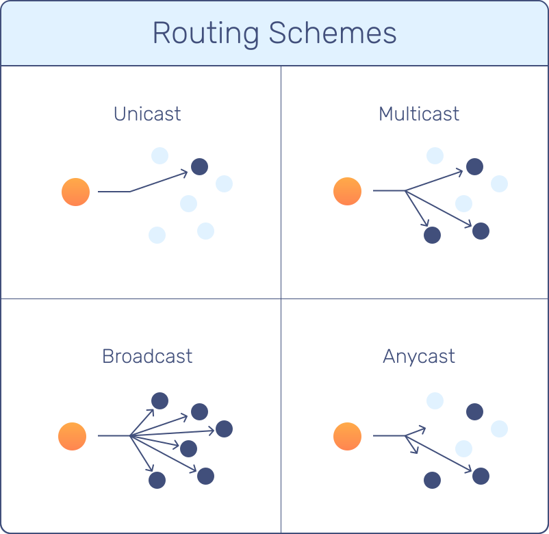

# Pokročílí 19: UDP Broadcast a Multicast

Pokračujeme v UDP a ukážeme si, ako vieme v UDP poslať správu naraz viacerým zariadeniam.

Na minulej hodine sme si vysvetlili základy posielania správ pomocou UDP protokolu. Všetky druhy (sender/listener, peer, client/server), ktoré sme si vyskúšali, pracovali tak, že správa bola súčasne posielana iba jednému zariadeniu. Takýto typ posielania správ sa nazýva **unicast**.

## Schémy posielania

Existujú 4 druhy schém posielania správ:

{width=350 align=right}

- **Unicast** - one-to-one - správa je posielaná jednému zariadeniu, ktoré je identifikované IP adresou a portom. Je to najčastejší typ posielania a je využívaný v client/server a peer-to-peer komunikácii.
- **Broadcast** - one-to-all - správa je poslaná všetkým zariadeniam v sieti
- **Multicast** - one-to-many - správa je poslaná viacerým zariadeniam a to tým, ktoré sa sami prihlásia na odber
- **Anycast** - one-to-one-of-many - správa je poslaná jednému zariadeniu (väčšinou najbližšiemu) z množiny zariadení

Unicast je najbežnejší typ a preberali sme ho na minulej hodine. Dnes sa povenujeme zvyšným trom.


## Broadcast

Broadcast je typ posielania správ, kedy sa správa pošle **všetkým zaradeniam v sieti**. Aby sa zabránilo zahlteniu siete, broadcast správy nie sú routrami prenášané na iné podsiete. Nie je možné poslať broadcast správu celému "internetu".

Broadcast správa je teda poslaná všetkým zariadeniam na podsieti (všetky zariadenia v rámci jedného routra).

Využitie broadcastu je hlavne pri objavovaní zariadenia (DHCP, herné lobby pre LAN party), kedy server sa sieti ohlási, že je aktívny a klienti sa môžu na neho pripojiť. Broadcast sa teda používa hlavne tam, kde zariadenia ešte nepoznajú IP adresy iných zariadení v rovnakej lokálnej sieti (LAN / VLAN).

Ak chceme posielať v Pythone broadcast správy, je potrebné to expliticne povoliť pomocou nastavenia `socket.SO_BROADCAST`. 

=== "Posielanie broadcast správ v Pythone"

    ```python
    sock = socket.socket(socket.AF_INET, socket.SOCK_DGRAM)
    sock.setsockopt(socket.SOL_SOCKET, socket.SO_BROADCAST, 1) # povolíme broadcast

    # Možnosti cieľovej adresy:
    sock.sendto(b"HELLO", ("255.255.255.255", 9999)) # limited broadcast
    sock.sendto(b"HELLO", ("192.168.1.255", 9999))   # directed broadcast
    sock.sendto(b"HELLO", ("<broadcast>", 9999))     # špeciálny string
    ```

Broadcast správa sa líši od unicast v tom, že ako cieľová IP adresa je uvedená špeciálna adresa `255.255.255.255` a sieť ju pošle všetkým zariadeniam. V Pythone namiesto tejto adresy vieme uviesť aj reťazec `<broadcast>`.

!!! info "Directed Broadcast"

    Existuje ešte jedna možnosť, a to uviesť presnú adresu podsiete, napr. `192.168.1.255` (posledná časť je `255`), kedy explicitne povieme, že tento tzv. **directed broadcast** sa má poslať iba na túto podsieť. V takomto prípade **môže router broadcast správu preposlať ďalej**, aby sa dostala do cieľovej podsiete. Štandardne to však routre nerobia a **je potrebné to explicitne na routroch povoliť**.

Prijímanie broadcast správ je podobné ako prijímanie klasických správ. Pri broadcast správach sa ešte zvykne nastaviť tzv. zdieľanie portu pomocou `socket.SO_REUSEADDR`. Toto nastavenie umožní, aby na porte mohli naraz počúvať viaceré aplikácie.


=== "Prijímanie broadcast správ v Pythone"

    ```python
    # Vytvoríme UDP socket
    sock = socket.socket(socket.AF_INET, socket.SOCK_DGRAM)

    # Povolíme opätovné použitie adresy/portu (voliteľné)
    sock.setsockopt(socket.SOL_SOCKET, socket.SO_REUSEADDR, 1)

    # Bind na všetky rozhrania ('' == 0.0.0.0) a daný port
    sock.bind(('', 55777))

    while True:
        # recvfrom vráti dáta + adresu odosielateľa
        data, addr = sock.recvfrom(1024)
        message = data.decode('utf-8', errors='replace')
        
        # addr = (ip_od_koho, port_od_koho)
        print(f"Prijaté od {addr[0]}:{addr[1]} {message}")
    ```

## Multicast

Časté používanie broadcast správ môže zahltiť alebo spomaliť sieť. Preto sa pre intenzívnejšiu komunikáciu používa radšej multicast. Vtedy je správa posielaná skupine zariadení, ktoré sa prihlásili na odber správ.

Podobne ako broadcast, aj multicast správy nie sú štandardne púšťané routrami von z podsiete. Je však možné to povoliť ručne, napr. vo firemných sieťach. Na globálny internet sa však multicast správy nedostanú.

Multicast sa často využíva v IPTV / live TV, IoT zariadeniach (Smart Home) a pri objavovaní zariadení (napr. tlačiarne).

V multicast komunikácii si musíme najpr zvoliť IT adresu skupiny, v ktorej budeme komunikovať. Pre multicast je vyčlenený rozsah IP adries `224.0.0.0` - `239.255.255.255`. Tento rozsah sa ďalej delí podľa použitia. Najčastejšie používané rozsahy sú:

- `224.0.0.0 - 224.0.0.255` - control traffic, routing protokoly
- `239.0.0.0 - 239.255.255.255` - najčastejšie pre aplikácie

Posielanie správ v rámci multicastu je také isté ako pri unicaste, iba IP adresa je špeciálna.

=== "Posielanie multicast správ"

    ```python
    MCAST_GRP = "239.1.2.3"
    MCAST_PORT = 5007

    sock = socket.socket(socket.AF_INET, socket.SOCK_DGRAM)
    sock.sendto(b"Streamovany text", (MCAST_GRP, MCAST_PORT))
    ```

Prijímanie správ v multicaste je však trochu komplikovanejšie. Pred samotným prijímaním sa aplikácia musí prihlásiť do danej skupiny a až potom môže začať prijímať správy. Po ukončení prijímania je potrebné sa zo skupiny odhlásiť, aby na zariadenie zbytočne nechodili správy.

=== "Prijímanie multicast správ"

    ```python
    MCAST_GRP = "239.1.2.3"
    MCAST_PORT = 5007

    sock = socket.socket(socket.AF_INET, socket.SOCK_DGRAM)
    sock.setsockopt(socket.SOL_SOCKET, socket.SO_REUSEADDR, 1)
    sock.bind(("", MCAST_PORT)) # dôležité: bind na prázdnu adresu!

    # Prihlásenie sa do multicast skupiny
    mreq = struct.pack("4s4s", socket.inet_aton(MCAST_GRP), socket.inet_aton("0.0.0.0"))
    sock.setsockopt(socket.IPPROTO_IP, socket.IP_ADD_MEMBERSHIP, mreq)

    try:
        while True:
            data, addr = sock.recvfrom(1024)
            message = data.decode('utf-8', errors='replace')
            print(f"Prijaté od {addr[0]}:{addr[1]} {message}")
    except Exception as e:
        print(f"Chyba: {e}")

    # Odhlásenie z multicast skupiny (leave)
    sock.setsockopt(socket.IPPROTO_IP, socket.IP_DROP_MEMBERSHIP, mreq)
    ```

## Anycast

Posledný typ posielania odosiela správu jednému zariadeniu z vopred preddefinovanej skupiny. Všetky zariadenia v skupine majú úplne rovnakú IP adresu! Anycast vo väčšine prípadov smeruje správu fyzicky najbližšiemu zariadeniu.

Anycast funguje hlavne na globálnej sieti využíva sa na to, aby správy nešli zbytočne dlhú cestu. Ak by ste mali servery na rôznych kontinentoch, vedeli by ste pomocou anycastu nastaviť posielanie správ tak, aby európania komunikovali s vašim európskym serverom a pod.

Anycast nie je vec protokolu (TCP/UDP), ale je vec topológie siete a routingu (hlavne BGP). Nejde teda o nastavenie na strane klienta.
Klient (Python kód, prehliadač, appka, atď.) robí presne to isté, ako keby išlo o obyčajný unicast:

- pošle správu na nejakú IP adresu
- odpoveď dostane z tej istej adresy
- klient netuší, že tá IP adresa je zdieľaná viacerými servermi na rôznych miestach sveta

Anycast vyzerá pre routery ako normálna unicast cesta. Routery vyberajú najlepšiu cestu podľa metrík (počet hopov, latencia, politika, zdravotný stav cesty). Klientovi príde odpoveď od tej istej IP, na ktorú poslal request (aj keď to fyzicky spracoval iný server).

Anycast je úplne transparentný pre klienta - nastavuje sa iba na strane serverov a siete (BGP + všade rovnaká IP), klient o ničom nevie a nič extra nerobí.

## Úlohy

!!! example "Úloha 19.1: Chat pomocou broadcastu"

    Upravte úlohu 18.3 tak, aby chat server odpovedal pomocou broadcastu a nemusel si pamatať zoznam klientov


!!! example "Úloha 19.2: Chat pomocou multicastu"

    Upravte úlohu 18.3 tak, aby chat server odpovedal pomocou multicastu a nemusel si pamatať zoznam klientov


!!! example "Úloha 19.3: Broadcast binárnych údajov"

    V súbore `broadcast_sender.py` vytvorte program, ktorý bude v nekonečnej slučke každých 7 sekúnd posielať náhodný obrázok z adresára assets.

    - súbory nesmú mať viac ako 65kB !!!
    - čakajte pomocou `time.sleep(0.7)`
    - náhodný súbor viete vybrať pomocou `IMAGE_PATH = "assets/" + random.choice(os.listdir("assets"))`
    - obsah súbor načítate pomocou `data = open(IMAGE_PATH, "rb").read()` a data potom pošlete broadcast správu cez `socket.sendto`

    V súbore `broadcast_listener.py` vytvorte program, ktorý počúva broadcast správy a vykresľuje načítaný obrázok pomocou pygame

    - načítavanie UDP správ majte v hlavnej slučke pygame
    - aby bola aplikácia responzívna, nastavte na UDP sockete prijímanie timeout pomocou `sock.settimeout(0.5)`
    - načítanie obrázku môžete urobiť takto:

        ```python
        # Load image directly from bytes
        file_like = io.BytesIO(data)
        surf = pygame.image.load(file_like).convert()

        # Create / update window size if needed
        w, h = surf.get_size()
        if screen is None or screen.get_size() != (w, h):
            screen = pygame.display.set_mode((w, h))

        screen.blit(surf, (0, 0))
        pygame.display.flip()

        print(f"Displayed: {w}×{h}")
        ```

!!! example "Úloha 19.4: Multicast binárnych údajov"

    Prerobte úlohu 19.3 do multicastu


## Zhrnutie cvičenia

- [x] Schémy posielania
    * [ ] Unicast - one-to-one - správa je posielaná jednému zariadeniu, ktoré je identifikované IP adresou a portom. Je to najčastejší typ posielania a je využívaný v client/server a peer-to-peer komunikácii.
    * [ ] Broadcast - one-to-all - správa je poslaná všetkým zariadeniam v sieti
    * [ ] Multicast - one-to-many - správa je poslaná viacerým zariadeniam a to tým, ktoré sa sami prihlásia na odber
    * [ ] Anycast - one-to-one-of-many - správa je poslaná jednému zariadeniu (väčšinou najbližšiemu) z množiny zariadení
- [x] Broadcast - správa sa pošle všetkým zaradeniam v sieti
    * [ ] Broadcast správy nie sú routrami prenášané na iné podsiete. Nie je možné poslať broadcast správu celému "internetu"
    * [ ] Používa sa hlavne tam, kde zariadenia ešte nepoznajú IP adresy iných zariadení v rovnakej lokálnej sieti (LAN / VLAN).
    * [ ] V Pythone je potrebné to expliticne povoliť pomocou nastavenia `socket.SO_BROADCAST`
    * [ ] Ako cieľová IP adresa je uvedená špeciálna adresa `255.255.255.255`, alebo reťazec `<broadcast>`.
    * [ ] Pri directed broadcast sa uvedie presná adresa podsiete, napr. 192.168.1.255 (posledná časť je 255). Router môže broadcast správu preposlať ďalej, ale je potrebné to explicitne na routroch povoliť.
    * [ ] Nastavenie `socket.SO_REUSEADDR` umožní, aby na porte mohli naraz počúvať viaceré aplikácie.
- [x] Multicast - správa je posielaná skupine zariadení, ktoré sa prihlásili na odber správ.
    * [ ] Multicast správy nie sú štandardne púšťané routrami von z podsiete. Je však možné to povoliť ručne, napr. vo firemných sieťach
    * [ ] Využitie je v IPTV / live TV, IoT zariadeniach (Smart Home) a pri objavovaní zariadení (napr. tlačiarne).
    * [ ] V multicast komunikácii si musíme najpr zvoliť IT adresu skupiny, v ktorej budeme komunikovať. 
    * [ ] Pre multicast je vyčlenený rozsah IP adries 224.0.0.0 - 239.255.255.255
    * [ ] Pre aplikácie je vyčlenená časť rozsahu 239.0.0.0 - 239.255.255.255
    * [ ] Pred samotným prijímaním sa aplikácia musí prihlásiť do danej skupiny a až potom môže začať prijímať správy. 
    * [ ] Po ukončení prijímania je potrebné sa zo skupiny odhlásiť, aby na zariadenie zbytočne nechodili správy.
- [x] Anycast - odosiela správu jednému zariadeniu z vopred preddefinovanej skupiny
    * [ ] Všetky zariadenia v skupine majú úplne rovnakú IP adresu!
    * [ ] Anycast vo väčšine prípadov smeruje správu fyzicky najbližšiemu zariadeniu.
    * [ ] Anycast funguje hlavne na globálnej sieti a využíva sa na to, aby správy nešli zbytočne dlhú cestu.
    * [ ] Je úplne transparentný pre klienta - nastavuje sa iba na strane serverov a siete (BGP + všade rovnaká IP), klient o ničom nevie a nič extra nerobí.


!!! note "Poznámky do zošita"
    V zošite je potrebné mať napísané aspoň tieto poznámky:

    ```
    Schémy posielania
    
    - Unicast - one-to-one - client/server a peer-to-peer komunikácia.
    - Broadcast - one-to-all - všetkým zariadeniam v sieti
    - Multicast - one-to-many - tým zariadeniam ktoré sa sami prihlásia na odber
    - Anycast - one-to-one-of-many - jednému z množiny zariadení

    Broadcast

    Správy nie sú routrami prenášané na iné podsiete. 
    Nie je možné poslať broadcast správu celému "internetu"
    Používa sa ak zariadenia ešte nepoznajú IP adresy iných zariadení v podsieti
    Je potrebné to expliticne povoliť socket.SO_BROADCAST
    Cieľová IP adresa je 255.255.255.255, alebo <broadcast>.
    Pri directed broadcast sa uvedie presná adresa podsiete, napr. 192.168.1.255. 
    Router môže directed broadcast správu preposlať ďalej, 
    ale je potrebné to explicitne na routroch povoliť.
    Nastavenie socket.SO_REUSEADDR umožní, aby na porte mohli naraz počúvať viaceré aplikácie.

    Multicast
    
    Multicast správy von je možné na routroch povoliť ručne, napr. vo firemných sieťach
    Využitie je v IPTV / live TV, IoT zariadeniach (Smart Home) a pri objavovaní (napr. tlačiarne)
    Musíme zvoliť IT adresu skupiny, v ktorej budeme komunikovať. 
    Rozsah IP adries 224.0.0.0 - 239.255.255.255
    Pre aplikácie je časť 239.0.0.0 - 239.255.255.255
    Prijímateľ sa prihlási do skupiny a až potom môže začať prijímať správy
    Po ukončení prijímania sa zo skupiny odhlási

    Anycast
    
    Všetky zariadenia v skupine majú úplne rovnakú IP adresu!
    Smeruje správu fyzicky najbližšiemu zariadeniu.
    Funguje hlavne na globálnej sieti a využíva sa na to, aby správy nešli zbytočne dlhú cestu.
    Nastavuje sa iba na strane serverov a siete, klient o ničom nevie a nič extra nerobí.
    ```

!!! warning "Skúšanie a kontrola vedomostí"

    Okruhy otázok na test:

    - Druhy schém posielania
    - Čo je broadcast, na čo sa používa, výhody a nevýhody
    - Čo je multicast, na čo sa používa, výhody a nevýhody
    - Čo je anycast, na čo sa používa, výhody a nevýhody
    - Kód v Pythone na posielanie/prijímanie, IP adresy pri jednotlivých schémach
