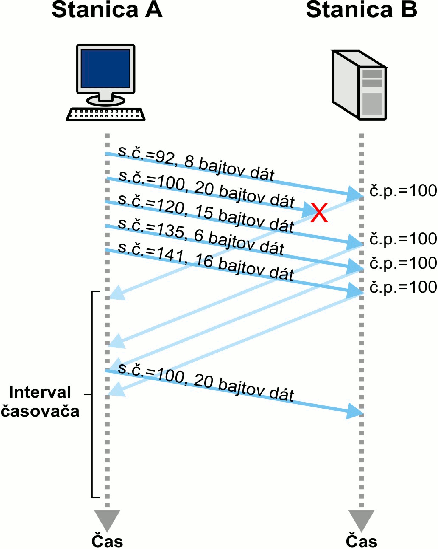
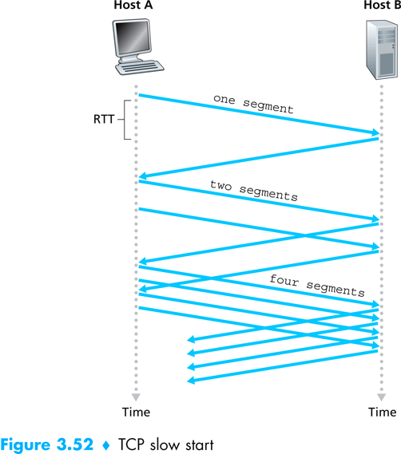
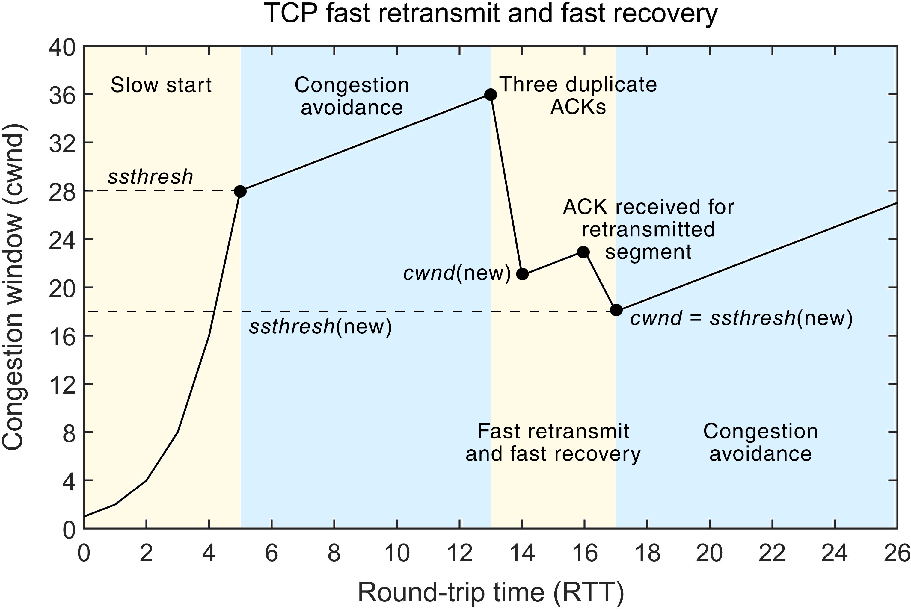

# Pokročílí 21: Prenos dát v TCP protokole

Pokračujeme vo vysvetľovaní TCP a dnes sa zameriame na proces prenášania dát.

## Prúd údajov

Dáta v TCP protokole nie sú prenášané ako správy, ale bajty sa medzi klientom a serverom prenášajú ako prúd údajov. To znamená, že dáta nemajú začiatok a koniec a je jedno, ako ich pri prenášaní rozkúskujeme. Pri TCP sa pošlú v nasledujúcich príkladoch úplne rovnaké dáta:

```python
sock.sendto(b"HELLO WORLD", addr)
```

```python
sock.sendto(b"HELLO ", addr)
sock.sendto(b"WORLD", addr)
```

```python
sock.sendto(b"HEL", addr)
sock.sendto(b"LLO W", addr)
sock.sendto(b"O", addr)
sock.sendto(b"RLD", addr)
```

Vo všetkých prípadoch druhej strane postupne prídu dáta `HELLO WORLD`. Pri prijímaní sa dáta taktiež nemusia načítať hneď všetky naraz. Hlavne pri veľkých dátach nám funkcia `sock.recvfrom()` vráti iba časť dát a musíme ju volať opakovane.

`recv()` vracia „koľko je práve dostupné“, nie „celú správu“!

TCP teda neposiela správy, nerieši začiatok a koniec jednotlivého posielania. TCP sa iba postará o to, aby všetky bajty dorazili a aby prišli v správnom poradí.

Aplikácie nad TCP tento problém riešia buď tak, že správy majú pevný počet bajtov, alebo si určia znak konca správy, napr. `\n`.

## Segmantácia

TCP nám ponúka nekonečný prúd bajtov, reálna sieť však stále pracuje s packetami a správami. TCP teda musí nejako tento prúd údajov rozkúskovať na menšie časti, a tie posielať po sieti. TCP správa sa volá **TCP segment**.

Rozdelenie dát na segmenty - tzv. segmentáciu - si vysvetlíme na príklade. Majme nasledovný kód, ktorý posiela väčšiu správu:

```python
sock.sendall(b"""Lorem ipsum dolor sit amet, consectetur adipiscing elit, 
sed do eiusmod tempor incididunt ut labore et dolore magna aliqua. 
Ut enim ad minim veniam, quis nostrud exercitation ullamco laboris 
nisi ut aliquip ex ea commodo consequat. Duis aute irure dolor in 
reprehenderit in voluptate velit esse cillum dolore eu fugiat nulla
 pariatur. Excepteur sint occaecat cupidatat non proident, sunt in 
 culpa qui officia deserunt mollit anim id est laborum.""")
```

Pre názornosť sa zameriame na začiatok správy.

{.on-glb width=600px}
/// caption
Dáta, ktoré chceme poslať cez TCP spojenie
///

Všetky dáta v prúde - streame - sa očíslujú, aby bolo pri posielaní možné zachovať poradie.

{.on-glb width=600px}
/// caption
Každý bajt má svoje poradie
///

Potom sa dáta rozkúskujú. Veľkosť jednotlivého kúsku je daná nastaveniami siete, v praxi dosahuje okolo 1kB. V nasledujúcom obrázku sú kúsky farebne oddelené.

{.on-glb width=600px}
/// caption
Dáta sa rozkúskujú do tzv. segmentov
///

Z takto rozkúskovaných dát sa potom vytvoria segmenty. Každý segment má v sebe číslo sekvencie, ktoré určuje **poradie prvého bajtu v danom segmente**. Pomocou tohto vieme potom zoradiť aj jednotlivé segmenty a nevadí, ak sa po ceste internetom vymení poradie segmentov.

{.on-glb width=600px}
/// caption
Každý segment má svoje poradie - poradie prvého bajtu v segmente
///

Dáta, ktoré chceme poslať sme si teda zabalili do segmentov a máme tak zoznam segmentov, ktorý budeme posielať po sieti druhej strane.

{.on-glb width=600px}
/// caption
Dáta vo forme očíslovaných segmentov
///

Odosielateľ zoberie každý jeden segment a postupne ich posiela druhej strane. Keďže TCP protokol zaručuje spoľahlovosť, **druhá strana na každý jeden prijatý segment musí odpovedať ACK správou**, ktorá informuje odosielateľa, že segment bol úspešne doručený!

## Posuvné okno

Ak by odosielateľ čakal na ACK odpoveď pred tým, ako by poslal ďalší segment, tak by to trvalo veľmi dlho a posielanie by bolo veľmi pomalé. TCP teda neposiela segmenty jeden po druhom, ale pošle vždy viacero segmentov naraz. Segmenty, ktoré sa práve posielajú tvoria tzv. **okno**, anglicky window.

{.on-glb width=600px}
/// caption
TCP posiela viacero segmentov naraz - červený obdĺžnik
///

Akonáhle prijímateľ potvdí prijatie segmentu, tak sa okno posunie a do okna sa dostanú ďalšie segmenty, ktoré sa pošlú.

{.on-glb width=600px}
/// caption
Ak prijímateľ potvrdí prijatie segmentu, okno sa posunie
///

{.on-glb width=600px}
/// caption
Nové segmenty, ktoré sa dostanú do okna, sa pošlú
///

Postupne sa tak okno posúva zoznamom segmentov. Úspešne odoslané segmenty môže odosielateľ vymazať zo svojej pamäte. Nové dáta vygenerujú nové segmenty, ktoré sa pripoja na koniec zoznamu, ktorým prechádza okno.

{.on-glb width=600px}
/// caption
Okno sa posúva naprieč segmentami
///

{.on-glb width=600px}
/// caption
Okno postupne prejde všetkými dátami, ktoré sa majú odoslať
///

## Retransmisia stratených segmentov

TCP teda vyžaduje, aby na každý odoslaný segment prijímateľ zareagoval potvrdzovacou ACK správou. Čo však, ak sa po ceste správa alebo segment stratí?

Prijímateľ vždy odošle ACK potvrdenie s informáciou o poradí, ktoré bajty už má úspešne prijaté. Ak nejaké segmenty neprídu, prijímateľ bude stále potvrzovať iba to poradie, ktoré má prijaté. To platí aj keď prídu ďalšie segmenty; prijímateľ ich bude ignorovať.

**ACK správa s číslom 100 znamená, že prijímateľ úspešne prijal všetky bajty očíslované 0 až 99 a je pripravený prijať bajty od čísla 100**

{.on-glb width=400px}
/// caption
Segment s číslom 100 sa stratí, Stanica B posiela ACK 100, aj keď prišli ďalšie segmenty
///

Pri strate TCP segmentu odosielateľ odošle pôvodny segment ešte raz. Bude ho odosielať až kým prijímateľ nepotvrdí, že ho dostal. Tento proces sa nazýva retransmisia. To, že došlo k strate segmentu odosielateľ zistí dvoma spôsobmi:

- Segment je považovaný za stratený, ak neprišla ACK odpoveď do určitého času (**timeout**).
- Prijímateľ poslal štyri rovnaké ACK odpovede (**tri duplikáty**). To znamená, že mu nejaký segment neprišiel a žiada o opätovné odoslanie

## Flow control

Posielaním segmentov v tzv. okne sa zrýchli prenos dát. Aké veľké okno má byť? Touto problematikou sa venuje tzv. Flow Control.

TCP Flow Control (riadenie toku dát) je mechanizmus, ktorý zabezpečuje, aby odosielateľ (sender) neposielal dáta rýchlejšie, než ich dokáže príjemca (receiver) spracovať.

Hlavný cieľ: zabrániť preplneniu buffera na strane príjemcu (receiver buffer overflow).

Ako to funguje? Príjemca v každom ACK pakete informuje, koľko bajtov je ešte chopný prijať (koľko má miesta vo svojom receive bufferi). Táto hodnota sa volá Receiver Window (`rwnd`, receive window). Sender smie poslať maximálne toľko bajtov, koľko je `rwnd`.

Ak prijímateľ z nejakého dôvodu nie je schopný prijímať dáta, alebo chce prijímanie pozastaviť, nastaví `rwnd` na nulu. Tento stav sa označuje ako *zero window*, pretože posuvné okno posielania sa nastaví na 0.

### Back pressure

{align=right width=300}

TCP Flow control je príklad implementácie tzv. **back pressure**.

*„Nenos mi viac tanierov, mám plný dres.“*

Backpressure (tlak späť, spätný tlak) je mechanizmus v systémoch spracovania dát (najmä v asynchrónnych, streamovacích a distribuovaných systémoch), ktorý zabezpečuje, aby rýchlejší producent dát nepreťažil pomalšieho konzumenta. 

Backpressure je spôsob, ako systém sám sebe povie „spomaľ, lebo nestíham“ – a tým zabraňuje pádom, strate dát a explózii pamäte v situáciách, keď producent je rýchlejší ako konzument.

## Congestion control

Pri flow control nám prijímateľ povedal, koľko dát vie zvládnuť a vedel tok dát spomaliť, ak nestíhal (back pressure), alebo ho na chvíľu úplne pozastaviť (zero window).

Čo však, ak prijímateľ je veľmi rýchly a výkonný, a je schopný prijímať veľké množstvo segmentov. Môžeme ho vždy poslúchnuť? 

Pre efektívne posielanie o rýchlosti nerozhoduje iba prijímateľ, ale aj stav danej siete. Niekedy je sieť pomalšia ako prijímateľ, môže byť zahltená, alebo ináč poškodená. Ak by sme vždy počúvali prijímateľa, mohli by sme takúto sieť zahltiť segmentami, a kým by prišli k prijímateľovi, ubehlo by veľa času a nastal by timeout. Odosielateľ by si myslel, že sa segmenty stratili a poslal by ich znova. Tým by zahltil sieť ešte viac a situácia by sa iba zhoršila.

Na ochranu pred zahltením a na kontrolu efektívneho posielania zo strany odosielateľa sa využíva tzv. *Congestion control*. Ten má dve hlavné časti:

- Slow Start (pomalý štart)
- Congestion Avoidance (vyhýbanie sa zahlteniu) + reakcia na zahltenie

### Slow start

Prvý režim pri Congestion control je tzv. **Slow start**, pri ktorom odosielateľ **začína posielať dáta v malom okne**, ktoré sa postupne zväčšuje. Ak prijímateľ stihne včas odpovedať ACK správou, **odosielateľ exponenciálne zväčšuje okno**, a tým aj počet segmentov, ktoré naraz posiela.

{.on-glb width=400px}
/// caption
Odosielateľ postupne zväčšuje okno
///

Cieľom Slow Startu je rýchlo zistiť, akú veľkosť okna (bandwidth) sieť zvládne, ale bez toho, aby sme sieť hneď zahltili.

Toto zväčšovanie okna trvá, až kým nenastane strata segmentov, alebo až kým nie je dosiahnutá žiadaná rýchlosť prenosu.

### Congestion Avoidance - lineárny rast

Po dosiahnutí požadovanej rýchlosti alebo pri strate segmentu sa prejde do opatrnejšieho režimu. V tomto režime Congestion Avoidance okno lineárne rastie a pri strate paketov prudko zníži okno (väčšinou na polovicu). Celý tento cyklus sa volá TCP congestion control a chráni sieť pred kolapsom.

{.on-glb width=600px}
/// caption
Congestion contol s režimom Slow Start a Congestion Avoidance
///

## Úlohy

!!! example "Úloha 21.1: ECHO server"

    Upravte server z cvičenia 20 tak, aby fungoval ako ECHO server. To znamená, že prepošle naspať všetky dáta, ktoré prijal.

!!! example "Úloha 21.2: Meranie času odozvy"

    Upravte klienta z úlohy 20.1 tak, aby odmeral čas, ktorý prešiel, kým server odpovedal na odoslanú správu. Skontrolujte, aby prijatá správa bola taká istá ako odoslaná, teda že šlo o ECHO server. Čas môžete merať napr. pomocou `time.time()`

    Pošlite 100 správ a odmerajte priemerný čas.

    1. Odmerajte čas odozvy vášho lokálneho servera (127.0.0.1)
    1. Odmerajte čas odozvy servera bežiaceho na učiteľovom počítači
    1. Odmerajte čas odozvy na ECHO serveri [https://tcpbin.com/](https://tcpbin.com/)

    Vyhodnoťte namerané údaje.

## Zhrnutie cvičenia

- [x] Prúd údajov
    * [ ] Dáta v TCP protokole nie sú prenášané ako správy, ale bajty sa prenášajú ako prúd údajov.
    * [ ] Dáta nemajú začiatok a koniec a je jedno, ako ich pri prenášaní rozkúskujeme.
    * [ ] Pri prijímaní sa dáta nemusia načítať všetky naraz. Pri veľkých dátach funkcia `sock.recvfrom()` vráti iba časť dát a musíme ju volať opakovane.
    * [ ] TCP teda neposiela správy, ale prúd bajtov a postará sa iba o to, aby všetky bajty dorazili a aby prišli v správnom poradí.
- [x] Segmentácia
    * [ ] Prúd údajov sa rozkúskuje na menšie časti. TCP správa sa volá TCP segment.
    * [ ] Všetky dáta v prúde - streame - sa očíslujú, aby sa zachovalo poradie.
    * [ ] Potom sa dáta rozkúskujú. Veľkosť kúsku je v praxi okolo 1kB. 
    * [ ] Z rozkúskovaných dát sa vytvoria segmenty. Každý segment má číslo sekvencie, ktoré určuje poradie prvého bajtu v segmente.
    * [ ] Segmenty sa postupne posielajú druhej strane. Druhá strana na každý jeden prijatý segment musí odpovedať ACK správou, potvrdzuje prijatie
- [x] Posuvné okno - sliding window
    * [ ] Ak by odosielateľ čakal na ACK odpoveď pred tým, ako by poslal ďalší segment, tak by to trvalo veľmi dlho a posielanie by bolo veľmi pomalé.
    * [ ] Pošle sa vždy viacero segmentov naraz. Odoslané segmenty tvoria tzv. okno
- [x] Retransmisia stratených segmentov
    * [ ] Prijímateľ vždy odošle ACK potvrdenie s informáciou, ktoré bajty už má úspešne prijaté. 
    * [ ] Ak nejaké segmenty chýbajú, prijímateľ bude stále potvrzovať iba to poradie, ktoré má prijaté.
    * [ ] Pri strate TCP segmentu odosielateľ odošle pôvodny segment ešte raz. Bude ho odosielať až kým prijímateľ nepotvrdí, že ho dostal. To sa nazýva retransmisia. 
    * [ ] To, že došlo k strate segmentu odosielateľ zistí dvoma spôsobmi:
    * [ ] 1. Segment je stratený, ak neprišla ACK odpoveď do určitého času (timeout).
    * [ ] 2. Prijímateľ poslal štyri rovnaké ACK odpovede (tri duplikáty). Chýba mu segment
- [x] Flow control (riadenie toku dát) - riadi prijímateľ
    * [ ] Je to mechanizmus, ktorý zabezpečuje, aby odosielateľ (sender) neposielal dáta rýchlejšie, než ich dokáže príjemca (receiver) spracovať.
    * [ ] Príjemca v každom ACK pakete informuje, koľko bajtov je ešte chopný prijať (koľko má miesta vo svojom receive bufferi).
    * [ ] TCP Flow control je príklad implementácie tzv. **back pressure**, ktorý zabezpečuje, aby rýchlejší producent dát nepreťažil pomalšueho konzumenta. 
- [x] Congestion control - ochrana pred zahltením - riadi odosielateľ
    * [ ] Pre efektívne posielanie o rýchlosti nerozhoduje iba prijímateľ, ale aj stav danej siete. 
    * [ ] Congestion control má dva hlavné režimy:
    * [ ] 1. Slow start, pri ktorom odosielateľ **začína posielať dáta v malom okne**, ktoré sa postupne zväčšuje. Ak prijímateľ stihne včas odpovedať ACK správou, **odosielateľ exponenciálne zväčšuje** okno, a tým aj počet segmentov, ktoré naraz posiela
    * [ ] 2. Congestion Avoidance, kedy **okno lineárne rastie** a pri strate paketov sa **prudko zníži okno** (väčšinou na polovicu).


!!! note "Poznámky do zošita"
    V zošite je potrebné mať napísané aspoň tieto poznámky:

    ```
    TCP neposiela správy, ale prúd údajov - bajtov.
    Časti dát nemajú začiatok a koniec, sock.recvfrom() často vráti iba časť dát

    Segmentácia

    Všetky bajty v prúde sa očíslujú, aby sa zachovalo poradie.
    Dáta sa rozkúskujú do častí, zvyčajne okolo 1kB. 
    Každý segment má číslo sekvencie, ktoré určuje poradie prvého bajtu v segmente.
    Prijímateľ musí každý segment potvrdiť ACK správou
    Kvôli rýchlosti sa posiela viacero segmentov naraz - tzv. posuvné okno - sliding window
    
    Retransmisia stratených segmentov
    
    ACK má v sebe informáciu, ktoré bajty má prijímateľ úspešne prijaté. 
    Pri strate TCP segmentu odosielateľ znova odošle pôvodny segment
    Segment je stratený:
    1. Ak neprišla ACK odpoveď do určitého času (timeout).
    2. Ak prijímateľ poslal štyri rovnaké ACK odpovede (tri duplikáty). Chýba mu segment

    Flow control (riadenie toku dát)
    
    Odosielateľ nemôže posielať dáta rýchlejšie, než ich dokáže príjemca spracovať
    Príjemca v každom ACK segmente informuje, koľko bajtov je ešte chopný prijať
    Flow control je tzv. back pressure - prijímateľ spomalí odosielateľa

    Congestion control - ochrana pred zahltením
    
    O rýchlosti nerozhoduje iba prijímateľ, ale aj stav danej siete.
    Dva hlavné režimy:
    1. Slow start - okno je na začiatku malé, ale rastie exponenciálne
    2. Congestion Avoidance - okno rastie lineárne a pri strate segmentu sa zníži na polovicu

    Flow control riadi prijímateľ, Congestion control riadi odosielateľ
    ```

!!! warning "Skúšanie a kontrola vedomostí"

    Okruhy otázok na test:

    - Akým spôsobom sa v TCP prenášajú dáta
    - Ako prebieha segmentácia dát v TCP
    - Na čo slúži posuvné okno
    - Čo je retransmisia stratených segmentov
    - Ako odosielateľ zistí, že sa segmenty stratili
    - Čo je flow control
    - Čo je congestion control, aké má režimy