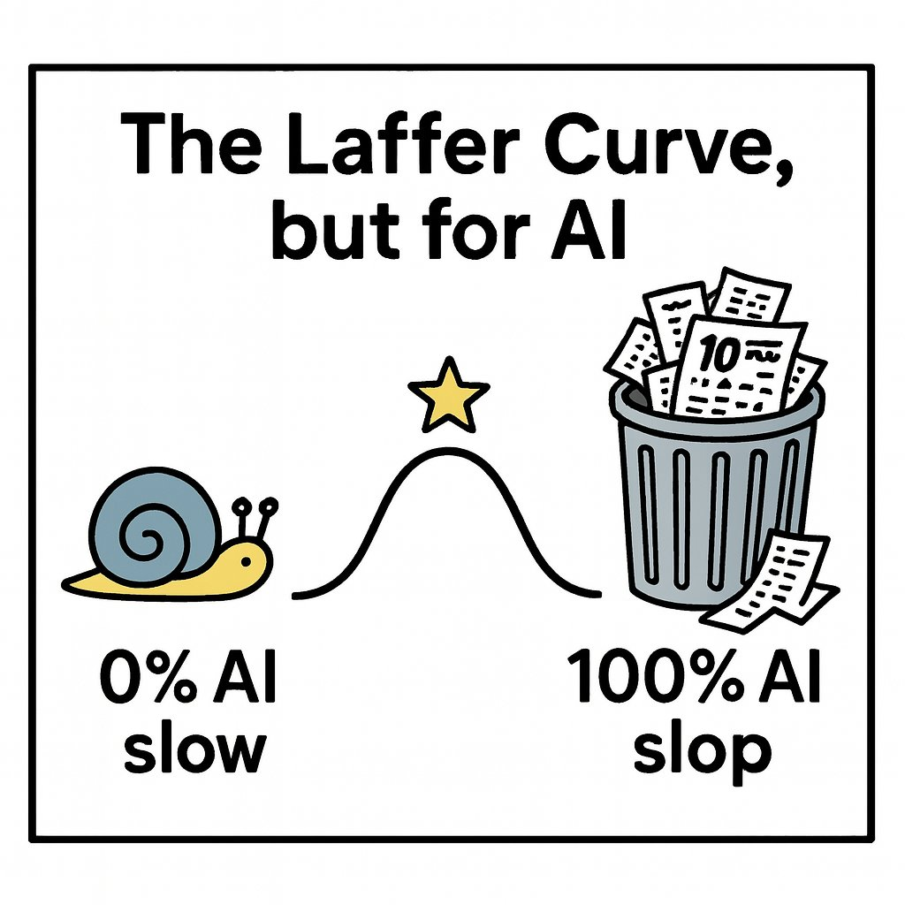
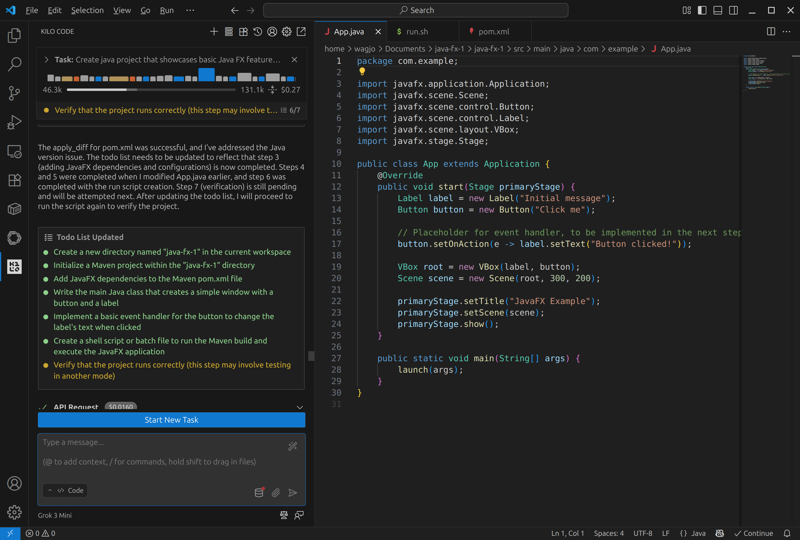

# Teória 1: Úvod a motivácia

<div class="md-has-sidebar" markdown>
  <main markdown>

Vitajte na predmete Objektovo orientované programovanie. Počas roka sa naučíte navrhovať a vytvárať softvér pomocou princípov OOP. Okrem toho sa zlepšíte v programovaní a softvérovom vývoji, naberiete nové vedomosti a praktické skúsenosti. Predmet je delený na 1 hodinu teórie a 2 hodiny cvičení. 

*[OOP]: Objektovo orientované programovanie
*[DSL]: Domain Specific Language

Tento predmet na škole vyučujeme už viacero rokov. Oblasť softvérového vývoja sa neustále vyvíja. Preto aj my sa budeme snažiť predstaviť vám prístupy, techniky a nástroje, ktoré sú moderné, sú používané v praxi a majú využitie naprieč celou oblasťou vývoja softvéru.

  </main>

  <aside>
<i>Prezentácia: <a href="../../assets/t01w.pdf">t01w.pdf</a></i>
  </aside>
</div>

## Nahradia nás AI agenti?

{ align=right width=400px}

AI nástroje *(Copilot, Cursor, Claude Code a agentické systémy)* už píšu veľkú časť kódu. Vo veľkých firmách ide o desiatky percent nového kódu; práca sa posunula od písania kódu k **špecifikácii**, **kontrole**, **architektúre** a **orchestrácii** agentov. Prieskumy hovoria, že vývojári trávia menej času písaním a viac **recenziou a overovaním AI výstupu**. 

Produktivita stúpla, **dôvera v AI kód je však nízka**. Firmy teda stále potrebujú ľudí, ktorí **výstupu rozumejú a nesú zaň zodpovednosť**. Ak AI agentov necháte robiť všetko za vás, budete vytvárať iba odpad, pomyje (AI slop). Takto generovaný kód sa rýchlo stane neprehľadným, ťažkopádnym a k riešeniu vášho problému sa nedopracujete.

### Majú programátori uplatnenie?

AI nenahradila vývojárov ako profesiu, no výrazne zmenila, čo sa od nich očakáva a kto sa dokáže zamestnať. Cieľom programovania totiž nikdy nebolo písať kód. Cieľom je vždy [vyriešit konkrétny problém a firme priniesť hodnotu](https://www.kalzumeus.com/2011/10/28/dont-call-yourself-a-programmer/), ktorá sa odzrkadlí v raste tržieb alebo poklese nákladov.

Programátorské miesta sa posunuli od písania kódu k **zadávaniu požiadaviek**, **návrhu systému** a **overovaniu** toho, čo vygeneruje AI. Tradičné juniorské pozície sú ohrozené a dopyt sa sústreďuje na seniorov.

To neznamená, že študent musí už hneď po strednej byť senior v korporátnom zmysle. Znamená to, že **seniorské zručnosti si musí budovať skôr a väčšinou sám**. 

Pred tým je však potrebné osvojiť si základy. Kto nepozná základy, robí tri typické chyby:

- **prijme kód, ktorý „vyzerá dobre“**. AI kód je pekne naformátovaný a sebavedomý. Chyby sú často logické, nie syntaktické. Bez predstavy o cykloch, stavoch, zložitosti a okrajových prípadoch tieto chyby nevidíte.
- **nevie zadať úlohu**. Špecifikácia úlohy („chcem toto, s týmito obmedzeniami, pri týchto dátach“) je programovanie v hlave. Kto nevie rozložiť problém, dostane od AI náhodný prototyp, nezapadajúci do celkového riešenia.
- **nevie opraviť zlyhanie**. Produkcia padá na veciach, ktoré AI „skoro trafí“. Debugging bez modelu výpočtu je hádanie.


{ .on-glb }
/// caption
Použitie AI agenta Kilo Code a Grok 3 mini vo Visual Studio Code na vytvorenie JavaFX projektu
///

Na tomto predmete máte príležitosť naučiť sa základy a tak isto aj pokročilé zručnosti v oblasti programovania. Pri učení základov je častým pokušením nechať za seba rozmýšľať umelú inteligenciu. Ak tomu odoláte, budete rýchlo napredovať a po škole si prácu nájdete oveľa jednoduchšie.

## Čo je objektovo orientované programovanie

Programovanie sa vyvíjalo od nízkoúrovňových jazykov k postupne zložitejším paradigmám. Objektovo orientované programovanie predstavuje jednu z nich. 

Paradigma určuje spôsoby, akým by sa malo riešenie danej úlohy - *implementácia* - vyjadriť a zapísať v danom programovacom jazyku. Programovacích paradigiem je veľké množstvo a jeden programovací jazyk ich často podporuje viacero. V jazyku Python a aj v jazyku Java sa stretneme s nasledovnými:

* *Štruktúrované programovanie* - používanie sekvencie príkazov, podmienok, cyklov, a blokov kódu
* *Procedurálne programovanie* - rozdelenie kódu na podprogramy či funkcie, ktoré sa vedia navzájom volať 
* *Objektovo orientované programovanie* - používanie objektov, zapuzdrenia a polymorfizmu
* *Funkcionálne programovanie* - funkcie bez názvu, schopnosť funkciu posielať ako argument, alebo návratovú hodnotu
* *Súbežné programovanie* - rozdelenie programu do častí, ktoré sú vykonávané súbežne, teda úlohy sú vykonávané súčasne naraz

<div class="md-has-sidebar" markdown>
  <main markdown>
Na predchádzajúcich predmetoch ste sa naučili technikám štruktúrovaného a procedurálneho programovania. Tie budete využívať aj naďalej a k nim na tomto predmete pridáme programovanie objektovo orientované.

!!! tip "Učím sa s pomocou umelej inteligencie"

    Som študent strednej školy, a učím sa objektové programovanie. Uveď [krátku históriu rôznych typov programovacích jazykov](https://chatgpt.com/share/68b363bf-4888-8011-bf48-d9c73d8e0115).

Objektovo orientované programovanie vzniklo z potreby zvládať komplexnosť. OOP sa snaží modelovať programy prirodzenejšie, podľa sveta okolo nás. Umožňuje nám organizovať kód intuitívnym spôsobom.

Objektovo orientované programovanie nám prináša nové možnosti abstrakcie. Pomocou nich vieme zložité systémy zjednodušiť tak, že sa zameriame na podstatné vlastnosti a nepotrebné detaily skryjeme. 

Cieľom zavedenia objektovo orientovaného programovania je tiež zlepšenie organizácie kódu a znovupoužiteľnosť. Raz napísaný kód objektu môžeme použiť znovu na iných miestach alebo aj neskôr v iných programoch. Ak pracujete v tíme, pomocou objektov si budete vedieť problém lepšie rozdeliť medzi seba.
  </main>

  <aside markdown>
Objektové programovanie sa stalo populárnym v 90. rokoch minulého storočia a dlhú dobu bolo hlavným spôsobom tvorby softvéru. Jeho používanie pretrvalo dodnes a má svoje reálne uplatnenie. Niektoré jeho aspekty sa však po rokoch ukázali ako príliš zložité alebo nevhodné a v dnešnom modernom programovaní sa prestávajú používať. 

V prípadoch, kde je použitie OOP príliš rozvláčne alebo pridáva zbytočnú zložitosť sa v súčasnosti využívajú iné paradigmy ako napríklad programovanie funkcionálne, deklaratívne alebo sa použijú malé doménovo špecifické jazyky (DSL)
  </aside>
</div>


## Programovací jazyk Java

<div class="md-has-sidebar" markdown>
  <main markdown>
  { align=left width=100px }

  Java patrí dlhodobo medzi najpopulárnejšie a najväčšie programovacie jazyky a softvérové vývojové platformy. Za svoju dlhú históriu prešiel mnohými zmenami a vylepšeniami a aj dnes dokáže obstáť v konkurencii iných moderných jazykov. Objektovo orientované zameranie patrí medzi jeho základné vlastnosti, ale programátorom umožňuje používať aj iné paradigmy.

  Medzi najväčšie konkurenčné výhody platformy Java patrí:

  * Špičkový virtuálny stroj Java Virtual Machine (JVM), ktorý umožňuje spúšťať Java programy nezávisle od operačného systému alebo hardvéru 
  * Mohutná sada štandardizovaných knižníc Java API, ktoré môžu vývojári použiť na bežné programovacie úlohy bez toho, aby museli písať kód od začiatku
  * Obrovský ekosystém knižníc, frameworkov a nástrojov, rokmi otestovaných v praxi
</main>
  <aside markdown>
Prieskum najnovších trendov a technológií v oblasti softvérového vývoja nájdete v [The 2025 Developer Survey](https://survey.stackoverflow.co/2025/) firmy Stack Overflow.
  </aside>
</div>

Pre ekosystém a platformu Java sú typické nasledovné vlastnosti:

* *Platformová nezávislosť* - Kód sa prekladá do tzv. bajtkódu (bytecode) a beží na JVM. Mottom Javy je Napíš raz, spusti všade (Write Once, Run Anywhere, WORA).
* *Statické typovanie* - typy premenných sú známe a kontrolované už pri kompilácii
* *Dlhodobá stabilita a kompatibilita, vysoká bezpečnosť* - Staré Java programy často bežia aj na nových verziách JVM bez úprav
* *Podpora paralelizmu, multithreadingu a distribuovaných systémov* - Zabudovaná podpora pre viacvláknové aplikácie a súbežné spracovanie dát.
* *Všestrannosť použitia, škálovateľnosť a vysoký výkon* - Java je vhodná pre webové, mobilné a aj veľké podnikové aplikácie

Java sa dnes využíva hlavne vo veľkých enterprise systémoch, webových back-endoch, cloudových aplikáciách a finančných systémoch. Je taktiež aj dominantnou platformou na vývoj mobilných Android aplikácií. Tam je populárnym jazyk Kotlin, ktorý beží nad platformou Java a ponúka jednoduchšiu syntax.

Hlavné nevýhody Javy sú nižší výkon v porovnaní s low-level jazykmi a vyššia spotreba pamäte. Ďalej je to "verbózna", teda príliš ukecaná syntax, kedy často aj jednoduchá vec je zapísaná na desiatkách riadkov. Z dôvodu použitia JVM majú programy v Jave pomalší štart aplikácií (to sa však dnes dá riešiť špeciálnym kompilátorom). Statické typovanie a mohutnosť jazyka, knižníc a nástrojov sú často pre začínajúcich programátorov zložité na pochopenie.

## Zhrnutie teórie

- [x] AI transformovala programovanie
    * [ ] Vývojári trávia menej času písaním a viac recenziou a overovaním AI výstupu
    * [ ] Slepá dôvera v AI vedie k produkovaniu AI odpadu
- [x] Bez znalosti základov sa robia 3 typické chyby
    * [ ] prijme sa kód, ktorý „vyzerá dobre“, ale je logicky chybný
    * [ ] nevie sa správne zadať úloha. AI vyprodukuje náhodný prototyp, nezapadajúci do celkovej architektúry.
    * [ ] neschopnosť opraviť zlyhanie u vecí, ktoré AI „skoro trafí“
- [x] Objektovo orientované programovanie ako paradigma
    * [ ] Je spôsob, ako zvládať komplexnosť programov
    * [ ] Modeluje svet podobne ako ho vnímame my
    * [ ] Zavádza používanie objektov, zapuzdrenia a polymorfizmu
    * [ ] Implementácia - praktické uskutočnenie alebo naprogramovanie určitého návrhu alebo algoritmu
    * [ ] Abstrakcia - proces, pri ktorom sa zameriavaš len na dôležité vlastnosti a skrývaš nepodstatné detaily.
- [x] Programovací jazyk Java
    * [ ] Možnosť používať objektovo orientované a aj funkcionálne programovanie
    * [ ] Používa statické typovanie, kde typy premenných sú známe a kontrolované už pri kompilácii
    * [ ] Dlhodobo stabilný a kompatibilný, s vysokou bezpečnosťou
    * [ ] Virtuálny stroj Java Virtual Machine (JVM) umožňuje spúšťať programy nezávisle od operačného systému alebo hardvéru
    * [ ] Ponúka mohutnú sadu knižníc, nástrojov a štandardizované Java API
    * [ ] Dominuje v podnikových aplikáciách a v prostredí Android

!!! note "Poznámky do zošita"
    V zošite je potrebné mať napísané aspoň tieto poznámky:

    ```
    AI

    AI Asistent - odpovedá na otázky
    AI Agent - samostatne vykonáva úlohy
    AI Slop - odpad, vznikne ak AI slepo dôverujem


    OBJEKTOVO ORIENTOVANÉ PROGRAMOVANIE

    Paradigmy v programovaní:
    - Štruktúrované
    - Procedurálne
    - Objektovo orientované
    - Funkcionálne

    Vlastnosti:
    - intuitívne modely podľa nášho sveta
    - zvláda väčšiu komplexnosť
    - znovupoužitie


    JAZYK JAVA

    Vlastnosti:
    - objektovo orientovaný
    - platformovo nezávislý 
    - staticky typovaný

    Použitie:
    - Android aplikácie
    - webový back-end
    - distribuované systémy (cloud)

    Platformová nezávislosť:
    - kód sa kompiluje do bytecode a beží nad JVM
    - motto Javy: Write Once, Run Anywhere (WORA)
    - virtuálny stroj JVM (Java Virtual Machine)
    ```

!!! warning "Skúšanie a kontrola vedomostí"

    Na ďalšej hodine budeme kontrolovať nasledovné veci:

    - Zapísané poznámky z hodiny vo vašom zošite

    Ústne skúšanie:

    - Aká je úloha programátora vo svete, kde sa používajú AI asistenti a agenti?
    - Aké typické chyby robí programátor pri používaní AI, ak neovláda základy?
    - Aké rôzne programovacie paradigmy poznáme?
    - Z akej potreby vzniklo objektové programovanie?
    - Čo nové nám OOP prináša?
    - Aké sú typické vlastnosti jazyka Java?
    - Bonus: Čo znamená: Napíš raz, spusti všade (Write Once, Run Anywhere, WORA)?
    - Bonus: Aké sú nevýhody jazyka Java?
    - Bonus: Čo znamená skratka JVM, na čo slúži?
