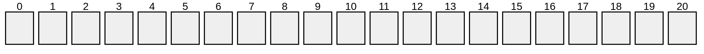
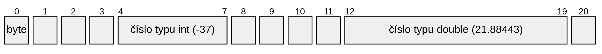
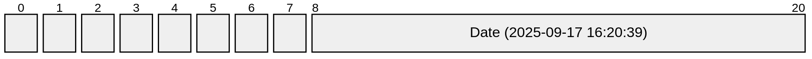
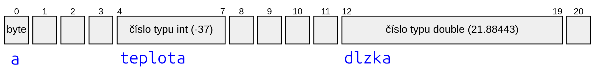
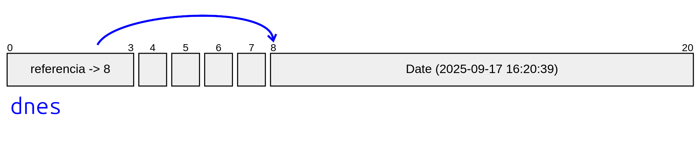
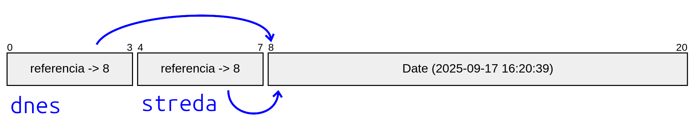

# Teória 2: Algoritmus, dátové typy a premenné

Keďže sa na tomto predmete budeme oháňať pojmom algoritmus, dnes si ho zadefinujeme. Povenujeme sa tiež dátovým typom v Jave, premenným a konštantám. Ukážeme si, ako sú tieto veci reprezentované v pamäti počítača. Je to nutné pre správne pochopenie správania týchto konceptov.


## Algoritmus

Algoritmus je *postupnosť presne definovaných krokov, ktoré musíme realizovať, aby sme vyriešili úlohu a dosiahli výsledok.*

Inými slovami, je to taký návod alebo recept, podľa ktorého vieme postupovať, aby sme zadaný problém vyriešili.
Algoritmus napísaný v programovacom jazyku sa volá program.

Nie každá postupnosť krokov je algoritmus. Musí mať aj určité vlastnosti.
Známy teoretický informatik Donald Knuth definuje tieto vlastnosti, ktoré algoritmus musí spĺňať:

- *Konečnosť*: Algoritmus musí skončiť po konečnom počte krokov
- *Determinovanosť*: Každý krok musí byť jednoznačne definovaný, vždy vieme aká činnosť má nasledovať
- *Vstup*: Pracuje so vstupnými hodnotami, ktoré sú mu odovzdané pred začatím jeho vykonávania
- *Výstup alebo Rezultatívnosť*: Algoritmus musí riešiť zadaný problém a dať výsledok
- *Efektívnosť*: Má sa uskutočniť v čo najkratšom čase a s využitím čo najmenšieho množstva prostriedkov


## Dáta v počítačí

<div class="md-has-sidebar" markdown>
  <main markdown>
Ako sme si povedali vyššie, algoritmus prijíma nejakú vstupnú hodnotu a riešením algoritmu je jeho výstup, opäť nejaká hodnota. Tak isto aj každý počítačový program pracuje s nejakými údajmi - dátami. Tieto dáta môžu byť rôzneho typu: čísla, znaky, súbory, obrázky, videá, ...

Údaje sú v počítačí uložené v jeho pamäti, napr. RAMke, disku, USB kľúči a pod. Počítačová pamäť tieto dáta uchováva vo forme sekvencie bajtov. Čím väčšie dáta, tým viac bajtov v pamäti počítača zaberajú. Dnes je bežné mať súbory veľkosti niekoľkých megabajtov alebo gigabajtov.

!!! info "Čo je bajt?"

    Bajt je jednotka informácie. Aj keď jeho veľkosť môže byť rôzna, v súčasnosti sa 1 bajt vo väčšine počítačov skladá zo sekvencie ôsmich bitov a teda môže nadobúdať 2^8^ = 256 rôznych hodnôt.

    A čo je bit? Bit je úplne najzákladnejšia jednotka informácie. Je to binárna hodnota, ktorá môže mať iba 2 stavy: pravda alebo nepravda, zapnutý alebo vypnutý, 1 alebo 0.
  </main>

  <aside markdown>


Pohľad cez mikroskop na bajty vypálene do CD-čka. Laser číta dáta po riadkoch a vypálené miesta predstavujú binárnu 1 a nevypálené miesta sú 0. (Dlhšia "čiarka" znamená, že za sebou ide viac jedničiek).
  </aside>
</div>

### Ako si predstaviť pamäť počítača?

Predstavte si školskú šatňu. Nie hocijakú, ale takú, v ktorej sú skrinky v jednom rade za sebou, a je ich strašne veľa. Každá skrinka je rovnako veľká a má svoje poradové číslo. Ak si potrebujem odložiť nejakú vec, nájdem voľnú skrinku a svoju vec dám do nej. Ak je vec veľmi veľká, rozdelím ju na menšie časti a dám do viacerých skriniek za sebou.

Takto nejako vyzerá aj pamäť počítača. Veľkosť skrinky je jeden bajt a poradové číslo skrinky sa volá adresa.

{.on-glb}
/// caption
Pamäť počítača ako očíslované skrinky v šatni
///


## Dáta v Jave

V jazyku Java delíme dátove typy na dve veľké skupiny: **Primitívne dátové typy** a **neprimitívne dátové typy**

### Primitívne dátové typy

<div class="md-has-sidebar" markdown>
  <main markdown>
Primitívne dátové typy píšeme malými písmenami. Java má 8 primitívnych dátových typov: `boolean`, `byte`, `char`, `short`, `int`, `long`, `float` a `double`.

Pomocou primitívnych dátových typoch si vieme určiť, koľko bajtov má daná hodnota zaberať v pamäti počítača. Java nám týmto spôsobom dáva možnosť optimalizovať naše algoritmy tak, aby nezaberali príliš veľa miesta a boli efektívnejšie.
  </main>

  <aside markdown>
Primitívne dátové typy so sebou prinášajú značnú zložitosť, a to hlavne v porovnaní s jazykmi ako Python, kde neriešime, koľko bajtov v pamäti daná hodnota zaberá.
  </aside>
</div>

=== "Primitívne dátové typy"

    | Kategória | Typ        | Veľkosť  | Rozsah hodnôt |
    |-----------|------------|---------------|-------|
    | Celé číslo | `byte`    | 8 bitov (1 bajt)  | -128 až 127 |
    | Celé číslo | `short`   | 16 bitov (2 bajty)  | -32768 až 32767 |
    | Celé číslo | `int`     | 32 bitov (4 bajty)  | -2147483648 až 2147483647 |
    | Celé číslo | `long`    | 64 bitov (8 bajtov) | -9223372036854775808 až 9223372036854775807 |
    | Číslo s pohyblivou rádovou čiarkou | `float` | 32 bitov (4 bajty)  | nižšia presnosť |
    | Číslo s pohyblivou rádovou čiarkou | `double` | 64 bitov (8 bajtov) | vyššia presnosť |
    | Znak | `char`    | 16 bitov (2 bajty) | 65536 rôznych znakov |
    | Logická hodnota | `boolean`    | 8 bitov (1 bajt) | `true` alebo `false` |

Hodnoty takýchto dátových typov potom v pamäti zaberajú rôznu veľkosť.

{.on-glb}
/// caption
Primitívne hodnoty v pamäti počítača
///


### Neprimitívne dátové typy

Primitívnych typov máme v Jave 8, všetko ostatné sú typy neprimitívne. Je ich strašne veľa a vieme si aj vytvárať vlastné. 

Príklad neprimitívnych dátových typov: `File`, `Date`, `Map`, `String`, `Array`.

Hodnoty neprimitívnych dátových typov sú vždy objekty (čo presne je objekt si povieme nabudúce). V pamäti počítača zaberajú rôzne veľa miesta, od pár desiatok bajtov až po gigabajty.

{.on-glb}
/// caption
Neprimitívna hodnota v pamäti počítača. (Obrázok je zjednodušený. Dátum, teda objekt triedy `Date` v skutočnosti zaberá 32 bajtov.)
///

!!! tip "Učím sa s pomocou umelej inteligencie"

    Som študent strednej školy, učím sa Javu. Prečo má Java primitívne a neprimitívne dátové typy? [Nemohlo byť všetko neprimitívne?](https://grok.com/share/c2hhcmQtMg%3D%3D_d3699b72-9ce9-4288-90fe-f44fe6eada15)


## Premenné a konštanty

**Premenná je pomenovanie alebo názov nejakého miesta v pamäti počítača, na ktoré potom môžem ukladať údaje.** Ak ostaneme pri prirovnaní so skrinkami v šatni, tak premenná je niečo také ako keď si označíte v šatni skrinku svojim menom. Nemusíte potom nikomu hovoriť, že *"daj veci do skrinky č. 23"*, ale poviete, *"daj veci do Ferovej skrinky"*.

<div class="md-has-sidebar" markdown>
  <main markdown>
Keďže Java je staticko typovaný jazyk, pri deklarácii (vytváraní) premennej *musíme počítaču povedať, aký dátový typ má premenná obsahovať*. Podľa toho potom Java vie, koľko miesta v pamäti počítača má pre danú premennú obsadiť (koľko skriniek v šatni).

=== "Príklad vytvorenia primitívnych premenných v Jave - declaration"

    ```java
      byte a;
      int teplota;
      double dlzka;
    ```

Po deklarovaní premennej jej môžeme priradiť nejakú hodnotu. Robíme to pomocou operátora priradenia `=`. Po anglicky sa to volá *assignment*. Kompilátor jazyka Java sa postará o to, že priradiť môžeme iba hodnotu dátového typu danej premennej.
  </main>
  <aside markdown>
{widths=100}
  
  Názvy premenných píšeme malými písmenami. Ak je premenná zložená z viacerých slov, používame tzv. Camel Case, kde každé ďalšie slovo začneme veľkým písmenom. Príklad: `startDate`, `end`, `topRight`
  </aside>
</div>

=== "Príklad priradenia hodnôt - assignment"

    ```java
      teplota = -37;
      dlzka = 21.88443;
    ```

<div class="md-has-sidebar" markdown>
  <main markdown>
Tieto dve operácie (deklaráciu a priradenie) vieme spojiť do jedného kroku. Prvé priradenie hodnoty do premennej sa volá **inicializácia**.

=== "Deklarácia a inicializácia primitívnych premenných - initialization"

    ```java
      int teplota = -37;
      double dlzka = 21.88443;
    ```


  </main>
  <aside markdown>
Ak by sme zabudli premennú inicializovať a chceli ju použiť pred tým, ako jej priradíme nejakú hodnotu, Java sa postará o tom, aby bola premenná pred prvým použitím automaticky inicializovaná na tzv. *default* hodnotu, čo pri číslach predstavuje číslo 0.</aside>
</div>

{.on-glb}
/// caption
Primitívne premenné v pamäti počítača
///


### Neprimitívne premenné

{align=right width=150}

Neprimitívne premenné sú v Jave implementované veľmi špeciálne. Neprimitívna hodnota - objekt - sa neukladá priamo do premennej, ale objekt je v pamäti uložený samostatne a premenná v sebe obsahuje iba odkaz na túto hodnotu. Takýto odkaz nazývame **referencia**.

V nasledujúcom príklade v jednom kroku vytvoríme nový objekt a priradíme ho do premennej.

=== "Príklad neprimitívnej premennej"

    ```java
      Date dnes = new Date();
    ```

Vytvorili sme 2 údaje v pamäti počítača. Ako prvé sme vytvorili objekt (pomocou operátora `new`) a ten sme potom počas inicializácie priradili novo vytvorenej premennej `dnes`. Hodnota neprimitívnej premennej - referencia - obvykle zaberá v Jave 32 bitov (4 bajty).

{.on-glb}
/// caption
Neprimitívna premenná v pamäti počítača
///


Ak potom vytvoríme inú premennú a priradíme do nej ten istý objekt, tento objekt v pamäti nebude dvakrát, ale iba raz. Obidve premenné budú teda odkazovať na ten istý objekt. *(To by sa nám pri primitívnych dátových typoch nestalo, tam by sa skopírovala hodnota a bola by v pamäti v každej premennej zvlášť.)*

=== "Dve premenné ukazujú na ten istý objekt"

    ```java
      Date dnes = new Date();
      Date streda;
      streda = dnes; 
    ```

{.on-glb}
/// caption
Viac premenných ukazuje na jeden objekt
///

{align=left width=180}

Načo je to dobré vedieť? Nie je jedno, ako to v počítači funguje? Pochopenie, ako fungujú neprimitívne premenné - referencie - je potrebné pre to, aby sme pochopili správanie programu. Keďže obidve premenné v predchádzajúcom príklade ukazujú na ten istý objekt, **ak sa tento objekt zmení, zmenu bude vidieť vo všetkých premenných**, ktoré sa na tento objekt odkazujú! 

<div class="md-has-sidebar" markdown>
  <main markdown>
A prečo to takto divne funguje? Nemohlo by byť všetko kopírované tak ako pri primitívnych premenných? Problém je, že kopírovanie je pre počítač náročná operácia, ak je objekt zložitý. Ak by sa objekty kopírovali pri každom priradení premennej, trvalo by to dlho a mohli by sme rýchlo zaplniť pamäť počítača. Takto sa kopíruje iba 4 bajtová referencia, čo je veľmi rýchla operácia. 
  </main>
  <aside markdown>
No dobre, ale čo ak chcem objekt skopírovať, aby mi ho nikto iný nemohol meniť? Takáto operácia sa v jazyku Java volá klonovanie a robí sa to pomocou metódy `clone()`. Viac si o tom povieme niekedy nabudúce.</aside>
</div>


!!! info "Ako je to v jazyku Python?"

    V jazyku Python neexistujú primitívne dátové typy. Všetky premenné sú implementované podobne ako neprimitívne premenné v Jave. V Pythone je každá hodnota objekt a premenná obsahuje vždy referenciu na objekt.


### Konštanty

<div class="md-has-sidebar" markdown>
  <main markdown>
Konštanty v Jave sú ako premenné, ale s tým rozdielom, že im hodnotu môžeme priradiť iba raz a potom sa už viac nesmú meniť. Kontrolovať to bude kompilátor jazyka a pri akomkoľvek pokuse o zmenu vypíše chybu.

Konštantu zadeklarujeme pomocou slovíčka `final`, ktoré dáme na začiatok deklarácie.

=== "Príklad konštanty"

    ```java
      final double PI = 3.1415926535;
      final int DEFAULT_PAGE_SIZE = 15;
    ```

Použitie konštánt v kóde zlepšuje jeho čitateľnosť a zjednodušuje údržbu programu.

  </main>
  <aside markdown>
{widths=100}
  
  Názvy konštánt píšeme VEĽKÝMI písmenami. Ak je premenná zložená z viacerých slov, používame tzv. Screaming Snake Case, kde medzi slová vložíme znak `_`. Príklad: `PI`, `MAX_INTEGER`, `DEFAULT_SIZE`
  </aside>
</div>

**Neprimitívne konštanty sa opäť správajú špeciálne**. Nakoľko ich hodnoty sú referencie (odkazy), takáto konštanta sa nebude môcť meniť v zmysle, že už nebude môcť ukazovať na iný objekt. Samotný objekt, ak je meniteľný, sa však meniť môže. A to aj v prípade, ak sa na neho ukazuje pomocou konštanty.

Preto majú neprimitívne konštanty využitie hlavne v prípadoch, kedy aj samotný objekt je od začiatku nemenný. Príkladom takého typu objektov je reťazec znakov `String`, ktorého hodnota sa po vytvorení nedá viac meniť (po anglicky je tzv. *immutable*)

=== "Príklad neprimitívnej konštanty"

    ```java
      final String APP_NAME = "Moje aplikácia";
      final String DEFAULT_COUNTRY_CODE = "SVK";
    ```

!!! tip "Učím sa s pomocou umelej inteligencie"

    Som študent strednej školy, učím sa Javu. Napíš 3 nie zložité príklady na:

    - [použitie primitívnych premenných](https://grok.com/share/c2hhcmQtMg%3D%3D_bd8c4a37-fb13-4355-b7cc-35d0b8b5c59b)
    - [použitie neprimitívnych premenných](https://grok.com/share/c2hhcmQtMg%3D%3D_d88a5c92-b2f8-4062-a85a-d5f386d6e022)
    - [použitie primitívnych a neprimitívnych konštánt](https://grok.com/share/c2hhcmQtMg%3D%3D_7798241c-9898-4e5b-9b90-5724a67d21c0)


## Zhrnutie teórie

- [x] Algoritmus je postupnosť presne definovaných krokov, ktoré musíme realizovať, aby sme vyriešili úlohu a dosiahli výsledok. Musí mať aj určité vlastnosti:
    * [ ] *Konečnosť:* Algoritmus musí skončiť po konečnom počte krokov
    * [ ] *Determinovanosť:* Každý krok musí byť jednoznačne definovaný, vždy vieme aká činnosť má nasledovať
    * [ ] *Vstup:* Pracuje so vstupnými hodnotami, ktoré sú mu odovzdané pred začatím jeho vykonávania
    * [ ] *Výstup alebo Rezultatívnosť:* Algoritmus musí riešiť zadaný problém a dať výsledok
    * [ ] *Efektívnosť:* Má sa uskutočniť v čo najkratšom čase a s využitím čo najmenšieho množstva prostriedkov
- [x] Dáta v počítačí
    * [ ] Počítačová pamäť uchováva dáta vo forme sekvencie bajtov
    * [ ] Pamäť počítača je ako očíslované skrinky v šatni - každý bajt má svoju adresu
    * [ ] Bajt je jednotka informácie, môže nadobúdať 2^8^ = 256 rôznych hodnôt
    * [ ] Bit je binárna hodnota, ktorá môže mať iba 2 stavy
- [x] Primitívne dátové typy
    * [ ] Java má 8 primitívnych dátových typov
    * [ ] logický typ: `boolean`
    * [ ] celé čísla: `byte`, `short`, `int`, `long`
    * [ ] čísla s pohyblivou rádovou čiarkou: `float` a `double`
    * [ ] znaky: `char`
- [x] Neprimitívne dátové typy
    * [ ] Je ich strašne veľa a vieme si aj vytvárať vlastné. 
    * [ ] Hodnoty neprimitívnych dátových typov sú vždy objekty
    * [ ] Príklad neprimitívnych dátových typov: `File`, `Date`, `Map`, `String`, `Array`
- [x] Premenné
    * [ ] Premenná je pomenovanie alebo názov nejakého miesta v pamäti počítača, na ktoré potom môžem ukladať údaje
    * [ ] Premenná má typ, názov a hodnotu
    * [ ] Hodnotu vkladáme pomocou operátora priradenia `=`
    * [ ] Neprimitívna premenná neukladá hodnotu priamo, ale v sebe obsahuje iba odkaz na túto hodnotu
    * [ ] Neprimitívna premenná obsahuje referenciu na objekt
    * [ ] Viacero premenných môže ukazovať na ten istý objekt
- [x] Konštanty
    * [ ] Konštanty v Jave sú ako premenné, ale s tým rozdielom, že im hodnotu môžeme priradiť iba raz a potom sa už viac nesmú meniť.
    * [ ] Konštantu zadeklarujeme pomocou slovíčka final, ktoré dáme na začiatok deklarácie
    * [ ] Neprimitívna konštanta sa nebude môcť meniť v zmysle, že už nebude môcť ukazovať na iný objekt. Samotný objekt, ak je meniteľný, sa však meniť môže

!!! note "Poznámky do zošita"
    V zošite je potrebné mať napísané aspoň tieto poznámky:

    ```
    ALGORITMUS

    Postupnosť presne definovaných krokov na dosiahnutie výsledku. 
    
    Algoritmus musí mať tieto vlastnosti:
    - Konečnosť
    - Determinovanosť
    - Vstup
    - Výstup
    - Efektívnosť


    DÁTOVÉ TYPY V JAVE

    Java má 8 primitívnych dátových typov
    - boolean
    - byte, short, int, long
    - float a double
    - char
    
    Neprimitívne dátové typy
    - Vieme si vytvárať vlastné
    - Ich hodnoty sú objekty
    - Príklad: File, Date, Map, String, Array


    PREMENNÉ

    Premenná je pomenovanie alebo názov nejakého miesta 
    v pamäti počítača, na ktoré potom môžem ukladať údaje

    Vlastnosti:
    - Premenná má typ, názov a hodnotu
    - Príklad: int teplota = -37;
    - Neprimitívna premenná obsahuje referenciu na objekt
    - Viacero premenných môže ukazovať na ten istý objekt

    Konštanty:
    - Sú ako premenné, ale nemôžu meniť svoju hodnotu
    - Deklarujeme ich pomocou slovíčka final
    - Ak chceme neprimitívnu konštantu, objekt musí byť nemenný
    - Príklad: final double PI = 3.1415;

    ```

!!! warning "Skúšanie a kontrola vedomostí"

    Na ďalšej hodine budeme kontrolovať nasledovné veci:

    - Zapísané poznámky z hodiny vo vašom zošite

    Ústne skúšanie alebo krátka 5-minútovka:

    - Čo je algoritmus? Aké vlastnosti musí spĺňať?
    - Ako delíme dátové typy v Jave?
    - Aká primitívne dátové typy poznáte?
    - Čo sú neprimitívne dátové typy? Uveďte príklady.
    - Čo je premenná, ako sa deklaruje a ako sa jej priradzuje hodnota?
    - Čo je neprimitívna premenná a ako sa správa?
    - Čo je konštanta a ako funguje?
