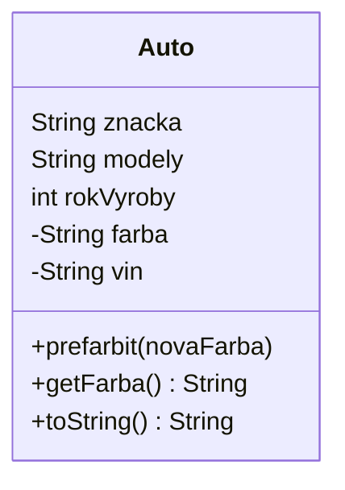
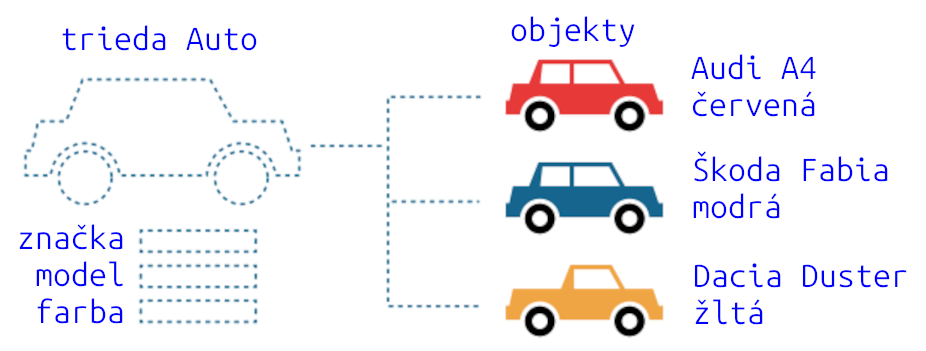

# Teória 4: Trieda, balíky

V tejto časti vás oboznámime s triedami v Jave. Vysvetlíme si na čo slúžia, ako sa vytvárajú a ukážeme si ich reprezentáciu v UML diagramoch. Predstavíme si tiež balíky tried a modifikátory prístupu.

Jednotlivé koncepty si detailne preberieme na iných hodinách. Dnes to bude iba úvod. Ak chcete vedieť všetky detaily a nechce sa vám čakať, s pomocou internetu a umelej inteligencie si viete všetky informácie veľmi rýchlo a jednoducho dohľadať.

## Trieda - základy

<div class="md-has-sidebar" markdown>
<main markdown>
Trieda (anglicky Class) je základný stavebný blok v Jave. Trieda predstavuje akýsi „plán“ alebo „šablónu“, podľa ktorej sa vytvárajú objekty. Taktiež nám triedy pomáhajú organizovať štruktúru zdrojového kódu a knižníc.

Trieda obsahuje okrem iného tieto základné veci:

- **atribúty** (anglicky fields) - vlastnosti objektu
- **metódy** (anglicky methods) - činnosti, ktoré môže objekt vykonávať
- **konštruktory** (anglicky constructors) - špeciálne metódy na vytváranie objektov

  </main>

  <aside markdown>
Aj keď sú triedy spájané s objektovým programovaním, nie všetky objektovo orientované jazyky majú triedy. Objekty sa v takýchto jazykoch vytvárajú iným spôsobom. Napríklad jazyk Javascript je objektovo orientovaný, avšak triedy v ňom nie sú. Vytváranie objektov má pomocou tzv. prototypov.
</aside>
</div>

Atribúty a metódy môžu byť aj statické, v takom prípade nepatria konkrétnemu objektu ale patria celej triede a môžeme s nimi pracovať bez toho, aby sme museli mať k dispozícii objekt danej triedy. Typickým príkladom je statická metóda `main`, ktorá je vstupným bodom programu.

V Jave názov triedy začína veľkým písmenom. Zdrojový kód tried píšeme do súborov s príponou `.java`. Každá verejná trieda musí byť vo svojom vlastnom súbore. Jej názov musí byť taký istý ako názov súboru.

=== "Príklad triedy"

    ```java
    public class Auto {

        // Atribúty
        final String znacka;
        final String model;
        final int rokVyroby;
        private String farba;
        private final String vin;

        // Konštruktor
        public Auto(String znacka, String model, int rokVyroby, 
                    String vin, String farba) {
            this.znacka = znacka;
            this.model = model;
            this.rokVyroby = rokVyroby;
            this.vin = vin;
            this.farba = farba;
        }

        // Metódy
        public void prefarbit(String novaFarba) {
            this.farba = novaFarba;
        }

        public String getFarba() {
            return farba;
        }

        // Textová reprezentacia objektu
        @Override
        public String toString() {
            return String.format("Auto %s %s, rok %d, %s farba", 
                                 znacka, model, rokVyroby, farba);
        }

        // Hlavná metóda na testovanie
        public static void main(String[] args) {
            // Vytvorenie objektu pomocou konštruktora
            Auto mojeAuto = new Auto("Audi", "RS4", 2018, 
                                     "WUAZZZF43JA900725","cierna");
            // Zmena farby
            mojeAuto.prefarbit("zlta"); 
            // Vypísanie objektu do konzoly
            System.out.println(mojeAuto);
        }
    }
    ```


## Class diagram - úvod

<div class="md-has-sidebar" markdown>
<main markdown>
Pomocou tried vieme modelovať riešenie našej úlohy. Koncepty z domény, v ktorej pracujeme, si vieme preniesť do sveta programovania vo forme tried a vzťahov medzi nimi. Pri návrhu tried a pochopení architektúry sa často využíva tzv. diagram tried (class diagram), v ktorom sú vykreslené jednotlivé triedy a ich prepojenia. 

Trieda je znázornená pomocou obdĺžnika, ktorý má 3 časti. V prvej časti je názov triedy, v druhej časti sú jeho atribúty a v tretej časti sú metódy. Diagram tried (class diagram) vieme vytvárať aj pomocou nástroja [mermaid.live](https://mermaid.live) a písať formou DaC.
  </main>

  <aside markdown>
Podobne ako diagram tried máme v UML aj diagram objektov. Tieto diagramy vyzerajú veľmi podobne, akurát v diagrame objektov sa znázorňujú konkrétne objekty a ich atribúty. Diagram objektov (anglicky Object diagram) sa v praxi používajú veľmi zriedka.</aside>
</div>
*[DaC]: Diagramy ako Kód


/// caption
UML Class diagram pre triedu Auto
///
 

## Rozdiel medzi objektom a triedou

Trieda ja šablóna (anglicky blueprint), pomocou ktorej vieme v Jave vytvárať konkrétne objekty. Objekty sú hodnoty uložené v pamäti počítača a vieme na nich odkazovať pomocou premenných. Keďže každá hodnota má dátový typ, má ju aj objekt. **Dátový typ objektu je trieda, z ktorej bol objekt vytvorený.**

{.on-glb}
/// caption
Trieda a jej objekty
///

Z jednej triedy viem vytvoriť veľa objektov, Priame vytvorenie objektu sa robí pomocou operátora `new`. Ten zavolá vhodný konštruktor - metódu, ktorá inicializuje atribúty nového objektu.

=== "Vytváranie objektov pomocou operátora `new`"

    ```java
    Auto moje = new Auto("Audi", "A4", 2020, "WUAZZZF43JA900725", "červená");
    Auto svokrine = new Auto("Škoda", "Fabia", 2018, "TMBAA25J183195020", "modrá");
    Auto susedove = new Auto("Dacia", "Duster", 2019, "VF1HJD40469459441", "žltá");
    ```

Ak v tom stále nemáte jasno, tu je zopár analógii zo života:

- Trieda je recept, objekty sú koláče upečené podľa tohto receptu
- Trieda je plán architekta, objekt je dom postavený podľa tohto plánu
- Trieda je ako pravidlá futbalu, objekt je konkrétny futbalový zápas

!!! tip "Učím sa s pomocou umelej inteligencie"

    Som študent strednej školy, učím sa Javu. Vysvetli mi, [čo je trieda a podrobne mi vysvetli, aký je rozdiel medzi triedou, dátovým typom, objektom a hodnotou](https://grok.com/share/c2hhcmQtMg%3D%3D_2a202d19-a73a-447c-8972-fecf381aff86).


## Usporiadanie tried

Takmer všetko v Jave je vnútri nejakej triedy, a pomocou tried sa modeluje väčšina vecí v Jave. Tried je teda strašne veľa a je preto veľmi dôležité ich vhodne usporiadať, aby sa rôzne knižnice alebo programy mohli vzájomne volať a používať. 

V Jave sú triedy súčasťou tzv. balíka tried (anglicky package). Balíky zoskupujú triedy a pomáhajú riešiť problémy s názvami a orientáciou vo veľkom množstve tried. 

<div class="md-has-sidebar" markdown>
<main markdown>
Ak chceme dať triedu do balíka, v `.java` súbore použijeme príkaz `package nazov.balika;` Súbory v rámci toho istého balíka musia byť v tom istom adresári. Adresárová štruktúra musí byť rovnaká ako názov balíka. V Jave je dohoda písať názvy balíkov malými písmenami, jeho časti sú oddelené bodkami. Odporúča sa, aby jednotlivé časti balíka boli iba jednoduché slová. Ak to inak nejde, a slov je viac, spájajú sa bez medzier alebo iných znakov. Príklad `org.example.mojbalik`

Napríklad ak uvedieme v súbore `Auto.java` deklaráciu `package com.wagjo.vozidla;` tak na disku musím mať súbor `Auto.java` v nasledovných podadresároch  </main>

  <aside markdown>
Nakoľko mená tried a balíkov sú aj názvami súborov a adresárov, je vhodné ostať pri základných písmenách a číslach a nepoužívať diakritiku a iné znaky. Pre mená tried sa používa tzv. PascalCase, kedy sa prvé písmeno každého slova píše veľké a ostatné písmena ostávajú malé.</div>

```
src/
 └── com/
     └── wagjo/
          └── vozidla/
              └── Auto.java
```

Adresárová štruktúra na disku tvorí hierarchiu, adresár ma podadresáre atď. Balíky v Jave síce majú názov totožný s adresárovou cestou na disku, netvoria však hierarchiu. To znamená, že napríklad balík `com.wagjo` nie je nadradený balíku `com.wagjo.vozidla` ani ho neobsahuje, aj keď majú podobný názov.

Ako ste si isto všimli, názov balíka pripomína webovú doménu. V Jave sa stalo zvykom, aby názvy balíkov začínali s doménou, ktorú vlastní daný programátor. Tak sa predíde konfliktom, kedy rôzni autori by vytvorili rovnaký názov balíka.

!!! tip "Učím sa s pomocou umelej inteligencie"

    Som študent strednej školy, učím sa Javu. Vysvetli mi, [ako fungujú balíky a súvis s triedami a súbormi na disku](https://grok.com/share/c2hhcmQtMg%3D%3D_2daaa53d-b1df-4846-bf23-b2a44ffb76ff).

!!! info

    Existuje veľké množstvo open source Java knižníc, zdrojové kódy ktorých môžete študovať a spoznávať tak princípy a zásady tvoby programov v Jave. Pre lepšie pochopenie usporiadania tried a balíkov odporúčame pozrieť si [zdrojový kód knižnice jsoup](https://github.com/jhy/jsoup/tree/master/src/main/java/org/jsoup), ktorý sa nachádza na GitHube a predstavuje dobrý príklad ako vytvárať triedy a balíky.

## Modifikátory prístupu - úvod

Iste ste si všimli slov ako `public` a `private` v definícii triedy, jej atribútov a metód. Ide o tzv. modifikátory prístupu a v Jave ich je niekoľko. Detailne si ich predstavíme neskôr, dnes iba uvedieme do problematiky.

Keď chceme, aby sa naša trieda mohla používať aj z iných balíkov, musíme pri jej deklarácii uviesť slovíčko `public`. 

=== "Príklad triedy, ktorú je možné použiť z akejkoľvek inej triedy"

    ```java
    public class Auto {
        String znacka;
        String model;
    }
    ```

Druhá možnosť je nedať tam žiadny modifikátor prístupu. V takom prípade túto triedu bude možné použiť **iba v rámci toho istého balíka tried**.


=== "Nasledovnú triedu je možné použiť iba v rámci toho istého balíka"

    ```java
    class Auto {
        String znacka;
        String model;
    }
    ```

Podobne je to aj pri atribútoch a metódach. Použitie modifikátorov prístupu má pri nich nasledovný význam:

- `public` - Metódu/atribút je možné používať z akejkoľvek inej triedy
- `private` - Metódu/atribút môže použiť iba jeho vlastná trieda
- *bez modifikátora prístupu* - Metódu/atribút je možné používať iba v rámci toho istého balíka tried


## Zhrnutie teórie

- [x] Trieda (anglicky Class) je základný stavebný blok v Jave.
    * [ ] Trieda predstavuje akýsi „plán“ alebo „šablónu“, podľa ktorej sa vytvárajú objekty.
    * [ ] Dátový typ objektu je trieda, z ktorej bol objekt vytvorený.
    * [ ] Taktiež nám triedy pomáhajú organizovať štruktúru zdrojového kódu a knižníc.
- [x] Trieda obsahuje
    * [ ] atribúty - fields
    * [ ] metódy - methods
    * [ ] konštruktory - constructors
    * [ ] atribúty a metódy môžu byť statické, potom nepatria objektu, ale triede
- [x] Vytváranie tried
    * [ ] Názov triedy začína veľkým písmenom
    * [ ] Zdrojový kód tried píšeme do súborov s príponou .java
    * [ ] Každá verejná trieda musí byť vo svojom vlastnom súbore, ktorého názov je taký istý ako názov triedy
    * [ ] Priame vytvorenie objektu sa robí pomocou operátora `new`, ten volá konštruktor triedy
- [x] UML Class Diagram
    * [ ] Znázorňuje triedy a ich prepojenia
    * [ ] Trieda je obdĺžnik s troma časťami: Názov, atribúty a metódy
- [x] Balíky tried - packages
    * [ ] Balíky zoskupujú triedy a pomáhajú riešiť problémy s názvami
    * [ ] Ak chceme dať triedu do balíka, v `.java` súbore použijeme príkaz `package nazov.balika;`
    * [ ] Súbory v rámci toho istého balíka musia byť v tom istom adresári
    * [ ] Adresárová štruktúra musí byť rovnaká ako názov balíka, časti oddeľujeme bodkami
    * [ ] V Jave je dohoda písať názvy balíkov malými písmenami
    * [ ] Názov balíka pripomína webovú doménu
- [x] Modifikátory prístupu (access modifiers)
    * [ ] `public` - triedu, atribúty alebo metódy je možné používať z iných tried a balíkov
    * [ ] `private` - atribúty alebo metódy sa môžu používaž iba v rámci tej istej triedy
    * [ ] *bez modifikátora* - triedu, atribúty alebo metódy je možné používať iba v rámci toho istého balíka
    

!!! note "Poznámky do zošita"
    V zošite je potrebné mať napísané aspoň tieto poznámky:

    ```
    TRIEDA

    Trieda (anglicky Class) je základný stavebný blok v Jave
      - Podľa triedy sa vytvárajú objekty
      - Dátový typ objektu je trieda, z ktorej bol objekt vytvorený

    Trieda obsahuje
      - atribúty - fields
      - metódy - methods
      - konštruktory - constructors

    Atribúty a metódy môžu byť statické, potom nepatria objektu, ale triede

    Vytváranie tried
      - Názov triedy začína veľkým písmenom
      - Zdrojový kód píšeme do .java súborov
      - Názov súboru s verejnou triedou je taký istý ako názov triedy
      - Operátor `new` volá konštruktor triedy
    
    Zakresliť UML Class Diagram triedy

    BALÍKY TRIED

    Balíky tried - packages
      - Zoskupujú triedy a pomáhajú riešiť problémy s názvami
      - Príkaz `package nazov.balika;`
      - Adresárová štruktúra musí byť rovnaká ako názov balíka
      - Názvy balíkov píšeme malými písmenami, časti oddeľujeme bodkami

    Modifikátory prístupu
      - public - verejný prístup z akejkoľvek triedy
      - private - prístup má iba sama trieda
      - bez modifikátora - prístup je dovolený iba v rámci toho istého balíka
    ```

!!! warning "Skúšanie a kontrola vedomostí"

    Na ďalšej hodine budeme kontrolovať nasledovné veci:

    - Zapísané poznámky z hodiny vo vašom zošite

    Ústne skúšanie alebo krátka 5-minútovka:

    - Čo je trieda
    - Čo trieda obsahuje
    - Ako sa trieda zapisuje v UML Class diagrame
    - Ako sa deklarujú balíky tried
    - Súborová štruktúra tried a balíkov
    - Na čo slúžia modifikátory prístupu. Rozdiel medzi public a private?
    - Čo ak modifikátor prístupu nie je uvedený?
