# Teória 5: Správa chýb, výnimky

V tejto časti sa budeme venovať spôsobom, akými Java pomocou výnimiek spravuje chyby v programoch.

## Výnimky

V Jave sa podobne ako v Pythone na spravovanie chýb používajú výnimky. Výnimka (anglicky exception) je **objekt, ktorý reprezentuje chybový alebo nečakaný stav počas behu programu**.

<div class="md-has-sidebar" markdown>
<main markdown>

Keď sa v programe stane chyba (napr. delenie nulou, prístup mimo poľa, chyba pri čítaní zo súboru), Java "vyhodí" (anglicky throw) výnimku.

Výnimku môže zachytiť metóda, ktorá volala kód, ktorý vyhodil výnimku. Ak ju nezachytí, výnimka stúpa vyššie - vybuble - a môže ju zachytiť rodičovská metóda. Tak to postupuje vyššie a vyššie v zozname volaní až do metódy `main()`. Ak ju ani tá nezachytí a nespracuje, výnimka spôsobí ukončenie programu.

Každá výnimka má svoj typ - triedu. Tieto triedy tvoria hierarchiu a všetky výnimky sa delia do troch veľkých skupín:

1. **Errors** - Veľmi vážne chyby programu, ktoré nemá zmysel zachytávať a ošetrovať, program by sa mal ukončiť
2. **Unchecked Exceptions** - Bežné chyby pri programovaní, ktoré môžeme alebo nemusíme ošetriť
3. **Checked Exceptions** - Vážnejšie chyby, ktoré musíme ošetriť, ináč sa náš program ani neskompiluje a nespustí

 </main>

  <aside markdown>
Začínajúcich programátorov veľmi láka výnimky používať aj pre prípady, keď nenastala chyba. Skúšajú ich použiť, keď metóda má vrátiť nejakú špeciálnu hodnotu, alebo namiesto podmienok `if-else` na riadenie toku programu. Toto je však veľmi zlý návrh programu a výnimky by sa mali použivať výhradne pre chybové stavy. Ich spracovanie je totiž pomalšie ako normálne vrátenie hodnoty. 

!!! tip "Učím sa s pomocou umelej inteligencie"

    [Prečo sa v Jave neodporúča používať výnimku pre bežné riadenie toku programu?](https://grok.com/share/c2hhcmQtMg%3D%3D_5a188eac-804d-4acf-9cbe-bbe3b75b2c24)

</aside>
</div>


Podľa toho, na akom mieste v hierarchii tried výnimka je, sa určí jej skupina. Výnimky založené na triede `Error` sú typu Error a výnimky založené na triede [`RuntimeException`](https://docs.oracle.com/en/java/javase/21/docs/api/java.base/java/lang/RuntimeException.html) sú Unchecked Exceptions. Všetky ostatné typy sa berú ako Checked Exceptions. Nasledovný diagram ukazuje hierarchiu tried výnimiek.

{width=800}
/// caption
Hierarchia tried výnimiek
///

## Zachytenie výnimiek

Výnimky vieme zachytiť a ošetriť v tzv. `try-catch` bloku.

```java
try {
    // kód, ktorý môže vyhodiť výnimku
} catch (TypVynimky e) {
    // spracovanie výnimky
}
```

Príklad ošetrenia výnimky, ktorá by ukončila program, ak by sme ju nezachytili:

```java
try {
    int a = 10;
    int b = 0;
    int result = a / b; // toto spôsobí ArithmeticException
    System.out.println("Výsledok: " + result);
} catch (ArithmeticException e) {
    System.out.println("Chyba: nemožno deliť nulou!");
    System.out.println("Detail chyby: " + e.getMessage());
}
```

Zachytiť viem aj viacero druhov výnimiek. A to tak, že uvediem viacero blokov `catch`

```java
try {
    // ...
} catch (IOException e) {
    // ...
} catch (SQLException e) {
    // ...
}
```

!!! into "Zachytávanie viacerých typov výnimiek pomocou multi-catch"

    Java nám pre uľahčenie ponúka aj možnosť zachytiť viacero typov výnimiek v jednom bloku `catch`. Ide však o trochu viac komplikovaný spôsob a odporúčame ho používať až skúseným programátorom. Viacero typov v bloku `catch` oddelíme znakom `|`

    ```java
    try {
        // ...
    } catch (IOException | SQLException e) {
        // e je final a nemožno ho meniť
    }
    ```


<div class="md-has-sidebar" markdown>
<main markdown>

Pri ošetrovaní výnimiek nám objekt výnimky poskytuje množstvo užitočných metód.

- [`getMessage()`](https://docs.oracle.com/en/java/javase/21/docs/api/java.base/java/lang/Throwable.html#getMessage()) vráti textovú správu výnimky
- [`printStackTrace()`](https://docs.oracle.com/en/java/javase/21/docs/api/java.base/java/lang/Throwable.html#printStackTrace()) vypíše stack trace do konzoly alebo na iné miesto
- [`getCause()`](https://docs.oracle.com/en/java/javase/21/docs/api/java.base/java/lang/Throwable.html#getCause()) vráti zabalenú výnimku, ak nejaká je

 </main>

  <aside markdown>*Stack trace* je zoznam volaní metód *(call stack)* v programe v okamihu, keď nastane výnimka. Stack trace sa štandardne vypíše do konzoly, ak program skončí chybou.
</aside>
</div>

Okrem blokov `catch` môžem zadať aj tzv. blok `finally`. Kód v tomto bloku sa vykoná vždy po ukončení bloku try-catch, bez ohľadu na to, či skončil normálne, alebo bola vyhodená výnimka. Tento blok sa používa pre prípady, kedy potrebujeme vykonať nejaké dodatočné upratovanie, napríklad zatvoriť otvorené súbory alebo sieťové pripojenia.

```java
try {
    // ...
} catch (Exception e) {
    // ...
} finally {
    // vždy sa vykoná, aj keď došlo k výnimke
}
```

## Deklarovanie checked výnimiek

Ak niektorá časť kódu môže v našej metóde vyhodiť checked výnimku a sami ju neošetrujeme, musíme túto výnimku uviesť v deklarácii metódy. Checked výnimky sú považované za vážnejšie chyby a preto musíme ich explicitne uviesť, ak ich nezachytávame. Ináč kompilátor vyhodí chybu a my nebudeme schopný program spustiť. Deklarácia výnimiek sa robí pomocou kľúčového slova `throws` hneď za argumentami metódy.

```java
public void readFile(String filePath) throws IOException {
    BufferedReader reader = new BufferedReader(new FileReader(filePath));
    String line = reader.readLine();
}
```

Každý, kto používa túto metódu, bude musieť ošetriť túto checked výnimku, alebo ju tak isto deklarovať vo svojich metódach. Tým sa predíde situácii, kedy by sme na ošetrenie výnimky zabudli.

Zadekladovať vieme aj viacero výnimiek naraz, stačí ak ich oddelíme čiarkou. Pomocou `throws` je dovolené zadeklarovať aj unchecked výnimky, ale nie je to nutné. Robí sa to hlavne kvôli dokumentácii.

## Vyhadzovanie výnimiek

Ak chceme vo svojom kóde vyhodiť výnimku, robíme tak pomocou príkazu `throw`.
Pri vytváraní inštancie (objektu) výnimky je vhodné uviesť krátku správu, aká chyba nastala. Pomôže to pri debugovaní.

```java
public static double divide(double numerator, double denominator) {
    if (denominator == 0) {
        throw new IllegalArgumentException("Deliteľ nemôže byť 0.");
    }
    return numerator / denominator;
}
```

Vyhodiť výnimku môžem aj v bloku `catch`, ak pri ošetrení výnimky zistíme, že ju ošetriť nevieme. Taktiež pomocou `throw` v bloku `catch` vieme zmeniť typ výnimky, ktorá sa vyhadzuje, napríklad namiesto checked výnimky vyhodíme unchecked. Pri takomto 'zabalení' výnimky do novej výnimky vieme tú pôvodnú pripojiť ku novej. Väčšinou sa to robí spôsobom, že ju pri vytváraní výnimky uvedieme ako druhý argument konštruktora.

```java
import java.io.BufferedReader;
import java.io.FileReader;
import java.io.IOException;

public static String readFile(String filePath) {
    try {
        BufferedReader reader = new BufferedReader(new FileReader(filePath));
        return reader.readLine();
    } catch (IOException e) {
        // Zabalíme checked výnimku do unchecked
        throw new RuntimeException("Chyba pri čítaní: " + filePath, e);
    }
}
```

### Kedy použiť checked výnimku

Ak vyhadzujeme výnimky, je na nás, či použijeme checked alebo unchecked výnimku. Checked výnimky sa zvykú používať v nasledovných situáciách:

- Výnimku je možné očakávať a rozumne riešiť (napr. chýbajúci súbor, nedostupná sieť, chyba pri čítaní databázy.) Tieto situácie sú bežné a volajúci by mal mať šancu na nápravu (skúsiť iný súbor, upozorniť používateľa, logovať)
- Výnimka nie je chyba programátora, ale súčasť domény problému (`ParseException` pri parsovaní dátumu, `SQLException` pri práci s databázou). Tu sa očakáva, že dáta môžu byť zlé alebo externý systém môže zlyhať, a program s tým musí vedieť počítať
- Chceme donútiť volajúceho, aby situáciu ošetril. Programátor, ktorý volá túto metódu, nemôže ignorovať možnosť chyby

Checked výnimky sa nehodia v prípade

- Ak ide o programátorské chyby (napr. `NullPointerException`, `IllegalArgumentException`)
- Ak by deklarácia spôsobila príliš veľa boilerplate kódu a zhoršila by čitateľnosť
- Ak je komplikované výnimku správne ošetriť

V praxi však 99.9% programátorov používa unchecked výnimky, keďže je to jednoduchšie. Unchecked výnimky má zmysel používať, ak vytvárame knižnicu pre iných programátorov.

!!! tip "Učím sa s pomocou umelej inteligencie"

    Som študent strednej školy, učím sa Javu. [Vytvor zoznam najčastejších checked a unchecked výnimiek s krátkym vysvetlením, kde sa používajú](https://grok.com/share/c2hhcmQtMg%3D%3D_9b81654f-04ea-405c-b484-fb5588a2942f)

## Automatické zatvorenie zdrojov 

<div class="md-has-sidebar" markdown>
<main markdown>

Pri ošetrovaní výnimiek často pracujeme v situáciách, kedy máme otvorené nejaké súbory alebo máme vytvorené spojenie po sieti s nejakým serverom. V Jave je po ukončení práce potrebné zatvoriť (anglicky close) všetky zdroje, súbory a pripojenia, ktoré sme mali otvorené. Ak to neurobíme, môže to spôsobiť spomalenie programu alebo aj závažné chyby.

Java nám poskytuje jednoduchý spôsob, ako ošetriť výnimky a zároveň automaticky zatvoriť zdroje, či už výnimka nastane alebo nie. Táto funkcionalita sa volá *try-with-resources*. Všetky zdroje, ktoré chcem zatvoriť, **dáme do zátvoriek** hneď za príkazom `try`.

 </main>

  <aside markdown>
  Manuálne zatváranie objektov so zdrojmi sa robí pomocou metódy `close()`, napr. v bloku `finally`. Ak sa dá, je však vždy lepšie použiť namiesto toho *try-with-resouces*
</aside>
</div>

```java
import java.io.BufferedReader;
import java.io.FileReader;
import java.io.IOException;

public static void main(String[] args) {
    String filePath = "example.txt";

    // Try-with-resources: BufferedReader sa automaticky zatvorí
    try (BufferedReader reader = new BufferedReader(new FileReader(filePath))) {
        String firstLine = reader.readLine();
        System.out.println("Prvý riadok súboru: " + firstLine);
    } catch (IOException e) {
        System.out.println("Chyba pri čítaní: " + e.getMessage());
    }
}
```

Odporúča sa použiť *try-with-resources* namiesto `finally` vždy, ak je to možné.
Môžeme dokonca uviesť viacero takýchto zdrojov, ktoré sa majú automaticky zavrieť, ale musíme ich jeden od druhého oddeliť bodkočiarkou.

!!! documentation "Pokročilé techniky (dobrovoľné učivo)"

    Ak používame *try-with-resources*, môže sa stať, že pri chybe a vyhodení výnimky sa zdroj nepodarí úspešne zatvoriť a vyhodí sa ďalšia výnimka, ktorá signalizuje chybu zatvorenia zdroja. Teda nastala situácia, kedy máme naraz 2 výnimky.

    V takejto situácii Java zoberie výnimku vyhodenú v bloku kódu a tú zoberie ako hlavnú. Všetky ostatné výnimky, ktoré nastali pri zatváraní zdrojov, sa stanú tzv. *suppressed exceptions*, teda sa z nich stanú 'potlačené' výnimky.

    Tieto potlačené výnimky si vieme z hlavnej výnimky vytiahnuť pomocou metódy [`getSuppressed()`](https://docs.oracle.com/en/java/javase/21/docs/api/java.base/java/lang/Throwable.html#getSuppressed())


## Zhrnutie teórie

- [x] Výnimka (anglicky exception) je objekt, ktorý reprezentuje chybový alebo nečakaný stav počas behu programu
    * [ ] Keď sa v programe stane chyba, Java "vyhodí" (anglicky throw) výnimku
    * [ ] Výnimku môže zachytiť metóda v ktorej sa vyhodila výnimka. Ak ju nezachytí, výnimka stúpa vyššie
    * [ ] Ak ju nezachytí `main()` výnimka spôsobí ukončenie programu
- [x] Kategórie výnimiek
    * [ ] *Errors* - Veľmi vážne chyby programu, program by sa mal ukončiť
    * [ ] *Unchecked Exceptions* - Bežné chyby pri programovaní
    * [ ] *Checked Exceptions* - Vážnejšie chyby, ktoré musíme ošetriť, ináč sa náš program ani neskompiluje a nespustí
- [x] Error sú výnimky dediace z triedy `Error`
- [x] Unchecked Exceptions sú výnimky dediace z triedy `RuntimeException`
- [x] Zachytenie výnimiek
    * [ ] Výnimky vieme zachytiť a ošetriť v tzv. `try-catch` bloku
    * [ ] Zachytiť viem aj viacero druhov výnimiek. A to tak, že uvediem viacero blokov `catch`
    * [ ] Nepovinný blok `finally` sa vykoná vždy po ukončení try-catch, bez ohľadu na to, či nastala chyba alebo nie
- [x] Neošetrené checked výnimky musíme uviesť v deklarácii metódy pomocou `throws`
    * [ ] `public void readFile(String filePath) throws IOException {...}`
    * [ ] Každý, kto používa túto metódu, bude musieť ošetriť túto checked výnimku, alebo ju tak isto deklarovať vo svojich metódach
    * [ ] Zadekladovať vieme aj viacero výnimiek naraz, stačí ak ich oddelíme čiarkou
- [x] Vyhadzovanie výnimiek robíme pomocou príkazu `throw`
    * [ ] Pri vytváraní výnimky je vhodné uviesť krátku správu, aká chyba nastala
    * [ ] `throw new IllegalArgumentException("Deliteľ nemôže byť 0.");`
- [x] try-with-resources automatické zatvára zdroje
    * [ ] Všetky zdroje, ktoré chcem zatvoriť, dáme do zátvoriek hneď za príkazom `try`.
    * [ ] Lepšia alternatíva ako použiť blok `finally`

!!! note "Poznámky do zošita"
    V zošite je potrebné mať napísané aspoň tieto poznámky:

    ```
    SPRÁVA CHÝB

    Výnimka (anglicky exception) je objekt, ktorý reprezentuje chybový alebo nečakaný stav programu
      - Ak nastane chyba, program 'vyhodí' výnimku
      - Vyhodená výnimka sa musí ošetriť v metóde kde nastala alebo v nadradených metódach
      - Ak sa neošetrí ani v main() tak program skončí chybou

    Kategórie výnimiek
      - Errors - Veľmi vážne chyby programu, neošetrujeme, program by sa mal ukončiť
      - Unchecked Exceptions - Bežné chyby pri programovaní
      - Checked Exceptions - Vážnejšie chyby, ktoré musíme ošetriť, 
        ináč sa program ani neskompiluje a nespustí

    Zachytenie výnimiek 
      - Pomocou try-catch blokov
      - Nepovinný blok finally sa vykoná vždy, či nastala chyba alebo nie

    Neošetrené checked výnimky musíme uviesť v deklarácii metódy pomocou `throws`

    Vyhadzovanie výnimiek robíme pomocou príkazu throw
    Pri vytváraní výnimky je vhodné uviesť krátku správu, aká chyba nastala

    try-with-resources automatické zatvára zdroje
      - Zdroje, ktoré chcem zatvoriť, dám do zátvoriek hneď za príkazom `try`
      - Je to lepšie ako použiť blok finally

    ```

!!! warning "Skúšanie a kontrola vedomostí"

    Na ďalšej hodine budeme kontrolovať nasledovné veci:

    - Zapísané poznámky z hodiny vo vašom zošite

    Okruhy otázok na test:

    - Čo je výnimka
    - 3 kategórie výnimiek, na čo sa používajú
    - Ako sa výnimka zachytáva a ošetruje
    - Význam blokov try-catch a finally
    - Ako sa výnimka vyhadzuje
    - Ako sa deklarujú checked výnimky v metódach
    - Automatické zatváranie zdrojov s try-with-resources
