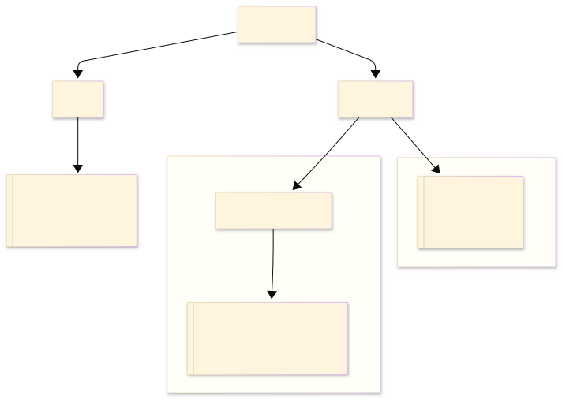

# Teória 5: Správa chýb, výnimky

V tejto časti sa budeme venovať spôsobom, akými Java pomocou výnimiek spravuje chyby v programoch.

## Výnimky

V Jave sa podobne ako v Pythone na spravovanie chýb používajú výnimky. Výnimka (anglicky exception) je **objekt, ktorý reprezentuje chybový alebo nečakaný stav počas behu programu**.

<div class="md-has-sidebar" markdown>
<main markdown>

Keď sa v programe stane chyba (napr. delenie nulou, prístup mimo poľa, chyba pri čítaní zo súboru), Java "vyhodí" (anglicky throw) výnimku.

Výnimku môže zachytiť metóda, ktorá volala kód, ktorý vyhodil výnimku. Ak ju nezachytí, výnimka stúpa vyššie - vybuble - a môže ju zachytiť rodičovská metóda. Tak to postupuje vyššie a vyššie v zozname volaní až do metódy `main()`. Ak ju ani tá nezachytí a nespracuje, výnimka spôsobí ukončenie programu.

Každá výnimka má svoj typ - triedu. Tieto triedy tvoria hierarchiu a všetky výnimky sa delia do troch veľkých skupín:

1. **Errors** - Veľmi vážne chyby programu, ktoré nemá zmysel zachytávať a ošetrovať, program by sa mal ukončiť
2. **Unchecked Exceptions** - Bežné chyby pri programovaní, ktoré môžeme alebo nemusíme ošetriť
3. **Checked Exceptions** - Vážnejšie chyby, ktoré musíme ošetriť, inak sa náš program ani neskompiluje a nespustí

 </main>

  <aside markdown>
Začínajúcich programátorov veľmi láka výnimky používať aj pre prípady, keď nenastala chyba. Skúšajú ich použiť, keď metóda má vrátiť nejakú špeciálnu hodnotu, alebo namiesto podmienok `if-else` na riadenie toku programu. Toto je však veľmi zlý návrh programu a výnimky by sa mali použivať výhradne pre chybové stavy. Ich spracovanie je totiž pomalšie ako normálne vrátenie hodnoty. 

!!! tip "Učím sa s pomocou umelej inteligencie"

    [Prečo sa v Jave neodporúča používať výnimku pre bežné riadenie toku programu?](https://grok.com/share/c2hhcmQtMg%3D%3D_5a188eac-804d-4acf-9cbe-bbe3b75b2c24)

</aside>
</div>


Podľa toho, na akom mieste v hierarchii tried výnimka je, sa určí jej skupina. Výnimky založené na triede `Error` sú typu Error a výnimky založené na triede [`RuntimeException`](https://docs.oracle.com/en/java/javase/21/docs/api/java.base/java/lang/RuntimeException.html) sú Unchecked Exceptions. Všetky ostatné typy sa berú ako Checked Exceptions. Nasledovný diagram ukazuje hierarchiu tried výnimiek.

{width=800}
/// caption
Hierarchia tried výnimiek
///

## Zachytenie výnimiek

Výnimky vieme zachytiť a ošetriť v tzv. `try-catch` bloku.

```java
try {
    // kód, ktorý môže vyhodiť výnimku
} catch (TypVynimky e) {
    // spracovanie výnimky
}
```

Príklad ošetrenia výnimky, ktorá by ukončila program, ak by sme ju nezachytili:

```java
try {
    int a = 10;
    int b = 0;
    int result = a / b; // toto spôsobí ArithmeticException
    System.out.println("Výsledok: " + result);
} catch (ArithmeticException e) {
    System.out.println("Chyba: nemožno deliť nulou!");
    System.out.println("Detail chyby: " + e.getMessage());
}
```

Zachytiť viem aj viacero druhov výnimiek. A to tak, že uvediem viacero blokov `catch`

```java
try {
    // ...
} catch (IOException e) {
    // ...
} catch (SQLException e) {
    // ...
}
```

!!! into "Zachytávanie viacerých typov výnimiek pomocou multi-catch"

    Java nám pre uľahčenie ponúka aj možnosť zachytiť viacero typov výnimiek v jednom bloku `catch`. Ide však o trochu viac komplikovaný spôsob a odporúčame ho používať až skúseným programátorom. Viacero typov v bloku `catch` oddelíme znakom `|`

    ```java
    try {
        // ...
    } catch (IOException | SQLException e) {
        // e je final a nemožno ho meniť
    }
    ```


<div class="md-has-sidebar" markdown>
<main markdown>

Pri ošetrovaní výnimiek nám objekt výnimky poskytuje množstvo užitočných metód.

- [`getMessage()`](https://docs.oracle.com/en/java/javase/21/docs/api/java.base/java/lang/Throwable.html#getMessage()) vráti textovú správu výnimky
- [`printStackTrace()`](https://docs.oracle.com/en/java/javase/21/docs/api/java.base/java/lang/Throwable.html#printStackTrace()) vypíše stack trace do konzoly alebo na iné miesto
- [`getCause()`](https://docs.oracle.com/en/java/javase/21/docs/api/java.base/java/lang/Throwable.html#getCause()) vráti zabalenú výnimku, ak nejaká je

 </main>

  <aside markdown>*Stack trace* je zoznam volaní metód *(call stack)* v programe v okamihu, keď nastane výnimka. Stack trace sa štandardne vypíše do konzoly, ak program skončí chybou.
</aside>
</div>

Okrem blokov `catch` môžem zadať aj tzv. blok `finally`. Kód v tomto bloku sa vykoná vždy po ukončení bloku try-catch, bez ohľadu na to, či skončil normálne, alebo bola vyhodená výnimka. Tento blok sa používa pre prípady, kedy potrebujeme vykonať nejaké dodatočné upratovanie, napríklad zatvoriť otvorené súbory alebo sieťové pripojenia.

```java
try {
    // ...
} catch (Exception e) {
    // ...
} finally {
    // vždy sa vykoná, aj keď došlo k výnimke
}
```

## Deklarovanie checked výnimiek

Ak niektorá časť kódu môže v našej metóde vyhodiť checked výnimku a sami ju neošetrujeme, musíme túto výnimku uviesť v deklarácii metódy. Checked výnimky sú považované za vážnejšie chyby a preto musíme ich explicitne uviesť, ak ich nezachytávame. Inak kompilátor vyhodí chyba a my nebudeme schopný program spustiť. Deklarácia výnimiek sa robí pomocou kľúčového slova `throws` hneď za argumentami metódy.
