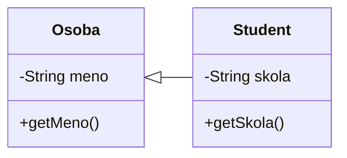
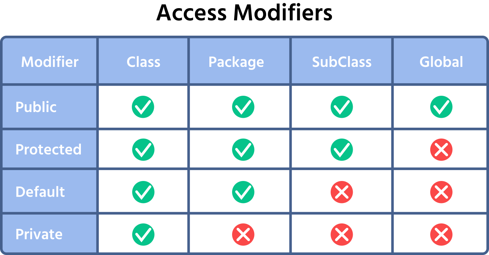
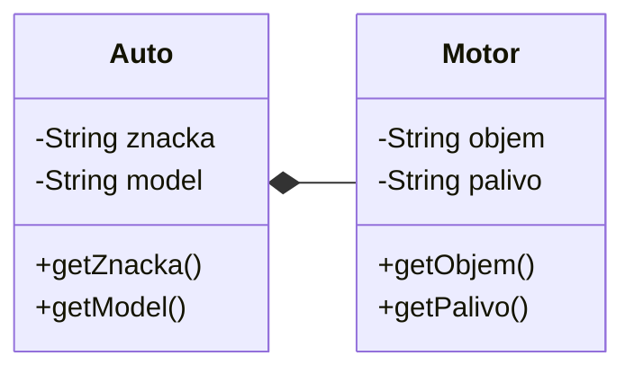

# Teória 11: Dedičnosť

Ako ďalší koncept objektovo orientovaného programovania si vysvetlíme dedičnosť.

Dedičnosť (anglicky inheritance) je jeden z pilierov objektovo-orientovaného programovania v Jave. Umožňuje triedam zdieľať a rozširovať funkcionalitu iných tried, čo podporuje opätovné použitie kódu, modularitu a hierarchickú štruktúru.

Dedičnosť je kľúčovým konceptom v OOP, ale má veľa rizík a nevýhod. V modernom softvérovom dizajne sa preto jej používanie posunulo smerom k opatrnejšiemu prístupu. Dnešné trendy zdôrazňujú flexibilitu, udržateľnosť a vyhýbanie sa rigidite, čo často vedie k preferovaniu alternatív ako kompozícia (composition).

## Dedičnosť

Dedičnosť je mechanizmus objektovo orientovaného programovania, ktorý umožňuje, aby jedna trieda, potomok (anglicky subclass), prevzala vlastnosti a správanie inej triedy, rodiča (anglicky superclass).

Inými slovami: trieda môže zdediť atribúty (premenné) a metódy z inej triedy. K týmto atribútom a metódam potom môže trieda voľne pristupovať.

Takto sa opätovne využíva kód (reusability) a zjednodušuje údržba programu.

Pri dedení používame kľúčové slovo `extends`.

=== "Príklad dedenia triedy"

    ```java title="Osoba.java"
    class Osoba {
        String meno;

        Osoba(String meno) {
            this.meno = meno;
        }

        String getMeno() {
            return meno;
        }
    }
    ```

    ```java title="Student.java"
    class Student extends Osoba {
        String skola;

        Student(String meno, String skola) {
            super(meno);
            this.skola = skola;
        }

        String getSkola() {
            return skola;
        }
    }
    ```

    ```java title="Main.java"
    public class Main {
        public static void main(String[] args) {
            Student s = new Student("Fero", "SPŠE Prešov");
            System.out.println(s.getMeno());
            System.out.println(s.getSkola());
        }
    }
    ```

Dôležité vlastnosti dedenia:

- **V Jave vieme dediť iba od jednej triedy** - tzv. single inheritance pre triedy
- Rodičovská trieda môže ďalej dediť od tretej triedy a byť jej potomkom
- Objekt podtriedy môžeme použiť všade tam, kde sa očakáva objekt nadradenej triedy
- Každá trieda v Jave je potomkom triedy triedy `java.lang.Object`
- Atribúty a metódy s modifikátorom prístupu `private` sa nededia

=== "Použitie podtriedy tam, kde sa očakáva nadradená trieda"

    ```java
    void vypisOsobu(Osoba osoba) {
        System.out.println(osoba.getMeno());
    }

    Osoba o = new Osoba("Alica");
    Student s = new Student("Bob", "SPŠE Prešov");

    vypisOsobu(o);
    vypisOsobu(s);
    ```

### Dedičnosť v UMl Class diagrame

V UML Class diagrame sa dedičnosť znázorňuje pomocou uzatvorenej šípky, ktorá smeruje od podtriedy smerom ku nadtriede - rodičovi.


/// caption
UML Class diagram tried `Osoba` a `Student`
///

## Konštruktory pri dedení

Konštruktory sa nededia.

Rodičovský konštruktor vieme zavolať pomocou kľúčového slova `super()`.

Volať nadradený konštruktor nie je nutné, ale je to dobré robiť. Ináč musíme inicializovať atribúty rodiča v triede potomka. Je dobré volať rodičovský konštruktor hneď na začiatku konštruktora podtriedy. (Do Javy 25 je to dokonca povinné)

## Rodičovská trieda `Object`

Každá trieda v Jave je potomkom triedy triedy [`java.lang.Object`](https://docs.oracle.com/en/java/javase/21/docs/api/java.base/java/lang/Object.html), ktorá je vrcholom hierarchie tried.

Táto trieda definuje metódy `toString` a `equals`, preto ich môžeme volať pre každý objekt.

Triedu `Object` môžeme použiť všade tam, kde akceptujeme objekt akejkoľvek triedy.

=== "Metóda akceptujúca akýkoľvek objekt"

    ```java
    static void analyzuj(Object o) {
        System.out.println(o.getClass().toString());
        System.out.println(o.toString());
        if(o instanceof Osoba) {
            System.out.println(((Osoba)o).getMeno());
        }
        if(o instanceof Student) {
            System.out.println(((Student)o).getSkola());
        }
    }

    analyzuj(osoba);
    analyzuj(student);
    analyzuj(67);
    analyzuj("Foo");
    ```

## Modifikátory prístupu

Pri dedení je možné použiť nový modifikátor prístupu s názvom `protected`. Ten obmedzuje prístup k atribútu alebo metóde v rámci triedy samotnej, v rámci rovnakého balíka a aj z potomkov danej triedy.

Prehľad všetkých modifikátorov prístupu:

{.on-glb}
/// caption
Prehľad modifikátorov prístupu
///

## Prekrytie metód - overriding

Triedy potomkov môžu prepísať (anglicky override) metódu rodiča, ak potrebujú zmeniť jej správanie. Metóda musí mať rovnaký názov, parametre a návratový typ.

=== "Prekrytie metód"
    ```java
    class Zviera {
        void zvuk() {
            System.out.println("Neznámy zvuk");
        }
    }

    class Pes extends Zviera {
        @Override
        void zvuk() {
            System.out.println("Haf!");
        }
    }
    ```

Všimnite si anotáciu `@Override`. Nie je povinná, ale signalizuje, že sme chceli prekryť rodičovskú metódu. Používanie tejto anotácia pomáha odhaliť možné chyby pri programovaní.

V metóde je možné zavolať pôvodnú prekrytú metódu pomocou kľúčového slova `super.metoda()`

Statické metódy nie je možné prekryť, sú vždy viazané na konrétnu triedu.

=== "Volanie prekrytej metódy"

    ```java title="Osoba.java"
    class Osoba {
        String meno;

        Osoba(String meno) {
            this.meno = meno;
        }

        String getMeno() {
            return meno;
        }

        void predstavSa() {
            System.out.println("Som " + meno);
        }
    }
    ```

    ```java title="Student.java"
    class Student extends Osoba {
        String skola;

        Student(String meno, String skola) {
            super(meno);
            this.skola = skola;
        }

        String getSkola() {
            return skola;
        }

        @Override
        void predstavSa() {
            System.out.println("Študujem na " + skola);
            super.predstavSa();
        }
    }
    ```

## Zabránenie dedenia - final

Pri definícii triedy môžeme zablokovať možnosť dediť z danej triedy pomocou kľúčového slova `final`. 

=== "Zabránenie dedenia triedy"

    ```java
    final class Auto {
        String model;
        String vyrobca;
    }
    ```

    Z triedy `Auto` nebude môcť nikto dediť


Podobne môžeme zabrániť aj prekrytiu metód.

=== "Zabránenie dedenia triedy"

    ```java
    class Osoba {
        String meno;

        final String getMeno() {
            return meno;
        }
    }
    ```

    Metódu `getMeno` nebude možné prekryť v potomkoch tejto triedy

`final` sa používa na optimalizáciu (JVM môže inlinovať final metódy) a bezpečnosť (napr. pri nemenných, immutable objektoch).


## IS-A verzus HAS-A

Pri modelovaní tried máme často na výber, či použijeme dedenie, alebo či triedu vložíme ako atribút. Pri rozhodovaní, ktorú možnosť použiť nám pomôže rozlíšenie, či trieda **je** špeciálnym prípadom inej triedy (anglicky **is a**), alebo či trieda v sebe **má** alebo obsahuje inú triedu (anglicky **has a**}

IS-A (je) znamená, že trieda je špeciálnym prípadom inej triedy. Vtedy použijeme dedičnosť. Príklady:

- Pes je Zviera
- Auto je Vozidlo
- Učiteľ je Osoba
- Študent je Osoba

HAS-A (má) znamená, že trieda obsahuje inú triedu ako atribút. Vzniká kompozíciou alebo agregáciou (teda nie dedičnosťou, ale zložením objektov). Použijeme atribúty. Príklady:

- Auto má Motor
- Dom má Dvere
- Auto má Motor
- Škola má Študentov

=== "Príklad kombinácie IS-A a HAS-A"

    ```java
    class Osoba {
        String meno;
    }

    class Adresa {
        String mesto;
    }

    class Student extends Osoba {    // Student IS-A Osoba
        Adresa adresa;               // Student HAS-A Adresa

        Student(String meno, String mesto) {
            this.meno = meno;
            this.adresa = new Adresa();
            this.adresa.mesto = mesto;
        }
    }
    ```

### Kompozícia v UML Class diagrame

V UML Class diagrame sa kompozícia znázorňuje pomocou plného diamantu, ktorý je pri triede, ktorá "má" (has-a) iné triedy ako atribúty.


/// caption
UML Class diagram kompozície tried `Auto` a `Motor`
///

## Radšej niečo iné, ako Dedičnosť!

Dedičnosť bola v minulosti často používaná, avšak má veľmi veľa návrhových úskalí, obmedzení a problémov. Preto sa v súčasnosti neodporúča dedičnosť používať a radšej využiť rozhrania, ktoré si ukážeme inokedy.

Najčastejší moderný pohľad je "favor composition over inheritance" – princíp z knihy Design Patterns (Gang of Four), ktorý sa stal štandardom v 2020s. Kompozícia znamená, že objekty obsahujú iné objekty (has-a vzťah), čo je flexibilnejšie.

!!! tip "Učím sa s pomocou umelej inteligencie"

    Som študent strednej školy, učím sa Javu. Vysvetli mi, [prečo sa v modernom programovaní neodporúča používať dedičnosť. Uveď súčasné trendy pri návrhu tried a objasni dôvody](https://grok.com/share/c2hhcmQtMg%3D%3D_2d69f174-40b2-444d-b1b2-2e36bca34faf).

## Zhrnutie teórie

- [x] Dedičnosť
    * [ ] Podradená trieda, potomok, prevezme vlastnosti a správanie nadradenej triedy
    * [ ] Takto sa opätovne využíva kód (reusability) a zjednodušuje údržba programu
    * [ ] Pri dedení používame kľúčové slovo extends
- [x] Vlastnosti
    * [ ] V Jave vieme dediť iba od jednej triedy - tzv. single inheritance pre triedy
    * [ ] Rodičovská trieda môže ďalej dediť od tretej triedy a byť jej potomkom
    * [ ] Objekt podtriedy môžeme použiť všade tam, kde sa očakáva objekt nadradenej triedy
    * [ ] Každá trieda v Jave je potomkom triedy triedy `java.lang.Object`
    * [ ] Atribúty a metódy s modifikátorom prístupu `private` sa nededia
- [x] Konštruktory pri dedení
    * [ ] Konštruktory sa nededia
    * [ ] Rodičovský konštruktor vieme zavolať pomocou kľúčového slova `super()`
    * [ ] Ak nezavoláme nadradený konštruktor, musíme inicializovať zdedené atribúty sami
- [x] Rodičovská trieda Object
    * [ ] `java.lang.Object` je vrcholom hierarchie tried
    * [ ] definuje metódy `toString` a `equals`
    * [ ] Triedu Object môžeme použiť všade tam, kde akceptujeme objekt akejkoľvek triedy.
- [x] Modifikátory prístupu
    * [ ] `protected` - atribút alebo metóda je viditeľná z rovnakého balíka a aj z podtried
- [x] Prekrytie metód - overriding
    * [ ] Triedy potomkov môžu prepísať (anglicky override) metódu rodiča, ak potrebujú zmeniť jej správanie
    * [ ] Metóda musí mať rovnaký názov, parametre a návratový typ
    * [ ] Odporúča sa použiť anotáciu `@Override`
    * [ ] V metóde je možné zavolať pôvodnú prekrytú metódu pomocou kľúčového slova `super.metoda()`
    * [ ] Statické metódy nie je možné prekryť, sú vždy viazané na konrétnu triedu
- [x] Zabránenie dedenia - final
    * [ ] Môžeme zablokovať možnosť dediť triedu alebo prekryť metódu pomocou kľúčového slova `final`
- [x] IS-A verzus HAS-A
    * [ ] IS-A (je) znamená, že trieda je špeciálnym prípadom inej triedy. Vtedy použijeme dedičnosť
    * [ ] HAS-A (má) znamená, že trieda obsahuje inú triedu ako atribút. Vzniká kompozíciou alebo agregáciou, použijeme atribúty
    * [ ] Auto je Vozidlo, ale Auto má Motor
    * [ ] Ak sa dá, dedičnosť tried nepoužívať, ale radšej zvoliť kompozíciu a rozhrania


!!! note "Poznámky do zošita"
    V zošite je potrebné mať napísané aspoň tieto poznámky:

    ```
    DEDIČNOSŤ

    Podradená trieda, potomok, prevezme vlastnosti a správanie nadradenej triedy.

    Pri dedení používame kľúčové slovo extends

    Vlastnosti
    - Vieme dediť iba z jednej triedy
    - Objekt podtriedy môžeme použiť všade tam, kde sa očakáva objekt nadradenej triedy
    - Atribúty a metódy s modifikátorom prístupu private sa nededia

    Konštruktory pri dedení
    - Konštruktory sa nededia
    - Rodičovský konštruktor voláme pomocou super()
    - Ak nezavoláme nadradený konštruktor, musíme inicializovať zdedené atribúty sami

    Rodičovská trieda Object
    - java.lang.Object je vrcholom hierarchie tried
    - definuje metódy toString a equals
    - Triedu Object môžeme použiť všade tam, kde akceptujeme objekt akejkoľvek triedy.

    Nový modifikátory prístupu protected - viditeľnosť z rovnakého balíka a aj z podtried

    Prekrytie metód - overriding
    - Potomok môže prepísať (anglicky override) metódu rodiča
    - Metóda musí mať rovnaký názov, parametre a návratový typ
    - Odporúča sa použiť anotáciu @Override
    - Zavolanie pôvodnej prekrytú metódy pomocou super.metoda()
    - Statické metódy nie je možné prekryť

    Môžeme zablokovať možnosť dediť triedu alebo prekryť metódu pomocou kľúčového slova final

    IS-A verzus HAS-A
    - IS-A (je) znamená, že trieda je špeciálnym prípadom inej triedy. Vtedy použijeme dedičnosť
    - HAS-A (má) znamená, že trieda obsahuje atribút inej triedy. Vzniká kompozíciou alebo agregáciou
    - Kompozícia používa atribúty
    - Auto je Vozidlo, ale Auto má Motor
    - Radšej zvoliť kompozíciu a rozhrania ako dedičnosť
    ```

!!! warning "Skúšanie a kontrola vedomostí"

    Na ďalšej hodine budeme kontrolovať nasledovné veci:

    - Zapísané poznámky z hodiny vo vašom zošite

    Okruhy otázok na test:

    - Dedičnosť - čo to je
    - Konštruktory pri dedení
    - modifikátor prístupu `protected`
    - Prekrytie metód - overriding
    - Zabránenie dedenia - final
    - IS-A versus HAS-A, dedenie versus kompozícia
