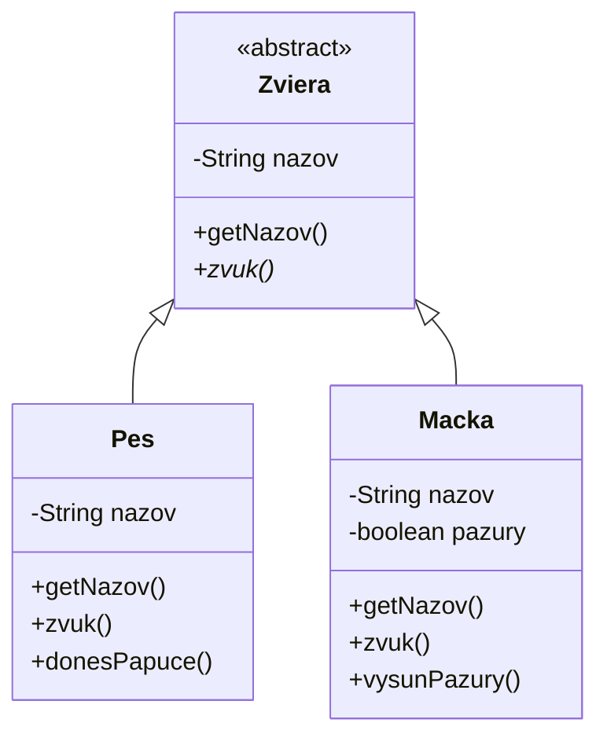
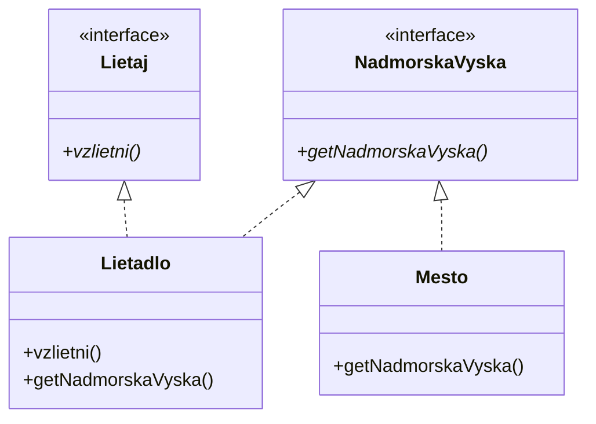

# Teória 13: Abstrakcia

Základné princípy objektovo orientovaného programovania sú zapuzdrenie, dedičnosť, polymorfizmus a abstrakcia.

Prvé tri princípy sme si už vysvetlili, posledný štvrtý princíp objektovo orientovaného programovania - abstrakciu, si predstavíme dnes.

## Abstrakcia

Abstrakcia je proces, pri ktorom **skryjeme nepodstatné detaily a ponecháme iba to, čo je dôležité pre používanie objektu**. 

Cieľom je dosiahnuť, aby programátor pri používaní tried a objektov pracoval s tým, **"čo"** robí objekt, nie **"ako"** to robí. To zjednodušuje kód, zvyšuje čitateľnosť a umožňuje lepšiu modularitu.

Ciele abstrakcie:

- Používateľ triedy by mal vidieť, čo trieda robí (API, verejné metódy)
- Implementácia triedy (ako to robí) má byť skrytá

Abstrakcia sa používa bežne mimo sveta programovania. Napríklad pri aute, pri šoférovaní používate volant, brzdu, plyn - to je abstrakcia (rozhranie auta). Nemusí vás zaujímať presný hydraulický systém bŕzd, alebo fungovanie motora - to je implementácia.

V Jave máme dva hlavné mechanizmy abstrakcie, ktoré nám pomáhaju oddeliť "čo" od "ako":

1. Abstraktné triedy
1. Rozhrania (interfaces)

## Abstraktné triedy

Abstraktná trieda v Jave je špeciálny typ triedy, ktorá obsahuje abstraktné metódy, to sú **metódy bez implementácie** - bez tela metódy. Definujú sa s kľúčovým slovom `abstract`.

Abstraktná trieda je taká napoly dokončená trieda. Táto trieda zadefinuje, čo všetko musia potomkovia vedieť robiť, ale ako konkrétne to budú robiť je prenechané na triedy potomkov. Ak sú niektoré vlastnosti, ktoré sú spoločné pre všetkých potomkov, môžu byť v abstraktnej triede zadefinované a implementované, ako v obyčajných rodičovských triedach.

=== "Abstraktná trieda"

    ```java
    abstract class Zviera {
        protected String nazov;

        public Zviera(String nazov) {
            this.nazov = nazov;
        }

        public String getNazov() {
            return nazov;
        }

        // abstraktná metóda, nemá telo
        abstract void zvuk();
    }
    ```

Abstraktná trieda teda môže mať atribúty, konštruktor, aj obyčajné metódy. **Nevieme však priamo vytvoriť objekty abstraktnej triedy**. Úlohou abstraktnej triedy je, aby ju dedili iné triedy.

**Abstraktná trieda definuje, "čo" má trieda robiť. To "ako" sa to bude robiť, definujú samotné podtriedy**.

Abstraktné triedy sa používajú na zdieľanie spoločného kódu medzi podtriedami. Abstraktná trieda zdieľa stav a správanie.
V kóde je možné používať referencie na abstraktnú triedu a kód bude fungovať s hocijakými objektami jej podtried.

=== "Použitie abstraktnej triedy"

    ```java
    class Pes extends Zviera {
        public Pes(String nazov) {
            super(nazov);
        }

        void donesPapuce() {
            // ...
        }

        @Override
        void zvuk() {
            System.out.println("Haf haf");
        }
    }

    class Macka extends Zviera {
        private boolean pazury = false;

        public Macka(String nazov) {
            super(nazov);
        }

        void vysunPazury() {
            pazury = true;
        }

        @Override
        void zvuk() {
            System.out.println("Mňau");
        }
    }

    class Zverinec {
        private Zviera[] zvierata;

        public Zverinec(Zviera[] zvierata) {
            this.zvierata = zvierata;
        }

        public void hluk() {
            for (Zviera zviera : zvierata) {
                zviera.zvuk();
            }
        }

        public static void main(String[] args) {
            Zviera[] zvierata = {new Pes("Dunco"), new Macka("Elza")};
            Zverinec zverinec = new Zverinec(zvierata);
        }
    }
    ```

V uvedenom príklade máme triedu Zverinec, ktorá v sebe vie mať akékoľvek Zviera. Vytvorili sme si 2 potomkov triedy Zviera, Pes a Macka. Vlastnosti spoločné pre každé zviera sme dali do rodičovskej triedy a definovaním abstraktných metód prinútime, aby podtriedy implementovali určitú funkcionalitu.

Podtrieda môže dediť iba z jednej abstraktnej triedy, tak ako je to pri bežné pri dedičnosti v Jave. 
Ak podtrieda neimplementuje všetky abstraktné metódy z nadtriedy, musí byť sama abstraktná.

Funkcionality a vlastnosti, ktoré nie sú spoločné pre všetky druhy zvierat definujeme v konkrétnej podtriede.

Nakoľko abstraktná trieda používa klasické dedenie, používa sa pri nej IS-A "je" vzťah, teda napr. Pes je Zviera, Mačka je Zviera, atď.


### UML Class diagram

Abstraktné triedy v UML Class diagrame majú pred menom značku `<<abstract>>`, a abstraktné metódy sú uvedené šikmým písmom (italic).



## Rozhrania

Druhý spôsob, ako v Jave vyjadriť abstrakciu je použitie rozhrania, anglicky interface. Rozhranie sa sústredí vyslovene na správanie, teda na schopnosti - behavior, ktoré by trieda implementujúca rozhranie mala podporovať.

**Rozhranie je špeciálna trieda, ktorá nemá atribúty ani konštruktory**, a obsahuje výlučne metódy, ktoré definujú správanie. Tieto metódy sú automaticky abstraktné a štandardne v rozhraní nie je napísana žiadna implementácia. Rozhranie je čistý dizajn, bez stavu a bez konkrétnej implementácie.

Rozhranie definujeme s kľúčovým slovom `interface`.

=== "Príklady rozhraní"

    ```java
    interface Lietaj {
        void vzlietni();
    }

    interface Potapaj {
        void ponorSa();
    }

    interface NadmorskaVyska {
        double getNadmorskaVyska();
    }
    ```

Obrovským rozdielom oproti abstraktným triedam je, že **podtrieda môže implementovať viacero rozhraní**.

Rozhranie tak isto už nepoužíva IS-A vzťah, ale sústredí sa iba na schopnosti triedy, teda o CAN-DO "vie" vzťah. Príklad takéhoto stavu je napr. Lietadlo vie Lietať, Súbor vieme Zatvoriť, Obdĺžnik vie vrátiť svoju Plochu, atď.

=== "Použitie rozhraní"

    ```java title="Lietadlo.java"
    class Lietadlo implements Lietaj, NadmorskaVyska {
        @Override
        public void vzlietni() {
            // ...
        }

        @Override
        public void getNadmorskaVyska() {
            // ...
        }
    }
    ```

    ```java title="Kacka.java"
    class Kacka implements Lietaj, Potapaj NadmorskaVyska {
        @Override
        public void vzlietni() {
            // ...
        }

        @Override
        public void ponorSa() {
            // ...
        }

        @Override
        public void getNadmorskaVyska() {
            // ...
        }
    }
    ```

    ```java title="Mesto.java"
    class Mesto implements NadmorskaVyska {
        @Override
        public void getNadmorskaVyska() {
            // ...
        }
    }
    ```

!!! info "Pokročilé techniky"

    Rozhrania v sebe môžu mať zadefinované konštanty. Ide však o veľmi špecifické prípady, kedy je vhodné ich tam mať a vo všeobecnosti sa do rozhrania neodporúča dávať nič iné okrem abstraktných metód.

    V novších verziách Javy je možné v rozhraniach definovať aj tzv. *defaultné metódy*, ktoré majú implementáciu, a tak isto je možné do rozhrani dať aj privátne a statické metódy. Táto možnosť bola pridaná za účelom, aby sa do rozhraní mohli pridávať nové funkcionality bez nutnosti meniť existujúce triedy. Pri bežnom používaní rozhraní nie je vhodné defaultné a statické metódy v rozhraniach definovať.

### Rozhrania v Jave

Rozhrania sa vo veľkom používajú aj v knižniciach Javy a pomocou niektorých rozhraní vieme svojim triedam pridať funkcionalitu tak, že budú použiteľné v rámci týchto Java knižníc.

V nasledujúcej tabuľke je uvedený prehľad najpoužívanejších rozhraní v Jave API

| Rozhranie         | Balík                | Stručný účel                             |
| ----------------- | -------------------- | ---------------------------------------- |
| [`List`](https://docs.oracle.com/en/java/javase/21/docs/api/java.base/java/util/List.html)            | java.util            | Usporiadaná kolekcia, indexovaný prístup |
| [`Set`](https://docs.oracle.com/en/java/javase/21/docs/api/java.base/java/util/Set.html)             | java.util            | Množina, bez duplicít                    |
| [`Map`](https://docs.oracle.com/en/java/javase/21/docs/api/java.base/java/util/Map.html)             | java.util            | Kľúč → hodnota                           |
| [`Iterable`](https://docs.oracle.com/en/java/javase/21/docs/api/java.base/java/lang/Iterable.html)        | java.lang            | Umožňuje `for-each` cyklus               |
| [`Iterator`](https://docs.oracle.com/en/java/javase/21/docs/api/java.base/java/util/Iterator.html)        | java.util            | Iterovanie cez kolekcie                  |
| [`Comparable`](https://docs.oracle.com/en/java/javase/21/docs/api/java.base/java/lang/Comparable.html)      | java.lang            | Prírdzené poradie objektov (compareTo)   |
| [`Comparator`](https://docs.oracle.com/en/java/javase/21/docs/api/java.base/java/util/Comparator.html)      | java.util            | Custom porovnávanie objektov             |
| [`AutoCloseable`](https://docs.oracle.com/en/java/javase/21/docs/api/java.base/java/lang/AutoCloseable.html)   | java.lang            | Try-with-resources                       |
| [`Cloneable`](https://docs.oracle.com/en/java/javase/21/docs/api/java.base/java/lang/Cloneable.html)       | java.lang            | Klonovanie objektov                      |
| [`Serializable`](https://docs.oracle.com/en/java/javase/21/docs/api/java.base/java/io/Serializable.html)    | java.io              | Serializácia objektov                    |
| [`Queue`](https://docs.oracle.com/en/java/javase/21/docs/api/java.base/java/util/Queue.html)           | java.util            | FIFO štruktúra                           |
| [`Deque`](https://docs.oracle.com/en/java/javase/21/docs/api/java.base/java/util/Deque.html)           | java.util            | Obojstranná fronta                       |
| [`Path`](https://docs.oracle.com/en/java/javase/21/docs/api/java.base/java/nio/file/Path.html)            | java.nio.file        | Moderný súborový systém (NIO2)           |

### UML Class diagram

Rozhrania v UML Class diagrame majú pred menom značku `<<interface>>`, a abstraktné metódy sú uvedené šikmým písmom (italic).

Od triedy, ktorá implementuje rozhranie, vedie prerušovaná uzatvorená šípka k danému rozhraniu.



## Abstraktná trieda Vs Rozhranie

Rozhranie je jednoduchšie, flexibilnejšie a menej obmedzujúce, preto je vhodné ho uprednostniť pred abstraktnou triedou.

Abstraktnú triedu použijeme, ak máme kostru nejakého algoritmu alebo procesu, a detaily sa doplnia v podtriedach, ktoré určujú konkrétny spôsob fungovania procesu.

Pri návrhu je potrebné dávať si pozor, aby použitie abstraktnej triedy alebo rozhrania nepridalo zbytočnú komplexitu - zložitosť. Cieľom je zložitosť umenšovať a skrývať do implementácie, nie ju pridávať.

- Abstraktná trieda: Pre "je-a" vzťahy (napr. Pes je Zviera), zdieľa stav a správanie
- Rozhranie: Pre "môže-robiť" vzťahy (napr. Lietadlo môže Lietat), čisto o správaní

Obidve prístupy môžeme kombinovať. Podtrieda môže súčasne dediť z abstraktnej triedy a implementovať 1 alebo viac rozhraní. Typickým príkladom je trieda [`java.util.ArrayList`](https://docs.oracle.com/en/java/javase/21/docs/api/java.base/java/util/ArrayList.html), ktorá má rodičovskú abstraktnú triedu a sama implementuje 7 rozhraní.

## Zhrnutie teórie

- [x] Abstrakcia
    * [ ] Abstrakcia je proces, pri ktorom skryjeme nepodstatné detaily a ponecháme iba to, čo je dôležité pre používanie objektu
    * [ ] Cieľom je dosiahnuť, aby programátor pri používaní tried a objektov pracoval s tým, "čo" robí objekt, nie "ako" to robí
    * [ ] To zjednodušuje kód, zvyšuje čitateľnosť a umožňuje lepšiu modularitu
- [x] Abstraktné triedy
    * [ ] Abstraktná trieda v Jave je špeciálny typ triedy, ktorá obsahuje abstraktné metódy, to sú metódy bez implementácie - bez tela metódy
    * [ ] Definujú sa s kľúčovým slovom `abstract`
    * [ ] Abstraktná trieda je taká napoly dokončená trieda
    * [ ] Abstraktná trieda teda môže mať atribúty, konštruktor, aj obyčajné metódy
    * [ ] Nevieme však priamo vytvoriť objekty abstraktnej triedy
    * [ ] Úlohou abstraktnej triedy je, aby ju dedili iné triedy
    * [ ] Abstraktná trieda definuje, "čo" má trieda robiť. To "ako" sa to bude robiť, definujú samotné podtriedy
    * [ ] Abstraktné triedy v UML Class diagrame majú pred menom značku `<<abstract>>`, a abstraktné metódy sú uvedené šikmým písmom (italic)
    * [ ] Abstraktné triedy používajú dedenie, teda IS-A "je" vzťah. Pes je Zviera, Auto je Vozidlo.
- [x] Rozhranie - interface
    * [ ] Rozhranie sa sústredí vyslovene na správanie, teda na schopnosti 
    * [ ] Rozhranie je špeciálna trieda, ktorá nemá atribúty ani konštruktory, a obsahuje výlučne metódy, ktoré definujú správanie
    * [ ] Rozhranie je čistý dizajn, bez stavu a bez konkrétnej implementácie
    * [ ] Rozhranie definujeme s kľúčovým slovom `interface`
    * [ ] Podtrieda môže implementovať viacero rozhraní!
    * [ ] Rozhranie sa sústredí sa iba na schopnosti triedy, teda o CAN-DO "vie" vzťah. Lietadlo vie Lietat, Súbor vieme Zatvoriť
    * [ ] Rozhrania v UML Class diagrame majú pred menom značku <<interface>>, a abstraktné metódy sú uvedené šikmým písmom (italic).
    * [ ] Od triedy, ktorá implementuje rozhranie, vedie prerušovaná uzatvorená šípka k danému rozhraniu.
- [x] Populárne rozhrania v Jave
    * [ ] Rozhrania sa vo veľkom používajú aj v knižniciach Javy
    * [ ] `List`, `Set`, `Map` - kolekcie
    * [ ] `Iterable`, `Iterator` - iterácia prvkov v cykle
    * [ ] `Comparable`, `Comparator` - zoradenie hodnôt
    * [ ] `Serializable`, `Cloneable` - serializácia a kopírovanie
    * [ ] `AutoCloseable` - zatvorenie zdrojov
- [x] Abstraktná trieda Vs Rozhranie
    * [ ] Rozhranie je jednoduchšie, flexibilnejšie a menej obmedzujúce
    * [ ] Abstraktnú triedu použijeme, ak máme kostru nejakého algoritmu alebo procesu, detaily necháme na potomkov
    * [ ] Cieľom je zložitosť umenšovať a skrývať do implementácie, nie ju pridávať
    * [ ] Abstraktná trieda: Pre "je-a" vzťahy (napr. Pes je Zviera), zdieľa stav a správanie
    * [ ] Rozhranie: Pre "môže-robiť" vzťahy (napr. Lietadlo môže Lietat), čisto o správaní
    * [ ] Obidve prístupy môžeme kombinovať. Podtrieda môže súčasne dediť z abstraktnej triedy a implementovať 1 alebo viac rozhraní


!!! note "Poznámky do zošita"
    V zošite je potrebné mať napísané aspoň tieto poznámky:

    ```
    ABSTRAKCIA
    
    Abstrakcia je proces, pri ktorom skryjeme nepodstatné detaily a ponecháme iba dôležité veci
    Cieľom je aby sa zverejnilo iba to, "čo" robí objekt, nie "ako" to robí
    To zjednodušuje kód, zvyšuje čitateľnosť a umožňuje lepšiu modularitu

    1. Abstraktné triedy

    Špeciálny typ triedy, ktorá obsahuje abstraktné metódy, to sú metódy bez implementácie - bez tela metódy
    Definujú sa s kľúčovým slovom abstract
    Abstraktná trieda je taká napoly dokončená trieda
    Abstraktná trieda teda môže mať atribúty, konštruktor, aj obyčajné metódy
    Nevieme však priamo vytvoriť objekty abstraktnej triedy
    Úlohou abstraktnej triedy je, aby ju dedili iné triedy
    V UML diagrame má značku <<abstract>>, a abstraktné metódy sú uvedené šikmým písmom (italic)
    Abstraktné triedy používajú dedenie, teda IS-A "je" vzťah. Pes je Zviera, Auto je Vozidlo.

    2. Rozhranie - interface

    Sústredí sa vyslovene na správanie, teda na schopnosti 
    Špeciálna trieda, ktorá nemá atribúty ani konštruktory
    Rozhranie je čistý dizajn, bez stavu a bez konkrétnej implementácie
    Rozhranie definujeme s kľúčovým slovom interface
    Podtrieda môže implementovať viacero rozhraní!
    Rozhranie sa sústredí na schopnosti triedy, teda o CAN-DO "vie" vzťah. 
    Lietadlo vie Lietat, Súbor vieme Zatvoriť
    Rozhrania v UML Class diagrame majú pred menom značku <<interface>>
    Od triedy, ktorá implementuje rozhranie, vedie prerušovaná uzatvorená šípka k danému rozhraniu.

    Rozhrania sa vo veľkom používajú aj v knižniciach Javy
    - List, Set, Map - kolekcie
    - Iterable, Iterator - iterácia prvkov v cykle
    - Comparable, Comparator - zoradenie hodnôt
    - AutoCloseable, Cloneable - zatvorenie a kopírovanie

    Abstraktná trieda Vs Rozhranie:
    - Rozhranie je jednoduchšie, flexibilnejšie a menej obmedzujúce
    - Cieľom je zložitosť umenšovať a skrývať do implementácie, nie ju pridávať
    - Abstraktná trieda: Pre "je-a" vzťahy (napr. Pes je Zviera), zdieľa stav a správanie
    - Rozhranie: Pre "môže-robiť" vzťahy (napr. Lietadlo môže Lietat), čisto o správaní
    - Obidve prístupy môžeme kombinovať
    ```

!!! warning "Skúšanie a kontrola vedomostí"

    Na ďalšej hodine budeme kontrolovať nasledovné veci:

    - Zapísané poznámky z hodiny vo vašom zošite

    Okruhy otázok na test:

    - Abstrakcia - čo to je
    - Abstraktné triedy - čo to je a  ako sa vytvára
    - Rozhrania - čo to je a ako sa vytvára
    - Populárne rozhrania v Jave
    - Porovnanie abstraktných tried a rozhraní
    - Zápis abstraktnej triedy a rozhrania v UML class diagrame
