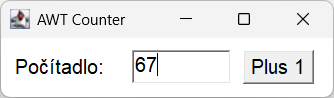

# Teória 20: JavaFX koncepty
 
https://openjfx.io/javadoc/21/

## Launcher

Trieda s metódou main. JavaFX nemá rada, ak je main v triede Aplikácia, preto je zvykom dať main do samostatnej triedy.

FxCounterFxmlApplication.launch(FxCounterFxmlApplication.class, args); - nájde a spustí JavaFX Aplikáciu

## Application

Abstraktná trieda, treba ju podediť

Hlavná logika v metóde start, ktorá má na vstupe Stage argument

https://openjfx.io/javadoc/21/javafx.graphics/javafx/application/Application.html

Metóda main musí byť mimo aplikácie, je dobré mať

- cinemax

## Stage

Okno. Vzdy mame 1 hlavne okno, vieme si vytvarat dalsie

setTitle


Style

initStyle - musí byť pred tým ako zobrazíme okno

StageStyle.DECORATED
StageStyle.UNDECORATED 

Modality

https://openjfx.io/javadoc/21/javafx.graphics/javafx/stage/Stage.html

vyska, sirka, x, y, maximized, ..., resizable

Z ordering

- kinosala

## Scene

Ten isty stage moze prepinat medzi viacerymi scene

https://openjfx.io/javadoc/21/javafx.graphics/javafx/scene/Scene.html

- premietanie filmu

Scene musi mat 1 root node, korenovy uzol

Drzi v sebe zoznam Nodov, uzlov, UI komponentov

Nody na rozlozenie
Parent
HBox

Nody s ovladacimi prvkami
TextField
Button
Label


AWT je prvá grafická knižnica v Jave (1996) poskytujúca GUI funkcionality. Neimplementuje vlastné komponenty, ale volá grafické knižnice daného operačného systému. Je to tzv. wrapper nad natívnym GUI.

Výhody

- Natívny vzhľad
- Jednoduchá architektúra
- Rýchly štart

Zásadné problémy

- Nejednotné správanie na rôznych OS
- Veľmi obmedzené možnosti kreslenia
- Ťažko rozšíriteľné
- Problémy s layoutmi a Z-orderom

O AWT sa hovorí, že používa tzv. heavyweight (ťažké, komplikované) komponenty, pretože vykresľovanie prenecháva operačnému systému, mimo Javu, a nekreslí si ich sama.

### Ukážka AWT kódu

```java title="AwtCounter.java"
public class AwtCounter extends Frame {

    private int counter = 0;
    private TextField textField;

    public AwtCounter() {
        super("AWT Counter");

        setLayout(new FlowLayout(FlowLayout.LEFT, 20, 20)); 

        Font bigFont = new Font("SansSerif", Font.PLAIN, 36);

        Label label = new Label("Počítadlo:");
        label.setFont(bigFont);
        add(label);

        textField = new TextField("0", 5);
        textField.setFont(bigFont);
        add(textField);

        Button button = new Button("Plus 1");
        button.setFont(bigFont);
        add(button);
        button.addActionListener(e -> {
            counter++;
            textField.setText(String.valueOf(counter));
        });

        setSize(500, 180);

        addWindowListener(new WindowAdapter() {
            public void windowClosing(WindowEvent e) {
                dispose();
                System.exit(0);
            }
        });
        setVisible(true);
    }
}
```

### Porovnanie GUI

Na nasledujúcich screenshotoch môžete porovnať AWT vo Windowse, Linuxe a Mac OS

{width=250}

{width=250}

{width=250}

### Java 2D

Do knižnice AWT boli v roku 1998 pridané triedy pre vykresľovanie 2D grafiky, tzv. Java 2D. 

Vlastnosti:

- Vektorová grafika
- Transformácie (rotate, scale, translate)
- Anti-aliasing
- Práca s fontami a obrázkami

Java 2D sa dodnes hojne používa a je aj základom pre modernejšie GUI knižnice.

Nevýhody:

- Obmedzená hardwarová akcelerácia
- Nevhodné pre moderné animácie

## Swing

Okrem Java 2D bol v roku 1998 predstavený aj Swing a stal sa nástupcom AWT pre GUI vývoj. Je postavený nad AWT, ale používa "ľahké" komponenty (lightweight components), ktoré sa kreslia priamo v Jave bez závislosti na natívnych widgetoch. Swing sa stal štandardom pre desktopové aplikácie na viac než 10 rokov

Podporuje pokročilé komponenty ako stromy, tabuľky, editory a drag-and-drop. 

Výhody:

- Konzistentné správanie
- Bohatá sada komponentov
- Plná kontrola nad vykresľovaním

Nevýhody:

- Pomalšie vykresľovanie (CPU-based)
- Zastaralý vzhľad
- Komplikovaná architektúra


### Ukážka Swing kódu

```java title="SwingCounter.java"
public class SwingCounter {

    private int counter = 0;

    public SwingCounter() {
        JFrame frame = new JFrame("Swing Counter");
        frame.setDefaultCloseOperation(JFrame.EXIT_ON_CLOSE);

        JPanel panel = new JPanel(new FlowLayout(FlowLayout.LEFT, 20, 20));

        Font bigFont = new Font("SansSerif", Font.PLAIN, 36);

        JLabel label = new JLabel("Počítadlo:");
        label.setFont(bigFont);
        panel.add(label);

        JTextField textField = new JTextField("0", 5);
        textField.setFont(bigFont);

        panel.add(textField);

        JButton button = new JButton("Plus 1");
        button.setFont(bigFont);
        button.addActionListener(e -> {
            counter++;
            textField.setText(String.valueOf(counter));
        });
        panel.add(button);

        frame.setContentPane(panel);
        frame.setSize(560, 170);
        frame.setVisible(true);
    }
}
```

### Porovnanie GUI

Na nasledujúcich screenshotoch môžete porovnať Swing vo Windowse, Linuxe a Mac OS

{width=250}

{width=250}

{width=250}

## JavaFX

JavaFX bol vytvorený ako moderný nástupca Swingu. Jeho prvá verzia vyšla v roku 2008.
Je ľahší na učenie pre web developerov vďaka CSS. Poskytuje modernejší dizajn a ponúka aj podporu 3D grafiky. 
JavaFX je dnes najlepšia voľba pre nové Java desktop GUI. Pomocou pluginov sa dá JavaFX aplikácia spustiť aj na Androide a iOS.

Výhody:

- Moderný vzhľad
- GPU akcelerácia, podpora animácií a efektov
- Podpora CSS
- Scene graph - ako DOM v prehliadačoch
- FXML - ako HTML v prehliadačoch

Nevýhody:

- Nie je štandardnou súčasťou Javy
- Menší ekosystém než Swing
- Vhodný hlavne pre desktopové aplikácie

### Ukážka JavaFX kódu

```java title="FxCounterApplication.java"
public class FxCounterApplication extends Application {

    private int counter = 0;

    public void start(Stage stage) {

        Label label = new Label("Počítadlo:");
        label.setStyle("-fx-font-size: 18px;");

        TextField textField = new TextField("0");
        textField.setPrefColumnCount(4);
        textField.setStyle("-fx-font-size: 18px;");

        Button button = new Button("Plus 1");
        button.setStyle("-fx-font-size: 18px;");

        button.setOnAction(e -> {
            counter++;
            textField.setText(String.valueOf(counter));
        });

        HBox root = new HBox(20, label, textField, button);
        root.setPadding(new Insets(20));

        Scene scene = new Scene(root);
        stage.setTitle("JavaFX Counter");
        stage.setScene(scene);
        stage.show();
    }
}
```

### Porovnanie GUI

Na nasledujúcich screenshotoch môžete porovnať JavaFX vo Windowse, Linuxe a Mac OS

{width=250}

{width=250}

{width=250}


## Zhrnutie teórie

Všetky príklady uvedené na tejto hodine viete nájsť a vyskúšať v repozitári na adrese [https://github.com/wagjo/opg-gui](https://github.com/wagjo/opg-gui)

- [x] Grafické knižnice
    * [ ] 2D grafika - tvary (čiary, obdĺžniky, kruhy), text, farby, ...
    * [ ] GUI - komponenty pre tvorbu užívateľského rozhrania (tlačidlá, textové polia, scrollbar, menu, tabuľky)
    * [ ] 3D - textúry, polygony, scéna, osvetlenie, kamera
- [x] AWT
    * [ ] Prvá GUI knižnica v Jave (1996). Volá grafické knižnice daného operačného systému. Je to tzv. wrapper nad natívnym GUI.
    * [ ] Rýchly štart, jednoduchá architektúra
    * [ ] Natívny vzhľad, ale nejednotné správanie na rôznych OS
    * [ ] Veľmi obmedzené možnosti kreslenia, málo komponentov
    * [ ] Používa tzv. heavyweight (ťažké, komplikované) komponenty, pretože vykresľovanie prenecháva operačnému systému, mimo Javu, a nekreslí si ich sama
- [x] Java 2D
    * [ ] Do knižnice AWT boli v roku 1998 pridané triedy pre vykresľovanie 2D grafiky, tzv. Java 2D. 
    * [ ] Java 2D sa dodnes hojne používa a je aj základom pre modernejšie GUI knižnice.
    * [ ] Vektorová grafika, Transformácie (rotate, scale, translate)
    * [ ] Anti-aliasing, Práca s fontami a obrázkami
    * [ ] Obmedzená hardwarová akcelerácia
    * [ ] Nevhodné pre moderné animácie
- [x] Swing
    * [ ] Okrem Java 2D bol v roku 1998 predstavený aj Swing a stal sa nástupcom AWT pre GUI vývoj.
    * [ ] Je postavený nad AWT, ale používa "ľahké" komponenty (lightweight components), ktoré sa kreslia priamo v Jave bez závislosti na natívnych widgetoch. 
    * [ ] Podporuje pokročilé komponenty ako stromy, tabuľky, editory a drag-and-drop. 
    * [ ] Konzistentné správanie naprieč OS, bohatá sada komponentov, plná kontrola nad vykresľovaním
    * [ ] Pomalšie vykresľovanie (CPU-based)
    * [ ] Zastaralý vzhľad, komplikovaná architektúra
- [x] JavaFX
    * [ ] JavaFX bol vytvorený ako moderný nástupca Swingu. Jeho prvá verzia vyšla v roku 2008.
    * [ ] Je ľahší na učenie pre web developerov vďaka CSS. Poskytuje modernejší dizajn a ponúka aj podporu 3D grafiky. 
    * [ ] JavaFX je dnes najlepšia voľba pre nové Java desktop GUI. Pomocou pluginov sa dá JavaFX aplikácia spustiť aj na Androide a iOS.
    * [ ] Moderný vzhľad, GPU akcelerácia, podpora animácií a efektov
    * [ ] Podpora CSS, scene graph - ako DOM v prehliadačoch
    * [ ] FXML - ako HTML v prehliadačoch

!!! note "Poznámky do zošita"
    V zošite je potrebné mať napísané aspoň tieto poznámky:

    ```
    GUI V JAVE

    2D grafika - tvary (čiary, obdĺžniky, kruhy), text, farby, ...
    GUI - komponenty pre tvorbu užívateľského rozhrania (tlačidlá, textové polia, scrollbar, menu)
    3D - textúry, polygony, scéna, osvetlenie, kamera

    AWT
    - Prvá GUI knižnica v Jave (1996)
    - Rýchly štart, jednoduchá architektúra
    - Natívny vzhľad, ale nejednotné správanie na rôznych OS
    - Veľmi obmedzené možnosti kreslenia, málo komponentov
    - heavyweight (ťažké, komplikované) komponenty, pretože vykresľovanie prenecháva OS

    Java 2D
    - 1998, pre vykresľovanie 2D grafiky, nie GUI
    - Vektorová grafika, Transformácie (rotate, scale, translate)
    - Práca s fontami a obrázkami
    - Obmedzená hardwarová akcelerácia
    
    Swing
    - Nástupca AWT pre GUI vývoj (1998)
    - používa "ľahké" komponenty (lightweight components), ktoré sa kreslia priamo v Jave, nie cez OS
    - pokročilé komponenty ako stromy, tabuľky, editory a drag-and-drop. 
    - Konzistentné správanie naprieč OS
    - Zastaralý vzhľad, komplikovaná architektúra

    JavaFX
    - moderný nástupca Swingu. (2008)
    - ľahší na učenie pre web developerov vďaka CSS
    - Moderný vzhľad, GPU akcelerácia, podpora animácií a efektov
    - Podpora CSS, scene graph - niečo ako DOM v prehliadačoch
    - FXML - niečo ako HTML v prehliadačoch    
    ```

!!! warning "Skúšanie a kontrola vedomostí"

    Na ďalšej hodine budeme kontrolovať nasledovné veci:

    - Zapísané poznámky z hodiny vo vašom zošite

    Okruhy otázok na test:

    - Aké typy krafických knižníc poznáme
    - Čo je AWT, aké má vlastnosti, výhody, nevýhody
    - Čo je Java 2D, aké má vlastnosti, výhody, nevýhody
    - Čo je Swing, aké má vlastnosti, výhody, nevýhody
    - Čo je JavaFX, aké má vlastnosti, výhody, nevýhody
