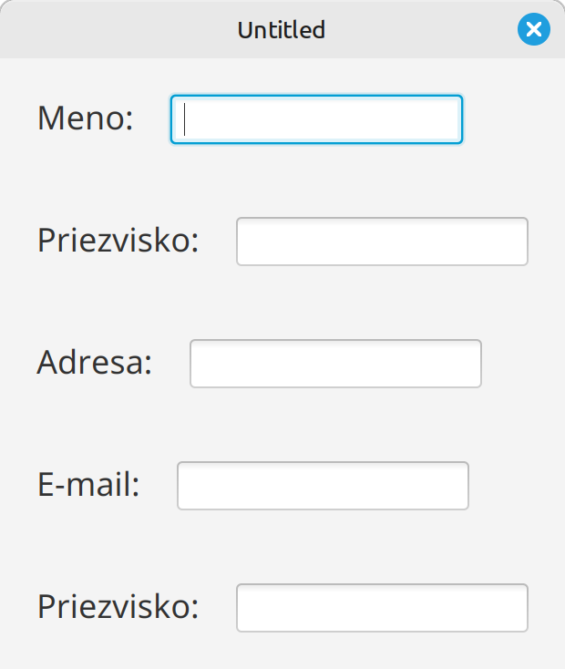
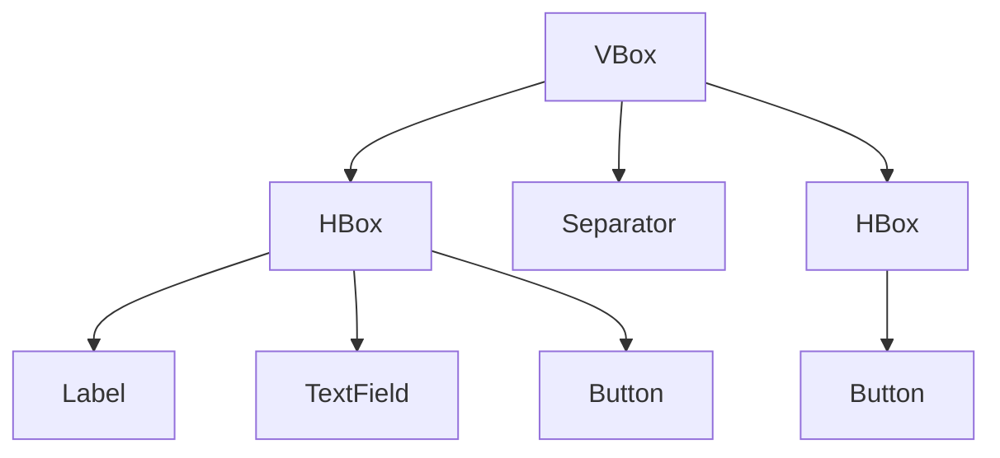
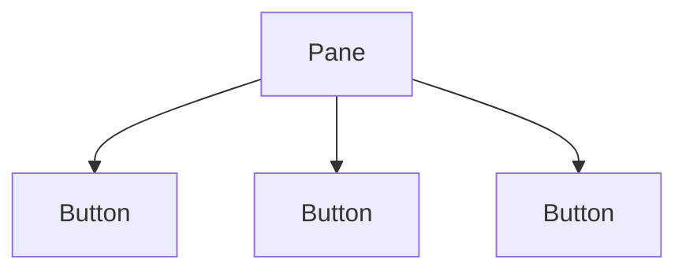

# Teória 21: JavaFX - komponenty

Táto časť je venovaná vykresľovaniu do okna aplikácie. JavaFX umožňuje vykresľovanie rôznych typov prvkov. Dnes sa povenujem dvom hlavným kategóriam:

- **Ovládacie prvky** - Controls
- **Komponenty pre rozmiestňovanie** - Layout Containers

Do scény sa typicky umiestní jedna alebo viac komponent pre rozmiestňovanie, a do nich sa potom vložia ovládacie prvky, ktoré sa vykreslia do okna aplikácie.

## Ovládacie prvky

Ovládacie prvky slúžia pre interakciu s používateľom a je ich veľké množstvo. Uvedieme si najpoužívanejšie:

- [`Label`](https://openjfx.io/javadoc/21/javafx.controls/javafx/scene/control/Label.html) - Textový popis bez interakcie.
- [`Button`](https://openjfx.io/javadoc/21/javafx.controls/javafx/scene/control/Button.html) - Klikateľné tlačidlo.
- [`CheckBox`](https://openjfx.io/javadoc/21/javafx.controls/javafx/scene/control/CheckBox.html) - Prepínač (true / false).
- [`RadioButton`](https://openjfx.io/javadoc/21/javafx.controls/javafx/scene/control/RadioButton.html) - Prepínač v skupine (len jedna možnosť).
- [`Slider`](https://openjfx.io/javadoc/21/javafx.controls/javafx/scene/control/Slider.html) - Posuvník s hodnotou (horizontálny alebo vertikálny).
- [`Separator`](https://openjfx.io/javadoc/21/javafx.controls/javafx/scene/control/Separator.html) - Oddeľovač (horizontálny alebo vertikálny).
- [`TextField`](https://openjfx.io/javadoc/21/javafx.controls/javafx/scene/control/TextField.html) - Jednoriadkové textové pole. (`TextArea` - Viacriadkové textové pole)
- [`PasswordField`](https://openjfx.io/javadoc/21/javafx.controls/javafx/scene/control/PasswordField.html) - Textové pole so skrytým obsahom.

{width=400}
///caption
Ukážka ovládacích prvkov
///

=== "Ukážka použitia ovládacích prvkov v kóde"

    ```java
    Button button = new Button("Klikni ma");

    button.setOnAction(event -> {
        System.out.println("Button bol kliknutý");
    });
    ```

## Komponenty pre rozmiestňovanie

Tieto tzv. layout komponenty, alebo kontajnery, nám definujú, ako budú jednotlivé prvky v okne rozložené. Existuje desiatok druhov takýchto kontajnerov, my si ukážeme najpoužívanejšie z nich.

### HBox (Horizontal Box)

HBox je definovaný v triede [javafx.scene.layout.HBox](https://openjfx.io/javadoc/21/javafx.graphics/javafx/scene/layout/HBox.html)

Tento kontajner rozmiestni prvky horizontálne v jednom riadku.

{width=600}

Ako príklad použitie HBoxu si môžeme uviesť náš príklad s počítadlom, kde sú 3 ovládacie prvky umiestnené do jedného riadku.

{width=350}

=== "Ukážka použitia HBox v kóde"

    ```java
    HBox hbox = new HBox(20);
    hbox.setAlignment(Pos.CENTER);
    hbox.getChildren().addAll(
         new Label("Lorem ipsum"),
         new Button("Close"));
    ```

### VBox (Vertical Box)

VBox je definovaný v triede [javafx.scene.layout.VBox](https://openjfx.io/javadoc/21/javafx.graphics/javafx/scene/layout/VBox.html)

VBox je kontajner, ktorý rozmiestni prvky vertikálne pod sebou

{width=300}

Nasledujúci príklad používa VBox na rozmiestnenie prvkov do riadkov.

{width=350}


### BorderPane

BorderPane je definovaný v triede [javafx.scene.layout.BorderPane](https://openjfx.io/javadoc/21/javafx.graphics/javafx/scene/layout/BorderPane.html)

Ide o zložitejší kontajner, ktorý vytvára priestor pre hlavičku a pätu okna a taktiež umožňuje vložiť prvky na ľavý a pravý okraj.

{width=600}

=== "Ukážka použitia BorderPane v kóde"

    ```java
    HBox menu = new HBox(
            new Button("Súbor"),
            new Button("Upraviť"),
            new Button("Pomoc")
    );

    BorderPane root = new BorderPane();
    root.setTop(menu); // horná časť
    root.setBottom(new Label("BOTTOM - pätička")); // spodná časť
    root.setLeft(new Button("LEFT")); // ľavá časť   
    root.setRight(new Button("RIGHT")); // pravá časť
    root.setCenter(new Button("CENTER - hlavný obsah")); // stred
    ```

### Ostatné

Okrem týchto kontajnerov existujú aj iné:

- `GridPane` - Tabuľkové rozloženie (riadky a stĺpce).
- `StackPane` - Prvky sú nad sebou (vrstvy).
- `FlowPane` - Tokové rozloženie – zalamuje prvky podľa šírky.
- `AnchorPane` - Ukotvenie prvkov k okrajom kontajnera.
- `TilePane` - Prvky majú rovnakú veľkosť v mriežke.
- `Pane` - Kontajner bez automatického rozloženia, grafické prvky musia mať uvedenú presnú polohu a veľkosť

{width=700}

## Scene Graph

Všetky komponenty, ktoré chceme zobraziť v okne sa vkladajú do scény (objekt triedy `Scene`), ktorá sa potom pripojí na okno aplikácie (objekt triedy `Stage`). Komponenty sa do scény vkladajú tak, že z komponentov si urobíme stromovú štruktúru s jedným koreňovým komponentom. Do neho postupne vkladáme ďalšie a tak si vytvoríme celú scénu. Táto stromová štruktúra sa volá **scene graph**.

Ak máme hotový scene graph, **do scény sa potom priamo vloží iba koreňový komponent**. Všetky ostatné komponenty sú priamo alebo nepriamo vnorené v tomto koreňovom uzle.

Ako príklad si ukážeme scene graph pre naše počítadlo s menšou úpravou. Pridáme do neho ešte separátor a tlačidlo na zatvorenie aplikácie.

{width=300}

Takúto scénu vieme vytvoriť pomocou VBox a HBox komponentov. Výsledný strom komponentov je nasledovný:



=== "Ukážka kódu vytvorenie scene graphu"

    ```java
    // Hlavný kontajner
    VBox root = new VBox(10);

    // Horný riadok s počítadlom
    HBox counterRow = new HBox(20);
    Label label = new Label("Počítadlo:");
    TextField counterField = new TextField("0");
    Button btnPlus = new Button("Plus 1");
    btnPlus.setOnAction(e -> incrementCounter());
    counterRow.getChildren().addAll(label, counterField, btnPlus);

    // Oddelovač
    Separator separator = new Separator();

    // Spodný riadok - tlačidlo Zavrieť
    HBox bottomRow = new HBox();
    bottomRow.setAlignment(Pos.CENTER_RIGHT); // detské komponenty posunúť doprava
    Button btnClose = new Button("Zavrieť program");
    btnClose.setOnAction(e -> primaryStage.close());
    bottomRow.getChildren().add(btnClose);

    // Všetko dáme dokopy
    root.getChildren().addAll(counterRow, separator, bottomRow);
    Scene scene = new Scene(root, 380, 220);
    ```


## Z-order

Všetky dnes spomínané komponenty sú dvojrozmerné - 2D. Majú šírku a výšku a X,Y pozíciu na obrazovke. Niekedy sa však pri vykresľovaní stáva, že sa komponenty prekrývajú. V takýchto prípadoch je nutné vedieť, ktorý prvok má byť navrchu a ktorý pod ním.

Pojem Z-ordering znamená poradie vykresľovania grafických a ovládacích prvkov - teda ktorý prvok je „hore“ a ktorý „dole“, keď sa prekrývajú.

Počas vykresľovania na obrazovke štandardne používame 2 osy, X a Y. X nám udáva vzdialenosť od ľavého kraja a Y od kraja horného. Pozícia 0,0 je teda v ľavom hornom rohu. Pri Z orderingu máme akoby ďalšiu os, nazývanú Z, ktorá ide kolmo od obrazovky. Podľa hodnoty na osi Z vieme určiť, ktorý prvok má byť na vrchu.

V rámci JavaFX sa Z-ordering nepoužíva priamo, ale Z-order poradie sa určuje na základe pozície prvku v strome uzlov - scene graphu

- Ako prvý sa vykresľuje koreňový uzol a potom sa vykresľujú jeho deti. 
- Deti sa vykresľujú v poradí, v akom sú do kontajnera umiestnené. To znamená, že ak by sa detské komponenty prekrývali, posledný komponent bude úplne navrchu.

Zmenu poradia Z-order vieme vykonať premiestnením komponentov v rámci scene graphu, či už na iné miesto v strome alebo na inú pozíciu v rámci zoznamu detských komponentov.

Nasledujúci príklad ukazuje použitie kontajnera s pevným rozložením a prekrytými komponentami.

{width=300px}

Scene graph takéhoto programu by vyzeral nasledovne:



=== "Ukážka kódu s prekrytými tlačidlami"

    ```java
    // Kontajner s pevným rozložením
    Pane pane = new Pane();

    // Tlačidlo 1 – najspodnejšie
    Button btn1 = new Button("Tlačidlo 1 (najspodnejšie)");
    btn1.setPrefSize(220, 80);
    btn1.setLayoutX(20);
    btn1.setLayoutY(20);

    // Tlačidlo 2 – uprostred
    Button btn2 = new Button("Tlačidlo 2 (stred)");
    btn2.setPrefSize(200, 90);
    btn2.setLayoutX(50);
    btn2.setLayoutY(70);

    // Tlačidlo 3 – najvrchnejšie
    Button btn3 = new Button("Tlačidlo 3 (najvrchnejšie)");
    btn3.setPrefSize(180, 100);
    btn3.setLayoutX(80);
    btn3.setLayoutY(120);

    // Tu sa rozhodne, ktorý prvok bude navrchu
    // Pridávame v poradí odspodu nahor
    pane.getChildren().addAll(btn1, btn2, btn3);

    Scene scene = new Scene(pane, 300, 240);
    ```


## Zhrnutie teórie

V repozitári na adrese [https://github.com/wagjo/opg-gui](https://github.com/wagjo/opg-gui) máte ukážku práce s triedami `Scene`, `Stage` a `Application`. Ide o triedy `FxStageExampleApplication` a `FxStageExampleMain`, pomocou ktorej viete aplikáciu spustiť.

- [x] JavaFX komponenty
    * [ ] **Ovládacie prvky** - Controls
    * [ ] **Komponenty pre rozmiestňovanie** - Layout Containers
- [x] Ovládacie prvky
    * [ ] Ovládacie prvky slúžia pre interakciu s používateľom a je ich veľké množstvo. Uvedieme si najpoužívanejšie
    * [ ] `Label` - Textový popis bez interakcie.
    * [ ] `Button` - Klikateľné tlačidlo.
    * [ ] `CheckBox` - Prepínač (true / false).
    * [ ] `RadioButton` - Prepínač v skupine (len jedna možnosť).
    * [ ] `Slider` - Posuvník s hodnotou (horizontálny alebo vertikálny).
    * [ ] `Separator` - Oddeľovač (horizontálny alebo vertikálny).
    * [ ] `TextField` - Jednoriadkové textové pole. (TextArea - Viacriadkové textové pole)
    * [ ] `PasswordField` - Textové pole so skrytým obsahom.
- [x] Komponenty pre rozmiestňovanie
    * [ ] `HBox` - rozmiestni prvky horizontálne v jednom riadku.
    * [ ] `VBox` - rozmiestni prvky horizontálne v jednom stĺpci pod sebou.
    * [ ] `BorderPane` - vytvára priestor pre hlavičku a pätu okna a taktiež umožňuje vložiť prvky na ľavý a pravý okraj.
    * [ ] `GridPane` - Tabuľkové rozloženie (riadky a stĺpce).
    * [ ] `StackPane` - Prvky sú nad sebou (vrstvy).
    * [ ] `FlowPane` - Tokové rozloženie – zalamuje prvky podľa šírky.
    * [ ] `AnchorPane` - Ukotvenie prvkov k okrajom kontajnera.
    * [ ] `TilePane` - Prvky majú rovnakú veľkosť v mriežke.
    * [ ] `Pane` - Kontajner bez automatického rozloženia, grafické prvky musia mať uvedenú presnú polohu a veľkosť
- [x] Scene Graph
    * [ ] Všetky komponenty, ktoré chceme zobraziť v okne sa vkladajú do scény (objekt triedy Scene), ktorá sa potom pripojí na okno aplikácie (objekt triedy Stage). 
    * [ ] Komponenty sa do scény vkladajú tak, že z komponentov si urobíme stromovú štruktúru s jedným koreňovým komponentom.
    * [ ] Do koreňového kontajnera postupne vkladáme ďalšie a tak si vytvoríme celú scénu. Táto stromová štruktúra sa volá scene graph.
    * [ ] Ak máme hotový scene graph, do scény sa potom priamo vloží iba koreňový komponent. Všetky ostatné komponenty sú priamo alebo nepriamo vnorené v tomto koreňovom uzle.
- [x] Z-order
    * [ ] Z-ordering znamená poradie vykresľovania grafických a ovládacích prvkov - teda ktorý prvok je „hore“ a ktorý „dole“, keď sa prekrývajú.
    * [ ] Počas vykresľovania na obrazovke štandardne používame 2 osy, X a Y. X nám udáva vzdialenosť od ľavého kraja a Y od kraja horného. Pozícia 0,0 je teda v ľavom hornom rohu. 
    * [ ] Pri Z orderingu máme akoby ďalšiu os, nazývanú Z, ktorá ide kolmo od obrazovky. Podľa hodnoty na osi Z vieme určiť, ktorý prvok má byť na vrchu.
    * [ ] V rámci JavaFX sa Z-ordering nepoužíva priamo, ale Z-order poradie sa určuje na základe pozície prvku v strome uzlov - scene graphu
    * [ ] Ako prvý sa vykresľuje koreňový uzol a potom sa vykresľujú jeho deti. 
    * [ ] Deti sa vykresľujú v poradí, v akom sú do kontajnera umiestnené. To znamená, že ak by sa detské komponenty prekrývali, posledný komponent bude úplne navrchu.
    * [ ] Zmenu poradia Z-order vieme vykonať premiestnením komponentov v rámci scene graphu, či už na iné miesto v strome alebo na inú pozíciu v rámci zoznamu detských komponentov.


!!! note "Poznámky do zošita"
    V zošite je potrebné mať napísané aspoň tieto poznámky:

    ```
    JavaFX komponenty
    1. Ovládacie prvky - Controls
    2. Komponenty pre rozmiestňovanie - Layout Containers

    Ovládacie prvky
    Slúžia pre interakciu s používateľom
    - Label - Textový popis bez interakcie.
    - Button - Klikateľné tlačidlo.
    - CheckBox - Prepínač (true / false).
    - RadioButton - Prepínač v skupine (len jedna možnosť).
    - Slider - Posuvník s hodnotou (horizontálny alebo vertikálny).
    - Separator - Oddeľovač (horizontálny alebo vertikálny).
    - TextField - Jednoriadkové textové pole. (TextArea - Viacriadkové textové pole)
    - PasswordField - Textové pole so skrytým obsahom.

    Komponenty pre rozmiestňovanie
    HBox - rozmiestni prvky horizontálne v jednom riadku.
    VBox - rozmiestni prvky horizontálne v jednom stĺpci pod sebou.
    BorderPane - vytvára priestor pre hlavičku a pätu okna a taktiež umožňuje vložiť prvky na okraje.
    GridPane - Tabuľkové rozloženie (riadky a stĺpce).
    StackPane - Prvky sú nad sebou (vrstvy).
    FlowPane - Tokové rozloženie – zalamuje prvky podľa šírky.
    AnchorPane - Ukotvenie prvkov k okrajom kontajnera.
    TilePane - Prvky majú rovnakú veľkosť v mriežke.
    Pane - Kontajner bez automatického rozloženia, grafické prvky musia mať uvedenú polohu a veľkosť

    Scene Graph
    Komponenty sa vkladajú do scény (Scene), ktorá sa pripojí na okno aplikácie (Stage). 
    Z komponentov sa vytvorí stromová štruktúra s jedným koreňovým komponentom. 
    Táto stromová štruktúra sa volá scene graph.
    Do scény sa potom priamo vloží iba koreňový komponent. 
    Ostatné komponenty sú priamo alebo nepriamo vnorené v tomto koreňovom uzle.

    Z-order
    Z-ordering znamená poradie vykresľovania grafických prvkov - čo je navrchu a čo naspodku
    Štandardne používame 2 osy, X a Y. Pozícia 0,0 je v ľavom hornom rohu. 
    Prekrytie je určene treťou osou, Z, ktorá ide kolmo od obrazovky.
    JavaFX určuje Z-order poradie na základe pozície prvku v strome uzlov - scene graphu
    Ako prvý sa vykresľuje koreňový uzol a potom sa vykresľujú jeho deti. 
    Deti sa vykresľujú v poradí, v akom sú do kontajnera umiestnené. 
    Teda posledný komponent bude úplne navrchu.
    Zmenu poradia vieme vykonať premiestnením komponentov v rámci scene graphu, 
    či už na iné miesto v strome alebo na inú pozíciu v rámci zoznamu detských komponentov.    
    ```

!!! warning "Skúšanie a kontrola vedomostí"

    Na ďalšej hodine budeme kontrolovať nasledovné veci:

    - Zapísané poznámky z hodiny vo vašom zošite

    Okruhy otázok na test:

    - Ako delíme JavaFX komponenty
    - Základné ovládacie prvky
    - Základné komponenty pre rozmiestňovanie
    - Čo je scene graph, čo ho tvorí a ako sa vkladá do scény
    - Čo je Z-order, ako JavaFX rozhoduje, ktorý komponent je navrchu
    - Ako sa dá meniť prekrytie komponentov
