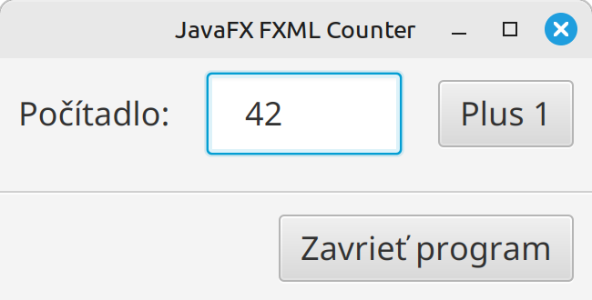
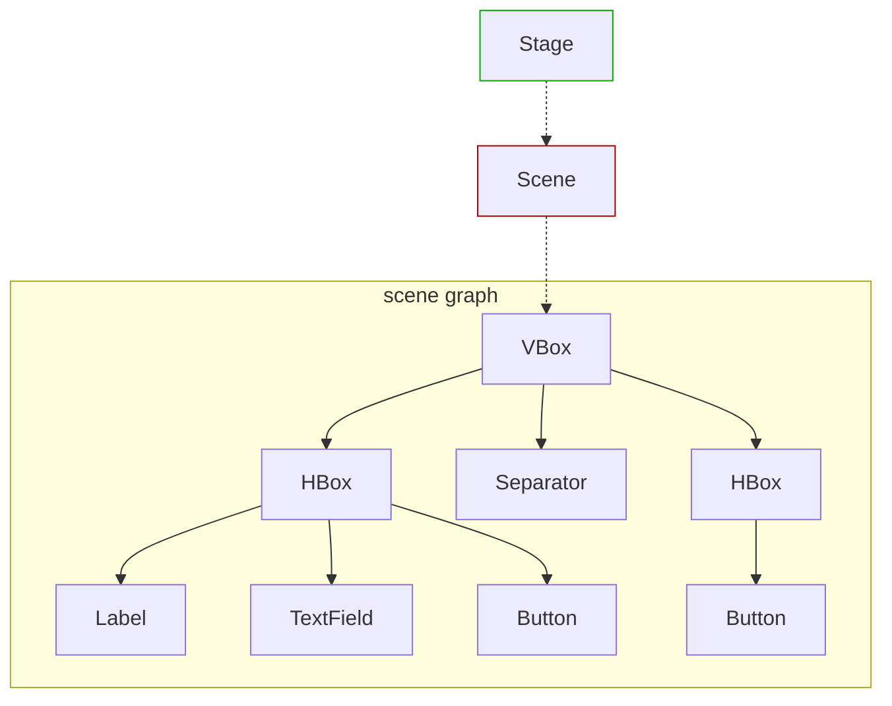
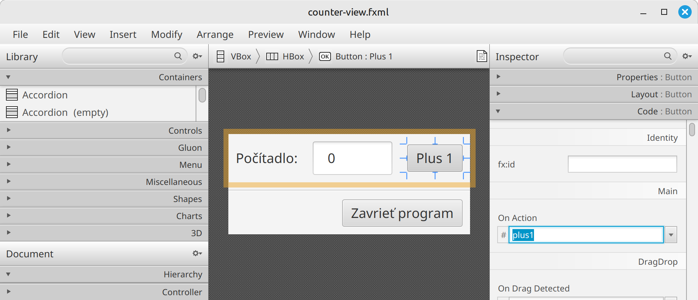

# Teória 22: JavaFX - Udalosti

V JavaFX aplikáciách sa vyskytujú rôzne udalosti, anglicky eventy. Reprezentujú vstup od užívateľa alebo rôzne iné situácie, ktoré môžu počas behu programu nastať. V dnešnej časti si bližšie priblížime udalosti, ich tvorbu, zachytenie a ošetrenie.

JavaFX poskytuje moderný prístup k tvorbe a spracovaniu udalostí. Podobný prístup sa používa aj v iných programovacích jazykoch a frameworkoch. Ak pochopíte ako fungujú udalosti v JavaFX, tak vám to pomôže aj pri iných projektoch.

## Udalosti

Udalosti nám hovoria o tom, že v našej aplikácii sa niečo stalo. Keď užívateľ klikne na tlačidlo, stlačí klávesu, pohne myšou, alebo uskutoční nejakú inú aktivitu, v aplikácii sa vyšlú udalosti - eventy. V rámci aplikácie potom máme možnosť na tieto udalosti zareagovať, poskytnúť užívateľovi odpoveď alebo vykonať inú akciu.

**Udalosť** - **event** - je objekt, dediaci z triedy `javafx.event.Event`. JavaFX poskytuje veľké množstvo tried, podľa toho, o aký typ udalosti ide. Ako príklad uvedieme triedy `DragEvent`, `KeyEvent`, `MouseEvent` a `ScrollEvent`. Okrem preddefinovaných tried si môžeme vytvoriť svoje vlastné triedy, dedením z triedy `Event`.

Každá udalosť obsahuje nasledovné informácie:

- **Typ udalosti** ktorá nastala, napr. `MouseEvent.MOUSE_CLICKED`
- **Source** (zdroj) - Kde sa práve v procese propagácie udalosti nachádzame
- **Target** (cieľ) - ktorého ovládacieho prvku alebo iného JavaFX objektu sa udalosť týka

Okrem toho môže udalosť obsahovať aj iné dáta, napr. pozíciu myši, ktorá klávesa bola stlačená, atď.

=== "Často používané udalosti"

| <div style="width:100px">Trieda udalosti</div>  | Typy udalosti      | Detaily    |
| ------------------ | ------------------ | ---------- |
| `ActionEvent`      | `ACTION`                                                                                                            | UI akcia (kliknutie na tlačidlo, výber menu, stlačenie enter v TextField). Signalizuje, že nastala nejaká akcia.  |
| `MouseEvent`       | `MOUSE_CLICKED`, `MOUSE_PRESSED`, `MOUSE_RELEASED`, `MOUSE_MOVED`, `MOUSE_DRAGGED`, `MOUSE_ENTERED`, `MOUSE_EXITED` | Interakcia myšou. Obsahuje dodatočné informácie o polohe a tlačidlách: `getX()`, `getButton()`, `getClickCount()`, `isShiftDown()` |
| `KeyEvent`         | `KEY_PRESSED`, `KEY_RELEASED`, `KEY_TYPED`                                                                          | Interakcia klávesnicou. Obsahuje informácie o stlačenej klávese a znaku: `getCode()`, `getCharacter()`, `getText()`, `isControlDown()` |
| `ScrollEvent`      | `SCROLL`, `SCROLL_STARTED`, `SCROLL_FINISHED`                                                                       | Užívateľ scrolluje. |
| `TouchEvent`       | `TOUCH_PRESSED`, `TOUCH_MOVED`, `TOUCH_RELEASED`                                                                    | Interakcia pomocou dotykovej obrazovky. Obsahuje pozíciu dotyku, počet dotykových bodov a iné. |
| `WindowEvent`      | `WINDOW_SHOWING`, `WINDOW_SHOWN`, `WINDOW_HIDING`, `WINDOW_HIDDEN`, `WINDOW_CLOSE_REQUEST`                          | Udalosti na úrovni života aplikácie, napríklad zobrazenie alebo zatvorenie okna. |

## Cieľ udalosti

Každá udalosť má svoj cieľ, ktorý identifikuje, kde udalosť nastala, alebo na aký objekt chce udalosť poukázať. Týmto cieľom väčšinou býva nejaký ovládací prvok, napr. tlačidlo, checkbox, radio button, text field, a iné.

- Pre udalosti z klávesnice je cieľom ovládací prvok, ktorý je práve zvolený - anglicky **focus**
- Pre udalosti z myši ide o prvok, na ktorom sa práve nachádza kurzor myši

Podobne sa cieľ určí aj pri iných typoch udalostí.

## Spracovanie udalosti

Spracovanie udalosti má 4 fázy:

1. **Nájdenie cieľa** - podľa vyššie uvedených pravidiel
1. **Vytvorenie cesty** ku komponentu v stromovej štruktúre scény - scene graphu
1. Zachytávanie udalosti po ceste smerom od stage ku cieľu - **capturing**
1. Ošetrenie udalosti po ceste od cieľa ku stage - tzv. vybublenie - **bubbling**

Po nájdení cieľa sa vytvorí cesta v stromovej štruktúre scény, podľa toho, kde sa cieľ nachádza. Cesta vedie od okna - stage objektu, až po cieľ. Ukážeme si to na príklade. 

Majme aplikáciu s počítadlom s predchádzajúcej teórie, znázornenú na nasledovnom obrázku.

{width=300}

Stromová štruktúra scény pre túto aplikáciu vyzerá nasledovne (zahrnuli sme do nej aj stage a scénu):



Ak užívateľ klikne na tlačidlo "Plus 1", aplikácia vyšle udalosť `ACTION`, ktorej cieľom je ovládací prvok `Button`. 

Cesta k udalosti bude nasledovná: `Stage - Scene - VBox - HBox - Button`. Po tejto ceste bude udalosť propagovaná, najprv smerom zľava doprava a potom naspať. Prvý smer sa volá zachytenie - **capturing**, a druhý smer vybublenie - **bubbling**.

Samotnú propagáciu udalosti - capturing a bubbling, si vysvetlíme v nasledujúcich kapitolách

### Zachytávanie udalosti - capturing

Vo fáze zachytávania udalosti (event capturing phase) je udalosť odoslaná zo stage a prechádza cestou až k cieľu. V našom príklade by šlo o postupnosť `Stage -> Scene -> VBox -> HBox -> Button`.

Počas tejto fázy sa udalosť **filtruje**. Ak má niektorý uzol v ceste **zaregistrovaný filter udalostí** pre typ udalosti, ktorá nastala, tento filter sa vykoná. Po jeho dokončení sa udalosť odovzdá ďalšiemu uzlu nižšie v postupnosti. Ak pre daný uzol nie je zaregistrovaný žiadny filter, udalosť sa jednoducho odovzdá ďalšiemu uzlu v reťazci.

Filter nám umožňuje vykonať spoločnú akciu pre udalosti, ktoré smerujú k vnoreným (detským) ovládacím prvkom. Filtre sa typicky využívajú na logovanie a taktiež na blokovanie, keďže vo filtroch **máme možnosť udalosť zastaviť**, aby sa nikdy k cieľu nedostala. Viac o tom v kapitole o skonzumovaní udalosti.

V JavaFX je filter nejaká funkcia, ktorú zaregistrujeme pomocou metódy **`addEventFilter`** v komponente, cez ktorý udalosť prechádza, napr. 

```java
hBox.addEventFilter(MouseEvent.MOUSE_CLICKED, e -> {
    System.out.println("Niekto klikol myšou");
});
```

Vnútri filtra bude objekt udalosti mať *source* nastavný na komponentu resp. uzol, na ktorom sa filter nachádza (v našom príklade by šlo o `HBox`). Cieľ udalosti, *target*, sa nemení a je stále nastavený na cieľový objekt, v našom prípade `Button`

### Ošetrenie udalosti - bubbling

Keď udalosť dosiahne cieľový uzol a všetky zaregistrované filtre ju spracujú, udalosť sa začne vracať späť po ceste v opačnom smere. V našom príklade by šlo o cestu `Button -> HBox -> VBox -> Scene -> Stage`.

V tejto fáze nastáva ošetrenie - **handling**. Ak má niektorý uzol po ceste **zaregistrovaný handler udalostí** pre typ udalosti, ktorá nastala, tento handler sa vykoná. Po jeho dokončení sa udalosť odovzdá ďalšiemu uzlu ďalej po ceste. Ak pre uzol nie je zaregistrovaný handler, udalosť sa presunie k ďalšiemu uzlu.

Vo väčšine prípadov sa registruje handler na cieľovom prvku, do ktorého udalosť smerovala. V JavaFX je handler nejaká funkcia, ktorú zaregistrujeme pomocou metódy **`addEventHandler`** v komponente, cez ktorý udalosť prechádza, napr. 

```java
plus1Button.addEventHandler(ActionEvent.ACTION, e -> {
    System.out.println("Plus 1 tlačidlo stlačené");
});
```

Keďže je registrácia handlerov častou operáciou, JavaFX nám poskytuje pomocné metódy, ktoré nám registráciu uľahčia. Tieto metódy sa začínajú názvom `setOn`, napr. `setOnMouseClicked`, `setOnKeyTyped` atď. V našom príklade by sme namiesto `addEventHandler` mohli použiť nasledovný kód:

```java
plus1Button.setOnAction(e -> {
    System.out.println("Plus 1 tlačidlo stlačené");
});
```

Podobne ako pri zachytávani - capturingu - tak aj pri ošetrení udalostí má handler možnosť propagáciu udalosti zastaviť, aby sa ďalej po ceste neposielala. Ako sa to robí si vysvetlíme v nasledujúcej kapitole.

## Skonzumovanie udalosti - consuming

Udalosť môže byť skonzumovaná filtrom alebo handlerom v ktoromkoľvek bode cesty spracovania udalostí zavolaním metódy **`event.consume()`**

Táto metóda signalizuje, že spracovanie udalosti je dokončené a prechod udalosti cez reťazec spracovania sa ukončí.

=== "Príklad skonzumovania udalosti po jej ošetrení"

    ```java
    plus1Button.setOnAction(e -> {
        System.out.println("Plus 1 tlačidlo stlačené");
        e.consume();
    });
    ```

Ak sa udalosť skonzumuje vo filtri udalostí, zabráni sa tomu, aby ju spracoval ktorýkoľvek ďalší uzol na ceste spracovania. Podobne ak sa udalosť skonzumuje v event handleri, zastaví sa pokračovanie spracovania udalosti ďalšími handlermi na ceste. 

Treba tiež poznamenať, že predvolené handlery ovládacích prvkov JavaFX zvyčajne spotrebujú väčšinu vstupných udalostí. Napr. button po ošetrení udalosti `ACTION` automaticky udalosť skomzumuje. Podobne tak robí aj pre všetky udalosti myšou.

## Udalosti a FXML

Ak používame FXML, teda deklaratívny spôsob tvorby JavaFX aplikácie, ošetrenie udalostí robíme nasledovne:

1. Handler funkciu vytvoríme v `Controller` triede aplikácie

    ```java
    public class Controller {

        @FXML
        public void plus1(ActionEvent actionEvent) {
            System.out.println("Plus 1 tlačidlo stlačené");
        }

    }
    ```

2. V Scene builder si označíme komponentu, pre ktorú chceme zaregistrovať handler, a v paneli "Code" vyberieme handler funkciu pre udalosť, ktorú chceme ošetriť

    {.on-glb width=700}

3. Vo výsledom FXML súbore sa nám potom toto zaregistrovanie zapíše ako atribút, napr. `onAction`:

    `<Button onAction="#plus1" style="-fx-font-size: 18px;" text="Plus 1" />`


## Zhrnutie teórie

- [x] JavaFX udalosti - eventy
    * [ ] Keď užívateľ klikne na tlačidlo, stlačí klávesu, pohne myšou, alebo uskutoční nejakú inú aktivitu, v aplikácii sa vyšle udalosť - event.
    * [ ] Udalosť je objekt dediaci z triedy `javafx.event.Event`
    * [ ] Príklady tried: `DragEvent`, `KeyEvent`, `MouseEvent` a `ScrollEvent`
- [x] Každá udalosť obsahuje nasledovné informácie:
    * [ ] **Typ udalosti** ktorá nastala, napr. `MouseEvent.MOUSE_CLICKED`
    * [ ] **Source** (zdroj) - Kde sa práve v procese propagácie udalosti nachádzame
    * [ ] **Target** (cieľ) - ktorého ovládacieho prvku alebo iného JavaFX objektu sa udalosť týka
- [x] Spracovanie udalosti má 4 fázy
    * [ ] **Nájdenie cieľa**
    * [ ] **Vytvorenie cesty** ku komponentu v stromovej štruktúre scény - scene graphu
    * [ ] Zachytávanie udalosti po ceste smerom od stage ku cieľu - **capturing**
    * [ ] Ošetrenie udalosti po ceste od cieľa ku stage - tzv. vybublenie - **bubbling**
- [x] Nájdenie cieľa a vytvorenie cesty
    * [ ] Cieľ je ovládací prvok, napr. tlačidlo, kde udalosť nastala, alebo iný objekt objekt, na ktorý udalosť poukázuje. 
    * [ ] Pre udalosti z klávesnice je cieľom ovládací prvok, ktorý je práve zvolený - anglicky focus
    * [ ] Pre udalosti z myši ide o prvok, na ktorom sa práve nachádza kurzor myši
    * [ ] Po nájdení cieľa sa vytvorí cesta v stromovej štruktúre scény, ktorá vedie od okna - stage objektu, až po cieľ
- [x] Zachytávanie udalosti - capturing
    * [ ] Udalosť je odoslaná zo stage a prechádza cestou až k cieľu.
    * [ ] Počas tejto fázy sa udalosť filtruje. Ak má niektorý uzol v ceste zaregistrovaný filter udalostí, tento filter sa vykoná. 
    * [ ] Filtre sa využívajú na logovanie a na blokovanie, keďže vo filtroch máme možnosť udalosť zastaviť, aby sa nikdy k cieľu nedostala.
    * [ ] Filter je funkcia, ktorú zaregistrujeme pomocou metódy `addEventFilter` v komponente, cez ktorú udalosť prechádza
    * [ ] Vnútri filtra bude source nastavný na komponentu resp. uzol, na ktorom sa filter nachádza. Cieľ sa nemení a je stále nastavený na cieľový objekt
- [x] Ošetrenie udalosti - bubbling
    * [ ] Keď udalosť dosiahne cieľový uzol a všetky zaregistrované filtre ju spracujú, udalosť sa začne vracať späť po ceste v opačnom smere.
    * [ ] Ak má niektorý uzol počas bubblingu zaregistrovaný handler udalostí, tento handler sa vykoná.
    * [ ] Väčšinou sa registruje handler na cieľovom prvku, do ktorého udalosť smerovala. Registrujeme pomocou metódy `addEventHandler` v komponente, cez ktorý udalosť prechádza
    * [ ] JavaFX poskytuje pomocné metódy na registráciu. Začínajú sa názvom `setOn`, napr. `setOnMouseClicked`, `setOnKeyTyped` atď. 
- [x] Skonzumovanie udalosti - consuming
    * [ ] Udalosť môže byť skonzumovaná filtrom alebo handlerom zavolaním metódy event.consume()
    * [ ] Skonzumovanie spôsobí, že sa spracovanie udalosti ukončí predčasne.
    * [ ] Skonzumovanie vo filtri zabráni, aby ju spracoval ktorýkoľvek ďalší uzol. Podobne skonzumovanie v event handleri zastaví pokračovanie spracovania ďalšími handlermi na ceste.
    * [ ] Predvolené handlery ovládacích prvkov zvyčajne spotrebujú väčšinu vstupných udalostí. Napr. button po ošetrení udalosti ACTION automaticky udalosť skomzumuje. To isté aj pre všetky udalosti myšou.
- [x] Udalosti a FXML
    * [ ] Handler funkciu vytvoríme v Controller triede aplikácie
    * [ ] V Scene builder označíme komponentu, pre ktorú chceme zaregistrovať handler. V paneli "Code" vyberieme funkciu pre udalosť, ktorú chceme ošetriť
    * [ ] Vo výsledom FXML súbore sa nám potom toto zaregistrovanie zapíše ako atribút, napr. `onAction`


!!! note "Poznámky do zošita"
    V zošite je potrebné mať napísané aspoň tieto poznámky:

    ```
    JavaFX udalosti - eventy
    
    Udalosť - kliknutie myšou, stlačenie klávesy, zmena veľkosti okna, ...
    Udalosť je objekt dediaci z triedy javafx.event.Event
    Príklady tried: DragEvent, KeyEvent, MouseEvent a ScrollEvent

    Každá udalosť obsahuje:
    - Typ udalosti ktorá nastala, napr. MouseEvent.MOUSE_CLICKED
    - Source (zdroj) - Kde sa práve v procese propagácie udalosti nachádzame
    - Target (cieľ) - ktorého ovládacieho prvku alebo iného JavaFX objektu sa udalosť týka

    Spracovanie udalosti má 4 fázy
    - Nájdenie cieľa
    - Vytvorenie cesty ku komponentu v stromovej štruktúre scény - scene graphu
    - Zachytávanie udalosti po ceste smerom od stage ku cieľu - capturing
    - Ošetrenie udalosti po ceste od cieľa ku stage - tzv. vybublenie - bubbling

    Nájdenie cieľa a vytvorenie cesty
    - Cieľ je ovládací prvok, napr. tlačidlo, kde udalosť nastala
    - Udalosti z klávesnice majú cieľ ovládací prvok, ktorý je práve zvolený - anglicky focus
    - Pre udalosti z myši ide o prvok, na ktorom sa práve nachádza kurzor myši
    - Cesta je v stromovej štruktúre scény a vedie od okna - stage objektu, až po cieľ

    Zachytávanie udalosti - capturing
    - Udalosť je odoslaná zo stage a prechádza cestou až k cieľu.
    - Počas toho sa udalosť filtruje. Ak má uzol v ceste zaregistrovaný filter, tak sa vykoná. 
    - Využitie na logovanie a blokovanie
    - Filter funkciu, zaregistrujeme pomocou metódy addEventFilter v komponente, 
      cez ktorú udalosť prechádza
    - Source v udalosti ukazuje na uzol, na ktorom sa filter nachádza. 
    - Cieľ sa nemení a je stále nastavený na cieľový objekt

    Ošetrenie udalosti - bubbling
    - Udalosť sa začne vracať späť po ceste v opačnom smere.
    - Ak má uzol zaregistrovaný handler udalostí, tento handler sa vykoná.
    - Väčšinou sa registruje handler na cieľovom prvku
    - Registrujeme pomocou metódy addEventHandler
    - Pomocné metódy na registráciu začínajú názvom setOn, napr. setOnMouseClicked, setOnKeyTyped 

    Skonzumovanie udalosti - consuming
    - event.consume()
    - Spracovanie udalosti sa ukončí predčasne.
    - Predvolené handlery skozumujú väčšinu vstupných udalostí, hlavne tie myšou
    ```

!!! warning "Skúšanie a kontrola vedomostí"

    Na ďalšej hodine budeme kontrolovať nasledovné veci:

    - Zapísané poznámky z hodiny vo vašom zošite

    Okruhy otázok na test:

    - Čo je v JavaFX udalosť - event. Čo obsahuje
    - Základné typy udalostí
    - Fázy spracovania udalosti
    - Nájdenie cieľa a vytvorenie cesty
    - Zachytávanie udalosti - capturing
    - Ošetrenie udalosti - bubbling
    - Skonzumovanie udalosti - consuming
