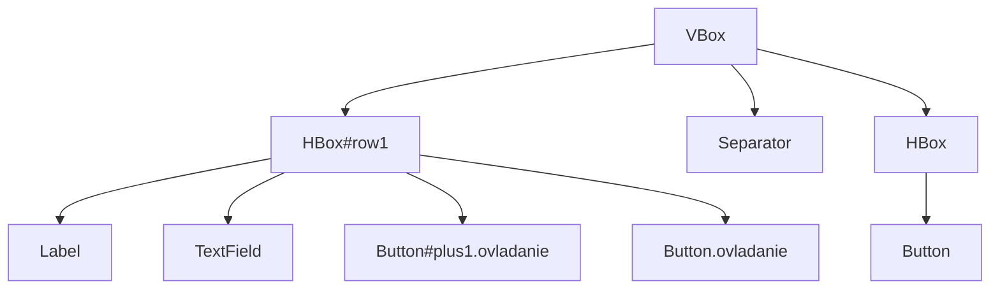
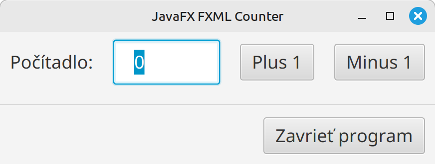
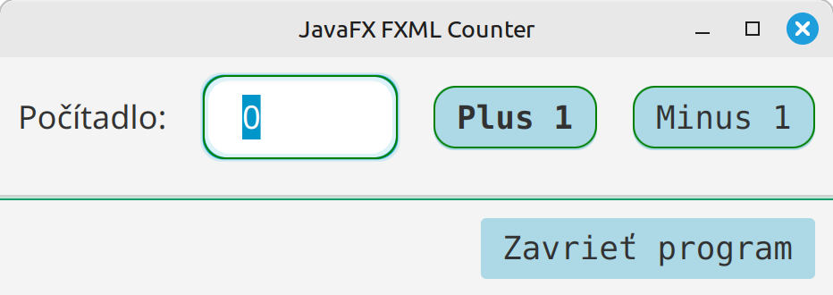
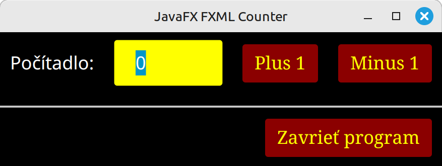
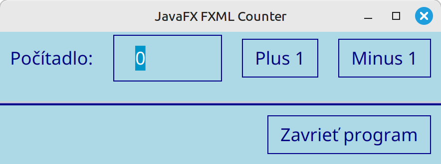

# Teória 23: JavaFX - Štýlovanie

Pri tvorbe webových aplikácií je zaužívanou praxou **oddeliť obsah od vzhľadu**. Pri webových stránkach sa obsah píše do HTML súborov a vzhľad sa definuje pomocou tzv. CSS štýlov. 

CSS (Cascading Style Sheets – **kaskádové štýly**) slúžia na vizuálne formátovanie a dizajn rôzneho typu obsahu, napr. webových stránok. Oddeľujú obsah (HTML) od vzhľadu, čo umožňuje meniť farby, písma, rozloženie prvkov (layout) a zabezpečiť responzivitu pre rôzne zariadenia. 

Asi najznámejšou stránkou, ktorá názorne demonštruje vlastnosti a výhody oddelenia obsahu od vzhľadu a možnosti jazyka CSS je stránka [CSS Zen Garden](https://csszengarden.com/)

## CSS v JavaFX

JavaFX prevzal od webových technológií tento model rozdelenia obsahu od vzhľadu. Umožňuje používať CSS kaskádové štýly pre scény a komponenty v JavaFX aplikáciách. 

CSS v JavaFX je mierne odlišný od webových CSS. Medzi najzreteľnejšie rozdiely patria:

- CSS atribúty majú prefix `-fx`, napr. `-fx-background-color` namiesto `background-color`.
- JavaFX nepodporuje layout funkcionality CSS jazyka (flexbox, grid, ...). Rozloženie prvkov sa v JavaFX robí pomocou layout prvkov (`GridPane`, `VBox`, `BorderPane`, ...).
- JavaFX nepodporuje CSS Media Queries

=== "Príklad CSS pre JavaFX"

    ```css
    #buttonOK {
        -fx-background-color: linear-gradient(to bottom, #2c3e50, #1a2533);
    }

    .text-field {
        -fx-text-fill: #ecf0f1;
        -fx-prompt-text-fill: #95a5a6;
        -fx-border-radius: 8;
        -fx-background-radius: 8;
        -fx-padding: 10;
    }

    .text-field:focused {
        -fx-border-color: #3498db;
        -fx-border-width: 2;
    }

    .btn-pill:hover {
        -fx-background-color: #c0392b;
        -fx-effect: dropshadow(gaussian, rgba(0,0,0,0.4), 12, 0, 0, 4);
    }
    ```

CSS štýly sa v JavaFX dajú priradiť rôznymi spôsobmi. Tie najhlavnejšie z nich si uvedieme v nasledujúcich kapitolách.

## Inline štýl

JavaFX nám umožňuje priradiť štýly priamo konkrétnemu ovládaciemu prvku alebo kontajneru. Slúži nám na to metóda `.setStyle()`, do ktorej dáme reťazec so štýlmi, ktoré chceme na daný prvok aplikovať. 

Tento spôsob je vhodný pre jednorazové použitie a pre testovanie a prototypovanie. Nie je však odporúčaný, nakoľko vytvára neprehľadný kód a neumožňuje znovupoužiteľnosť. Taktiež je ťažké udržiavať takéto štýly dlhodobo, najmä ak robíme väčšie zmeny vo vzhľade aplikácie.

=== "Inline CSS štýly"

    ```java
    Button btn = new Button("Klikni");
    btn.setStyle("""
        -fx-background-color: #f38ba8;
        -fx-text-fill: white;
        -fx-font-size: 16px;
        -fx-padding: 12 24;
        -fx-background-radius: 12;
        """);
    ```

### Inline štýl v FXML

Ak používame FXML, inline štýly sa vkladajú priamo do `.fxml` súboru do atribútov `style`, podobne ako sa to robí pri webových stránkach.

=== "Inline štýly v FXML"

    ```XML
    <TextField fx:id="counter" style="-fx-font-size: 18px; -fx-padding: 10;"/>
    ```

Inline štýly sa dajú pre daný ovládací prvok alebo kontajner zadefinovať priamo v Scene Builderi, a to v časti **Properties - Style**. Tak sme to robili aj na cvičení, kedy sme nastavovali farbu pozadia pre VBox komponenty.

## Externý CSS súbor

Odporúčaným spôsobom je písať štýly do samostatného súboru a ten pripojiť do scény vo vašej aplikácii. Ak máme napr. súbor so štýlmi `myStyles.css` v tom istom adresári ako zdrojový `.java` súbor aplikácie, môžeme štýly pripojiť nasledovne:

```java
String cssPath = getClass().getResource("myStyles.css").toExternalForm();
scene.getStylesheets().add(cssPath);
```

Pripojiť je možné viacero .css súborov. Štýly sa zvyknú pripájať na scénu aplikácie, avšak JavaFX umožňuje pripojiť CSS štýl k akémukoľvek komponentu alebo kontajneru.

### Externý CSS súbor v FXML

Ak používame FXML, externý .css súbor pripojíme na koreňový (root) kontajner pomocou atribútu `stylesheets`, napr.

```xml
<VBox stylesheets="@myStyles.css" fx:controller="sk.spse.MyController" ...>
  ...
</VBox>
```

Ak používame Scene Builder, externý stylesheet súbor pripojíme v časti **Properties - Stylesheets**. Nezabudnite, že štýl sa zvykne pripájať na koreňový prvok.

## CSS selektory

Pri CSS štýloch je potrebné nájsť prvky, ktorým chceme nastaviť požadovaný štýl. Robí sa to pomocou tzv. CSS selektorov. V JavaFX na výber prvkov zvykneme používať dve metódy:

- Pomocou jedinečného identifikátora - `id`
- Pomocou triedy - `class` - ktorú vieme priradiť viacerým prvkom

### Použitie jedinečného identifikátora

V JavaFX vieme priradiť akémukoľvek prvku jedinečný identifikátor `id`. Robí sa to pomocou metódy `setId()`.

=== "Nastavenie ID pre JavaFX komponent"

    ```java
    Button button = new Button("Plus 1");
    button.setId("plus1");
    ```

V FXML a v Scene builder sa ID nastavuje pomocou atribútu `fx:id` alebo `id` (atribút `id` má prednosť. Ak nie je definovaný, použije sa `fx:id`).

=== "Nastavenie ID v FXML"

    ```xml
    <TextField fx:id="counter" style="-fx-font-size: 18px; -fx-padding: 10;"/>
    <Button id="plus1" onAction="#incrementCounter" text="Plus 1" />
    ```

Na takto označený komponent potom môžeme v `.css` súbore použiť tzv. ID selektor, začínajúci znakom `#` (mriežka)

=== "ID Selektor v CSS súbore"

    ```css
    #plus1 {
        -fx-font-weight: bold;
    }
    ```

Jedinečný identifikátor sa používa, ak potrebujeme nastaviť štýl pre jeden konkrétny prvok. Tento identifikátor môže mať iba jeden prvok v scéne, nesmie sa opakovať.

### Použitie CSS tried

Druhou a aj viac používanou možnosťou je priradiť prvkom tzv. triedu, ktorú potom môžeme v CSS selektoroch použiť. Na rozdiel od identifikátora sa trieda môže použiť pre viacero prvkov. Druhým rozdielom je to, že jeden prvok môže mať viacero tried, čo z tried robí silný a flexibilný nástroj. Nastavenie triedy pre prvok sa robí pomocou metódy `getStyleClass()`.

=== "Nastavenie class pre JavaFX komponent"

    ```java
    Button button = new Button("Plus 1");
    button.getStyleClass().add("ovladanie");
    // môžeme priradiť viacero tried
    button.getStyleClass().add("trieda2");
    ```

V FXML a v Scene Builderi sa trieda nastavuje pomocou atribútu `styleClass`. Jednotlivé triedy sa v tomto atribúte oddeľujú medzerou.

=== "Nastavenie ID v FXML"

    ```xml
    <Button styleClass="ovladanie" onAction="#incrementCounter" text="Plus 1" />
    <!-- rovnakú triedu môže mať viacero komponentov -->
    <Button styleClass="ovladanie" onAction="#closeCounter" text="Zavrieť" />
    ```

Ak použijeme túto triedu v CSS štýle, ten sa následne aplikuje na všetky komponenty, ktoré majú túto triedu.

=== "Class Selektor v CSS súbore"

    ```css
    .ovladanie {
        -fx-border-radius: 12px;
        -fx-background-radius: 12px;
    }
    ```

### Preddefinované triedy

JavaFX automaticky priradí svojim komponentom triedu podľa typu daného komponentu. Tlačidlá budú mať triedu `button`, Label prvky triedu `label`, TextField prvky triedu `text-field` atď. Vo veľkom množstve prípadov teda nemusíme definovať žiadne vlastné triedy a vieme komponenty v našej aplikácii štýlovať.

=== "Class Selektor používajúci preddefinované JavaFX triedy"

    ```css
    .text-field {
        -fx-border-color: green;
        -fx-border-radius: 12px;
        -fx-background-radius: 12px;
    }
    ```

### Pseudo triedy

Okrem tried máme v CSS aj tzv pseudo triedy, ktoré nám umožňujú štýlovať prvky, ktoré sú v určitom stave, napr. pri kliknití, pri prechode myšou, atď. Zozname základných pseudo tried v JavaFX:

- `pressed` - použije se pri stlačení prvku (kliknutie myšou)
- `hover` - použije sa, ak nad prvkom je kurzor myši
- `focused` - ak je prvok 'fokusovaný'
- `disabled` - neaktívne prvky

=== "Použitie pseudo tried v CSS selektoroch"

    ```css
    .button:pressed {
        -fx-background-color: green;
    }

    .button:hover {
        -fx-effect: dropshadow(gaussian, rgba(0,0,0,0.4), 12, 0, 0, 4);
    }
    ```


## Príklad

Použitie štýlov si ukážeme na príklade s počítadlom. Niektorým prvkom sme pridali triedy a niektorým id. Výsledný scene graph máte znázornený na diagrame.



Takejto scéne teraz vieme priradiť rôzne CSS súbory a vieme meniť vzhľad našej aplikácie

=== "Bez Štýlov"

    {.on-glb width=400}

=== "Štýl 1"

    {.on-glb width=400}

    ```css title="style1.css"
    .button {
        -fx-background-color: lightblue;
        -fx-font-family: Monospaced;
    }

    .button:pressed {
        -fx-background-color: green;
    }

    .button:hover {
        -fx-effect: dropshadow(gaussian, rgba(0,0,0,0.4), 12, 0, 0, 4);
    }

    #plus1 {
        -fx-font-weight: bold;
    }

    #row1 .button {
        -fx-border-color: green;
    }

    .ovladanie {
        -fx-border-radius: 12px;
        -fx-background-radius: 12px;
    }

    .text-field {
        -fx-border-color: green;
        -fx-border-radius: 12px;
        -fx-background-radius: 12px;
    }

    .separator {
        -fx-background-color: #179c6c;
        -fx-pref-height: 2;
        -fx-border-color: null ;
    }    
    ```

=== "Štýl 2"

    {.on-glb width=400}

    ```css title="style2.css"
    VBox {
        -fx-background-color: black;
    }

    .label {
        -fx-text-fill: white;
    }

    .button {
        -fx-background-color: darkred;
        -fx-text-fill: yellow;
        -fx-font-family: Serif;
    }

    .text-field {
        -fx-background-color: yellow;
    }
    ```

=== "Štýl 3"

    {.on-glb width=400}

    ```css title="style3.css"
    VBox {
        -fx-background-color: lightblue;
        -fx-font-family: Noto Sans;
    }

    .label {
        -fx-text-fill: navy;
    }

    .button {
        -fx-text-fill: navy;
        -fx-background-color: lightblue;
        -fx-border-color: darkblue;
    }

    .text-field {
        -fx-text-fill: navy;
        -fx-background-color: lightblue;
        -fx-border-color: darkblue;
    }

    .separator {
        -fx-border-width: 0 0 1 0; /* its make really one-pixel-border */
        -fx-border-color: darkblue;
        -fx-background-color: darkblue;
        -fx-pref-height: 0;
    }
    ```

## Zhrnutie teórie

- [x] CSS - kaskádové štýly
    * [ ] CSS (Cascading Style Sheets) slúžia na vizuálne formátovanie a dizajn rôzneho typu obsahu, napr. webových stránok.
    * [ ] Oddeľujú obsah (HTML) od vzhľadu, čo umožňuje meniť farby, písma, rozloženie prvkov (layout) a zabezpečiť responzivitu pre rôzne zariadenia. 
    * [ ] JavaFX CSS atribúty majú prefix `-fx`, napr. `-fx-background-color` namiesto `background-color`
    * [ ] JavaFX nepodporuje layout funkcionality CSS jazyka (flexbox, grid, ...). Rozloženie prvkov sa v JavaFX robí pomocou layout prvkov (GridPane, VBox, BorderPane, ...).
    * [ ] JavaFX nepodporuje CSS Media Queries
- [x] Inline štýl
    * [ ] Pomocou metódy `.setStyle()` priradíme štýly priamo konkrétnemu ovládaciemu prvku alebo kontajneru
    * [ ] Tento spôsob je vhodný pre jednorazové použitie a pre testovanie a prototypovanie. 
    * [ ] Nie je však odporúčaný, nakoľko vytvára neprehľadný kód a neumožňuje znovupoužiteľnosť. 
    * [ ] Ak používame FXML, inline štýly sa vkladajú priamo do .fxml súboru do atribútov style, podobne ako sa to robí pri webových stránkach.
    * [ ] Inline štýly sa dajú pre daný ovládací prvok alebo kontajner zadefinovať priamo v Scene Builderi, a to v časti Properties - Style.
- [x] Externý CSS súbor
    * [ ] Ak máme napr. súbor so štýlmi myStyles.css v tom istom adresári ako zdrojový .java súbor aplikácie, môžeme štýly pripojiť pomocou `scene.getStylesheets()`
    * [ ] Pripojiť je možné viacero .css súborov. Štýly sa zvyknú pripájať na scénu aplikácie, avšak JavaFX umožňuje pripojiť CSS štýl k akémukoľvek komponentu alebo kontajneru.
    * [ ] Ak používame FXML, externý .css súbor pripojíme na koreňový (root) kontajner pomocou atribútu stylesheets
    * [ ] Ak používame Scene Builder, externý stylesheet súbor pripojíme v časti Properties - Stylesheets.
- [x] Použitie jedinečného identifikátora
    * [ ] V JavaFX vieme priradiť akémukoľvek prvku jedinečný identifikátor id. Robí sa to pomocou metódy `setId()`.
    * [ ] V FXML sa ID nastavuje pomocou atribútu `fx:id` alebo `id` (atribút `id` má prednosť. Ak nie je definovaný, použije sa `fx:id`).
    * [ ] Na takto označený komponent potom môžeme v .css súbore použiť tzv. ID selektor, začínajúci znakom `#` (mriežka)
    * [ ] Jedinečný identifikátor sa používa, ak potrebujeme nastaviť štýl pre jeden konkrétny prvok. Tento identifikátor môže mať iba jeden prvok v scéne, nesmie sa opakovať.
- [x] Použitie CSS tried
    * [ ] Nastavenie triedy pre prvok sa robí pomocou metódy `getStyleClass()`
    * [ ] V FXML sa trieda nastavuje pomocou atribútu `styleClass`. Jednotlivé triedy sa v tomto atribúte oddeľujú medzerou
    * [ ] Ak použijeme túto triedu v CSS štýle, ten sa následne aplikuje na všetky komponenty, ktoré majú túto triedu.
    * [ ] Na rozdiel od identifikátora sa trieda môže použiť pre viacero prvkov
    * [ ] JavaFX automaticky priradí svojim komponentom triedu podľa typu daného komponentu. Tlačidlá budú mať triedu button, Label prvky triedu label, TextField prvky triedu text-field atď. 
- [x] Pseudo triedy
    * [ ] Pseudo triedy nám umožňujú štýlovať prvky, ktoré sú v určitom stave, napr. pri kliknití, pri prechode myšou, atď
    * [ ] pressed - použije se pri stlačení prvku (kliknutie myšou)
    * [ ] hover - použije sa, ak nad prvkom je kurzor myši
    * [ ] focused - ak je prvok 'fokusovaný'
    * [ ] disabled - neaktívne prvky


!!! note "Poznámky do zošita"
    V zošite je potrebné mať napísané aspoň tieto poznámky:

    ```
    CSS - kaskádové štýly

    Vizuálne formátovanie a dizajn. Oddeľujú obsah (HTML) od vzhľadu
    JavaFX CSS atribúty majú prefix -fx, napr. -fx-background-color namiesto background-color
    JavaFX nepodporuje layout CSS jazyka (flexbox, grid, ...)
    Rozloženie sa v JavaFX robí cez kontajnery (GridPane, VBox, BorderPane, ...)

    Inline štýl - pre jednorazové použitie a pre testovanie
    Inline štýl vytvára neprehľadný kód a neumožňuje znovupoužiteľnosť.

    - Pomocou metódy .setStyle()
    - V .fxml súbore sa používa atribút style
    - V Scene Builderi v časti Properties - Style
    
    Externý CSS súbor
    - pomocou scene.getStylesheets()
    - V .fxml súbore pomocou atribútu stylesheets
    - V Scene Builder v časti Properties - Stylesheets

    Jedinečný identifikátor komponentu, #id v CSS
    - Pomocou metódy setId()
    - V .fxml a v Scene Builderi pomocou atribútu fx:id alebo id
    - Tento identifikátor môže mať iba jeden prvok v scéne, nesmie sa opakovať
    
    Použitie CSS tried, .class v CSS
    - Pomocou metódy getStyleClass()
    - V .fxml pomocou atribútu styleClass (style class v Scene Builderi)
    - Trieda sa môže použiť pre viacero prvkov
    - JavaFX má preddefinované triedy podľa typu daného komponentu. (button, label, text-field, ...)

    Pseudo triedy
    - Prvky ktoré sú v určitom stave, napr. pri kliknití, pri prechode myšou, atď
    - pressed - použije se pri stlačení prvku (kliknutie myšou)
    - hover - použije sa, ak nad prvkom je kurzor myši
    - focused - ak je prvok 'fokusovaný'
    - disabled - neaktívne prvky
    ```

!!! warning "Skúšanie a kontrola vedomostí"

    Na ďalšej hodine budeme kontrolovať nasledovné veci:

    - Zapísané poznámky z hodiny vo vašom zošite

    Okruhy otázok na test:

    - V čom sa CSS štýly v JavaFX líšia od tých webových?
    - Ako použijem v JavaFX inline štýl?
    - Ako použijem v JavaFX externý štýl?
    - Ako nastaviť a použiť identifikátor?
    - Ako nastaviť a použiť triedu?
    - Có sú pseudo triedy, ako sa používajú?
