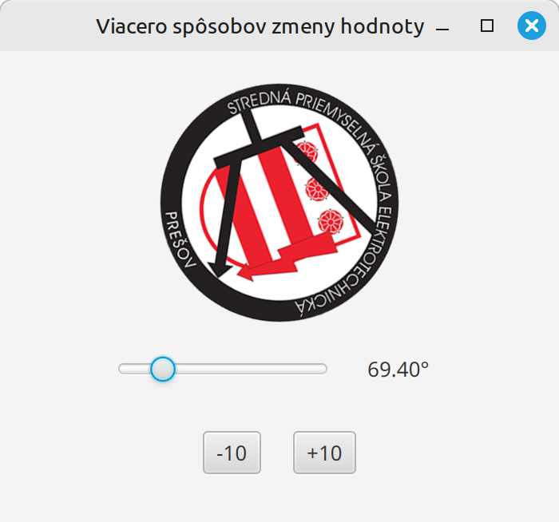

# Teória 24: JavaFX - ObservableValue

Pri aplikáciách so zložitejším UI alebo s komplexnejším dátovým modelom sa často stane, že kód sa stane neprehľadným. Nutnosť prepojiť JavaFX komponenty s dátovým modelom, ošetriť vstupy a udalosti od užívateľa, to všetko nám môže skomplikovať zdrojový kód.

JavaFX ponúka rôzne **techniky na uľahčenie prepojenia komponentov**, dátového modelu a spracovanie udalostí. Dnes si ukážeme význam a použitie triedy `ObservableValue`

## Udalosti a sledovanie zmien

Už sme si vysvetlili ako fungujú udalosti - eventy. Vždy keď užívateľ vykoná nejakú akciu, JavaFX vygeneruje udalosť, ktorú vieme zachytiť a spracovať.

Tlačidlá, radio buttony, text fieldy, slidery, na všetkých týchto komponentoch môže nastať nejaká udalosť. Kliknutie myšou, stlačenie klávesy a podobne. 

Niektoré komponenty v JavaFX v sebe obsahujú hodnotu - číslo alebo text. Napríklad `textField` obsahuje text a `slider` číselnú hodnotu. Táto hodnota pre nás má nejaký význam: meno užívateľa, vek, stupeň otočenia, atď. Na základe toho, akú aplikáciu vytvárame, potrebujeme túto hodnotu spracovať a vyhodnotiť. Je preto veľmi dôležité **byť informovaný o tom, čo sa deje s touto hodnotou** a dostať notifikáciu, ak sa hodnota zmenila.

Väčšina zmien v komponentoch sa udeje na základe nejakej akcie užívateľa. Vieme teda použiť ošetrenie udalosti na to, aby sme sa dozvedeli, že sa niečo asi v komponente zmenilo.

Sú to však dva rozdielne druhy udalostí:

1. Užívateľ vykonal nejakú akciu
1. Zmenila sa hodnota nejakého komponentu

JavaFX eventy sú určené na ošetrenie prvého typu udalostí, kedy v aplikácii nastala nejaká akcia od užívateľa alebo od systému. Použitie JavaFX eventov pre sledovanie zmien hodnôt komponentov je však problematické, a to z viacerých dôvodov.

Ten hlavný dôvod je to, že niekedy sa hodnota môže meniť aj iným spôsobom, ako udalosťou, ktorú zachytávame.

Napríklad, pri slider komponente zachytávame ťahanie myšou, ale hodnota sa môže meniť aj na základe stlačenia klávesy (doprava, doľava). Museli by sme teda ošetriť všetky možné iné spôsoby, ako sa v slideri dá meniť jeho hodnota.

**JavaFX udalosti - eventy - by sa teda nemali používať na sledovanie zmien hodnôt v komponentoch**

A čo iné máme teda používať? To si ukážeme dnes. Najprv si však problém bližšie demonštrujme na jednoduchom príklade.

## Príklad 1

Majme jednoduchú aplikáciu so sliderom, labelom a obrázkom s logom školy. Chceme, aby slider ovládal otočenie obrázku a label ukazoval aktuálny stupeň otočenia.

{.on-glb width=400}

Vytvoríme si teda 3 komponenty a každému priradíme `fx:id`: `slider`, `label` a `obrazok`. Okrem toho si ošetríme udalosť `OnMouseDragged`, aby sme vedeli, kedy užívateľ pohol sliderom.

[Kód Controllera](https://github.com/wagjo/opg-gui-slider/blob/master/src/sk/spse/slider/verzia1/Controller.java) je jednoduchý, vyzerá nasledovne:

=== "Sledovanie zmeny hodnoty cez eventy"

    ```java
    public class Controller {

        public ImageView obrazok;
        public Slider slider;
        public Label label;

        public void updatuj(MouseEvent mouseEvent) {
            double hodnota = slider.getValue();
            obrazok.setRotate(hodnota);
            label.setText(String.format("%.2f°", hodnota));
        }
    }
    ```

V ošetrení udalosti sme zistili aktuálnu hodnotu slidera a aktualizovali text v labeli a natočenie obrázku. Aplikácia funguje a po potiahnutí slidera myšou sa obrázok natočí.

Avšak, ak by sme chceli pohnúť slider klávesami doprava a doľava, už to fungovať nebude. Zabudli sme ošetriť udalosti z klávesnice.

## Príklad 2

Doplňme teda ošetrenie udalosti z klávesnice `onKeyReleased` a do aplikácie tiež pridáme 2 tlačidlá na zmenu otočenia, `+10` a `-10`.

{.on-glb width=400}

[Kód Controllera](https://github.com/wagjo/opg-gui-slider/blob/master/src/sk/spse/slider/verzia2/Controller.java) bude vyzerať takto:

=== "Viacero spôsobov zmeny hodnoty"

    ```java
    public ImageView obrazok;
    public Slider slider;
    public Label label;

    public void updatujSlider() {
        double hodnota = slider.getValue();
        obrazok.setRotate(hodnota);
        label.setText(String.format("%.2f°", hodnota));
    }

    public void updatujMysou(MouseEvent mouseEvent) {
        updatujSlider();
    }

    public void updatujKlavesou(KeyEvent keyEvent) {
        updatujSlider();
    }

    public void plus10(ActionEvent actionEvent) {
        double hodnota = slider.getValue();
        hodnota = Math.min(hodnota + 10, 360);
        slider.setValue(hodnota);
        obrazok.setRotate(hodnota);
        label.setText(String.format("%.2f°", hodnota));
    }

    public void minus10(ActionEvent actionEvent) {
        double hodnota = slider.getValue();
        hodnota = Math.max(hodnota - 10, 0);
        slider.setValue(hodnota);
        obrazok.setRotate(hodnota);
        label.setText(String.format("%.2f°", hodnota));
    }
    ```

Kód sa nám začína mierne komplikovať. Obidve ošetrenia udalosti slidera robia tú istú vec, preto sme to dali do samostatnej metódy `updatujSlider`.

Čo však udalosti z tlačidiel `+10` a `-10`? Musia urobiť podobnú vec, získať hodnotu zo slidera, zmeniť ju a potom aktualizovať všetky komponenty. Tieto udalosti však robia jednu vec naviac. Aktualizujú aj hodnotu samotného slidera, pretože sme zmenu nevykonali akciou na slideri, ale kliknitím na tlačidlo.

Ak by sme aplikáciu testovali dôsledne, zistili sme, že sme opäť na niečo zabudli. Kliknutie myšou na slider vie zmeniť jeho hodnotu. Túto udalosť však nemáme ošetrenú, preto v takomto prípade by naša aplikácia nefungovala správne. Musíme pridať tretiu udalosť...

Tu vidíme, ako rýchlo sa nám môže začať kód komplikovať. **Príliš veľa aktualizovaní komponentov robí program neprehľadným**.

## Sledovanie zmien pomocou ObservableValue

Skomplikovali sme si kód všelijakými udalosťami, ale našim cieľom bolo **reagovať na zmenu hodnoty slidera**. Namiesto udalostí nám JavaFX ponúka niečo iné. 

**Na sledovanie zmeny hodnoty v JavaFX používame interface `ObservableValue`**

[`ObservableValue`](https://openjfx.io/javadoc/21/javafx.base/javafx/beans/value/ObservableValue.html) je rozhranie, ktoré umožňuje 'počúvať' (anglicky listen) na zmenu hodnoty v komponente. Pomocou `ObservableValue` si vieme zaregistrovať metódu, ktorá sa spustí, ak sa hodnota zmenila.

### Počúvanie na zmenu hodnoty 

Počúvanie na zmenu hodnoty sa robí pomocou metódy `addListener()`. Všetky JavaFX komponenty, ktoré v sebe obsahujú nejakú hodnotu (napr. textové pole, slider) pre túto hodnotu poskytujú objekt, ktorý podporuje **ObservableValue** rozhranie.

**JavaFX objekt, ktorý podporuje ObservableValue, sa volá property**

Komponent, ktorý v sebe obsahuje hodnotu nám vie poskytnúť aj property objekt, ktorý implementuje ObservableValue rozhranie a vieme pomocou neho počúvať na zmenu hodnoty. Získanie tohto property objektu robíme pomocou metódy `valueProperty()`

Porovnanie udalostí a sledovania zmien hodnoty:

- [`addEventFilter`](https://openjfx.io/javadoc/21/javafx.base/javafx/event/EventTarget.html#addEventFilter(javafx.event.EventType,javafx.event.EventHandler)) - zachytenie udalosti - capturing
- [`addEventHandler`](https://openjfx.io/javadoc/21/javafx.base/javafx/event/EventTarget.html#addEventHandler(javafx.event.EventType,javafx.event.EventHandler)) - ošetrenie udalosti - handling
- [`addListener`](https://openjfx.io/javadoc/21/javafx.base/javafx/beans/value/ObservableValue.html#addListener(javafx.beans.value.ChangeListener)) - sledovanie zmeny hodnoty - listening

Nad udalosťou vieme zavolať `addEventFilter` a `addEventHandler`, nad property voláme `addListener`.

## Príklad 3

Poďme využiť property objekt v našej aplikácii. Aby sme nemali hodnoty natočenia kade tade, je potrebné mať hodnotu na jednom mieste. 

Najprv si teda určíme, kde v našom programe bude hlavné miesto - objekt - v ktorom sa bude uchovávať hodnota natočenia. Dobrým kandidátom na takýto účel je slider, ktorý v sebe uchováva double hodnotu. Tento slider použijeme ako hlavné miesto na uchovanie hodnoty. To má pre nás 2 dôsledky:

1. Pre aktualizáciu stavu aplikácie nám stačí počúvať na zmenu hodnoty na jednom mieste - slideri
1. Ak chceme hodnotu meniť manuálne, budeme ju meniť v slideri

S uvedomením si týchto vecí bude [finálny kód našej aplikácie](https://github.com/wagjo/opg-gui-slider/blob/master/src/sk/spse/slider/verzia3/Controller.java) vyzerať nasledovne:

=== "Sledovanie zmien cez ObservableValue"

    ```java
    public ImageView obrazok;
    public Slider slider;
    public Label label;

    public void initialize() {
        slider.valueProperty().addListener((observable, oldValue, newValue) -> {
            obrazok.setRotate(newValue.doubleValue());
            label.setText(String.format("%.2f°", newValue.doubleValue()));
        });
    }

    public void plus10(ActionEvent actionEvent) {
        double hodnota = slider.getValue();
        hodnota = Math.min(hodnota + 10, 360);
        slider.setValue(hodnota);
    }

    public void minus10(ActionEvent actionEvent) {
        double hodnota = slider.getValue();
        hodnota = Math.max(hodnota - 10, 0);
        slider.setValue(hodnota);
    }    
    ```

Kód sa nám zjednodušil! Nemáme už viac udalosti nad sliderom, ale iba sledujeme jeho hodnotu cez `addListener`.

Podobne pri udalostiach tlačidiel už viac nemusíme aktualizovať hodnoty v ostatných komponentoch, stačí zmeniť hodnotu slidera a všetko sa automaticky upraví. Je to preto, lebo **aj manuálnym zmenením hodnoty v slideri sa aktivuje listener**, ktorý máme pripojený na slider.

Kód pre aktualizáciu stavu natočenia máme na jednom mieste, pri sledovaní zmeny hodnoty.

Aplikácia teraz bude správne reagovať na potiahnutie slidera myšou, klávesy doprava a doľava, tlačidlá +10 a -10 a taktiež aj na kliknutie myšou.


## Zhrnutie teórie

- [x] Udalosti a sledovanie zmien
    * [ ] Vždy keď užívateľ vykoná nejakú akciu, JavaFX vygeneruje udalosť, ktorú vieme zachytiť a spracovať.
    * [ ] Niektoré komponenty v JavaFX v sebe obsahujú hodnotu - číslo alebo text.  
    * [ ] Niekedy chceme byť informovaný o tom, čo sa deje s touto hodnotou a dostať notifikáciu, ak sa hodnota zmenila.
    * [ ] Treba rozlišovať medzi: Užívateľ vykonal nejakú akciu, versus Zmenila sa hodnota nejakého komponentu
    * [ ] JavaFX eventy sú určené na ošetrenie prvého typu udalostí, kedy v aplikácii nastala nejaká akcia od užívateľa alebo od systému. 
- [x] Problém pri používaní udalostí pre účely sledovania zmien hodnôt
    * [ ] Použitie JavaFX eventov pre sledovanie zmien hodnôt komponentov je však problematické
    * [ ] Hlavný dôvod je to, že niekedy sa hodnota môže meniť aj iným spôsobom, ako udalosťou, ktorú zachytávame.
    * [ ] JavaFX udalosti - eventy - by sa teda nemali používať na sledovanie zmien hodnôt v komponentoch
- [x] Sledovanie zmien pomocou ObservableValue
    * [ ] Na sledovanie zmeny hodnoty v JavaFX používame interface ObservableValue
    * [ ] ObservableValue je rozhranie, ktoré umožňuje 'počúvať' (anglicky listen) na zmenu hodnoty v komponente.
    * [ ] Pomocou ObservableValue si vieme zaregistrovať metódu, ktorá sa spustí, ak sa hodnota zmenila. 
- [x] Počúvanie na zmenu hodnoty
    * [ ] Počúvanie na zmenu hodnoty sa robí pomocou metódy addListener()
    * [ ] Všetky JavaFX komponenty, ktoré v sebe obsahujú nejakú hodnotu (napr. textové pole, slider) pre túto hodnotu poskytujú objekt, ktorý podporuje ObservableValue rozhranie.
    * [ ] JavaFX objekt, ktorý podporuje ObservableValue, sa volá property
    * [ ] Získanie tohto property objektu robíme väčšinou pomocou metódy valueProperty()
- [x] Porovnanie udalostí a sledovania zmien hodnoty:
    * [ ] addEventFilter - zachytenie udalosti - capturing
    * [ ] addEventHandler - ošetrenie udalosti - handling
    * [ ] addListener - sledovanie zmeny hodnoty - listening
    * [ ] Nad udalosťou vieme zavolať addEventFilter a addEventHandler, nad property voláme addListener.


!!! note "Poznámky do zošita"
    V zošite je potrebné mať napísané aspoň tieto poznámky:

    ```
    Udalosti a sledovanie zmien
    
    Keď užívateľ vykoná akciu, JavaFX vygeneruje udalosť, ktorú vieme spracovať
    Niektoré komponenty v sebe obsahujú hodnotu - číslo alebo text.  
    Niekedy chceme byť informovaní, čo sa s hodnotou deje, ako sa zmenila.
    
    Treba rozlišovať medzi: 
    - Užívateľ vykonal nejakú akciu
    - Zmenila sa hodnota nejakého komponentu

    JavaFX udalosti - eventy sú určené na ošetrenie akcií, nie na sledovanie zmien hodnôt!
    Hlavný dôvod je, že hodnota sa môže meniť aj iným spôsobom, ako udalosťou, ktorú zachytávame.

    ObservableValue
    
    Na sledovanie zmeny hodnoty používame interface ObservableValue
    Rozhranie ObservableValue umožňuje 'počúvať' na zmenu hodnoty
    Cez ObservableValue si vieme zaregistrovať metódu, ktorá sa spustí, ak sa hodnota zmenila. 

    Počúvanie na zmenu hodnoty
    
    Počúvanie na zmenu hodnoty sa robí pomocou metódy addListener()
    JavaFX komponenty s hodnotou poskytujú objekt, ktorý podporuje ObservableValue rozhranie.
    Takýto objekt sa volá property, získame ho väčšinou pomocou metódy valueProperty()

    Porovnanie udalostí a sledovania zmien hodnoty:
    
    - addEventFilter - zachytenie udalosti - capturing
    - addEventHandler - ošetrenie udalosti - handling
    - addListener - sledovanie zmeny hodnoty - listening
    
    Nad udalosťou vieme zavolať addEventFilter a addEventHandler, nad property voláme addListener.
    ```

!!! warning "Skúšanie a kontrola vedomostí"

    Na ďalšej hodine budeme kontrolovať nasledovné veci:

    - Zapísané poznámky z hodiny vo vašom zošite

    Okruhy otázok na test:

    - Aký je rozdiel medzi reagovaním na akciu užívateľa a nad sledovaním zmeny hodnoty?
    - Prečo nie sú udalostí vhodný nástroj na sledovanie zmeny hodnoty?
    - Na čo slúži ObservableValue a ako ho používame
    - Čo je property a ako ho získame
    - Porovnajte addEventFilter, addEventHandler a addListener
