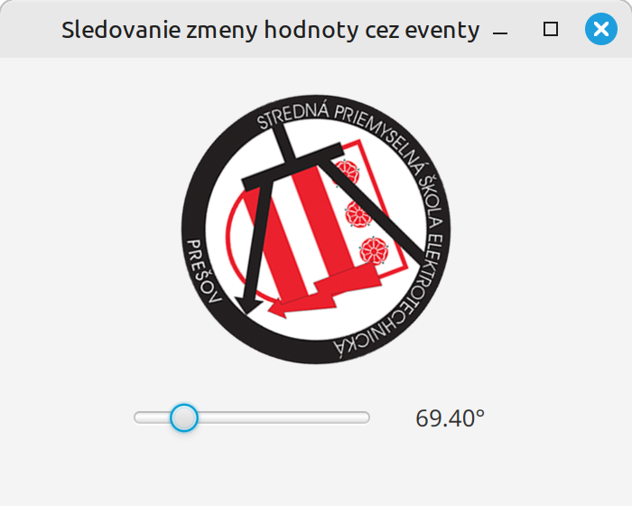
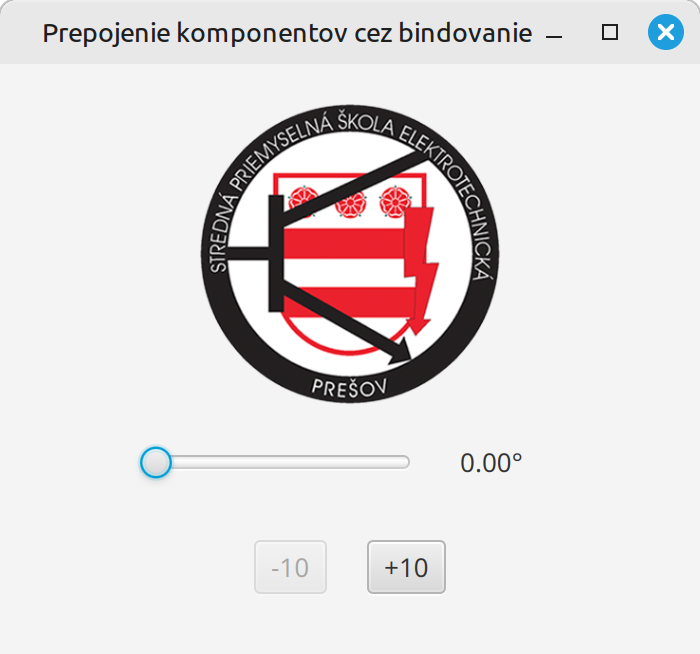
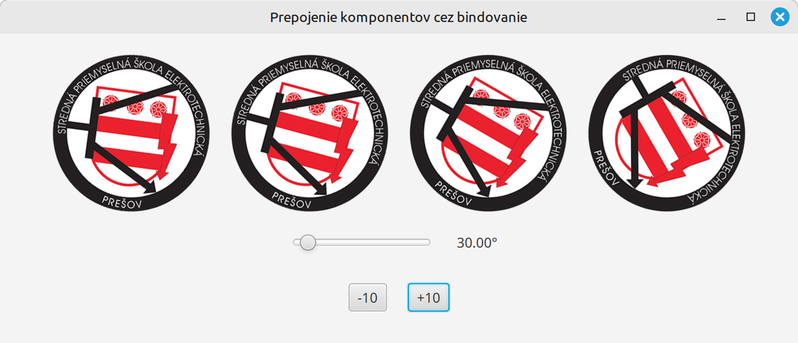

# Teória 25: JavaFX - Property

Sledovanie zmien hodnoty sa v JavaFX robí pomocou rozhrania ObservableValue. Komponenty pre svoje vnútorné hodnoty poskytujú tzv. property objekty, ktoré toto ObservableValue rozhranie implementujú. Dnes sa na tieto property objekty pozrieme bližšie.

## Property

Property objekty v JavaFX sú jedným z najvýznamnejších a najvýkonnejších prvkov frameworku. Umožňujú pozorovateľnosť (observability) hodnôt, automatickú aktualizáciu UI a data binding.

[`javafx.beans.property.Property`](https://openjfx.io/javadoc/21/javafx.base/javafx/beans/property/Property.html) je objekt, ktorý obalí (wrap) bežnú hodnotu (int, String, Object, atď.) a pridá k nej ďalšie schopnosti:

- Výpočet aktuálnej hodnoty - `getValue`
- Zmena hodnoty - `setValue`
- Change listeners - upozornenie pri zmene hodnoty - `addListener`
- Binding - prepojenie viacerých properties - `bind` a `bindBidirectional`

Okrem týchto funkcionalít property objekty poskytujú aj ďalšie schopnosti pre pokročilejšie použitie ako napr. Lazy evaluation (výpočet sa vykoná až keď je to potrebné) alebo Invalidation listeners (upozornenie, že sa doterajšia stará hodnota je už neplatná a mohla sa zmeniť).

Property objekty obsahujú samotné JavaFX komponenty alebo si ich vieme vytvoriť aj my sami.

## Property objekty v komponentoch

JavaFX komponenty poskytujú property objekty pre svoje vnútorné hodnoty a parametre. Týchto property objektov sú desiatky, my si uvedieme tie najpoužívanejšie:

- `textProperty()` - textová hodnota (String) pri komponentoch, ktoré majú nejaký text (`Label`, `TextField` `TextArea`, ...)
- `valueProperty()` - číselné hodnoty (Double) pri komponentoch s číselnou hodnotou (`Slider`)
- `rotateProperty()` - stupeň natočenia komponentu (Double), má ho takmer každý komponent
- `disableProperty()` - boolean hodnota, či je komponent neaktívny (`Button`, `CheckBox`)
- `selectedProperty()` - boolean hodnota, či je komponent vybraný (`CheckBox`, `RadioButton`)

=== "Property objekty v komponentoch"

    ```java
    TextField tf = new TextField("Ahoj");

    String text = tf.textProperty().getValue();
    Boolean disabled = tf.disableProperty().getValue();
    ```

## Vlastné property objekty

Property objekty si vieme vytvoriť tiež aj sami. Podľa toho, aký typ má mať hodnota, ktorá bude zabalená v property objekte si volíme aj spôsob vytvorenia property objektu.

Základné abstraktné typy property objektov sú:

- `DoubleProperty` - uchováva reálnu číselnú hodnotu
- `IntegerProperty` - uchováva celočíselnú hodnotu
- `StringProperty` - uchováva textovú hodnotu
- `BooleanProperty` - uchováva booleovskú hodnotu

Nové objekty týchto tried si vieme vytvoriť pomocou tzv. `Simple` property tried, a to napr. takto:

=== "Vlastné property objekty"

    ```java
    IntegerProperty vekProperty = new SimpleIntegerProperty(18);
    BooleanProperty isStudentProperty = new SimpleBooleanProperty(true);
    ```

## Prepojenie property objektov - Binding

Najsilnejšou funkcionalitou property objektov a ich najväčšou výhodou je možnosť navzájom prepojiť rôzne property objekty.

Prepojenie - *binding* - property objektov znamená, že **zmena hodnoty v jednom property objektu sa automaticky prejaví na property objektoch, ktoré sú s týmto objektom prepojené**.

Existujú dva druhy prepojenia property objektov:

- **jednosmerné prepojenie** - unidirectional bind - zmena hodnoty je propagovaná jedným smerom
- **obojsmerné prepojenie** - bidirectional bind - zmena hodnoty je propagovaná oboma smermi

Prepojenia nahrádzajú manuálne zmeny hodnôt pomocou setterov a zjednodušujú kód.

Prepojenie medzi dvoma property objektami sa robí pomocou metódy `bind()` resp. `bindBidirectional()`

=== "Príklad prepojenia 2 property objektov"

    ```java
    fooProperty.bind(barProperty);
    ```

    Toto prepojenie spôsobí, že vždy, keď sa zmení hodnota barProperty tak sa automaticky zmení aj hodnota fooProperty. Druhým smerom to nebude platiť.

## Príklad 1

V našom príklade z minulej hodiny máme logo školy, ktoré rotujeme na základe hodnoty slideru. 

{.on-glb width=350}

V tomto príklade sú pre nás zaujímavé nasledovné property objekty

- Komponent s logom má property nad hodnotou otočenia - `obrazok.rotateProperty()` - `Double`
- Slider má property so svojou hodnotou - `slider.ValueProperty()` - `Double`
- Label má property s textom - `label.textProperty()` - `String`

Logo školy chceme otočiť podľa hodnoty slidera. Dosiahneme to tak, že prepojíme tieto 2 property pomocou bindingu.

=== "Natočenie loga školy podľa hodnoty slideru"

    ```java
    public void initialize() {
        obrazok.rotateProperty().bind(slider.valueProperty());
    }
    ```

Výhodou tohto prístupu je, že už viac nemusíme mať žiadny listener a ručne meniť hodnotu natočenia pomocou `setRotate`.

Ostáva nám ešte prepojiť label so sliderom tak, aby label ukazoval aktuálny uhol natočenia. Tu však nastáva menší problém. Slider nám ponúka hodnotu typu Double, ale label má textovú hodnotu typu String. Priame prepojenie pomocou bind by teda nefungovalo.

Pred tým ako si ukážeme ako prepojiť tieto 2 property si najpr musíme vysvetliť metódy transformácie property objektov.

## Transformácia property objektov

Často sa pri pripojení stáva, že hodnotu medzi prepojenými objektami chceme upraviť alebo transformovať. JavaFX nám na to ponúka triedu `javafx.beans.binding.Bindings`. Táto trieda má množstvo metód na transformáciu hodnôt. Uvedieme si tie najpoužívanejšie

- Manipulácie s číslami: `add`, `subract`, `multiply`, `divide`, `negate`, `max`, `min`. Príklad: `Bindings.add(10, property)` - Hodnota poslaná do prepojeného property sa zväčší o 10
- Prevod na text: `format` - funguje  podobne ako `String.format`. Príklad: `Bindings.format("%d", intProperty)` - Vráti textovú reprezentáciu čísla
- Prevod na booleovskú hodnotu: `notEqual`, `lessThan`, `greaterThan`. Príklad: `Bindings.notEqual(property1, property2)`

=== "Príklad použitia bindings pri prepojení property objektov"

    ```java
    opacneProperty.bind(Bindings.negate(cisloProperty));
    textProperty.bind(Bindings.format("%.2f°", cisloProperty));
    ```

Tieto transformácie vieme voľne kombinovať a vytvoriť tak celkom komplexné typy prepojení.

## Príklad 2

Upravíme si náš príklad, aby pomocou prepojení fungoval aj label. Okrem toho si ešte skúsime ošetriť tlačidlá +10 a -10 tak, aby boli zablokované, keď je slider na maximálnej alebo minimálnej hodnote. Vo finálnej verzii využijeme tieto property:

- Komponent s logom má property nad hodnotou otočenia - `obrazok.rotateProperty()` - `Double`
- Slider má property so svojou hodnotou - `slider.ValueProperty()` - `Double`
- Label má property s textom - `label.textProperty()` - `String`
- Tlačidlá majú property neaktívnosti - `plusButton.disableProperty()` - `Boolean`

=== "Prepojenie labelu a tlačidiel z hodnotou zo slidera"

    ```java
    public void initialize() {
        obrazok.rotateProperty().bind(slider.valueProperty());
        label.textProperty().bind(Bindings.format("%.2f°", slider.valueProperty()));
        minusButton.disableProperty().bind(Bindings.lessThanOrEqual(slider.valueProperty(),0));
        plusButton.disableProperty().bind(Bindings.greaterThanOrEqual(slider.valueProperty(), 360));
    }
    ```

Aplikácia bude fungovať správne a oproti minulej hodine máme lepšie ošetrené tlačidlá.

{.on-glb width=350}


## Príklad 3

Na transformáciu property si ukážeme ešte jeden príklad. Zmeníme našu aplikáciu tak, aby v nej boli 4 logá školy, a každé aby sa otáčalo podľa hodnoty slidera. Chceme však, aby sa otáčali rôzne: Jedno logo by pri maximálnej hodnote slidera urobilo celú otočku (360 stupňov), druhé len pol, a iné 2 otočky.

{.on-glb width=550}

=== "Rôzne natočenie obrázkov"

    ```java
    public void initialize() {
        obrazok1.rotateProperty().bind(Bindings.divide(slider.valueProperty(), 4.0));
        obrazok2.rotateProperty().bind(Bindings.divide(slider.valueProperty(), 2.0));
        obrazok3.rotateProperty().bind(slider.valueProperty());
        obrazok4.rotateProperty().bind(Bindings.multiply(slider.valueProperty(), 2.0));

        label.textProperty().bind(Bindings.format("%.2f°", slider.valueProperty()));
        minusButton.disableProperty().bind(slider.valueProperty().lessThanOrEqualTo(0));
        plusButton.disableProperty().bind(slider.valueProperty().greaterThanOrEqualTo(360));

    }
    ```

## Zhrnutie teórie

- [x] Property
    * [ ] Property je objekt, ktorý obalí (wrap) bežnú hodnotu (int, String, Object, atď.) a pridá k nej ďalšie schopnosti
    * [ ] Výpočet aktuálnej hodnoty - getValue
    * [ ] Zmena hodnoty - setValue
    * [ ] Change listeners - upozornenie pri zmene hodnoty - addListener
    * [ ] Binding - prepojenie viacerých properties - bind a bindBidirectional
    * [ ] Property objekty obsahujú samotné JavaFX komponenty alebo si ich vieme vytvoriť aj my sami
- [x] Property objekty v komponentoch
    * [ ] JavaFX komponenty poskytujú property objekty pre svoje vnútorné hodnoty a parametre
    * [ ] textProperty() - textová hodnota (String) pri komponentoch, ktoré majú nejaký text (Label, TextField TextArea, ...)
    * [ ] valueProperty() - číselné hodnoty (Double) pri komponentoch s číselnou hodnotou (Slider)
    * [ ] rotateProperty() - stupeň natočenia komponentu (Double), má ho takmer každý komponent
    * [ ] disableProperty() - boolean hodnota, či je komponent neaktívny (Button, CheckBox)
    * [ ] selectedProperty() - boolean hodnota, či je komponent vybraný (CheckBox, RadioButton)
- [x] Vlastné property objekty
    * [ ] Property objekty si vieme vytvoriť tiež aj sami. Podľa toho, aký typ má mať hodnota, ktorá bude zabalená v property objekte si volíme aj spôsob vytvorenia property objekt
    * [ ] DoubleProperty - uchováva reálnu číselnú hodnotu
    * [ ] IntegerProperty - uchováva celočíselnú hodnotu
    * [ ] StringProperty - uchováva textovú hodnotu
    * [ ] BooleanProperty - uchováva booleovskú hodnotu 
    * [ ] Nové objekty týchto tried si vieme vytvoriť pomocou tzv. Simple property tried (SimpleDoubleProperty, SimpleIntegerProperty atď)
- [x] Prepojenie property objektov - Binding
    * [ ] Zmena hodnoty v jednom property objektu sa automaticky prejaví na property objektoch, ktoré sú s týmto objektom prepojené
    * [ ] jednosmerné prepojenie - unidirectional bind - zmena hodnoty je propagovaná jedným smerom
    * [ ] obojsmerné prepojenie - bidirectional bind - zmena hodnoty je propagovaná oboma smermi
    * [ ] Prepojenia nahrádzajú manuálne zmeny hodnôt pomocou setterov a zjednodušujú kód.
    * [ ] Prepojenie medzi dvoma property objektami sa robí pomocou metódy bind() resp. bindBidirectional()
    * [ ] fooProperty.bind(barProperty) -  keď sa zmení hodnota barProperty tak sa automaticky zmení aj hodnota fooProperty. Druhým smerom to nebude platiť.
- [x] Transformácia property objektov
    * [ ] Bindings trieda má množstvo metód na transformáciu hodnôt
    * [ ] Manipulácie s číslami: add, subract, multiply, divide, negate, max, min. Príklad: Bindings.add(10, property) - Hodnota poslaná do prepojeného property sa zväčší o 10
    * [ ] Prevod na text: format - funguje podobne ako String.format. Príklad: Bindings.format("%d", intProperty) - Vráti textovú reprezentáciu čísla
    * [ ] Prevod na booleovskú hodnotu: notEqual, lessThan, greaterThan. Príklad: Bindings.notEqual(property1, property2)
    * [ ] Tieto transformácie vieme voľne kombinovať a vytvoriť tak celkom komplexné typy prepojení.


!!! note "Poznámky do zošita"
    V zošite je potrebné mať napísané aspoň tieto poznámky:

    ```
    Property

    Obalí (wrap) bežnú hodnotu (int, String, atď.) a pridá ku nej ďalšie schopnosti:
    - Výpočet aktuálnej hodnoty - getValue
    - Zmena hodnoty - setValue
    - Change listeners - upozornenie pri zmene hodnoty - addListener
    - Binding - prepojenie viacerých properties - bind a bindBidirectional

    Komponenty poskytujú property pre svoje vnútorné hodnoty
    - textProperty() - text (String) ak má komponent nejaký text (Label, TextField TextArea, ...)
    - valueProperty() - číslo (Double) pri komponentoch s číselnou hodnotou (Slider)
    - rotateProperty() - stupeň natočenia (Double), má ho takmer každý komponent
    - disableProperty() - boolean, či je komponent neaktívny (Button, CheckBox)
    - selectedProperty() - boolean, či je komponent vybraný (CheckBox, RadioButton)

    Vlastné property objekty - podľa typu hodnoty
    DoubleProperty, IntegerProperty, StringProperty, BooleanProperty, ...
    Nové objekty vytvoríme pomocou 'Simple' tried (SimpleDoubleProperty, SimpleIntegerProperty atď)

    Prepojenie property objektov - Binding
    Najdôležitejšia funkcionalita
    Zmena hodnoty v property sa automaticky prejaví na prepojených property objektoch
    - jednosmerné prepojenie - unidirectional bind - zmena propagovaná jedným smerom
    - obojsmerné prepojenie - bidirectional bind - zmena propagovaná oboma smermi
    Prepojenie sa robí pomocou bind() resp. bindBidirectional()

    Príklad - fooProperty.bind(barProperty) 
    Keď sa zmení hodnota barProperty tak sa automaticky zmení aj hodnota fooProperty. 
    Druhým smerom to nebude platiť.
    
    Bindings trieda má množstvo metód na transformáciu hodnôt
    Manipulácie s číslami: add, subract, multiply, divide, negate, max, min. 
    Prevod na text: format - funguje podobne ako String.format
    Prevod na booleovskú hodnotu: notEqual, lessThan, greaterThan. 
    Príklady: Bindings.add(10, property), Bindings.notEqual(property1, property2)
    Transformácie vieme voľne kombinovať
    ```

!!! warning "Skúšanie a kontrola vedomostí"

    Na ďalšej hodine budeme kontrolovať nasledovné veci:

    - Zapísané poznámky z hodiny vo vašom zošite

    Okruhy otázok na test:

    - Čo sú property objekty a aké majú funkcionality
    - Najbežnejšie property pri komponentoch
    - Ako si vytvoríme vlastné property objekty
    - Na čo slúži prepojenie property objektov - binding
    - Ako realizujeme binding
    - Metódy na transformáciu property objektov
