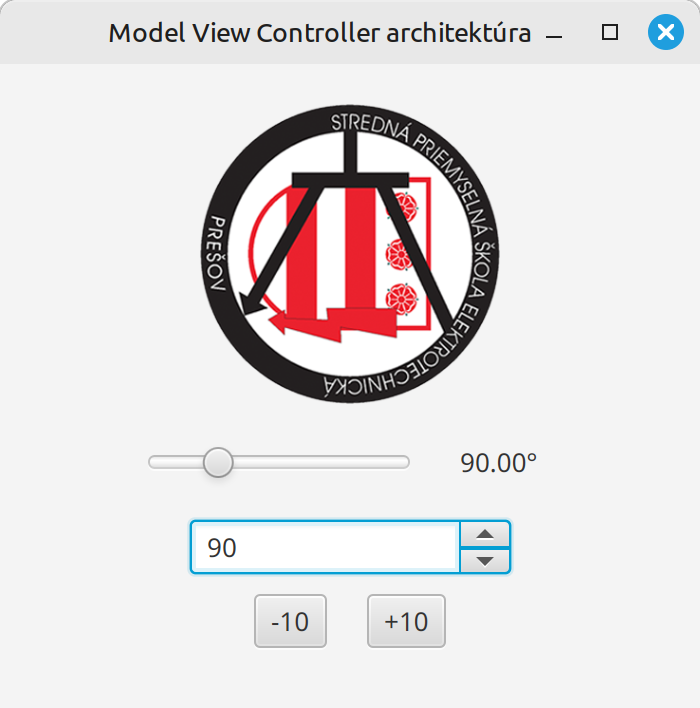
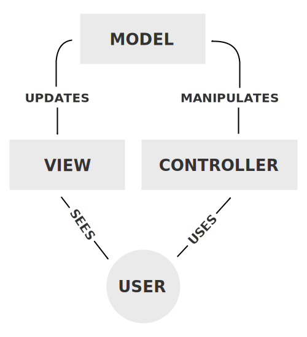

# Teória 26: Model-View-Controller architektúra

Na minulej hodine sme si ukázali, ako sa property objekty dajú vzájomne prepojiť, aby sa hodnoty na ovládacích prvkoch automaticky aktualizovali.

V príkladoch, ktoré sme si vysvetlili, boli ovládacie prvky napojené na property objekt slidera, ktorý určoval uhol natočenia obrázku.

Uhol natočenia je hodnota, ktorá bola pre našu aplikáciu veľmi potrebná. Prečo sme ju však dali práve do slidera? Slider je obyčajný komponent, a my sme z neho urobili najpodstatnejší prvok, prepojený so všetkými ostatnými vecami.

Čo ak by sme chceli namiesto slidera mať napr. spinner? Alebo ešte horšie, čo ak by sme chceli mať aj slider aj spinner? Prečo by mal práve slider byť ten komponent, ktorý bude držať 'hlavnú' hodnotu pre celú aplikáciu? Nebol by spinner na to lepší?

{.on-glb width=400}
/// caption
Naša slider aplikácia s pridaným spinnerom
///

Správna odpoveď je nedržať hlavnú hodnotu ani v spinnerovi a ani sliderovi. Dôležité dáta a hodnoty, ktoré majú význam naprieč aplikáciou, by mali byť umiestnené samostatne.

K tomu nám môže dopomôcť MVC architektúra, ktorej sa dnes povenujeme.

## Model-View-Controller

MVC (Model-View-Controller) je jeden z najstarších a najpoužívanejších softvérových architektonických vzorov (design pattern). Slúži na rozdelenie aplikácie na tri navzájom nezávislé, ale spolupracujúce časti, aby sa dosiahlo **oddelenie zodpovedností** (separation of concerns).

Cieľom je:

- urobiť kód ľahšie testovateľný, udržiavateľný a rozšíriteľný.
- umožniť viacerým vývojárom pracovať paralelne (napr. jeden na UI, druhý na biznis logike).
- znížiť prelínanie (coupling) medzi vrstvami.

### Model

Model reprezentuje dáta a biznis logiku aplikácie. Model je zodpovedný za prácu s dátami, validáciu hodnôt, výpočty, komunikácia s databázou, a podobne.

V JavaFX do vrstvy modelu patria triedy obsahujúce business logiku aplikácie.

### View

View predstavuje samotné užívateľské rozhranie (UI). Jeho úlohou je zobrazovať dáta z Modelu.

View je zodpovedný za zobrazovanie a prijímanie vstupov od užívateľa (kliknutia, zadávanie).

V JavaFX do vrstvy View patrí FXML. 

### Controller

Controller je sprostredkovateľ medzi View a Modelom. Jeho zodpovednosťou je spracovanie udalostí (eventov), aktualizácia Modelu, refreshovanie View.

V JavaFX do vrstvy Controller patrí na to určená trieda, väčšinou nazvaná `Controller`

## Fungovanie MVC

Dáta v MVC architektúre prúdia nasledovne:

1. Užívateľ vykoná akciu vo View (napr. klikne na tlačidlo).
1. Controller zachytí udalosť.
1. Controller zavolá metódy na Modeli (napr. model.saveUser()).
1. Model vykoná logiku a zmení svoj stav.
1. View sa aktualizuje s novými hodnotami Modelu.

{.on-glb width=400}
/// caption
MVC architektúra
///

## Vlastnosti MVC

Pri malých a triviálnych aplikáciách môže byť MVC príliš komplikovaný. Väčšie aplikácie však už vedia využiť výhody MVC prístupu:

- Testovateľnosť (Model a Controller sa dajú testovať unit testami bez UI).
- Opätovná použiteľnosť (ten istý Model môže mať viacero View: desktop, web, mobil).
- Jednoduchšia údržba (zmena UI neovplyvní biznis logiku).

## MVC v JavaFX

Použitie MVC v JavaFX je de facto štandardom. Samotný JavaFX bol navrhnutý tak, aby použitie MVC architektúry bolo intuitívne a jednoduché.

V našich deklaratívnych aplikáciách, ktoré sme na cvičeniach vytvárali, sme sa veľmi blížili MVC. View máme v FXML a ovládanie sme už dávali do triedy Controller. 

Na to, aby z našich programov boli skutočné MVC aplikácie, nám ostáva oddeliť business logiku, stav a dáta do samostatných tried, ktoré budú predstavovať vrstvu Modelu.

### MVC pre slider aplikáciu

Ak sa vrátime späť do našej aplikácie, jedinou hodnotou v nej je uhol natočenia. Model teda bude veľmi jednoduchý, a mohol by vyzerať nasledovne:

=== "Model.java"

    ```java
    public record Model (DoubleProperty rotacia) {

        public static Model createModel() {
            return new Model(new SimpleDoubleProperty(0.0));
        }

        public void rotuj(double delta) {
            double hodnota = rotacia.getValue();
            hodnota += delta;
            hodnota = Math.max(hodnota, 0);
            hodnota = Math.min(hodnota, 360);
            rotacia.setValue(hodnota);
        }
    }
    ```

Náš model bude držať uhol natočenia. Aby bolo jednoduché prepojiť model s vrstvou View (FXML), na uloženie hodnoty použijeme property objekt. Jeho prepojením s komponentami vo View bude zmena hodnoty v modeli automaticky aktualizovaná aj v užívateľskom rozhraní.

=== "Controller.java"

    ```java
    public class Controller {

        Model model;

        public ImageView obrazok;
        public Slider slider;
        public Label label;
        public Button minusButton;
        public Button plusButton;


        public void initialize() {
            model = Model.createModel();

            obrazok.rotateProperty().bind(model.rotacia());
            label.textProperty().bind(Bindings.format("%.2f°", model.rotacia()));
            slider.valueProperty().bindBidirectional(model.rotacia());
            minusButton.disableProperty().bind(model.rotacia().lessThanOrEqualTo(0));
            plusButton.disableProperty().bind(model.rotacia().greaterThanOrEqualTo(360));
        }

        public void plus10(ActionEvent actionEvent) {
            model.rotuj(10);
        }

        public void minus10(ActionEvent actionEvent) {
            model.rotuj(-10);
        }
    }
    ```

Controller tak už nebude používať slider ako hlavný prvok aplikácie, ale všetky komponenty budú hodnotu uhla natočenia brať z modelu. Ak by sme slider odstránili, alebo nahradili inými komponentami, aplikácia by fungovala bez problémov.

!!! info "Použitie Spinnera"

    Ak ste zvedaví, ako by aplikácia vyzerala, ak by sme chceli mať aj spinner aj slider, môžete si prezrieť zdrojový kód na adrese [https://github.com/wagjo/opg-gui-slider/tree/master/src/sk/spse/slider/verzia5](https://github.com/wagjo/opg-gui-slider/tree/master/src/sk/spse/slider/verzia5)

## Zhrnutie teórie

- [x] Model-View-Controller
    * [ ] MVC slúži na rozdelenie aplikácie na tri navzájom nezávislé, ale spolupracujúce časti, aby sa dosiahlo oddelenie zodpovedností (separation of concerns).
    * [ ] Dôležité dáta a hodnoty, ktoré majú význam naprieč aplikáciou, by mali byť umiestnené samostatne, mimo ovládacích prvkov.
- [x] Ciele MVC
    * [ ] urobiť kód ľahšie testovateľný, udržiavateľný a rozšíriteľný.
    * [ ] umožniť viacerým vývojárom pracovať paralelne (napr. jeden na UI, druhý na biznis logike).
    * [ ] znížiť prelínanie (coupling) medzi vrstvami.
- [x] Model
    * [ ] Model reprezentuje dáta a biznis logiku aplikácie. Model je zodpovedný za prácu s dátami, validáciu hodnôt, výpočty, komunikácia s databázou, a podobne.
    * [ ] V JavaFX do vrstvy modelu patria triedy obsahujúce business logiku aplikácie.
- [x] View
    * [ ] View predstavuje samotné užívateľské rozhranie (UI). Jeho úlohou je zobrazovať dáta z Modelu.
    * [ ] View je zodpovedný za zobrazovanie a prijímanie vstupov od užívateľa (kliknutia, zadávanie).
    * [ ] V JavaFX do vrstvy View patrí FXML.
- [x] Controller
    * [ ] Controller je sprostredkovateľ medzi View a Modelom. Jeho zodpovednosťou je spracovanie udalostí (eventov), aktualizácia Modelu, refreshovanie View.
    * [ ] V JavaFX do vrstvy Controller patrí na to určená trieda, väčšinou nazvaná Controller
- [x] Fungovanie MVC
    * [ ] Užívateľ vykoná akciu vo View (napr. klikne na tlačidlo).
    * [ ] Controller zachytí udalosť.
    * [ ] Controller zavolá metódy na Modeli (napr. model.saveUser()).
    * [ ] Model vykoná logiku a zmení svoj stav.
    * [ ] View sa aktualizuje s novými hodnotami Modelu.
- [x] Vlastnosti MVC
    * [ ] Pri malých a triviálnych aplikáciách môže byť MVC príliš komplikovaný. Väčšie aplikácie však už vedia využiť výhody MVC prístupu:
    * [ ] Testovateľnosť (Model a Controller sa dajú testovať unit testami bez UI).
    * [ ] Opätovná použiteľnosť (ten istý Model môže mať viacero View: desktop, web, mobil).
    * [ ] Jednoduchšia údržba (zmena UI neovplyvní biznis logiku).

!!! note "Poznámky do zošita"
    V zošite je potrebné mať napísané aspoň tieto poznámky:

    ```
    Model-View-Controller
    
    Definuje tri spolupracujúce vrstvy, umožňuje oddelenie zodpovedností (separation of concerns).

    Ciele MVC
    - ľahšie testovanie, udržiavanie a rozšíriteľnosť
    - lepšia spolupráca v rámci tímu
    - znížiť prelínanie (coupling) medzi vrstvami

    Model - dáta a biznis logiku aplikácie (validácia hodnôt, výpočty, komunikácia s databázou)
    View - užívateľské rozhranie (UI), zobrazuje hodnoty z Modelu. Je to hlavne FXML.
    Controller - spracovanie udalostí (eventov), aktualizácia Modelu, refreshovanie View

    Fungovanie MVC
    1. Užívateľ vykoná akciu vo View (napr. klik myšou).
    2. Controller zachytí udalosť.
    3. Controller zavolá metódy na Modeli (napr. model.saveUser()).
    4. Model vykoná logiku a zmení svoj stav.
    5. View sa aktualizuje s novými hodnotami Modelu.

    Vlastnosti MVC
    - Pri malých aplikáciách je MVC príliš komplikovaný
    - Možnosť testovať model bez UI
    - Opätovná použiteľnosť (tviacero View: desktop, web, mobil).
    - Jednoduchšia údržba (zmena UI neovplyvní biznis logiku).
    ```

!!! warning "Skúšanie a kontrola vedomostí"

    Na ďalšej hodine budeme kontrolovať nasledovné veci:

    - Zapísané poznámky z hodiny vo vašom zošite

    Okruhy otázok na test:

    - Čo je a na čo slúži MVC. Ciele.
    - Popíšte jednotlivé vrstvy. Ako sú reprezentované v JavaFX?
    - Process fungovania MVC
    - Vlastnosti MVC
